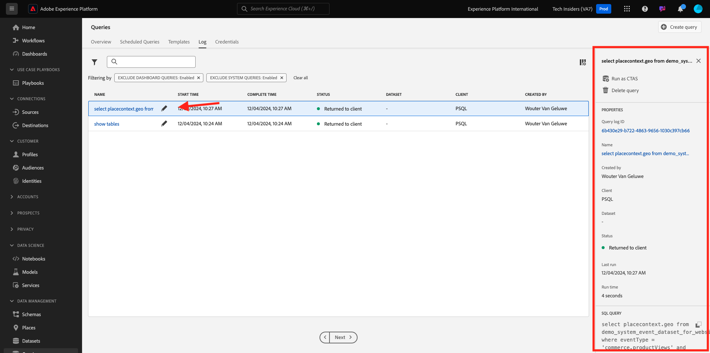
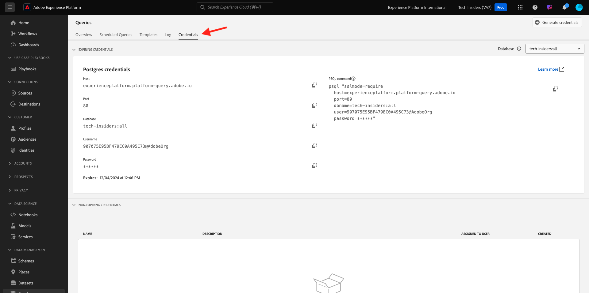

# 2.1.2快速入门

## 熟悉Adobe Experience Platform UI

转到[Adobe Experience Platform](https://experience.adobe.com/platform)。 登录后，您将登录到Adobe Experience Platform的主页。

在继续之前，您需要选择一个&#x200B;**沙盒**。 要选择的沙盒名为``--aepSandboxName--``。 选择适当的[!UICONTROL 沙盒]后，您将看到屏幕更改，现在您已经进入专用的[!UICONTROL 沙盒]。

## 在平台上浏览数据

对于任何品牌而言，从不同渠道获取数据都是一项艰巨的任务。 在此练习中，Citi Signal客户在其网站、移动应用程序上与Citi Signal互动，购买数据由Citi Signal的销售点系统收集，他们拥有CRM和忠诚度数据。 花旗信号正使用Adobe Analytics和Adobe Launch在其网站、移动应用程序以及POS系统中捕获数据，因此这些数据已流入Adobe Experience Platform。 让我们先来探索Adobe Experience Platform中已有的花旗信号的所有数据。

在左侧菜单中，转到&#x200B;**数据集**。

Citi Signal正在将数据流式传输到Adobe Experience Platform，并且此数据在`Demo System - Event Dataset for Website (Global v1.1)`数据集中可用。 搜索`Demo System - Event Dataset for Website`。

在`Demo System - Event Dataset for Call Center (Global v1.1)`数据集中捕获了Citi Signal的呼叫中心交互数据。 在搜索框中搜索`Demo System - Event Dataset for Call Center`数据。 单击数据集的名称以将其打开。

单击数据集后，您将获得数据集活动的概览，例如已摄取和失败的批次。 单击&#x200B;**预览数据集**&#x200B;查看存储在`Demo System - Event Dataset for Call Center (Global v1.1)`数据集中的数据示例。

左侧面板显示此数据集的架构结构，右侧您将看到已摄取的数据示例。

单击&#x200B;**关闭**&#x200B;以关闭&#x200B;**预览数据集**&#x200B;窗口。

## 查询服务简介

单击左侧菜单中的&#x200B;**查询**&#x200B;可访问查询服务。

转到&#x200B;**日志**&#x200B;后，您将看到“查询列表”页面，该页面为您提供此组织中运行的所有查询的列表，最新的查询位于顶部。

单击列表中的任何SQL查询，并观察右边栏中提供的详细信息。

您可以滚动窗口以查看整个查询，也可以单击下面高亮显示的图标以将整个查询复制到记事本。 此时您不必复制查询。

您不能只查看已执行的查询，此用户界面允许您从查询创建新数据集。 这些数据集可以链接到Adobe Experience Platform的实时客户档案，或用作Adobe Experience Platform数据科学Workspace的输入。

## 将PSQL客户端连接到查询服务

查询服务支持带有用于PostgreSQL的驱动程序的客户端。 在本示例中，我们将使用PSQL（命令行界面）和Power BI或Tableau。 让我们连接到PSQL。

单击&#x200B;**凭据**。

您将会看到下面的屏幕。 屏幕提供服务器信息和凭据，用于对查询服务进行身份验证。 目前，我们将侧重于屏幕的右侧，其中包含用于PSQL的connect命令。 单击复制按钮以将命令复制到剪贴板。

对于Windows：单击windows键并键入cmd ，然后单击“Command Prompt（命令提示符）”结果以打开命令行。

对于macOS：通过Spotlight Search打开terminal.app：

粘贴从查询服务UI复制的connect命令，然后在命令提示符窗口中按enter ：

Windows：

macOS：

您现在已使用PSQL连接到查询服务。

在接下来的练习中，将有一些与此窗口的交互。 我们将它称为您的&#x200B;**PSQL命令行接口**。

现在，您可以开始提交查询了。

## 后续步骤

使用查询服务[&#128279;](./ex3.md){target="_blank"}转到2.1.3

返回[查询服务](./query-service.md){target="_blank"}

返回[所有模块](./../../../../overview.md){target="_blank"}
