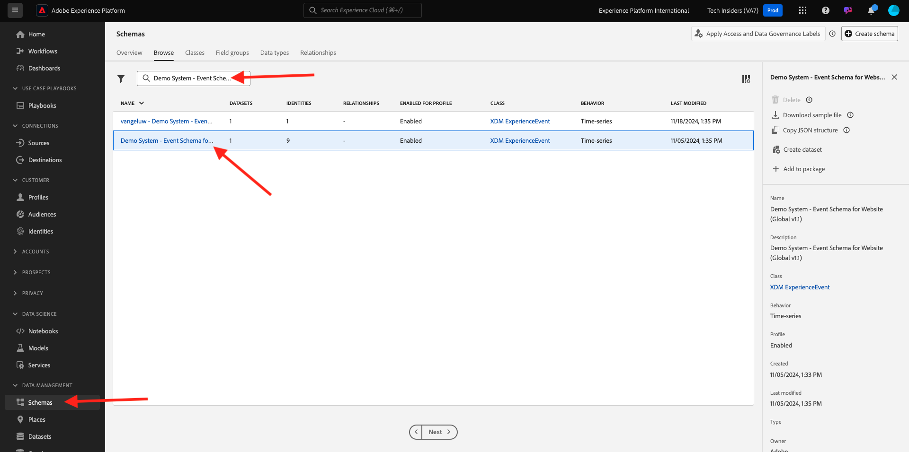

# 2.1.3使用查询服务

## 目标

- 查找和浏览数据集
- 了解如何在查询中处理Experience Data Model对象和属性

## 上下文

在本课程中，您将学习如何使用PSQL检索有关可用数据集的信息，如何编写Experience Data Model (XDM)的查询，以及使用查询服务和Citi Signal数据集编写您的第一个简单报表查询。

## 基本查询

在本教程中，您将了解用于检索有关可用数据集的信息的方法，以及如何通过XDM数据集中的查询正确检索数据。

在1之初，我们通过Adobe Experience Platform探索的所有数据集也可以通过SQL接口作为表进行访问。 要列出这些表，可以使用&#x200B;**show tables；**&#x200B;命令。

在&#x200B;**PSQL命令行接口**&#x200B;中执行`show tables;`。 （别忘了用分号结束您的命令）。

复制命令`show tables;`并在提示符处粘贴它：


您将看到以下结果：

```text
tech-insiders:all=> show tables;
                               name                               |                                                  dataSetId                                                   |                                       dataSet                                        | description |        labels        
------------------------------------------------------------------+--------------------------------------------------------------------------------------------------------------+--------------------------------------------------------------------------------------+-------------+----------------------
 ajo_bcc_feedback_event_dataset                                   | 672a07cb7728e82aefa1ec56                                                                                     | AJO BCC Feedback Event Dataset                                                       |             | 
 ajo_classification_dataset                                       | 672a07cab55b0d2aef6f9626                                                                                     | AJO Classification Dataset                                                           |             | 
 ajo_consent_service_dataset                                      | 672a07c80fd5fd2aee4155ca                                                                                     | AJO Consent Service Dataset                                                          |             | 'PROFILE'
 ajo_email_tracking_experience_event_dataset                      | 672a07c926d57d2aef020230                                                                                     | AJO Email Tracking Experience Event Dataset                  :
                               name                               |                                                  dataSetId                                                   |                                       dataSet                                        | description |        labels        
------------------------------------------------------------------+--------------------------------------------------------------------------------------------------------------+--------------------------------------------------------------------------------------+-------------+----------------------
 ajo_bcc_feedback_event_dataset                                   | 672a07cb7728e82aefa1ec56                                                                                     | AJO BCC Feedback Event Dataset                                                       |             | 
 ajo_classification_dataset                                       | 672a07cab55b0d2aef6f9626                                                                                     | AJO Classification Dataset                                                           |             | 
 ajo_consent_service_dataset                                      | 672a07c80fd5fd2aee4155ca                                                                                     | AJO Consent Service Dataset                                                          |             | 'PROFILE'
 ajo_email_tracking_experience_event_dataset                      | 672a07c926d57d2aef020230                                                                                     | AJO Email Tracking Experience Event Dataset   
```

在冒号处，按空格键查看结果集的下一页，或输入`q`还原到命令提示符。

AEP中的每个数据集都有其相应的查询服务表。 您可以通过数据集UI找到数据集的表：


`demo_system_event_dataset_for_website_global_v1_1`表是与`Demo System - Event Schema for Website (Global v1.1)`数据集对应的查询服务表。

要查询有关产品查看位置的信息，我们将选择&#x200B;**地域**&#x200B;信息。

复制下面的查询并将其粘贴到&#x200B;**PSQL命令行接口**&#x200B;中的提示符，然后按Enter：

```sql
select placecontext.geo
from   demo_system_event_dataset_for_website_global_v1_1
where  eventType = 'commerce.productViews'
and placecontext.geo.countryCode <> ''
limit 1;
```

在查询结果中，您会注意到体验数据模型(XDM)中的列可以是复杂类型，而不仅仅是标量类型。 在上面的查询中，我们希望确定发生&#x200B;**commerce.productViews**&#x200B;的地理位置。 要识别&#x200B;**commerce.productViews**，我们必须使用&#x200B;**在XDM模型中导航。** （点）表示法。

```text
tech-insiders:all=> select placecontext.geo
from   demo_system_event_dataset_for_website_global_v1_1
where  eventType = 'commerce.productViews'
and placecontext.geo.countryCode <> ''
limit 1;
                 geo                  
--------------------------------------
 ("(51.59119,-1.407848)",Charlton,GB)
(1 row)
```

是否注意到结果是一个平面对象而不是单个值？ **placecontext.geo**&#x200B;对象包含四个属性：架构、国家/地区和城市。 当一个对象被声明为一列时，它将以字符串的形式返回整个对象。 XDM架构可能比您熟悉的架构更复杂，但它非常强大，其设计可支持许多解决方案、渠道和用例。

要选择对象的各个属性，请使用&#x200B;**。** （点）表示法。

复制下面的语句并将其粘贴到&#x200B;**PSQL命令行接口**&#x200B;中的提示符：

```sql
select placecontext.geo._schema.longitude
      ,placecontext.geo._schema.latitude
      ,placecontext.geo.city
      ,placecontext.geo.countryCode
from   demo_system_event_dataset_for_website_global_v1_1
where  eventType = 'commerce.productViews'
and placecontext.geo.countryCode <> ''
limit 1;
```

上述查询的结果应如下所示。
结果现在是一组简单的值：

```text
tech-insiders:all=> select placecontext.geo._schema.longitude
      ,placecontext.geo._schema.latitude
      ,placecontext.geo.city
      ,placecontext.geo.countryCode
from   demo_system_event_dataset_for_website_global_v1_1
where  eventType = 'commerce.productViews'
and placecontext.geo.countryCode <> ''
limit 1;
 longitude | latitude |   city   | countrycode 
-----------+----------+----------+-------------
 -1.407848 | 51.59119 | Charlton | GB
(1 row)
```

不用担心，有一个简单的方法可以获得指向特定资产的路径。 在接下来的部分中，您将学习如何操作。

您将需要编辑查询，因此让我们先打开一个编辑器。

在Windows上：使用&#x200B;**记事本**

在Mac上：安装所选的任何文本编辑器应用程序并打开它。

将以下语句复制到文本编辑器中：

```sql
select your_attribute_path_here
from   demo_system_event_dataset_for_website_global_v1_1
where  eventType = 'commerce.productViews'
and placecontext.geo.countryCode <> ''
limit 1;
```

返回到Adobe Experience Platform UI（应在浏览器中打开）或导航到[Adobe Experience Platform](https://experience.adobe.com/platform)。

选择&#x200B;**架构**，在&#x200B;**搜索**&#x200B;字段中输入`Demo System - Event Schema for Website`，然后单击以打开架构`Demo System - Event Schema for Website (Global v1.1) Schema`。



通过单击对象来探索&#x200B;**演示系统 — 网站(Global v1.1)**&#x200B;的事件架构的XDM模型。 展开&#x200B;**placecontext**、**geo**&#x200B;和&#x200B;**架构**&#x200B;的树。 当您选择实际属性&#x200B;**longitude**&#x200B;时，您将在高亮显示的红色框中看到完整的路径。 要复制属性的路径，请单击复制路径图标。


切换到记事本/括号并从第一行删除&#x200B;**your_attribute_path_here**。 将光标放在第一行&#x200B;**选择**&#x200B;后并粘贴(CTRL-V)。


复制修改后的语句并将其粘贴到&#x200B;**PSQL命令行接口**&#x200B;中的提示符，然后按Enter。

结果应如下所示：

```text
tech-insiders:all=> select placeContext.geo._schema.longitude
from   demo_system_event_dataset_for_website_global_v1_1
where  eventType = 'commerce.productViews'
and placecontext.geo.countryCode <> ''
limit 1;
 longitude 
-----------
 -1.407848
(1 row)
```

## 后续步骤

转到[2.1.4查询、查询、查询和流失分析](./ex4.md){target="_blank"}

返回[查询服务](./query-service.md){target="_blank"}

返回[所有模块](./../../../../overview.md){target="_blank"}
