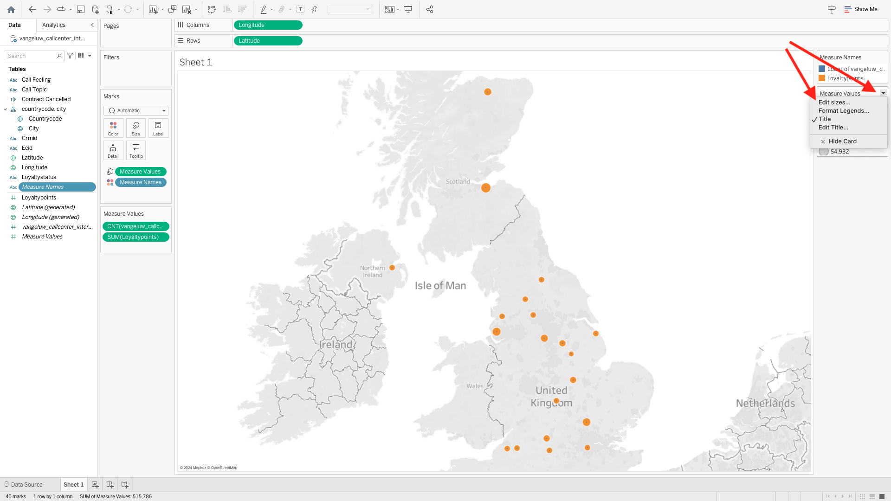

# 2.1.7查询服务和Tableau

打开Tableau。

在&#x200B;**连接到服务器**&#x200B;中，单击&#x200B;**更多**，然后单击&#x200B;**PostgreSQL**。

如果您尚未将PostgeSQL与Tableau一起使用，您可能会看到此内容。 单击&#x200B;**下载驱动程序**。

按照说明下载并安装PostgreSQL驱动程序。

安装完驱动程序后，请退出并重新启动Tableau Desktop。 然后，重新启动后，再次转到&#x200B;**连接到服务器**，单击&#x200B;**更多**，然后再次单击&#x200B;**PostgreSQL**。

你会看到这个。

转到Adobe Experience Platform、**查询**&#x200B;和&#x200B;**凭据**。

从Adobe Experience Platform的&#x200B;**凭据**&#x200B;页中，复制&#x200B;**主机**&#x200B;并将其粘贴到&#x200B;**服务器**&#x200B;字段中，复制&#x200B;**数据库**&#x200B;并将其粘贴到Tableau中的&#x200B;**数据库**&#x200B;字段中，复制&#x200B;**端口**&#x200B;并将其粘贴到Tableau中的&#x200B;**端口**&#x200B;字段中，对&#x200B;**用户名**&#x200B;和&#x200B;**密码**&#x200B;执行相同的操作。 接下来，单击&#x200B;**登录**。

在可用表的列表中，找到您在上一个练习中创建的表，该表名为`--aepUserLdap--_callcenter_interaction_analysis`。 将其拖动到画布上。

你会看到这个。 单击&#x200B;**立即更新**。

然后，您会看到AEP中的数据在Tableau中变得可用。 单击&#x200B;**表1**&#x200B;开始处理数据。

要在地图上可视化您的数据，您需要将经度和纬度转换为维度。 在&#x200B;**度量**&#x200B;中，右键单击&#x200B;**纬度**，然后在菜单中选择&#x200B;**转换为Dimension**。 对&#x200B;**经度**&#x200B;度量值执行相同操作。

将&#x200B;**Longitude**&#x200B;度量值拖动到&#x200B;**列**，将&#x200B;**纬度**&#x200B;度量值拖动到&#x200B;**行**。 **Belgium**&#x200B;的地图将自动显示，其中带有代表数据集中的城市的小点。

选择&#x200B;**度量值名称**，单击&#x200B;**添加到工作表**。

您现在将拥有包含各种大小点的地图。 该大小表示特定城市的呼叫中心互动次数。 若要改变点的大小，请导航到右侧面板并打开&#x200B;**度量值**（使用下拉图标）。 从下拉列表中选择&#x200B;**编辑大小**。 玩不同大小的游戏。

若要进一步显示每个&#x200B;**调用主题**&#x200B;的数据，请将&#x200B;**调用主题**&#x200B;维度拖动到&#x200B;**页**&#x200B;上。 使用屏幕右侧的&#x200B;**呼叫主题**&#x200B;浏览不同的&#x200B;**呼叫主题**：

您现在已经完成了此练习。

## 后续步骤

转到[2.1.8查询服务API](./ex8.md){target="_blank"}

返回[查询服务](./query-service.md){target="_blank"}

返回[所有模块](./../../../../overview.md){target="_blank"}
