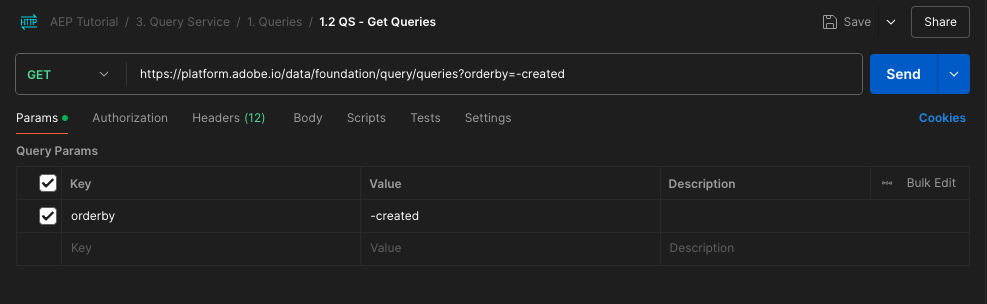

# 2.1.8查询服务API

## 目标

- 使用查询服务API管理查询模板和查询计划

## 上下文

在本练习中，您将执行API调用以使用Postman收藏集管理查询模板和查询计划。 您将定义查询模板，执行常规查询和CTAS查询。 **CTAS**&#x200B;查询（创建表作为选择查询）将其结果集存储在显式数据集中。 虽然常规查询存储在隐式（或系统生成的）数据集中，但通常以parquet文件格式导出。

## 文档

- [Adobe Experience Platform查询服务帮助](https://experienceleague.adobe.com/docs/experience-platform/query/api/getting-started.html?lang=zh-Hans)
- [查询服务API](https://www.adobe.io/apis/experienceplatform/home/api-reference.html#!acpdr/swagger-specs/qs-api.yaml)

## 查询服务API

查询服务API允许您对Adobe Experience Platform数据湖管理非交互式查询。

非交互是指执行查询的请求不会导致立即响应。 将处理查询，其结果集将存储在隐式或显式（CTAS：创建表作为选择）数据集中。

## 示例查询

作为示例查询，您将使用[4.3中列出的第一个查询 — 查询、查询、查询……和流失分析](./ex3.md)：

我们每天查看多少次产品？

**SQL**

```sql
select date_format( timestamp , 'yyyy-MM-dd') AS Day,
       count(*) AS productViews
from   demo_system_event_dataset_for_website_global_v1_1
where  --aepTenantId--.demoEnvironment.brandName IN ('Citi Signal')
and eventType = 'commerce.productViews'
group by Day
limit 10;
```

## 查询

>[!IMPORTANT]
>
>如果您是Adobe员工，请按照此处的说明使用[PostBuster](./../../../../modules/getting-started/gettingstarted/ex8.md)。

在计算机上打开Postman。 在模块2.1中，您创建了一个Postman环境并导入了一个Postman收藏集。 请按照[练习2.1.3](./../../../../modules/delivery-activation/rtcdp-b2c/rtcdpb2c-1/ex3.md)中的说明进行操作，以防您尚未执行该操作。

在您导入的Postman集合中，您将看到一个文件夹&#x200B;**3。 查询服务**。 如果未看到此文件夹，请按照[练习2.1.3](./../../../../modules/delivery-activation/rtcdp-b2c/rtcdpb2c-1/ex3.md)中的说明重新下载[Postman收藏集](./../../../../assets/postman/postman_profile.zip)并在Postman中重新导入该收藏集。


>[!NOTE]
>
>此时，仅文件夹&#x200B;**1。 查询**&#x200B;包含请求。 其他请求将在图层阶段添加。

打开该文件夹并了解要执行、监控和下载查询结果集的查询服务API调用。

使用以下有效负载对[/query/queries]的POST调用将触发我们的查询的执行；

### 创建查询

单击名为&#x200B;**1.1 QS — 创建查询**&#x200B;的请求，然后转到&#x200B;**标头**。 您随后将看到以下内容：


让我们关注此标题字段：

| 键 | 值 |
| ----------- | ----------- |
| x-sandbox-name | `--aepSandboxName--` |

>[!NOTE]
>
>您需要指定正在使用的Adobe Experience Platform沙盒的名称。 标头字段&#x200B;**x-sandbox-name**&#x200B;应为`--aepSandboxName--`。

转到此请求的&#x200B;**Body**&#x200B;部分。 在此请求的&#x200B;**正文**&#x200B;中，您将看到以下内容：


```sql
{
    "name" : "ldap - QS API demo - Citi Signal - Product Views Per Day",
	"description": "ldap - QS API demo - Citi Signal - Product Views Per Day",
	"dbName": "--aepSandboxName--:all",
	"sql": "select date_format( timestamp , 'yyyy-MM-dd') AS Day, count(*) AS productViews from demo_system_event_dataset_for_website_global_v1_1 where --aepTenantId--.demoEnvironment.brandName IN ('Citi Signal') and eventType = 'commerce.productViews' group by Day limit 10"
}
```

注意：请通过以下请求更新变量&#x200B;**name**，将&#x200B;**ldap**&#x200B;替换为您的特定&#x200B;**—aepUserLdap—**。

添加特定的&#x200B;**ldap**&#x200B;后，正文应类似于以下内容：

```json
{
    "name" : "vangeluw - QS API demo - Citi Signal - Product Views Per Day",
	"description": "vangeluw - QS API demo - Citi Signal - Product Views Per Day",
	"dbName": "tech-insiders:all",
	"sql": "select date_format( timestamp , 'yyyy-MM-dd') AS Day, count(*) AS productViews from demo_system_event_dataset_for_website_global_v1_1 where _experienceplatform.demoEnvironment.brandName IN ('Citi Signal') and eventType = 'commerce.productViews' group by Day limit 10"
}
```

>[!NOTE]
>
>上述JSON正文中的键&#x200B;**dbName**&#x200B;引用Adobe Experience Platform实例中使用的沙盒。 如果您使用的是PROD沙盒，则dbName应为&#x200B;**prod：all**；如果您使用其他沙盒（如实例&#x200B;**tech-insiders**），则dbName应等于&#x200B;**tech-insiders：all**。

接下来，单击蓝色的&#x200B;**发送**&#x200B;按钮以创建该区段并查看其结果。


成功后，POST请求将返回以下响应：

```json
{
    "isInsertInto": false,
    "request": {
        "dbName": "module7:all",
        "sql": "select date_format( timestamp , 'yyyy-MM-dd') AS Day, count(*) AS productViews from demo_system_event_dataset_for_website_global_v1_1 where _experienceplatform.demoEnvironment.brandName IN ('Luma Telco', 'Citi Signal') and eventType = 'commerce.productViews' group by Day limit 10",
        "name": "vangeluw - QS API demo - Citi Signal - Product Views Per Day",
        "description": "vangeluw - QS API demo - Citi Signal - Product Views Per Day"
    },
    "clientId": "5a143b5ae4aa4631a1f3b09cd051333f",
    "state": "SUBMITTED",
    "rowCount": 0,
    "errors": [],
    "isCTAS": false,
    "version": 1,
    "id": "8f0d7f25-f7aa-493b-9792-290f884a7e5b",
    "elapsedTime": 0,
    "updated": "2021-01-20T13:23:13.951Z",
    "client": "API",
    "userId": "A3392DB95FFF08EE0A495E87@techacct.adobe.com",
    "created": "2021-01-20T13:23:13.951Z",
    "_links": {
        "self": {
            "href": "https://platform-va7.adobe.io/data/foundation/query/queries/8f0d7f25-f7aa-493b-9792-290f884a7e5b",
            "method": "GET"
        },
        "soft_delete": {
            "href": "https://platform-va7.adobe.io/data/foundation/query/queries/8f0d7f25-f7aa-493b-9792-290f884a7e5b",
            "method": "PATCH",
            "body": "{ \"op\": \"soft_delete\"}"
        },
        "cancel": {
            "href": "https://platform-va7.adobe.io/data/foundation/query/queries/8f0d7f25-f7aa-493b-9792-290f884a7e5b",
            "method": "PATCH",
            "body": "{ \"op\": \"cancel\"}"
        }
    }
}
```

查询的当前&#x200B;**状态**&#x200B;是&#x200B;**SUBMITTED**，一旦执行，其状态将变为&#x200B;**SUCCESS**。

您还可以通过Adobe Experience Platform UI查找已提交的查询，打开[Adobe Experience Platform](https://experience.adobe.com/#/@experienceplatform/platform/home)，导航到&#x200B;**查询**，导航到&#x200B;**日志**，并选择您的查询：


### 获取查询

单击名为&#x200B;**1.2 QS - Get Queries**&#x200B;的请求，然后转到&#x200B;**Headers**。 您随后将看到以下内容：


让我们关注此标题字段：

| 键 | 值 |
| ----------- | ----------- |
| x-sandbox-name | `--aepSandboxName--` |

>[!NOTE]
>
>您需要指定正在使用的Adobe Experience Platform沙盒的名称。 标头字段&#x200B;**x-sandbox-name**&#x200B;应为`--aepSandboxName--`。

转到&#x200B;**参数**。 您随后将看到以下内容：



**orderby**&#x200B;参数允许您根据&#x200B;**created**&#x200B;属性指定排序顺序。 请注意&#x200B;**&#39;-&#39;**&#x200B;登录已创建之前，这意味着返回查询列表的顺序将使用其创建日期，顺序为&#x200B;**降序**。 您的查询应位于列表顶部。

接下来，单击蓝色的&#x200B;**发送**&#x200B;按钮以创建该区段并查看其结果。


成功后，请求将返回与以下响应类似的响应。 响应的&#x200B;**状态**&#x200B;可以是&#x200B;**SUBMITTED**、**IN_PROGRESS**&#x200B;或&#x200B;**SUCCESS**。 可能需要几分钟时间，查询才会具有&#x200B;**SUCCESS**&#x200B;状态。 您可以多次重复发送此请求，直到看到&#x200B;**SUCCESS**&#x200B;状态为止。

```json
{
    "queries": [
        {
            "isInsertInto": false,
            "sessionType": "HTTP_SESSION",
            "request": {
                "dbName": "tech-insiders:all",
                "sql": "select date_format( timestamp , 'yyyy-MM-dd') AS Day, count(*) AS productViews from demo_system_event_dataset_for_website_global_v1_1 where _experienceplatform.demoEnvironment.brandName IN ('Citi Signal') and eventType = 'commerce.productViews' group by Day limit 10",
                "name": "vangeluw - QS API demo - Citi Signal - Product Views Per Day",
                "description": "vangeluw - QS API demo - Citi Signal - Product Views Per Day"
            },
            "computeMetrics": null,
            "clientId": "b7d8a1fc396242889bb31dc83644e91d",
            "state": "IN_PROGRESS",
            "rowCount": 0,
            "isService": false,
            "errors": [],
            "isCTAS": false,
            "version": 1,
            "id": "a535234e-dc0c-42ea-bcad-eb09c5997d76",
            "elapsedTime": 8088,
            "updated": "2024-12-04T14:17:10.627Z",
            "client": "API",
            "effectiveSQL": "select date_format( timestamp , 'yyyy-MM-dd') AS Day, count(*) AS productViews from demo_system_event_dataset_for_website_global_v1_1 where _experienceplatform.demoEnvironment.brandName IN ('Citi Signal') and eventType = 'commerce.productViews' group by Day limit 10",
            "userId": "8CD31E54673C49EE0A495E05@techacct.adobe.com",
            "isParentLevel": true,
            "created": "2024-12-04T14:14:22.637Z",
                "version": 1,
    "_links": {
        "next": {
            "href": "https://platform-va7.adobe.io/data/foundation/query/queries?orderby=-created&start=2024-11-22T00:32:04.505Z"
        },
        "prev": {
            "href": "https://platform-va7.adobe.io/data/foundation/query/queries?orderby=-created&start=2024-12-04T14:14:22.637Z&isPrevLink=true"
        }
    }
}
```

当状态为&#x200B;**SUCCESS**&#x200B;时，请继续下一个请求。

### 获取查询状态

单击名为&#x200B;**1.3 QS — 获取查询状态**&#x200B;的请求，然后转到&#x200B;**标头**。 您随后将看到以下内容：


让我们关注此标题字段：

| 键 | 值 |
| ----------- | ----------- |
| x-sandbox-name | `--aepSandboxName--` |

>[!NOTE]
>
>您需要指定正在使用的Adobe Experience Platform沙盒的名称。 标头字段&#x200B;**x-sandbox-name**&#x200B;应为`--aepSandboxName--`。

接下来，单击蓝色的&#x200B;**发送**&#x200B;按钮以创建该区段并查看其结果。


成功后，请求将返回与以下响应类似的响应。

```json
{
    "isInsertInto": false,
    "sessionType": "HTTP_SESSION",
    "request": {
        "dbName": "tech-insiders:all",
        "sql": "select date_format( timestamp , 'yyyy-MM-dd') AS Day, count(*) AS productViews from demo_system_event_dataset_for_website_global_v1_1 where _experienceplatform.demoEnvironment.brandName IN ('Citi Signal') and eventType = 'commerce.productViews' group by Day limit 10",
        "name": "vangeluw - QS API demo - Citi Signal - Product Views Per Day",
        "description": "vangeluw - QS API demo - Citi Signal - Product Views Per Day"
    },
    "computeMetrics": {
        "executorVMSeconds": 138,
        "clusterCpuSeconds": 3312,
        "clusterVMHours": 0.07666666805744171,
        "driverVMSeconds": 138,
        "clusterVMSeconds": 276
    },
    "clientId": "b7d8a1fc396242889bb31dc83644e91d",
    "state": "SUCCESS",
    "rowCount": 1,
    "isService": false,
    "errors": [],
    "isCTAS": false,
    "version": 1,
    "id": "a535234e-dc0c-42ea-bcad-eb09c5997d76",
    "elapsedTime": 199219,
    "updated": "2024-12-04T14:17:41.856Z",
    "client": "API",
    "effectiveSQL": "select date_format( timestamp , 'yyyy-MM-dd') AS Day, count(*) AS productViews from demo_system_event_dataset_for_website_global_v1_1 where _experienceplatform.demoEnvironment.brandName IN ('Citi Signal') and eventType = 'commerce.productViews' group by Day limit 10",
    "userId": "8CD31E54673C49EE0A495E05@techacct.adobe.com",
    "isParentLevel": true,
    "created": "2024-12-04T14:14:22.637Z",
    "_links": {
        "self": {
            "href": "https://platform-va7.adobe.io/data/foundation/query/queries/a535234e-dc0c-42ea-bcad-eb09c5997d76",
            "method": "GET"
        },
        "soft_delete": {
            "href": "https://platform-va7.adobe.io/data/foundation/query/queries/a535234e-dc0c-42ea-bcad-eb09c5997d76",
            "method": "PATCH",
            "body": "{ \"op\": \"soft_delete\"}"
        },
        "referenced_datasets": [
            {
                "id": "672a10b1074ceb2af0aa7034",
                "href": "https://platform-va7.adobe.io/data/foundation/catalog/dataSets/672a10b1074ceb2af0aa7034"
            }
        ]
    }
}
```

当查询达到&#x200B;**SUCCESS**&#x200B;的状态时，响应还将指示查询通过&#x200B;**rowCount**&#x200B;属性检索的行数。 在我们的示例中，查询返回10行。 让我们在下一节中查看如何检索10行。

### 检索查询结果

上述&#x200B;**SUCCESS**&#x200B;响应包含&#x200B;**referenced_datasets**&#x200B;属性，该属性指向存储查询结果的隐式数据集。 要访问结果，我们使用其&#x200B;**href**&#x200B;或&#x200B;**id**&#x200B;属性。

单击名为&#x200B;**1.4 QS — 获取查询结果**&#x200B;的请求，然后转到&#x200B;**标头**。 您随后将看到以下内容：


让我们关注此标题字段：

| 键 | 值 |
| ----------- | ----------- |
| x-sandbox-name | `--aepSandboxName--` |

>[!NOTE]
>
>您需要指定正在使用的Adobe Experience Platform沙盒的名称。 标头字段&#x200B;**x-sandbox-name**&#x200B;应为`--aepSandboxName--`。

接下来，单击蓝色的&#x200B;**发送**&#x200B;按钮以创建该区段并查看其结果。


此请求的响应将指向数据集文件：

```json
{
    "672a10b1074ceb2af0aa7034": {
        "name": "Demo System - Event Dataset for Website (Global v1.1)",
        "description": "Demo System - Event Dataset for Website (Global v1.1)",
        "enableErrorDiagnostics": false,
        "tags": {
            "adobe/siphon/partition/definition": [
                "day(timestamp, _ACP_DATE)",
                "identity(_ACP_BATCHID)"
            ],
            "adobe/siphon/meta": [
                "acpBufferedFlag::false"
            ],
            "aep/siphon/partitions": [
                "_ACP_DATE",
                "_ACP_BATCHID"
            ],
            "acp_granular_plugin_validation_flags": [
                "identity:enabled",
                "profile:disabled"
            ],
            "adobe/pqs/table": [
                "demo_system_event_dataset_for_website_global_v1_1"
            ],
            "acp_granular_validation_flags": [
                "requiredFieldCheck:enabled"
            ],
            "aep/siphon/cleanup/trash/timestamp": [
                "1733302532212"
            ],
            "acp_validationContext": [
                "enabled"
            ],
            "adobe/siphon/table/format": [
                "delta"
            ],
            "unifiedProfile": [
                "enabled:true",
                "enabledAt:2024-11-05 12:33:59"
            ],
            "aep/siphon/cleanup/meta/timestamp": [
                "1733302532287"
            ],
            "unifiedIdentity": [
                "enabled:true"
            ]
        },
        "state": "ACTIVE",
        "imsOrg": "907075E95BF479EC0A495C73@AdobeOrg",
        "sandboxId": "79e3c8b2-0609-4564-a3c8-b20609a5648c",
        "extensions": {
            "adobe_lakeHouse": {
                "metrics": {
                    "storageSize": 810709,
                    "rowCount": 1141,
                    "asOf": 1732494676514
                }
            },
            "adobe_unifiedProfile": {}
        },
        "version": "1.0.21",
        "created": 1730810034023,
        "updated": 1733302532348,
        "createdClient": "d75039d36ca543c78612f7aac18e6c2b",
        "createdUser": "53FB1E5E66CDC87D0A495FC0@techacct.adobe.com",
        "updatedUser": "acp_foundation_dataTracker@AdobeID",
        "classification": {
            "dataBehavior": "time-series",
            "managedBy": "CUSTOMER"
        },
        "viewId": "672a10b2074ceb2af0aa7035",
        "fileDescription": {
            "format": "parquet"
        },
        "files": "@/dataSetFiles?dataSetId=672a10b1074ceb2af0aa7034",
        "schemaRef": {
            "id": "https://ns.adobe.com/experienceplatform/schemas/d9b88a044ad96154637965a97ed63c7b20bdf2ab3b4f642e",
            "contentType": "application/vnd.adobe.xed-full+json;version=1"
        }
    }
}
```

## 后续步骤

转到[摘要和优点](./summary.md){target="_blank"}

返回[查询服务](./query-service.md){target="_blank"}

返回[所有模块](./../../../../overview.md){target="_blank"}
