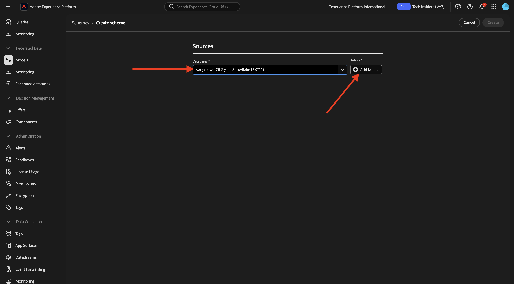
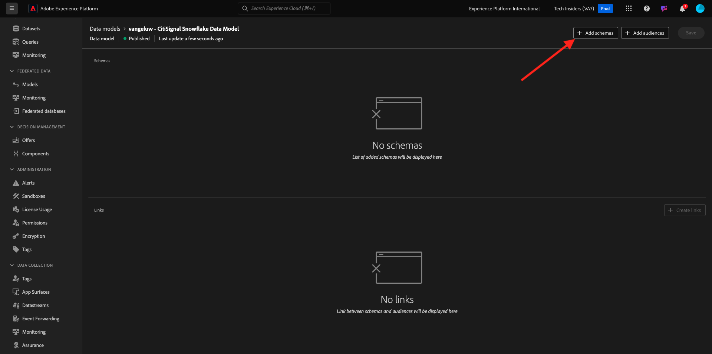
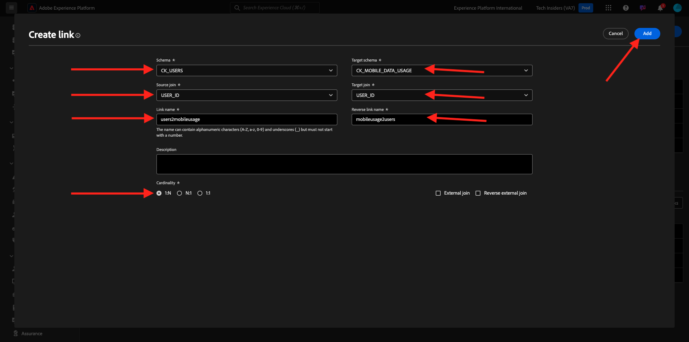

# 3.1.2创建架构、数据模型和链接

您现在可以在Adobe Experience Platform中配置联合数据库。

通过转到以下URL登录Adobe Experience Platform： [https://experience.adobe.com/platform](https://experience.adobe.com/platform)。

登录后，您将登录到Adobe Experience Platform的主页。

在继续之前，您需要选择一个&#x200B;**沙盒**。 要选择的沙盒名为``--aepSandboxName--``。 选择相应的沙盒后，您将看到屏幕变化，现在您位于专用沙盒中。

## 3.1.2.1在AEP中设置联合数据库

单击左侧菜单中的&#x200B;**联合数据库**。 然后，单击&#x200B;**添加联合数据库**。

作为&#x200B;**标签**，使用`--aepUserLdap-- - CitiSignal Snowflake`，对于类型，请选择&#x200B;**Snowflake**。

在“详细信息”下，您需要填写凭据，凭据将如下所示：

**服务器**：

在Snowflake中，转到&#x200B;**管理员>帐户**。 单击帐户旁边的3 **...**，然后单击&#x200B;**管理URL**。

你会看到这个。 复制&#x200B;**当前URL**&#x200B;并将其粘贴到AEP中的&#x200B;**服务器**&#x200B;字段中。

**用户**：您在练习1.3.1.1中先前创建的用户名
**密码**：您在练习1.3.1.1中先前创建的密码
**数据库**：使用&#x200B;**CITISIGNAL**

最后，你应该拥有这个。 单击&#x200B;**测试连接**。 如果测试成功，请单击&#x200B;**部署函数**，这将在Snowflake端创建工作流引擎所需的函数。

成功测试连接并部署功能后，将存储您的配置。

然后返回&#x200B;**联合数据库**&#x200B;菜单时，您将在该处看到连接。

## 3.1.2.2在AEP中创建架构

在左侧菜单中，单击&#x200B;**模型**，然后转到&#x200B;**架构**。 单击&#x200B;**创建架构**。

选择联合数据库并单击&#x200B;**+添加表**。

你会看到这个。 选择之前在Snowflake中创建的5个表：

- `--aepUserLdap--_HOUSEHOLDS`
- `--aepUserLdap--_MOBILE_DATA_USAGE`
- `--aepUserLdap--_MONTHLY_DATA_USAGE`
- `--aepUserLdap--_PERSONS`
- `--aepUserLdap--_USERS`

单击&#x200B;**添加**。

然后，AEP将加载每个表的信息并在UI中显示该信息。

对于每个表，您可以：

- 更改架构的标签
- 添加描述
- 重命名所有字段，并设置其可见性
- 选择架构的主键

在本练习中，无需进行任何更改。

单击&#x200B;**创建**。

你会看到这个。 您可以单击任何架构并查看信息。 例如，单击&#x200B;**—aepUserLdap—_PERSONS**。

然后，您将看到此内容，并能够编辑配置。 单击&#x200B;**数据**&#x200B;查看Snowflake数据库中的数据示例。

然后，您将看到数据示例。

## 3.1.2.3在AEP中创建模型

在左侧菜单中，转到&#x200B;**模型**，然后转到&#x200B;**数据模型**。 单击&#x200B;**创建数据模型**。

对于标签，请使用`--aepUserLdap-- - CitiSignal Snowflake Data Model`。 单击&#x200B;**创建**。

单击&#x200B;**添加架构**。

选择您的架构并单击&#x200B;**添加**。

你会看到这个。 单击&#x200B;**保存**。

### `--aepUserLdap--_USERS` — `--aepUserLdap--_PERSONS`

您现在可以开始定义架构之间的链接。 若要开始定义链接，您需要单击&#x200B;**创建链接**。

首先，我们定义表`--aepUserLdap--_USERS`和`--aepUserLdap--_PERSONS`之间的链接。

单击&#x200B;**添加**。

### `--aepUserLdap--_HOUSEHOLDS` — `--aepUserLdap--_PERSONS`

你以后会回到这里的。 单击&#x200B;**创建链接**&#x200B;以创建另一个链接。

接下来，让我们定义表`--aepUserLdap--_HOUSEHOLDS`和`--aepUserLdap--_PERSONS`之间的链接。

### `--aepUserLdap--_USERS` — `--aepUserLdap--_MONTHLY_DATA_USAGE`

你以后会回到这里的。 单击&#x200B;**创建链接**&#x200B;以创建另一个链接。

接下来，让我们定义表`--aepUserLdap--_USERS`和`--aepUserLdap--_MONTHLY_DATA_USAGE`之间的链接。

### `--aepUserLdap--_USERS` — `--aepUserLdap--_HOUSEHOLDS`

你以后会回到这里的。 单击&#x200B;**创建链接**&#x200B;以创建另一个链接。

接下来，让我们定义表`--aepUserLdap--_USERS`和`--aepUserLdap--_HOUSEHOLDS`之间的链接。

### `--aepUserLdap--_USERS` — `--aepUserLdap--_MOBILE_DATA_USAGE`

你以后会回到这里的。 单击&#x200B;**创建链接**&#x200B;以创建另一个链接。

接下来，让我们定义表`--aepUserLdap--_USERS`和`--aepUserLdap--_MOBILE_DATA_USAGE`之间的链接。

您应该会看到此内容。 单击&#x200B;**保存**。

AEP中的设置现已完成。 您现在可以开始在联合受众组合中使用联合数据。

下一步： [3.1.3创建联合合成](./ex3.md)

[返回模块3.1](./fac.md)

[返回所有模块](../../../overview.md)
