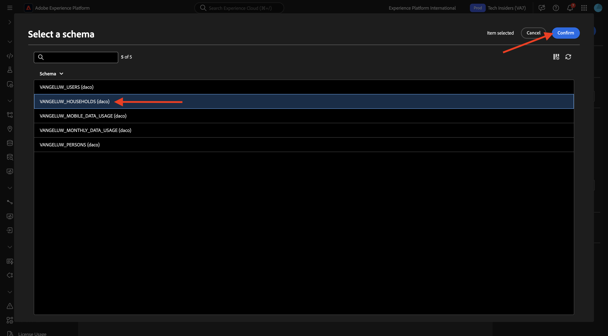
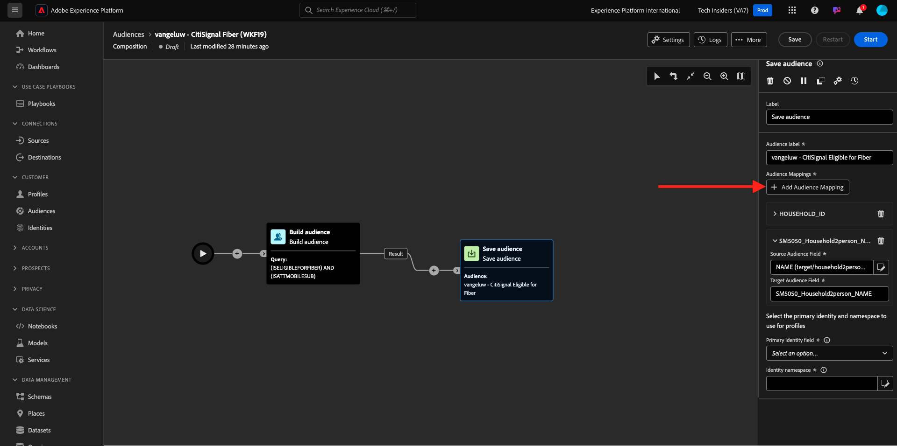
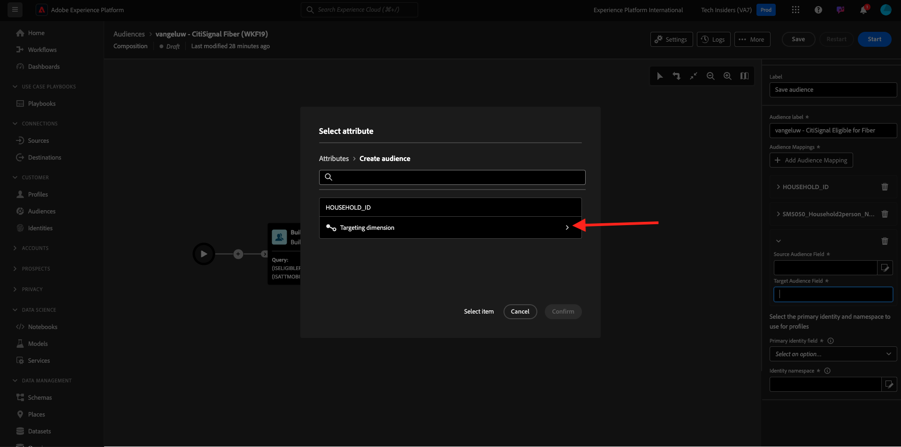
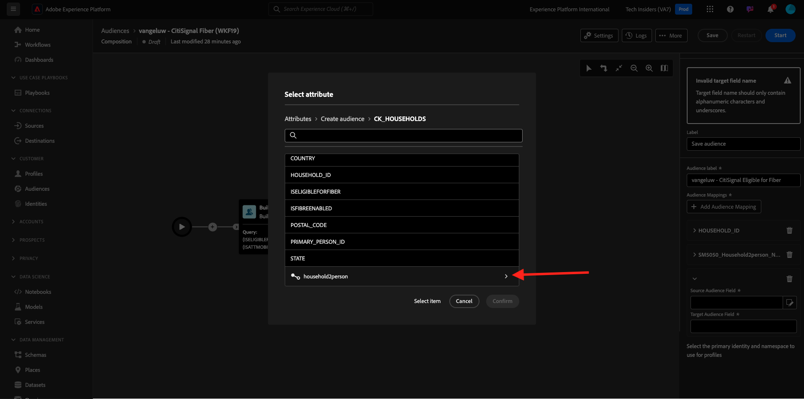
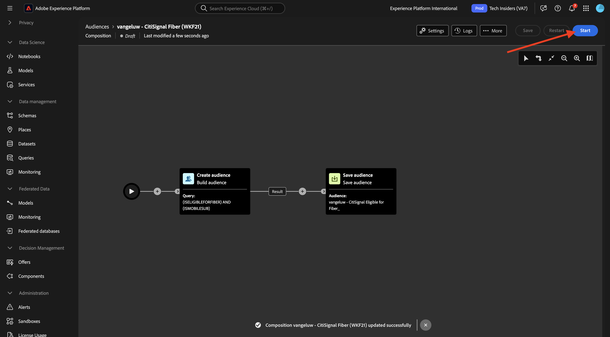

# 3.1.3创建联合组合

您现在可以在AEP中配置联合受众合成。

通过转到以下URL登录Adobe Experience Platform： [https://experience.adobe.com/platform](https://experience.adobe.com/platform)。

登录后，您将登录到Adobe Experience Platform的主页。

在继续之前，您需要选择一个&#x200B;**沙盒**。 要选择的沙盒名为``--aepSandboxName--``。 选择相应的沙盒后，您将看到屏幕变化，现在您位于专用沙盒中。

## 3.1.3.1创建受众

在左侧菜单中，转到&#x200B;**受众**，然后转到&#x200B;**联合合成**。 单击&#x200B;**创建合成**。

对于标签，使用此： `--aepUserLdap-- - CitiSignal Fiber`。 选择您在上一个练习中创建的数据模型，名为`--aepUserLdap-- - CitiSignal Snowflake Data Model`。 单击&#x200B;**创建**。

你会看到这个。

单击&#x200B;**+**&#x200B;图标并单击&#x200B;**生成受众**。

你会看到这个。 选择&#x200B;**创建受众**。 单击&#x200B;**搜索**&#x200B;图标以选择架构。

选择架构&#x200B;**—aepUserLdap—_HOMETHINGS**。 单击&#x200B;**确认**。

接下来，单击&#x200B;**继续**。

您现在可以开始构建将发送到Snowflake的查询。 单击&#x200B;**+**&#x200B;图标，然后单击&#x200B;**自定义条件**。

选择属性&#x200B;**ISELIGIBLEFORFIBRE**&#x200B;单击&#x200B;**确认**。

你会看到这个。 将字段&#x200B;**值**&#x200B;设置为&#x200B;**True**。 单击&#x200B;**计算**&#x200B;以将查询推送到Snowflake并获取现在符合条件的用户档案的估计值。

然后，再次单击&#x200B;**+**&#x200B;图标并再次单击&#x200B;**自定义条件**&#x200B;以添加另一个条件。

要添加的第二个条件是： `Is the user an existing CitiSignal Mobile subscriber?`。 回答该问题的方法是使用家庭与家庭中主要客户之间的关系，该关系在另一个表&#x200B;**—aepUserLdap—_PERSONES**&#x200B;中定义。 您可以使用&#x200B;**household2person**&#x200B;链接在属性菜单中向下展开。

选择属性&#x200B;**ISMOBILESUB**&#x200B;并单击&#x200B;**确认**。

将字段&#x200B;**Value**&#x200B;设置为&#x200B;**True**&#x200B;再次单击&#x200B;**计算**&#x200B;以更新将定向的用户档案数。 单击&#x200B;**确认**。

单击&#x200B;**+**&#x200B;图标，然后单击&#x200B;**保存受众**。

将&#x200B;**受众标签**&#x200B;设置为`--aepUserLdap-- - CitiSignal Eligible for Fiber`。

单击&#x200B;**+添加受众映射**。

选择&#x200B;**HOUSEHOLD_ID**&#x200B;并单击&#x200B;**确认**。

单击&#x200B;**+添加受众映射**。

通过单击&#x200B;**定向维度**&#x200B;向下展开。

通过单击链接&#x200B;**household2person**&#x200B;向下展开。

选择字段&#x200B;**名称**。 单击&#x200B;**确认**。

单击&#x200B;**+添加受众映射**。

通过单击&#x200B;**定向维度**&#x200B;向下展开。

通过单击链接&#x200B;**household2person**&#x200B;向下展开。

选择字段&#x200B;**电子邮件**。 单击&#x200B;**确认**。

你会看到这个。 您现在需要设置&#x200B;**主标识字段**，并将其设置为&#x200B;**Household2person_EMAIL**。

单击&#x200B;**保存**。

你的文章现在写完了。 单击&#x200B;**启动**&#x200B;以运行它。

现在，查询将被推送到Snowflake，后者将在其中查询源数据。 结果将推送回AEP，但源数据仍保留在Snowflake中。

受众现已填充，可在AEP生态系统中定位受众。

下一步：[摘要和优点](./summary.md)

[返回模块3.1](./fac.md)

[返回所有模块](../../../overview.md)
