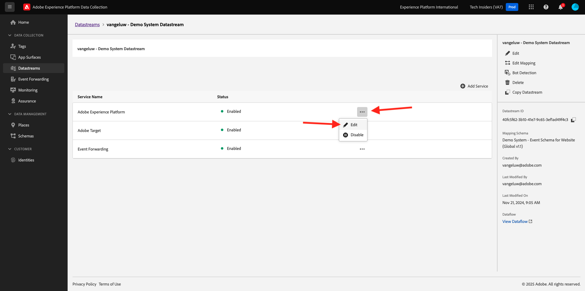

# 3.3.3准备您的Adobe Experience Platform数据收集客户端资产和Web SDK设置以进行Offer decisioning

## 3.3.3.1更新您的数据流

在[快速入门](./../../../modules/getting-started/gettingstarted/ex2.md)中，您创建了自己的&#x200B;**数据流**。 您随后使用了名称`--aepUserLdap-- - Demo System Datastream`。

在本练习中，您需要将该&#x200B;**数据流**&#x200B;配置为与&#x200B;**Offer decisioning**&#x200B;一起使用。

为此，请转到[https://experience.adobe.com/#/data-collection/](https://experience.adobe.com/#/data-collection/)。 你会看到这个。 单击&#x200B;**数据流**。

在屏幕右上角，选择沙盒名称，应为`--aepSandboxName--`。


搜索名为`--aepUserLdap-- - Demo System Datastream`的&#x200B;**数据流**。 单击您的&#x200B;**数据流**&#x200B;以将其打开。


你会看到这个。 单击&#x200B;**Adobe Experience Platform**&#x200B;旁边的&#x200B;**...**，然后单击&#x200B;**编辑**。



要启用&#x200B;**Offer decisioning**，请选中&#x200B;**Offer decisioning**&#x200B;的框。 单击&#x200B;**保存**。


您的&#x200B;**数据流**&#x200B;现在已准备好与&#x200B;**Offer decisioning**&#x200B;一起使用。


## 3.3.3.2配置您的Adobe Experience Platform数据收集客户端资产以请求个性化优惠

转到[https://experience.adobe.com/#/data-collection/](https://experience.adobe.com/#/data-collection/)，转到&#x200B;**标记**。 搜索名为`--aepUserLdap-- - Demo System (DD/MM/YYYY)`的数据收集属性。 打开Web的数据收集客户端属性。


在属性中，转到&#x200B;**规则**&#x200B;并打开规则&#x200B;**页面视图**。


单击以打开操作&#x200B;**发送“页面查看”体验事件**。


你会看到这个。 在&#x200B;**Personalization**&#x200B;下，您会注意到&#x200B;**范围**&#x200B;的选项。


对于发送到边缘和Adobe Experience Platform的每个请求，可以提供一个或多个&#x200B;**决策范围**。 **决策范围**&#x200B;是两个元素的组合：

- 决策ID
- 投放 ID

我们先来看看你们在哪里可以找到这两个元素。

### 3.3.3.2.1检索您的版面ID

版面ID标识所需的资源的位置和类型。 例如，CitiSignal网站主页上的主页图像对应于Web — 图像的版面ID。

>[!NOTE]
>
>在练习2.3.5中，您已配置Adobe Target体验定位活动，该活动将更改主页中主页位置的图像，如屏幕快照中所示。 在本练习中，您现在会使选件显示在主页图像下方的图像中，如屏幕快照中所示。


要查找Web版面ID，请转到[Adobe Experience Cloud](https://experience.adobe.com)，将图像转到Adobe Journey Optimizer。 单击&#x200B;**Journey Optimizer**。

您将被重定向到Journey Optimizer中的&#x200B;**主页**&#x200B;视图。 首先，确保使用正确的沙盒。 要使用的沙盒名为`--aepSandboxName--`。 然后，您将进入沙盒`--aepSandboxName--`的&#x200B;**主页**&#x200B;视图。

接下来，转到组件，再转到版面。 单击&#x200B;**Web — 图像**&#x200B;位置查看其详细信息。


如上图所示，在本例中，版面ID为`dps:offer-placement:1a08a14ccfe533b6`。 记下您的Web版面ID — 在下个练习中根据需要创建图像。

### 3.3.3.2.2检索您的优惠决策ID

**优惠决策ID**&#x200B;标识您要使用的个性化优惠和备用优惠组合。 在上一个练习中，您创建了自己的决策并将其命名为`--aepUserLdap-- - CitiSignal Decision`。

要查找您`--aepUserLdap-- - CitiSignal Decision`的优惠决策ID，请转到“优惠”，然后转到“决策”。 单击以选择名为`--aepUserLdap-- - CitiSignal Decision`的决策。


如上图所示，在此示例中，决策ID为`dps:offer-activity:1a08ba4b529b2fb2`。 记下您决定`--aepUserLdap-- - CitiSignal Decision`的优惠决定ID，因为您将在下一个练习中需要它。

现在，您已检索到创建&#x200B;**决策范围**&#x200B;所需的两个元素，您可以继续下一步骤，其中涉及编码决策范围。

### 3.3.3.2.3基本编码64

您需要输入的&#x200B;**决策范围**&#x200B;是BASE64编码的字符串。 此BASE64编码字符串是版面ID和决策ID的组合，如下所示：

```json
{
  "xdm:activityId": "dps:offer-activity:1a08ba4b529b2fb2",
  "xdm:placementId": "dps:offer-placement:1a08a14ccfe533b6"
}
```

您可以从Adobe Experience Platform中检索BASE64编码的字符串。 转到Decisions并单击以打开名为`--aepUserLdap-- - CitiSignal Decision`的Decisions。


打开`--aepUserLdap-- - CitiSignal Decision`后，您将看到此内容。 找到版面Web — 图像，然后单击&#x200B;**复制**&#x200B;按钮。 接下来，单击&#x200B;**编码决策范围**。 **决策范围**&#x200B;现已复制到剪贴板。


接下来，返回到Launch，进入您的操作&#x200B;**AEP Web SDK — 发送事件**。


将编码的决策范围粘贴到输入字段中。 单击&#x200B;**[!UICONTROL 保留更改]**，保存操作&#x200B;**AEP Web SDK — 发送事件**&#x200B;中所做的更改。


接下来，单击&#x200B;**[!UICONTROL 保存]**。


在Adobe Experience Platform数据收集中，转到&#x200B;**[!UICONTROL 发布流]**&#x200B;并打开名为&#x200B;**[!UICONTROL Main]**&#x200B;的&#x200B;**[!UICONTROL 开发库]**。 单击&#x200B;**[!UICONTROL +添加所有更改的资源]**，然后单击&#x200B;**[!UICONTROL 保存并生成以进行开发]**。 您所做的更改将立即发布到演示网站。


每次您现在加载&#x200B;**常规页面**&#x200B;时（例如，演示网站的主页），Offer decisioning都将评估适用的选件，并将返回包含要显示的选件详细信息的响应。 在网站上显示选件需要其他配置，您将在下一步中进行这些配置。

## 3.3.3.3配置您的Adobe Experience Platform数据收集客户端资产以接收和应用个性化优惠

转到[https://experience.adobe.com/#/data-collection/](https://experience.adobe.com/#/data-collection/)，转到&#x200B;**[!UICONTROL 属性]**。 搜索名为`--aepUserLdap-- - Demo System (DD/MM/YYYY)`的数据收集属性。 打开Web的数据收集属性。


在属性中，转到&#x200B;**规则**。 搜索并打开规则&#x200B;**显示选件(Offer decisioning)**。


你会看到这个。 打开操作&#x200B;**在页面**&#x200B;上显示选件。


单击&#x200B;**[!UICONTROL 打开编辑器]**


通过在编辑器中粘贴以下代码来覆盖代码。

```javascript
if (!Array.isArray(event.decisions)) {
  console.log("No personalization decisions");
  return;
}

console.log("Received response from Offer Decisioning", event.decisions);

event.decisions.forEach(function (payload) {
  payload.items.forEach(function (item) {
    console.log("Offer", item.data.deliveryURL);

    if (!item.data || item.data?.deliveryURL==null) {
      return;
    }
    console.log("item.data.deliveryURL", item.data.deliveryURL)
    //document.querySelector(".TopRibbon").innerHTML = item.data.content;
    document.querySelector("#SpectrumProvider > div.App > div > div.Page.home > main > div:nth-child(2)").innerHTML = "";
    document.querySelector("#SpectrumProvider > div.App > div > div.Page.home > main > div:nth-child(2) > img").style.backgroundRepeat="no-repeat";
    document.querySelector("#SpectrumProvider > div.App > div > div.Page.home > main > div:nth-child(2) > img").style.backgroundPosition="center center";
    document.querySelector("#SpectrumProvider > div.App > div > div.Page.home > main > div:nth-child(2) > img").style.backgroundSize = "contain";
  });
});
```

第17行将Offer decisioning返回的映像应用到网站。 单击&#x200B;**[!UICONTROL 保存]**。


单击&#x200B;**[!UICONTROL 保留更改]**。


接下来，单击&#x200B;**[!UICONTROL 保存]**。


在Adobe Experience Platform数据收集中，转到&#x200B;**[!UICONTROL 发布流]**&#x200B;并打开名为&#x200B;**[!UICONTROL Main]**&#x200B;的&#x200B;**[!UICONTROL 开发库]**。 单击&#x200B;**[!UICONTROL +添加所有更改的资源]**，然后单击&#x200B;**[!UICONTROL 保存并生成以进行开发]**。 您所做的更改将立即发布到演示网站。


在执行此更改后，Adobe Experience Platform数据收集中的此规则现在将侦听来自Offer Decisioning的响应(属于Web SDK响应的一部分)，并在收到响应时，将在主页上显示选件的图像。

查看演示网站，您会看到此图像将被立即替换。 现在，您将看到类似这样的选件，而不是默认的CitiSignal网站图像。 在这种情况下，将显示后备优惠。


您现在配置了2种类型的个性化：

- 在练习2.3.5中使用Adobe Target的“1体验定位”活动
- 使用“数据收集”资产实现1个Offer decisioning

在下一个练习中，您将了解如何将在Adobe Journey Optimizer中创建的优惠和决策与Adobe Target体验定位活动相结合。

下一步：[3.3.4将Adobe Target和Offer decisioning结合使用](./ex4.md)

[返回模块3.3](./offer-decisioning.md)

[返回所有模块](./../../../overview.md)
