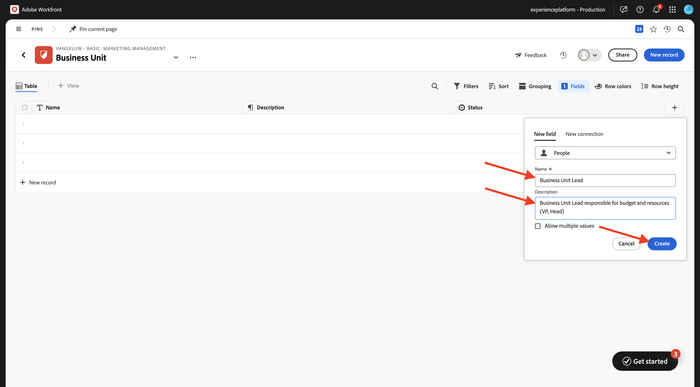
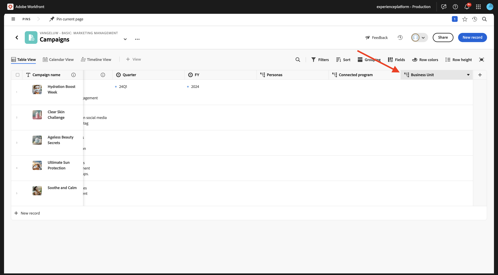
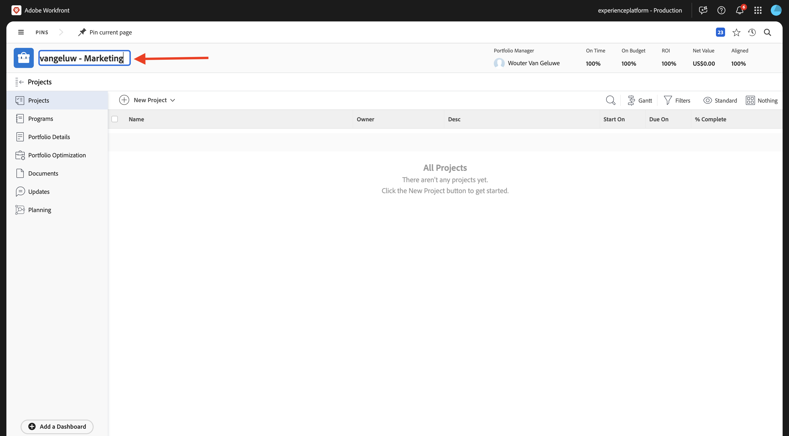
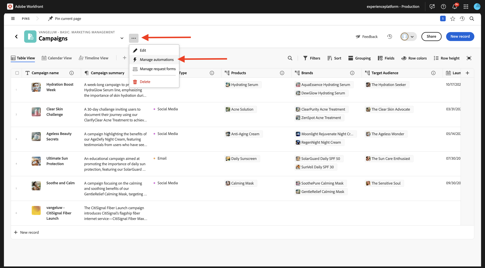
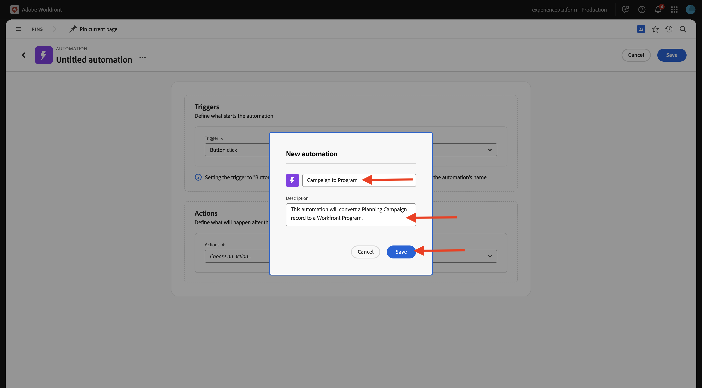
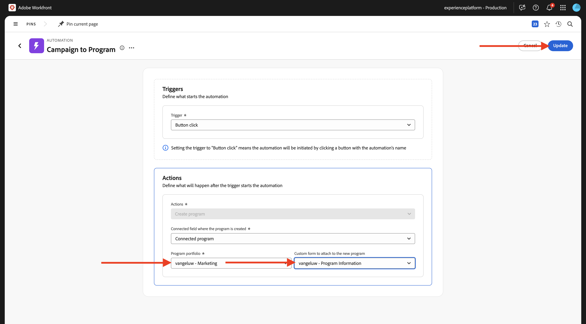

# 1.1.1 Workfront Planning快速入门

## 1.1.1.1 CitiSignal营销活动摘要

若要了解CitiSignal的背景以及他们尝试实现的目标，请在此处下载并阅读CitiSignal的营销活动简报： [CitiSignal-Fibre-Launch-Winter-2026.pdf](./../../../assets/brief/CitiSignal-Fiber-Launch-Winter-2026.pdf)。

## 1.1.1.2 Workfront规划术语

以下是主要的Workfront Planning对象和概念：

| 术语 | 说明 |
| --- | ---|
| **Workspace** | 定义特定组织的运营生命周期的记录类型集合。 工作区是组织单位的工作框架。 |
| **记录类型** | Workfront Planning中对象类型的名称。 记录类型填充工作区。 与Workfront Workflow中预定义对象类型不同，在Workfront Planning中，您可以创建自己的对象类型。 |
| **记录** | 记录类型的实例。 |
| **Workspace模板** | 您可以使用预定义模板创建工作区。 您可以使用模板中的预定义记录类型和字段，也可以添加自己的类型和字段。 |
| **字段** | 字段是您可以添加到记录类型的属性。 字段包含有关记录类型的信息。 |

>[!NOTE]
>
>您可以创建的Workfront Planning对象数存在限制。 有关详细信息，请参阅Adobe Workfront Planning对象限制概述。

现在，您将亲自开始创建其中一些对象。

## 1.1.1.3 Workspace，记录类型，字段

转到[https://experience.adobe.com/](https://experience.adobe.com/){target="_blank"}。 单击以打开&#x200B;**Workfront**。


在Workfront中，单击以打开菜单，然后选择&#x200B;**计划**。


您应该会看到此内容。 单击&#x200B;**创建Workspace**。


单击模板&#x200B;**基本营销管理**&#x200B;的&#x200B;**使用模板**。


现在已创建新工作区。 在继续之前，您需要更改工作区的名称。 单击这3个点&#x200B;**...**，然后选择&#x200B;**编辑**。


将名称更改为`--aepUserLdap-- - Basic: Marketing Management`。 单击&#x200B;**保存**。


然后您应该拥有此项。


## 1.1.1.4分类：记录类型和字段

在&#x200B;**分类**&#x200B;下，单击&#x200B;**+添加记录类型**，然后选择&#x200B;**手动添加**。


然后，您应该会看到&#x200B;**添加记录类型**&#x200B;弹出窗口。


在&#x200B;**外观**&#x200B;选项卡上更新以下信息：

- 由&#x200B;**替换**&#x200B;无标题记录类型`Business Unit`。
- 描述： `Defines which BU is leading campaign planning.`。
- 选择所选图标的颜色和形状

单击&#x200B;**保存**。


单击以打开新创建的&#x200B;**业务部门**&#x200B;记录类型。


您现在将看到空表格视图，因为您新创建的记录类型尚未定义任何业务部门记录。


单击字段&#x200B;**开始日期**&#x200B;上的下拉按钮，然后选择&#x200B;**删除**。


选择&#x200B;**删除**。


单击字段&#x200B;**结束日期**&#x200B;上的下拉按钮，然后选择&#x200B;**删除**。


选择&#x200B;**删除**。


接下来，单击&#x200B;**+**&#x200B;图标以添加新字段。 在可用字段类型列表中向下滚动并选择&#x200B;**人员**。


将字段的&#x200B;**Name**&#x200B;设置为`Business Unit Lead`并将字段的描述设置为`Business Unit Lead responsible for budget and resources (VP, Head).`

单击&#x200B;**保存**。



单击第一条记录上的3个点&#x200B;**...**，然后选择&#x200B;**查看**。


将&#x200B;**Name**&#x200B;设置为`Consumer Services`。

将&#x200B;**描述**&#x200B;设置为`Handles residential offerings like mobile plans, internet packages, and customer support.`。

将&#x200B;**业务部门潜在客户**&#x200B;设置为您自己。

完成后，单击箭头返回上一个屏幕。


单击第二条记录上的3个圆点&#x200B;**...**，然后选择&#x200B;**查看**。


将&#x200B;**Name**&#x200B;设置为`Enterprise & Business Solutions`

将&#x200B;**描述**&#x200B;设置为`Provides connectivity, cloud, and managed services to corporate clients and government entities.`

将&#x200B;**业务部门潜在客户**&#x200B;设置为您自己。

完成后，单击箭头返回上一个屏幕。


单击第三条记录上的3个圆点&#x200B;**...**，然后选择&#x200B;**查看**。


将&#x200B;**Name**&#x200B;设置为`Sales & Marketing`

将&#x200B;**描述**&#x200B;设置为`Drives customer acquisition, brand strategy, advertising, and market segmentation.`

将&#x200B;**业务部门潜在客户**&#x200B;设置为您自己。

完成后，单击箭头返回上一个屏幕。


您现在已创建了新记录类型，您既删除了字段，又创建了字段，并且创建了3个业务部门。 单击左上角的箭头，返回到Workspace概述屏幕。


您应该会看到此内容。


## 1.1.1.5操作记录类型：字段

单击以打开&#x200B;**营销活动**。


单击&#x200B;**+**&#x200B;图标以创建新字段。 选择&#x200B;**新建连接**，然后选择&#x200B;**业务单元**。


保留默认设置。 单击&#x200B;**创建**。


选择&#x200B;**跳过**。


然后，您的新字段将显示在表格视图中。



## 1.1.1.6创建请求表单

在营销活动概述屏幕上，单击3个圆点&#x200B;**...**，然后选择&#x200B;**创建请求表单**。


将名称更改为`Campaign Request Form`。 单击&#x200B;**创建**。


目前，无需对表单进行任何更改。 您无需进行更改即可使用它。 首先，单击&#x200B;**保存**，然后单击&#x200B;**发布**。


单击左上角的箭头，以返回到“请求Forms概述”屏幕。


单击左上角的箭头，以返回营销活动概述屏幕。


## 1.1.1.7使用请求表单提交新记录

在促销活动概览屏幕上，单击&#x200B;**+新建记录**。


选择&#x200B;**提交请求**&#x200B;并单击&#x200B;**继续**。


将&#x200B;**主题**&#x200B;设置为`--aepUserLdap-- - New Campaign Creation Request`。

将&#x200B;**促销活动名称**&#x200B;设置为`--aepUserLdap-- - CitiSignal Fiber Launch`。

将&#x200B;**营销活动摘要**&#x200B;设置为：

```
The CitiSignal Fiber Launch campaign introduces CitiSignal’s flagship fiber internet service—CitiSignal Fiber Max—to key residential markets. This campaign is designed to build awareness, drive sign-ups, and establish CitiSignal as the go-to provider for ultra-fast, reliable, and future-ready internet. The campaign will highlight the product’s benefits for remote professionals, online gamers, and smart home families, using persona-driven messaging across digital and physical channels.
```

根据需要填写其他字段。

单击&#x200B;**提交请求**。


单击&#x200B;**X**&#x200B;关闭弹出窗口。


然后，您应该会在概述中看到新创建的营销活动。


## 1.1.1.8创建Portfolio和自定义表单

在下一步中，您将创建一个自动功能，该功能将从您在Workfront Planning中创建的营销策划中获得信息，并在Workfront中使用该信息创建项目。 在创建自动化之前，必须先在Workfront中配置两项：项目组合和自定义表单。

要创建项目组合，请打开菜单并单击&#x200B;**项目组合**。


单击&#x200B;**+新建Portfolio**。


将项目组合名称设置为`--aepUserLdap-- - Marketing`。



接下来，打开菜单并单击&#x200B;**设置**&#x200B;以创建自定义表单。


在左侧菜单中，转到&#x200B;**自定义Forms**，转到&#x200B;**Forms**，然后单击&#x200B;**+新建自定义表单**。


选择&#x200B;**程序**&#x200B;并单击&#x200B;**继续**。


将表单名称更改为`--aepUserLdap-- - Program Information`。


接下来，转到&#x200B;**字段库**&#x200B;并搜索`budget`。 将现有字段&#x200B;**预算**&#x200B;拖放到表单上。

单击&#x200B;**应用**。


您的自定义表单配置现已保存。


## 1.1.1.8创建自动化

创建项目组合和自定义表单后，您现在可以创建自动化。

单击以打开菜单，然后选择&#x200B;**计划**。


单击以打开您之前创建的工作区，名为`--aepUserLdap-- - Basic: Marketing Management`。


单击以打开&#x200B;**营销活动**。


在营销活动概述屏幕上，单击3个圆点&#x200B;**...**，然后选择&#x200B;**管理自动化**。



单击&#x200B;**新建自动化**。


将Automation的名称设置为`Campaign to Program`。

将描述设置为`This automation will convert a Planning Campaign record to a Workfront Program.`

单击&#x200B;**保存**。



将&#x200B;**操作**&#x200B;设置为&#x200B;**创建项目**。 单击&#x200B;**+添加连接的字段**。


选择&#x200B;**项目组合**： `--aepUserLdap-- - Marketing`。

选择此&#x200B;**自定义表单**： `--aepUserLdap-- Program information`。

单击&#x200B;**保存**。



您应该会看到此内容。 单击箭头以返回营销活动概述屏幕。


选中您之前创建的营销活动前的复选框。 然后，单击&#x200B;**Campaign to Program**&#x200B;自动化。


几秒钟后，您应该会看到一条确认消息，确认自动化已成功完成。 这意味着根据Workfront规划中的Campaign对象，在Workfront中创建了一个项目。


要在Workfront中检查程序，请向右滚动并单击&#x200B;**连接的程序**&#x200B;列中的程序。


然后，您应该会看到刚刚通过所配置的自动化程序创建的程序。


下一步：[摘要和优点](./summary.md){target="_blank"}

返回[Workfront规划简介](./wfplanning.md){target="_blank"}

[返回所有模块](./../../../overview.md){target="_blank"}
