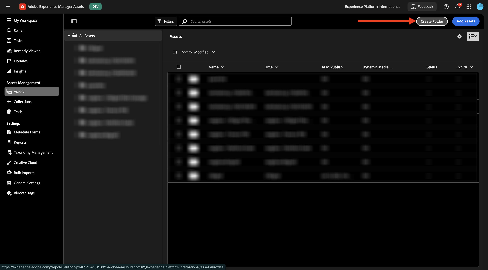

# 1.2.1 Workfront + AEM Assets CS元数据集成

>[!IMPORTANT]
>
>要完成本练习，您需要有权访问有效的AEM Assets CS Author环境。
>
>考虑以下两个选项：
>
>- 如果您参加GenStudio的CSC技术支持研讨会，您的讲师已经为您创建了一个AEM Assets CS创作环境。 请与他们确认名称以及操作方法。
>
>- 如果您遵循完整的One Adobe教程路径，请转到练习[Adobe Experience Manager Cloud Service &amp; Edge Delivery Services](./../../../modules/asset-mgmt/module2.1/aemcs.md){target="_blank"}。 按照上面的说明进行操作，您将有权访问此类环境。

>[!IMPORTANT]
>
>如果您之前已使用AEM CS环境配置了AEM Assets CS项目，则可能是您的AEM CS沙盒已休眠。 鉴于解除此类沙盒的休眠需要10-15分钟，最好现在就启动解除休眠过程，这样以后就不必等待它。

## 1.2.1.1 Workfront工作流术语

以下是主要的Workfront对象和概念：

| 名称 | 上次更新 |
| ---------------------- | ------------ | 
| 组合 | 具有统一特性的项目集合。 这些项目通常会争夺相同的资源、预算或时限。 |
| 项目 | 项目组合中的子集，可将相似的项目组合在一起，以实现明确定义的收益。 |
| 项目 | 必须在特定时间框架内完成的大量工作，且必须使用特定预算和特定资源数量。 为了使项目易于管理，您可以将项目划分为一系列任务。 完成所有任务即完成项目。 |
| 项目模板 | 您可以使用项目模板捕获与组织中项目关联的大多数可重复流程、信息和设置。 创建模板后，您可以将其附加到现有项目，或者使用它们构建新项目。 |
| 任务 | 作为实现最终目标（完成项目）的步骤而必须执行的活动。 任务永远不可能独立存在。 它们始终是项目的一部分。 |
| 指定任务 | 分配给问题或任务的用户、工作角色或团队。 项目、项目组合或项目群不能具有分配。 |
| 文档/版本 | 附加到Workfront中对象的任何文件。 每次将同一文档上载到同一对象时，都会为其分配一个版本号。 用户可以查看和更改文档早期版本的多个选项。 |
| 审批 | 给定工作项，如任务、文档或时间表，可能要求主管或其他用户签发该工作项。 此注销过程称为批准。 |

转到[https://experience.adobe.com/](https://experience.adobe.com/){target="_blank"}。 单击以打开&#x200B;**Workfront**。

你会看到这个。

## 1.2.1.1配置您的AEM Assets集成

单击&#x200B;**菜单**&#x200B;图标，然后选择&#x200B;**设置**。

在左侧菜单中，向下滚动到&#x200B;**文档**，然后单击&#x200B;**Experience Manager Assets**。 单击&#x200B;**+添加Experience Manager集成**。

对于集成的名称，请使用`--aepUserLdap-- - CitiSignal AEM`。

打开&#x200B;**Experience Manager存储库**&#x200B;下拉列表并选择您的应名为`--aepUserLdap-- - CitiSignal`的AEM CS实例。

在&#x200B;**元数据**&#x200B;下，配置以下映射：

| Workfront字段 | Experience Manager Assets字段 |
| --------------- | ------------------------------ | 
| **文档** > **名称** | **wm:documentName** |
| **项目** > **名称** | **wm:projectName** |
| **项目** > **描述** | **wm:projectDescription** |
| **文档请求** > **状态** | **wm:wm:documentStatus** |
| **任务** > **名称** | **wm:taskName** |
| **任务** > **描述** | **wm:taskDescription** |
| **项目** > **ID** | **wm:projectId** |

为&#x200B;**同步对象元数据**&#x200B;启用开关。

单击&#x200B;**保存**。

现已配置从Workfront到AEM Assets CS的集成。

## 1.2.1.2配置元数据与AEM Assets的集成

接下来，您需要配置AEM Assets CS，以便与AEM Assets CS共享Workfront中资源的元数据字段。

为此，请转到[https://experience.adobe.com/](https://experience.adobe.com/)。 单击&#x200B;**Experience Manager Assets**。

单击以选择您的AEM Assets环境，应将其命名为`--aepUserLdap-- - CitiSignal dev`。

您应该会看到此内容。 在左侧菜单中，转到&#x200B;**Assets**。

接下来，单击&#x200B;**创建文件夹**。

命名您的文件夹`--aepUserLdap-- - CitiSignal Fiber Campaign`，然后单击&#x200B;**创建**。

接下来，转到左侧菜单中的&#x200B;**元数据Forms**，然后单击&#x200B;**创建**。

使用名称`--aepUserLdap-- - Metadata Form`并单击&#x200B;**创建**。

将7个新的&#x200B;**单行文本**&#x200B;字段添加到表单并选择第一个字段。 然后，单击第一个字段的&#x200B;**元数据属性**&#x200B;字段旁边的&#x200B;**架构**&#x200B;图标。

然后您会看到此弹出窗口。 在搜索字段中，输入`wm:project`，然后选择字段&#x200B;**项目名称**。 单击&#x200B;**选择**。

将字段的标签更改为`Project Name`。 单击&#x200B;**保存**。

转到第二个字段，然后单击&#x200B;**元数据属性**&#x200B;字段旁边的&#x200B;**架构**&#x200B;图标。

在搜索字段中，输入`wm:project`，然后选择字段&#x200B;**项目说明**。 单击&#x200B;**选择**。

将字段的标签更改为`Project Description`。

接下来，选择第三个字段，然后再次单击&#x200B;**元数据属性**&#x200B;字段旁边的&#x200B;**架构**&#x200B;图标。

你将再次看到此弹出窗口。 在搜索字段中，输入`wm:project`，然后选择字段&#x200B;**项目ID**。 单击&#x200B;**选择**。

将字段的标签更改为`Project ID`。

接下来，选择第四个字段，然后再次单击&#x200B;**元数据属性**&#x200B;字段旁边的&#x200B;**架构**&#x200B;图标。

你将再次看到此弹出窗口。 在搜索字段中，输入`wm:document`，然后选择字段&#x200B;**文档状态**。 单击&#x200B;**选择**。

将字段的标签更改为`Document Status`。

接下来，选择第五个字段，然后再次单击&#x200B;**元数据属性**&#x200B;字段旁边的&#x200B;**架构**&#x200B;图标。

你将再次看到此弹出窗口。 在搜索字段中，输入`wm:document`，然后选择字段&#x200B;**文档名称**。 单击&#x200B;**选择**。

将字段的标签更改为`Document Name`。

接下来，选择第六个字段，然后再次单击&#x200B;**元数据属性**&#x200B;字段旁边的&#x200B;**架构**&#x200B;图标。

你将再次看到此弹出窗口。 在搜索字段中，输入`wm:task`，然后选择字段&#x200B;**任务名称**。 单击&#x200B;**选择**。

将字段的标签更改为`Task Name`。

接下来，选择第七个字段，然后再次单击&#x200B;**元数据属性**&#x200B;字段旁边的&#x200B;**架构**&#x200B;图标。

你将再次看到此弹出窗口。 在搜索字段中，输入`wm:task`，然后选择字段&#x200B;**任务描述**。 单击&#x200B;**选择**。

将字段的标签更改为`Task Description`。

将表单上的&#x200B;**选项卡名称**&#x200B;更改为`--aepUserLdap-- - Workfront Metadata`。

单击&#x200B;**保存**&#x200B;和&#x200B;**关闭**。

您的&#x200B;**元数据表单**&#x200B;现已配置完成。

接下来，您需要将元数据表单分配给之前创建的文件夹。 选中元数据表单的复选框，然后单击&#x200B;**分配给文件夹**。

选择您的文件夹，该文件夹应命名为`--aepUserLdap-- - CitiSignal Fiber Campaign`。 单击&#x200B;**分配**。

元数据表单现已成功分配到您的文件夹。

下一步：[使用Workfront校对1.2.2](./ex2.md){target="_blank"}

返回到[使用Adobe Workfront的工作流管理](./workfront.md){target="_blank"}

[返回所有模块](./../../../overview.md){target="_blank"}
