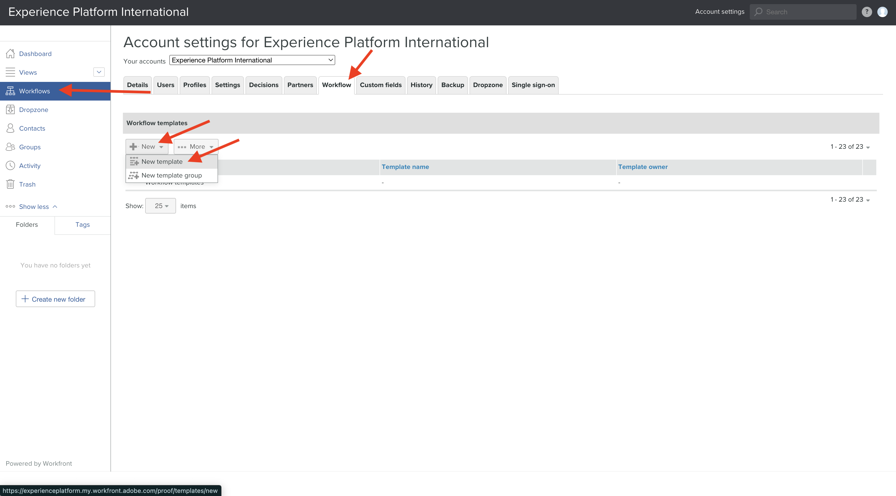
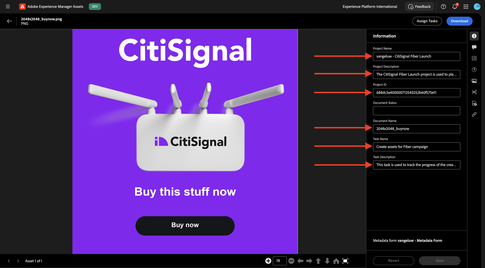

# 1.2.2 Workfront校对

>[!IMPORTANT]
>
>如果您之前已使用AEM CS环境配置了AEM Assets CS项目，则可能是您的AEM CS沙盒已休眠。 鉴于解除此类沙盒的休眠需要10-15分钟，最好现在就启动解除休眠过程，这样以后就不必等待它。

## 1.2.2.1创建新的审批流程

返回&#x200B;**Adobe Workfront**。 单击&#x200B;**菜单**&#x200B;图标并选择&#x200B;**校对**。

转到&#x200B;**工作流**，单击&#x200B;**+新建**，然后选择&#x200B;**新建模板**。

将&#x200B;**模板名称**&#x200B;设置为`--aepUserLdap-- - Approval Workflow`并将&#x200B;**模板所有者**&#x200B;设置为您自己。

向下滚动，在&#x200B;**阶段** > **阶段1**&#x200B;下，将自己添加为&#x200B;**审阅者和审批者**&#x200B;的&#x200B;**角色**。

单击&#x200B;**创建**。

您的基本审批工作流现已准备就绪，可供使用。

## 1.2.2.2创建新项目

打开&#x200B;**菜单**&#x200B;并转到&#x200B;**程序**。

单击到您之前创建的名为`--aepUserLdap-- CitiSignal Fiber Launch`的程序。

>[!NOTE]
>
>您在[Workfront Planning](./../module1.1/ex1.md)上的练习中创建了一个项目，并使用了您创建和运行的自动化功能。 如果您尚未这样做，可以在此处查找说明。

在您的项目中，转到&#x200B;**项目**。 单击&#x200B;**+新建项目**，然后选择&#x200B;**新建项目**。

您应该会看到此内容。 将名称更改为`--aepUserLdap-- - CitiSignal Fiber Launch`。

转到&#x200B;**项目详细信息**。 单击&#x200B;**描述**&#x200B;下的&#x200B;**+添加**。

将描述设置为`The CitiSignal Fiber Launch project is used to plan the upcoming launch of CitiSignal Fiber.`

单击&#x200B;**保存更改**。

您的项目现已创建。

## 1.2.2.3创建新任务

转到&#x200B;**任务**&#x200B;并单击&#x200B;**+新建任务**。

为您的任务输入此名称： `Create assets for Fiber campaign`。

将字段&#x200B;**Description**&#x200B;设置为： `This task is used to track the progress of the creation of the assets for the CitiSignal Fiber Launch Campaign.`

单击&#x200B;**创建任务**。

您应该会看到此内容。

在&#x200B;**工作**&#x200B;列中，添加您自己的名称。

然后，该任务将分配给您。

## 1.2.2.4向您的任务添加新文档通过审批流程

单击&#x200B;**Workfront**&#x200B;徽标以返回概览页面。 然后，您应该会看到刚刚创建的项目出现在概述中。 单击您的项目以将其打开。

在&#x200B;**任务**&#x200B;中，单击以打开任务。

转到&#x200B;**文档**。 单击&#x200B;**+添加新**，然后选择&#x200B;**文档**。

将[此文件](./images/2048x2048.png)下载到桌面。

{width="50px" align="left"}

选择文件&#x200B;**2048x2048.png**，然后单击&#x200B;**打开**。

然后您应该拥有此项。 将鼠标悬停在上传文档上。 单击&#x200B;**创建验证**，然后选择&#x200B;**高级验证**。

在&#x200B;**新验证**&#x200B;窗口中，选择&#x200B;**自动**，然后选择您之前创建的工作流模板，该模板应命名为`--aepUserLdap-- - Approval Workflow`。 单击&#x200B;**创建校对**。

单击&#x200B;**处理它**。

单击&#x200B;**打开校对**

您现在可以查看证明。 选择&#x200B;**添加注释**&#x200B;以添加需要更改文档的注释。

输入您的评论并单击&#x200B;**发布**。 单击&#x200B;**关闭**。

接下来，您需要将您的角色从&#x200B;**审阅者**&#x200B;更改为&#x200B;**审阅者和批准者**。 为此，请返回任务并单击&#x200B;**校对工作流**。

将您的角色从&#x200B;**审阅者**&#x200B;更改为&#x200B;**审阅者和批准者**。

返回您的任务，然后再次打开验证。 您现在看到一个新按钮，**做出决定**。 单击它。

选择&#x200B;**所需的更改**&#x200B;并单击&#x200B;**做出决定**。

返回您的&#x200B;**任务**&#x200B;和&#x200B;**文档**。 现在，您需要上传第二个图像，该图像会考虑您提供的评论。

将[此文件](./images/2048x2048_buynow.png)下载到桌面。

{width="50px" align="left"}

在“任务”视图中，选择未批准的旧图像文件。 然后，单击“**+新增**”，选择“**版本**”，然后选择“**文档**”。

选择文件&#x200B;**2048x2048_buynow.png**，然后单击&#x200B;**打开**。

然后您应该拥有此项。 单击&#x200B;**创建验证**，然后再次选择&#x200B;**高级验证**。

你会看到这个。 **工作流模板**&#x200B;现已预选，因为Workfront假定以前的审批工作流仍然有效。 单击&#x200B;**创建校对**。

选择&#x200B;**打开校对**。

现在，您可以在其旁边看到文件的2个版本。

单击&#x200B;**做出决定**，选择&#x200B;**已批准**，然后单击&#x200B;**再次做出决定**。

单击&#x200B;**任务名称**&#x200B;以返回任务概述。

然后，您将带着批准的资源返回到“任务”视图。 现在，需要向AEM Assets共享此资源。

选择已批准的文档。 单击&#x200B;**共享箭头**&#x200B;图标并选择您的应命名为`--aepUserLdap-- - CitiSignal AEM`的AEM Assets集成。

双击您之前创建的文件夹，该文件夹应名为`--aepUserLdap-- - CitiSignal Fiber Launch Assets`。

单击&#x200B;**选择文件夹**。

1-2分钟后，您的文档将发布到AEM Assets中。 您将在文档名称旁边看到一个AEM图标。

单击&#x200B;**标记为完成**&#x200B;以完成此任务。

您应该会看到此内容。

## 1.2.2.5在AEM Assets中查看您的文件

转到AEM Assets CS中名为`--aepUserLdap-- - CitiSignal Fiber Launch Assets`的文件夹。

选择映像，然后选择&#x200B;**详细信息**。

然后，您将看到之前创建的元数据表单，其中值已由Workfront与AEM Assets之间的集成自动填充。

返回到[使用Adobe Workfront的工作流管理](./workfront.md){target="_blank"}

[返回所有模块](./../../../overview.md){target="_blank"}
