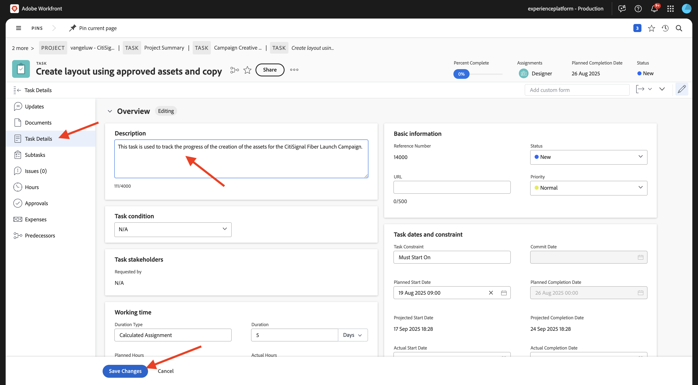
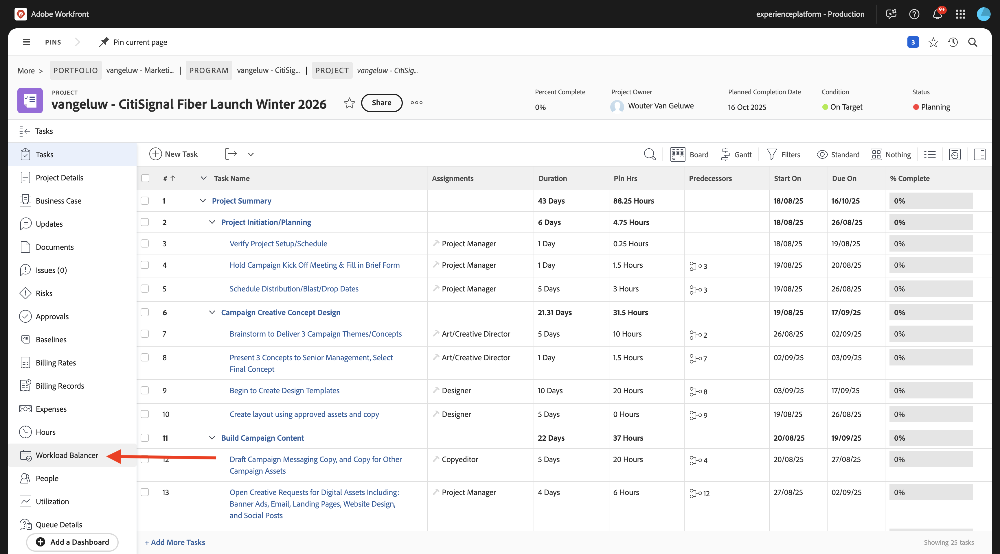

# 1.2.2 Workfront校对

>[!IMPORTANT]
>
>如果您之前已使用AEM CS环境配置了AEM Assets CS项目，则可能是您的AEM CS沙盒已休眠。 鉴于解除此类沙盒的休眠需要10-15分钟，最好现在就启动解除休眠过程，这样以后就不必等待它。

## 1.2.2.1创建新的审批流程

返回&#x200B;**Adobe Workfront**。 单击&#x200B;**菜单**&#x200B;图标并选择&#x200B;**校对**。

转到&#x200B;**工作流**，单击&#x200B;**+新建**，然后选择&#x200B;**新建模板**。

将&#x200B;**模板名称**&#x200B;设置为`--aepUserLdap-- - Approval Workflow`并将&#x200B;**模板所有者**&#x200B;设置为您自己。

向下滚动，在&#x200B;**阶段** > **阶段1**&#x200B;下，将&#x200B;**校对创建者**&#x200B;角色更改为&#x200B;**审阅者和审批者**。 例如，您还可以通过选择您的用户并设置&#x200B;**审阅者和审批者**&#x200B;的&#x200B;**角色**&#x200B;来添加您自己。

单击&#x200B;**创建**。

您的基本审批工作流现已准备就绪，可供使用。

## 1.2.2.2启用Workfront Blueprint

在下一步中，您将使用模板创建新项目。 Adobe Workfront提供了许多只需激活即可使用的蓝图。

对于CitiSignal的使用案例，您需要使用&#x200B;**集成营销活动执行**&#x200B;蓝图。

要安装该Blueprint，请打开菜单并选择&#x200B;**Blueprint**。

选择过滤器&#x200B;**Marketing**，然后向下滚动以查找Blueprint **集成营销活动执行**。 单击&#x200B;**安装**。

单击&#x200B;**继续**。

单击&#x200B;**按原样安装……**。

您应该会看到此内容。 安装可能需要几分钟的时间。

几分钟后，将安装Blueprint。

## 1.2.2.3创建新项目

打开&#x200B;**菜单**&#x200B;并转到&#x200B;**程序**。

单击到您之前创建的名为`--aepUserLdap-- CitiSignal Fiber Launch`的程序。

>[!NOTE]
>
>您在[Workfront Planning](./../module1.1/ex1.md)上的练习中创建了一个项目，并使用了您创建和运行的自动化功能。 如果您尚未这样做，可以在此处查找说明。

在您的项目中，转到&#x200B;**项目**。 单击&#x200B;**+新建项目**，然后选择&#x200B;**从模板新建项目**。

选择模板&#x200B;**集成营销活动执行**，然后单击&#x200B;**使用模板**。

您应该会看到此内容。 将名称更改为`--aepUserLdap-- - CitiSignal Fiber Launch Winter 2026`并单击&#x200B;**创建项目**。

您的项目现已创建。 转到&#x200B;**项目详细信息**。

转到&#x200B;**项目详细信息**。 单击以选择&#x200B;**描述**&#x200B;下的当前文本。

将描述设置为`The CitiSignal Fiber Launch project is used to plan the upcoming launch of CitiSignal Fiber.`

单击&#x200B;**保存更改**。

您的项目现已准备就绪，可供使用。

项目中的任务和依赖项是根据您选择的模板创建的，并且您已被设置为。 项目的所有者。 项目的状态已设置为&#x200B;**计划**。 您可以通过选择列表中的其他值来更改项目的状态。

## 1.2.2.4创建新任务

将鼠标悬停在任务&#x200B;**开始创建设计模板**&#x200B;上并单击3个点&#x200B;**...**。

选择选项&#x200B;**在下方插入任务**。

为您的任务输入此名称： `Create layout using approved assets and copy`。

将字段&#x200B;**工作**&#x200B;设置为角色&#x200B;**Designer**。
将字段&#x200B;**持续时间**&#x200B;设置为&#x200B;**5天**。
将字段前置任务设置为&#x200B;**9**。
为&#x200B;**开始日期**&#x200B;和&#x200B;**到期日期**&#x200B;字段输入日期。

单击屏幕中的其他位置以保存新任务。

您应该会看到此内容。 单击任务以将其打开。

转到&#x200B;**任务详细信息**&#x200B;并将字段&#x200B;**描述**&#x200B;设置为： `This task is used to track the progress of the creation of the assets for the CitiSignal Fiber Launch Campaign.`

单击&#x200B;**保存更改**。

您应该会看到此内容。 单击&#x200B;**项目**&#x200B;字段以返回您的项目。

在&#x200B;**项目**&#x200B;视图中，转到&#x200B;**工作负载均衡器**。

单击&#x200B;**批量分配**。

选择&#x200B;**Designer**&#x200B;的&#x200B;**角色分配**，然后单击字段&#x200B;**用户以分配**。 这将显示在您的Workfront实例中具有&#x200B;**Designer**&#x200B;角色的所有用户。 在这种情况下，请选择虚构的用户&#x200B;**Melissa Jenkins**。

单击&#x200B;**分配**。 现在，您选择的用户将被分派到项目中链接到&#x200B;**Designer**&#x200B;角色的任务。

任务现已分配。 单击&#x200B;**任务**&#x200B;以返回&#x200B;**任务**&#x200B;概述页面。

单击您创建的任务，该任务名为
**使用批准的资源创建布局并复制**。

作为本练习的一部分，您现在将开始处理此任务。 此时您会看到Melissa Jenkins已分配到此任务。 若要将其更改给您自己，请单击&#x200B;**工作总揽**&#x200B;字段并选择&#x200B;**分配给我**。

单击&#x200B;**保存**。

单击&#x200B;**处理它**。

您应该会看到此内容。

作为此任务的一部分，您需要创建新图像，然后将其作为文档上传到Workfront。 现在，您将自行使用Adobe Express创建该资源。

## 1.2.2.5将新文档添加到您的项目并开始审批流程

在本练习中，您需要下载并使用此资源： [timetravelnow.png](./images/timetravelnow.png)

转到您任务的&#x200B;**文档**。 单击&#x200B;**+添加新**，然后选择&#x200B;**文档**。

单击以选择文件`timetravelnow.png`。 单击&#x200B;**打开**。

然后您应该拥有此项。

将鼠标悬停在上传文档上。 单击&#x200B;**创建验证**，然后选择&#x200B;**高级验证**。

在&#x200B;**新验证**&#x200B;窗口中，选择&#x200B;**自动**，然后选择您之前创建的工作流模板，该模板应命名为`--aepUserLdap-- - Approval Workflow`。 单击&#x200B;**创建校对**。

单击&#x200B;**打开校对**

您现在可以查看证明。 选择&#x200B;**添加注释**&#x200B;以添加需要更改文档的注释。

输入您的评论并单击&#x200B;**发布**。 接下来，单击&#x200B;**做出决定**。

选择&#x200B;**所需的更改**&#x200B;并单击&#x200B;**做出决定**。

返回您的&#x200B;**任务**&#x200B;和&#x200B;**文档**。 您会看到文本&#x200B;**所需更改**&#x200B;也会显示在该处。

您现在需要进行设计更改并上传图像的新版本。

## 1.2.2.6将文档的新版本添加到任务中

在本练习中，您需要下载并使用此资源： [getonboard.png](./images/getonboard.png)

在Adobe Workfront的“任务”视图中，选择未批准的旧图像文件。 然后，单击“**+新增”**，选择“**版本**”，然后选择“**文档**”。

单击以选择文件`getonboardnow.png`。 单击&#x200B;**打开**。

然后您应该拥有此项。 单击&#x200B;**创建验证**，然后再次选择&#x200B;**高级验证**。

你会看到这个。 **工作流模板**&#x200B;现已预选，因为Workfront假定以前的审批工作流仍然有效。 单击&#x200B;**创建校对**。

选择&#x200B;**打开校对**。

现在，您可以在其旁边看到文件的2个版本。 单击&#x200B;**比较校样**&#x200B;按钮。

然后，您应该会看到该图像的两个版本彼此相邻。 单击&#x200B;**做出决定**。

选择&#x200B;**已批准**&#x200B;并再次单击&#x200B;**做出决策**。

通过关闭图像的左侧版本来关闭&#x200B;**比较验证**&#x200B;视图。 单击&#x200B;**任务名称**&#x200B;以返回任务概述。

然后，您将带着批准的资源返回到“任务”视图。 现在，需要向AEM Assets共享此资源。

选择已批准的文档。 单击&#x200B;**共享箭头**&#x200B;图标并选择您的应命名为`--aepUserLdap-- - CitiSignal AEM+ACCS`的AEM Assets集成。

双击您之前创建的文件夹，该文件夹应名为`--aepUserLdap-- - CitiSignal Fiber Campaign`。

单击&#x200B;**选择文件夹**。

1-2分钟后，您的文档将发布到AEM Assets中。 您将在文档名称旁边看到一个AEM图标。

单击&#x200B;**标记为完成**&#x200B;以完成此任务。

您应该会看到此内容。

## 1.2.2.7在AEM Assets中查看您的文件

转到AEM Assets CS中名为`--aepUserLdap-- - CitiSignal Fiber Campaign`的文件夹。

选择映像，然后选择&#x200B;**详细信息**。

然后，您将看到之前创建的元数据表单，其中值已由Workfront与AEM Assets之间的集成自动填充。

返回到[使用Adobe Workfront的工作流管理](./workfront.md){target="_blank"}

[返回所有模块](./../../../overview.md){target="_blank"}
