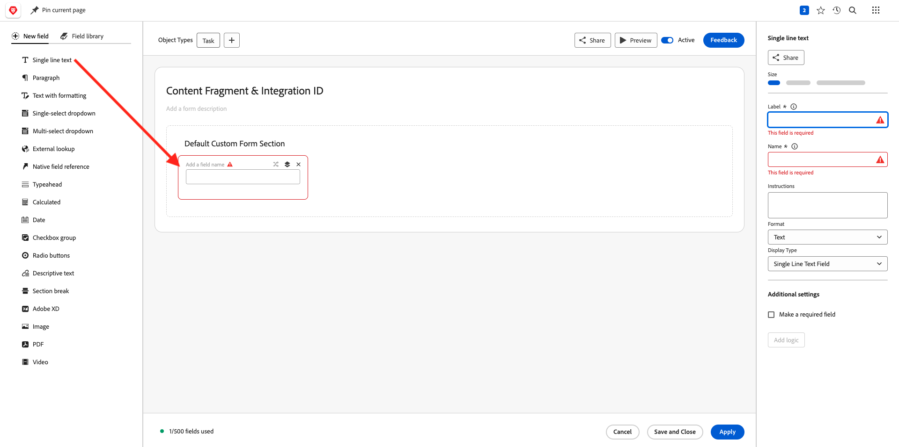

# 1.2.4 Workfront + AEM Sites

登录到Adobe Workfront，方法是转到[https://experienceplatform.my.workfront.com/](https://experienceplatform.my.workfront.com/){target="_blank"}。

然后您会看到此内容。

## 1.2.4.1配置您的AEM Sites集成

>[!NOTE]
>
>此插件当前处于&#x200B;**早期访问**&#x200B;模式，尚未正式提供。
>
>该插件可能已安装在您使用的Workfront实例中。 如果已安装，您可以查看以下说明，但无需更改配置中的任何内容。

转到[https://experience.adobe.com/#/@experienceplatform/aem/extension-manager/universal-editor](https://experience.adobe.com/#/@experienceplatform/aem/extension-manager/universal-editor){target="_blank"}。

确保将此插件的&#x200B;**切换**&#x200B;设置为&#x200B;**已启用**。 然后，单击&#x200B;**齿轮**&#x200B;图标。

您会看到&#x200B;**扩展配置**&#x200B;弹出窗口。 配置以下字段以使用此插件。

| 键 | 值 |
| --------------- | ------------------------------ | 
| **`IMS_ENV`** | **生产** |
| **`WORKFRONT_INSTANCE_URL`** | **https://experienceplatform.my.workfront.com** |
| **`SHOW_CUSTOM_FORMS`** | **&#39;{&quot;previewUrl&quot;： true， &quot;publishUrl&quot;： true}&#39;** |

单击&#x200B;**保存**。

返回您的Workfront UI，然后单击9个圆点&#x200B;**汉堡包**&#x200B;图标。 选择&#x200B;**设置**。

在左侧菜单中，转到&#x200B;**自定义Forms**&#x200B;并选择&#x200B;**表单**。 单击&#x200B;**+新建自定义表单**。

选择&#x200B;**任务**&#x200B;并单击&#x200B;**继续**。

然后，您将看到空的自定义表单。 输入表单名称`Content Fragment & Integration ID`。

将新的&#x200B;**单行文本**&#x200B;字段拖放到画布上。

配置新字段，如下所示：

- **标签**： **内容片段**
- **名称**： **`aem_workfront_integration_content_fragment`**

将新的&#x200B;**单行文本**&#x200B;字段添加到画布上，并配置新字段，如下所示：

- **标签**： **集成ID**
- **名称**： **`aem_workfront_integration_id`**

单击&#x200B;**应用**。

您现在需要配置第二个自定义表单。 单击&#x200B;**+新建自定义表单**。

选择&#x200B;**任务**&#x200B;并单击&#x200B;**继续**。

然后，您将看到空的自定义表单。 输入表单名称`Preview & Publish URL`。

将新的&#x200B;**单行文本**&#x200B;字段拖放到画布上。

配置新字段，如下所示：

- **标签**： **预览URL**
- **名称**： **`aem_workfront_integration_preview_url`**

将新的&#x200B;**单行文本**&#x200B;字段添加到画布上，并配置新字段，如下所示：

- **标签**： **发布URL**
- **名称**： **`aem_workfront_integration_publish_url`**

单击&#x200B;**应用**。

然后，您应该有2个可用的自定义表单。

下一步：[使用Workfront校对1.2.2](./ex2.md){target="_blank"}

返回到[使用Adobe Workfront的工作流管理](./workfront.md){target="_blank"}

[返回所有模块](./../../../overview.md){target="_blank"}
