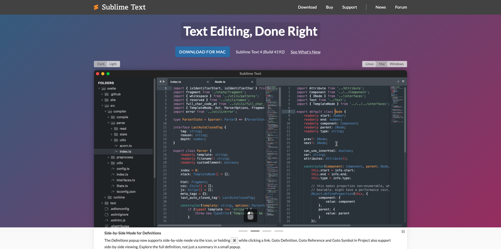

# 前期工作

以下是参加实时研讨会之前所需的准备工作概述。

## 1.安装Adobe Creative Cloud

转到[https://creativecloud.adobe.com/apps/download/creative-cloud](https://creativecloud.adobe.com/apps/download/creative-cloud)。

## 2.Photoshop

打开&#x200B;**Adobe Creative Cloud**&#x200B;应用，转到&#x200B;**应用**。 在计算机上安装Photoshop。

## 3.Postman

转到[https://www.postman.com/downloads/](https://www.postman.com/downloads/)。

下载并安装适用于您的操作系统的Postman的相关版本。

使用您的个人帐户登录Postman。

## 4. Visual Studio代码

转到[https://code.visualstudio.com/](https://code.visualstudio.com/){target="_blank"}，下载并安装&#x200B;**Visual Studio Code**。

## 5.选择的文本编辑器

如果您没有文本编辑器应用程序，则可以转到[https://www.sublimetext.com/](https://www.sublimetext.com/){target="_blank"}并下载和安装此文本编辑器。

## 6. GitHub帐户

如果您还没有GitHub帐户，请转到[https://github.com/](https://github.com/){target="_blank"}，然后单击&#x200B;**注册**。 使用您的个人电子邮件地址并创建您的帐户。

## 7. GitHub Desktop

转到[https://desktop.github.com/download/](https://desktop.github.com/download/){target="_blank"}，下载并安装&#x200B;**Github Desktop**。

>[!NOTE]
>
>{width="50px" align="left"}
>
>如果您有任何疑问，希望分享对未来内容提出建议的一般反馈，请直接联系技术业内人士，方式是向&#x200B;**techinsiders@adobe.com**&#x200B;发送电子邮件。

[返回所有模块](./overview.md)
