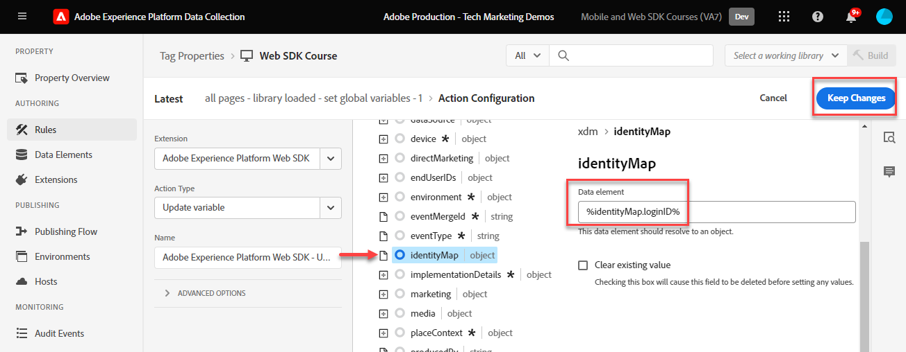

# 创建标记规则

了解如何使用标记规则将事件与XDM对象一起发送到Platform Edge Network。 标记规则是事件、条件和操作的组合，用于告知标记属性执行一些操作。

>[!NOTE]
>
> 出于演示目的，本课程中的练习以本课程中用到的示例为基础， [创建身份](create-identities.md) 步骤；发送XDM事件操作以从上的用户捕获内容和身份 [Luma演示站点](https://luma.enablementadobe.com/content/luma/us/en.html).

## 学习目标

在本课程结束时，您能够：

* 使用命名惯例来管理标记中的规则
* 在标记规则中使用更新变量和发送事件操作类型发送XDM事件
* 将标记规则发布到开发库

## 先决条件

您熟悉数据收集标记和 [Luma演示站点](https://luma.enablementadobe.com/content/luma/us/en.html)，并且您必须在教程中完成以下以前的课程：

* [配置XDM架构](configure-schemas.md)
* [配置身份命名空间](configure-identities.md)
* [配置数据流](configure-datastream.md)
* [Web SDK扩展安装在标记属性中](install-web-sdk.md)
* [创建数据元素](create-data-elements.md)
* [创建身份](create-identities.md)

## 命名约定

为了更好地管理标记中的规则，建议遵循标准命名约定。 本教程使用三部分命名约定：

* [**位置**] - [**事件**] - [**工具**] (**序列**)

其中；

1. **位置** 是规则触发的网站上的一个或多个页面
1. **事件** 是规则的触发器
1. **工具** 是在该规则的操作步骤中使用的一个或多个特定应用程序
1. **序列** 是规则相对于其他规则应触发的顺序
<!-- minor update -->

## 创建标记规则

在标记中，规则用于在各种条件下执行操作（触发调用）。 Platform Web SDK标记扩展包含两个将在本课程中使用的操作：

* **[!UICONTROL 更新变量]** 将数据元素映射到XDM字段
* **[!UICONTROL 发送事件]** 将XDM对象发送到Experience Platform边缘网络

首先，我们使用 **[!UICONTROL 更新变量]** 操作，定义我们要在网站的每个页面上发送的XDM字段的“全局配置”（例如，页面名称）。

然后，我们可以使用定义其他规则 **[!UICONTROL 更新变量]** 操作，使用仅在特定条件下可用的附加字段（例如，在产品页面上添加产品详细信息）来补充全局XDM字段。

最后，我们将使用另一条规则和 **[!UICONTROL 发送事件]** 操作将向Adobe Experience Platform Edge Network发送完整的XDM对象。

### 更新变量规则

#### 全局字段

要为全局XDM字段创建标记规则：

1. 打开您在本教程中使用的标记属性

1. 转到 **[!UICONTROL 规则]** 在左侧导航中

1. 选择 **[!UICONTROL 创建新规则]** 按钮

   

1. 将规则命名为 `all pages global content variables - library loaded - AA (order 1)`

1. 在 **[!UICONTROL 活动]** 部分，选择 **[!UICONTROL 添加]**

   

1. 使用 **[!UICONTROL 核心扩展]** 并选择 `Page Bottom` 作为 **[!UICONTROL 事件类型]**

1. 在 **[!UICONTROL 名称]** 字段，将其命名为 `Core - Page Bottom - order 1`. 这有助于您以有意义的名称描述触发器。

1. 选择 **[!UICONTROL 高级]** 下拉菜单并输入 `1` 在 **[!UICONTROL 订购]**

   >[!NOTE]
   >
   > 输入的数字越高，所触发的操作的整体顺序越靠后。

1. 选择 **[!UICONTROL 保留更改]** 以返回到主规则屏幕
   

1. 在 **[!UICONTROL 操作]** 部分，选择 **[!UICONTROL 添加]**

1. 作为 **[!UICONTROL 扩展名]**，选择 **[!UICONTROL Adobe Experience Platform Web SDK]**

1. 作为 **[!UICONTROL 操作类型]**，选择 **[!UICONTROL 更新变量]**

1. 作为 **[!UICONTROL 数据元素]**，选择 `xdm.variable.content` 您已在 [创建数据元素](create-data-elements.md) 课程

   

现在映射您的 [!UICONTROL 数据元素] 到 [!UICONTROL 架构] 由XDM对象使用。

>[!NOTE]
> 
> 您可以映射到单个属性或整个对象。 在本例中，您将映射到各个属性。

1. 向下滚动，直到达到 **`web`** 对象

1. 选择以将其打开

1. 将以下数据元素映射到相应的 `web` XDM变量

   * **`web.webPageDetials.name`** 到 `%page.pageInfo.pageName%`
   * **`web.webPageDetials.server`** 到 `%page.pageInfo.server%`
   * **`web.webPageDetials.siteSection`** 到 `%page.pageInfo.hierarchie1%`

1. 将 `web.webPageDetials.pageViews.value` 设置为 `1`

   

1. 接下来，查找 `identityMap` 对象并将其选定

1. 将映射到 `identityMap.loginID` 数据元素

   

1. 接下来，找到eventType字段并将其选定

1. 输入值 `web.webpagedetails.pageViews`

   >[!WARNING]
   >
   > 此下拉菜单会填充 **`xdm.eventType`** 变量标识。 虽然您也可以在此字段中键入自由格式标签，但强烈建议您 **不要** 因为它对Platform有不利影响。

   >[!TIP]
   >
   > 要了解在 `eventType` 字段，您必须转到架构页面并选择 `eventType` 字段以查看右边栏上的建议值。

   >[!TIP]
   >
   > 而两者都不是 `web.webPageDetials.pageViews.value` 也不 `eventType` 设置为 `web.webpagedetails.pageViews` 要将信标作为页面视图进行处理，Adobe Analytics需要使用此变量；对于其他下游应用程序，使用标准方式指示页面视图会很有用。

   

1. 选择 **[!UICONTROL 保留更改]** 然后 **[!UICONTROL 保存]** 下一个屏幕中用于完成规则创建的规则

#### 通过更新变量操作，使用其他规则扩充XDM对象

您可以使用 **[!UICONTROL 更新变量]**  在多个有序规则中扩充XDM对象，然后再将其发送至 [!UICONTROL Platform边缘网络].

>[!TIP]
>
>规则顺序确定在触发事件时首先运行的规则。 如果两个规则具有相同的事件类型，则编号最低的规则会先运行。
> 
>

##### 产品页面字段

首先在Luma的产品详细信息页面上跟踪产品查看：

1. 选择 **[!UICONTROL 添加规则]**
1. 将其命名为  [!UICONTROL `ecommerce - pdp library loaded - AA (order 20)`]
1. 选择  在“事件”下添加新的触发器
1. 下 **[!UICONTROL 扩展名]**，选择 **[!UICONTROL 核心]**
1. 下 **[!UICONTROL 事件类型]**，选择 **[!UICONTROL Page Bottom]**
1. 将其命名为 `Core - Page Bottom - order 20`
1. 选择以打开 **[!UICONTROL 高级选项]**，键入 `20`. 这可确保规则在 `all pages global content variables - library loaded - AA (order 1)` ，用于设置全局内容变量，但在 `all pages send event - library loaded - AA (order 50)` 发送XDM事件。

   

1. 下 **[!UICONTROL 条件]**，选择以 **[!UICONTROL 添加]**
1. 离开 **[!UICONTROL 逻辑类型]** 作为 **[!UICONTROL 常规]**
1. 离开 **[!UICONTROL 扩展]** 作为 **[!UICONTROL 核心]**
1. 选择 **[!UICONTROL 完成情况类型]** 作为 **[!UICONTROL 不含查询字符串的路径]**
1. 在右侧，启用 **[!UICONTROL 正则表达式]** 切换
1. 下 **[!UICONTROL 路径等于]** 设置 `/products/`. 对于Luma演示站点，它确保规则仅在产品页面上触发
1. 选择 **[!UICONTROL 保留更改]**

   

1. 下 **[!UICONTROL 操作]** 选择 **[!UICONTROL 添加]**
1. 选择 **[!UICONTROL Adobe Experience Platform Web SDK]** 扩展
1. 选择 **[!UICONTROL 操作类型]** 作为 **[!UICONTROL 更新变量]**
1. 向下滚动到 `commerce` 对象并选择以将其打开。
1. 打开 **[!UICONTROL 产品视图]** 对象和设置 **[!UICONTROL 值]** 到 `1`

   

   >[!TIP]
   >
   >在XDM中设置commerce.productViews.value=1会自动映射到 `prodView` Analytics中的事件

1. 向下滚动到并选择 `productListItems` 数组
1. 选择 **[!UICONTROL 提供单个项目]**
1. 选择 **[!UICONTROL 添加项目]**

   

   >[!CAUTION]
   >
   >此 **`productListItems`** 是 `array` 数据类型，以便它希望数据以元素集合的形式输入。 由于Luma演示站点的数据层结构，并且由于一次只能在Luma站点上查看一个产品，因此需要单独添加项目。 在您自己的网站上实施时，根据数据层结构，您可能能够提供整个阵列。

1. 选择以打开 **[!UICONTROL 项目1]**
1. 将 **`productListItems.item1.SKU`** 映射到 `%product.productInfo.sku%`

   

1. 查找 `eventType` 并将其设置为 `commerce.productViews`

1. 选择 **[!UICONTROL 保留更改]**

1. 选择 **[!UICONTROL 保存]** 保存规则

### 购物车字段

您可以将整个数组映射到XDM对象，前提是数组与XDM架构的格式匹配。 自定义代码数据元素 `cart.productInfo` 之前创建的循环是通过 `digitalData.cart.cartEntries` Luma上的数据层对象，并将其转换为 `productListItems` XDM模式的对象。

要说明此问题，请参阅Luma站点数据层（左）与转换后的数据元素（右）的以下比较：

将数据元素与 `productListItems` 结构（提示，它应该匹配）。

>[!IMPORTANT]
>
>请注意数值变量的转换方式，以及数据层中字符串值的转换方式，例如 `price` 和 `qty` 已重新格式化为数据元素中的数字。 这些格式要求对于Platform中的数据完整性非常重要，并且在 [配置架构](configure-schemas.md) 步骤。 在本例中， **[!UICONTROL 数量]** 使用 **[!UICONTROL 整数]** 数据类型。
> 

现在，让我们将数组映射到XDM对象”

1. 创建新规则，名为 `ecommerce - cart library loaded - AA (order 20)`
1. 选择  在“事件”下添加新的触发器
1. 下 **[!UICONTROL 扩展名]**，选择 **[!UICONTROL 核心]**
1. 下 **[!UICONTROL 事件类型]**，选择 **[!UICONTROL Page Bottom]**
1. 将其命名为 `Core - Page Bottom - order 20`
1. 选择以打开 **[!UICONTROL 高级选项]**，键入 `20`
1. 选择 **[!UICONTROL 保留更改]**

   

1. 下 **[!UICONTROL 条件]**，选择以 **[!UICONTROL 添加]**
1. 离开 **[!UICONTROL 逻辑类型]** 作为 **[!UICONTROL 常规]**
1. 离开 **[!UICONTROL 扩展]** 作为 **[!UICONTROL 核心]**
1. 选择 **[!UICONTROL 完成情况类型]** 作为 **[!UICONTROL 不含查询字符串的路径]**
1. 在右边， **不要** 启用 **[!UICONTROL 正则表达式]** 切换
1. 下 **[!UICONTROL 路径等于]** 设置 `/content/luma/us/en/user/cart.html`. 对于Luma演示站点，它确保规则仅在购物车页面上触发
1. 选择 **[!UICONTROL 保留更改]**

   

1. 下 **[!UICONTROL 操作]** 选择 **[!UICONTROL 添加]**
1. 选择 **[!UICONTROL Adobe Experience Platform Web SDK]** 扩展
1. 选择 **[!UICONTROL 操作类型]** 作为 **[!UICONTROL 更新变量]**
1. 向下滚动到 `commerce` 对象并选择以将其打开。
1. 打开 **[!UICONTROL productListView]** 对象和设置 **[!UICONTROL 值]** 到 `1`

   

   >[!TIP]
   >
   >在XDM中设置commerce.productListViews.value=1会自动映射到 `scView` Analytics中的事件

1. 向下滚动到并选择 **[!UICONTROL productListItems]** 数组

1. 选择 **[!UICONTROL 提供整个阵列]**

1. 将映射到 **`cart.productInfo`** 数据元素

1. 选择 `eventType` 并设置为 `commerce.productListViews`

1. 选择 **[!UICONTROL 保留更改]**

1. 选择 **[!UICONTROL 保存]** 保存规则

按照相同的模式为结账和购买创建其他两个规则，但存在以下差异：

**规则名称**： `ecommerce - checkout library loaded - AA (order 20)`

* **[!UICONTROL 条件]**： /content/luma/us/en/user/checkout.html
* 将 `eventType` 设置为 `commerce.checkouts`
* 设置 **XDM商务事件**： commerce.checkout.value到 `1`

  >[!TIP]
  >
  >这相当于设置 `scCheckout` Analytics中的事件

**规则名称**： `ecommerce - purchase library loaded - AA (order 20)`

* **[!UICONTROL 条件]**： /content/luma/us/en/user/checkout/order/thank-you.html
* 将 `eventType` 设置为 `commerce.purchases`
* 设置 **XDM商务事件**： commerce.purchases.value到 `1`

  >[!TIP]
  >
  >这相当于设置 `purchase` Analytics中的事件

还有其他步骤可捕获所有必需的 `purchase` 事件变量：

1. 打开 **[!UICONTROL 商务]** 对象
1. 打开 **[!UICONTROL 订购]** 对象
1. 地图 **[!UICONTROL purchaseID]** 到 `cart.orderId` 数据元素
1. 设置 **[!UICONTROL currencyCode]** 到硬编码值 `USD`

   

   >[!TIP]
   >
   >这相当于设置 `s.purchaseID` 和 `s.currencyCode` Analytics中的变量

1. 向下滚动到并选择 **[!UICONTROL productListItems]** 数组
1. 选择 **[!UICONTROL 提供整个阵列]**
1. 将映射到 **`cart.productInfo.purchase`** 数据元素
1. 选择 **[!UICONTROL 保存]**

完成后，您应该会看到创建了以下规则。

### 发送事件

现在，您已设置变量，接下来可以创建第二个规则，使用将XDM对象发送到Platform Edge Network **[!UICONTROL 发送事件]** 操作类型。

1. 在右侧，选择 **[!UICONTROL 添加规则]** 创建其他规则

1. 将规则命名为 `all pages send event - library loaded - AA (order 50)`

1. 在 **[!UICONTROL 活动]** 部分，选择 **[!UICONTROL 添加]**

1. 使用 **[!UICONTROL 核心扩展]** 并选择 `Page Bottom` 作为 **[!UICONTROL 事件类型]**

1. 在 **[!UICONTROL 名称]** 字段，将其命名为 `Core - Page Bottom - order 50`. 这有助于您以有意义的名称描述触发器。

1. 选择 **[!UICONTROL 高级]** 下拉菜单并输入 `50` 在 **[!UICONTROL 订购]**. 这将确保第二个规则在您设置为触发的第一个规则之后触发 `1`.

1. 选择 **[!UICONTROL 保留更改]** 以返回到主规则屏幕
   

1. 在 **[!UICONTROL 操作]** 部分，选择 **[!UICONTROL 添加]**

1. 作为 **[!UICONTROL 扩展名]**，选择  **[!UICONTROL Adobe Experience Platform Web SDK]**

1. 作为  **[!UICONTROL 操作类型]**，选择  **[!UICONTROL 发送事件]**

1. 作为 **[!UICONTROL XDM]**，选择 `xdm.variable.content` 在上一课程中创建的数据元素

1. 选择 **[!UICONTROL 保留更改]** 以返回到主规则屏幕

   
1. 选择 **[!UICONTROL 保存]** 保存规则

   

## 在库中发布规则

接下来，将规则发布到开发环境，以便您可以验证它是否有效。

要创建库，请执行以下操作：

1. 转到 **[!UICONTROL 发布流]** 在左侧导航中

1. 选择 **[!UICONTROL 添加库]**

   
1. 对于 **[!UICONTROL 名称]**，输入 `Luma Web SDK Tutorial`
1. 对于 **[!UICONTROL 环境]**，选择 `Development`
1. 选择  **[!UICONTROL 添加所有已更改资源]**

   >[!NOTE]
   >
   >    除了Adobe Experience Platform Web SDK扩展和 `all pages global content variables - library loaded - AA (order 50)` 规则，您将看到在前面的课程中创建的标记组件。 核心扩展包含所有Web标记属性所需的基本JavaScript。

1. 选择 **[!UICONTROL 保存并构建用于开发]**

   

库可能需要几分钟才能构建，完成后，库名称左侧会显示一个绿色圆点：

如您所见， [!UICONTROL 发布流] 屏幕，发布流程还有许多其他内容超出了本教程的范围。 本教程仅在开发环境中使用单个库。

现在，您可以使用Adobe Experience Platform Debugger来验证请求中的数据。

[下一个 ](validate-with-debugger.md)

>[!NOTE]
>
>感谢您投入时间学习Adobe Experience Platform Web SDK。 如果您有疑问、希望分享一般反馈或有关于未来内容的建议，请在此共享它们 [Experience League社区讨论帖子](https://experienceleaguecommunities.adobe.com/t5/adobe-experience-platform-launch/tutorial-discussion-implement-adobe-experience-cloud-with-web/td-p/444996)
