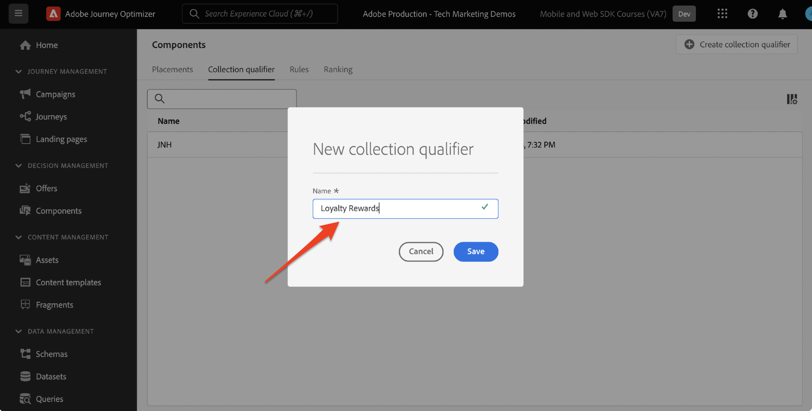
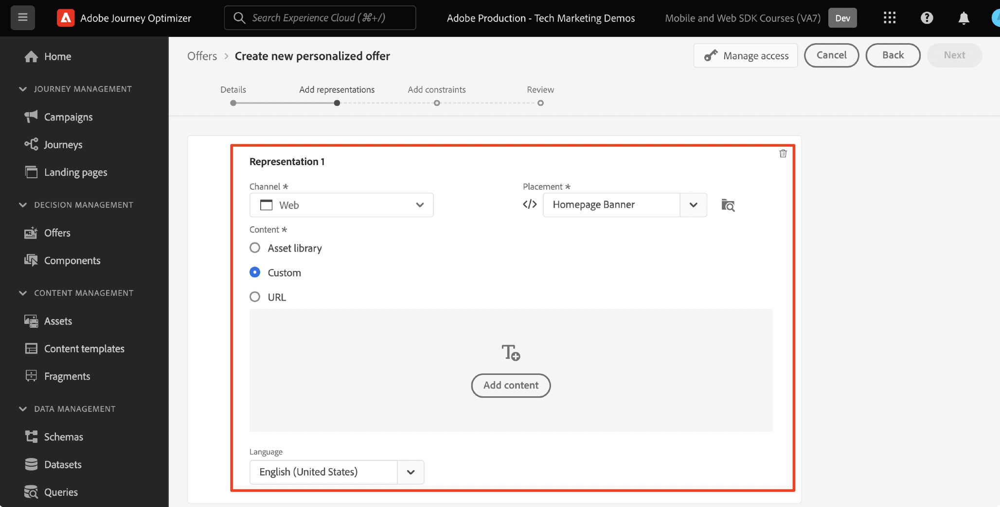

# 使用Platform Web SDK设置决策管理

了解如何使用Platform Web SDK实施决策管理。 本指南介绍了基本的决策管理先决条件、配置的详细步骤，并深入研究了以忠诚度状态为中心的用例。

通过遵循此文档，Journey Optimizer用户能够有效地应用offer decisioning功能，增强其客户交互的个性化和相关性。

## 学习目标

在本课程结束时，您能够：

* 掌握Adobe Journey Optimizer中决策管理的核心概念及其与Adobe Experience Platform Web SDK的集成。

* 了解配置Web SDK以进行Offer decisioning的分步流程，从而确保与AJO的无缝集成。

* 探索以忠诚度状态优惠为中心的详细用例，深入了解如何有效创建和管理优惠、决策和投放。

* 了解决策管理框架中的基本术语及其影响。

* 了解决策规则、收藏集限定符和备用选件在向正确用户提供正确选件方面的重要性。

* 深入了解模拟和自定义事件数据收集等高级主题，让您能够测试、验证和增强优惠交付机制。

## 先决条件

要完成此部分中的课程，您必须首先：

* 确保贵组织有权访问Adobe Journey Optimizer Ultimate(AJO和Offer Decisioning)或Adobe Experience Platform以及Offer decisioning应用程序服务加载项。

* 完成有关Platform Web SDK初始配置的所有课程。

* 为您的组织启用Edge Decisioning。

* 发布您的数据流。

* 了解如何配置投放位置，并在决策范围JSON中实例化投放位置和活动ID。

## 限制

请注意以下限制：

* Adobe Journey Optimizer当前不支持基于事件的优惠。 如果您基于事件创建决策规则，则无法在优惠中应用它。

## 授予对决策管理的访问权限

要授予对决策管理功能的访问权限，您必须创建 **产品配置文件** 并为用户分配相应的权限。 [在本节中了解有关管理Journey Optimizer用户和权限的更多信息](https://experienceleague.adobe.com/docs/journey-optimizer/using/access-control/privacy/high-low-permissions.html?lang=en#decisions-permissions).

## 配置数据流

offer decisioning必须在 **数据流** 在Platform Web SDK可提供任何决策管理活动之前进行配置。

要在数据流中配置Offer decisioning，请执行以下操作：

1. 转到 [数据收集](https://experience.adobe.com/#/data-collection) 界面。

1. 在左侧导航中，选择 **数据流**.

1. 选择之前创建的Luma Web SDK数据流。

   

1. 选择 **编辑** 内部 **Adobe Experience Platform服务**.

   

1. 查看 **offer decisioning** 盒子。

   

1. 选择&#x200B;**保存**。

这可确保正确处理Journey Optimizer的入站事件 **Adobe Experience Platform Edge**.

## 为决策管理配置SDK

根据Web SDK实施类型，决策管理需要其他SDK步骤。 有两个可用选项可用于为决策管理配置SDK。

* SDK独立安装
   1. 配置 `sendEvent` 操作 `decisionScopes`.

      ```javascript
      alloy("sendEvent", {
         ...
         "decisionScopes": [
            "[DECISION SCOPE 1]",
            "[DECISION SCOPE 2]"
         ]
      })
      ```

* SDK标记安装
   1. 转到数据收集界面。

   1. 在左侧导航中，选择 **标记**.

      

   1. 选择 **标记属性**.

   1. 创建您的 **规则**.
      * 添加Platform Web SDK **“发送事件”操作** 并添加相关 `decisionScopes` 到该操作的配置。

   1. 创建和发布 **库** 包含所有相关 **规则**， **数据元素**、和 **扩展** 您已配置。

## 术语

首先，您应该了解决策管理界面中使用的术语。

* **上限**：指定选件出现频率的限制。 两种类型：
   * 总上限：选件在目标受众中可以显示的最大次数。
   * 配置文件上限：向特定用户显示选件的次数。
* **收藏集**：按营销人员设置的特定条件分组的选件子集，例如，选件类别。
* **决策**：指定优惠选择的逻辑。
* **决策规则**：对优惠的限制，用于了解用户的资格。
* **合格优惠**：与预设约束匹配并可向用户显示的选件。
* **决策管理**：使用业务逻辑和决策规则来创建和分发个性化优惠的系统。
* **后备优惠**：用户不符合集合中任何选件的资格时显示的默认选件。
* **选件**：营销消息，其潜在的资格规则将决定其查看者。
* **选件库**：一个管理优惠、决策和相关规则的中央存储库。
* **个性化优惠**：根据资格限制定制的自定义营销消息。
* **版面**：向用户显示选件的设置或方案。
* **优先级**：考虑各种约束（资格和上限）的优惠排名量度。
* **呈现**：特定于渠道的信息，例如位置或语言，用于指导选件的显示。

## 用例概述 — 忠诚度奖励

在本课程中，您将实施一个忠诚度奖励示例用例，以了解使用Web SDK的决策管理。

此用例使您能够更好地了解Journey Optimizer如何利用集中式优惠库和优惠决策引擎来帮助为客户提供最佳优惠。

>[!NOTE]
>
> 由于本教程面向实施者，因此需要注意的是，本课程涉及AJO中的大量UI工作。 虽然此类UI任务通常由营销人员处理，但是即使实施者不负责决策管理营销活动的长期创建，了解该过程也会很有帮助。

## 组件

在开始创建选件之前，必须定义多个必备组件。

### 创建忠诚度优惠的版面

**版面** 是用于显示选件的容器。 在此示例中，您在Luma网站顶部创建一个版面。

可在以下位置访问投放位置列表： **组件** 菜单。 您可以使用过滤器来帮助您根据特定渠道或内容检索投放位置。


要创建投放位置，请执行以下步骤：

1. 单击 **创建投放位置**.

   

1. 定义投放位置的属性：
   * **名称**：投放位置的名称。 我们称之为示例投放位置 *&#39;主页横幅&#39;*.
   * **渠道类型**：使用投放位置的渠道。 让我们使用 *&#39;网络&#39;* 因为选件显示在Luma网站上。
   * **内容类型**：允许投放位置显示的内容类型：文本、HTML、图像链接或JSON。 您可以使用 *&#39;HTML&#39;* 选件。
   * **描述**：投放位置的描述（可选）。

   

1. 单击&#x200B;**保存**。
1. 创建投放位置后，该投放位置将显示在投放位置列表中。
1. 记下版面ID，因为这对于在决策范围内进行配置可能很有必要。

   

### 忠诚度状态的决策规则

**决策规则** 指定提供优惠的条件。 在此示例中，您创建决策规则以根据用户的忠诚度状态提供不同的优惠。

决策规则的列表可在 **组件** 菜单。

要创建决策规则，请执行以下步骤：

1. 导航至 **规则** 选项卡，然后单击 **创建规则**.

   

1. 让我们命名第一个规则&#39;*金会员状态规则*’。 您可以使用XDM字段定义规则。 Adobe Experience Platform **区段生成器** 是一个直观的UI，可用于构建规则条件。

   

1. 单击 **保存** 以确认规则条件。
1. 新保存的&#39;*金会员状态规则*&#39;将显示在 **规则列表**. 选择它以显示其属性。

   

1. 现在，为该用例创建剩余的忠诚度优惠规则条件。


### 收藏集限定符

**收藏集限定符** 让您能够轻松地在选件库中组织和搜索选件。 在本例中，您将收藏集限定符添加到忠诚度奖励选件以改进选件组织。

集合限定符列表可在 **组件** 菜单。

要创建忠诚度奖励收集限定词，请执行以下步骤：

1. 导航至 **收藏集限定符** 选项卡，然后单击 **创建集合限定符**.

   

1. 让我们命名集合限定符&#39;*忠诚度奖励*’

   

1. 新的集合限定符现在应显示在 **集合限定符** 选项卡

## 选件

现在，该创建忠诚度奖励优惠了。

优惠列表可在 **选件** 菜单。


### 创建不同忠诚度级别的优惠

首先为不同的Luma忠诚度级别创建个性化优惠。

创建第一个 **选件**，请按照以下步骤操作：

1. 单击 **创建选件**，然后选择 **个性化优惠**.

1. 让我们命名第一个选件&#39;*Luma忠诚度级别 — 金级*’。 您必须为此选件指定开始/结束日期和时间。 您还应关联 **集合限定符** ’*忠诚度奖励*”添加到选件中，使您能够更好地在 **选件库**. 之后，单击 **下一个**.

   

1. 现在您必须添加 **呈现** 以定义优惠的显示位置。 让我们选择 **Web渠道**. 让我们也选择&#39;*主页横幅*’ **投放** 您之前已配置。 选定的 **投放** 是HTML类型，因此您可以将HTML、JSON或文本内容直接添加到编辑器，以使用构建选件 **自定义** 单选按钮。

   

1. 使用直接编辑选件内容 **表达式编辑器**. 请记住，您可以将HTML、JSON或TEXT内容添加到此投放位置。 确保您选择正确的 **模式** （具体取决于您的内容类型）。 您还可以点击 **验证** 以确保没有错误。

   

1. 此外，您可以使用表达式编辑器检索存储在Adobe Experience Platform中的属性。 让我们将用户档案的名字添加到优惠内容中，以便更好地按1:1级别为忠诚会员进行个性化。

   

1. 添加约束以仅显示符合条件的用户档案的选件&#39;*金会员状态规则*’。

   

1. 查看完选件后，单击 **完成**. 选择 **保存并批准**.

现在为各个Luma忠诚度级别创建其余优惠

### 后备优惠

您仍希望向Luma网站的非Luma忠诚度访客提供选件。 为此，您可以配置 **后备优惠** 来参加竞选的。

要创建后备优惠，请执行以下步骤：

1. 单击 **创建选件**，然后选择 **后备优惠**.
   <!--
      
   -->
1. 让我们命名后备优惠&#39;*非Luma忠诚度*’。 您还可以关联先前创建的 **集合限定符**， &#39;*忠诚度奖励*”作为后备选件，以便于进行选件组织。
   <!--
      
   -->
1. 将后备优惠内容添加到 **表达式编辑器**. 请记住，您可以向此投放位置添加HTML、JSON或文本内容。 确保您选择正确的 **模式** （具体取决于您的内容类型）。 您还可以点击 **验证** 以确保没有错误。
   <!--
      
   -->
1. 如果一切配置正确，点击 **完成** 然后 **保存并批准**.
<!--
   
-->

## 决策

**决策** 是优惠的容器，这些容器会根据目标为客户选择最佳优惠。

决策列表可在 **决策** 选项卡 **选件** 菜单。
<!--
   
-->

### 创建忠诚度优惠决策

让我们为Luma忠诚度奖励用例创建决策。

要创建决策，请执行以下步骤：

1. 单击 **创建决策**.
   <!--
      
   -->
1. 我们来决定吧。*12月Luma忠诚度优惠*’。 选件应持续1个月，因此我们在此处指定它。
   <!--
      
   -->
1. 现在，您必须定义 **决策范围**. 首先，选择投放位置。 您可以使用之前创建的&#39;*主页横幅*’。
   <!--
      
   -->
1. 接下来，您必须添加 **评估标准** 决策范围。 单击 **添加** 并选择之前创建的&#39;*忠诚度奖励*’ **收藏集** 包含要考虑的所有忠诚度优惠。
   <!--
      
   -->
1. 在“*忠诚度奖励*”收藏集，您可以使用资格字段将选件交付限制为Luma访客的子集。 但是，对于此用例，您希望每个访客都收到一个选件。 请记住，您已配置 **后备优惠** 所有不忠诚访客的点击。 将资格设置为“无”。
   <!--
      
   -->
1. 此外，您可以使用 **排名方法** 字段用于为每个Luma访客选择最佳选件（如果多个选件符合用户/投放组合的条件）。 对于此用例，您可以使用 **优惠优先级** 方法，它使用选件中定义的值来提供最佳选件。
   <!--
      
   -->
1. 现在添加 **后备优惠** 做决定。 提醒，如果Luma访客不属于任何Luma忠诚度受众，则备用选件是向Luma访客显示的默认选件。 选择&#39;*非Luma忠诚度*”的可用后备优惠列表中的后备&#x200B;*主页横幅*&#39;位置。
   <!--
      
   -->
1. 在激活决策之前，我们先查看决策范围、后备优惠、预览可用优惠并评估符合条件的用户档案。 一旦一切看起来正常，您就可以单击 **完成** 和 **保存并激活**.
<!--
   
-->

## 模拟

作为最佳实践，您应该验证Luma忠诚度决策逻辑，以确保将正确的选件交付给正确的忠诚度受众。 为此，您可以使用以下代码 **测试用户档案**. 在将新选件版本推送到生产环境之前，最好通过测试用户档案测试对选件所做的更改。

要开始测试，请选择 **模拟** 选项卡 **选件** 菜单。

### 测试忠诚度优惠

1. 选择要用于模拟的测试用户档案。 单击 **管理配置文件**. [要创建或指定新的测试配置文件以进行选件测试，请遵循本指南](https://experienceleague.adobe.com/docs/journeys/using/building-journeys/about-journey-building/creating-test-profiles.html?lang=en#create-test-profiles-csv).
   <!--
      
   -->
1. 将一个或多个测试用户档案添加到模拟中，并保存您的选择。 对于用例测试，您应确保已为每个Luma忠诚度奖励受众配置了测试用户档案。
   <!--
      
   -->
1. 选择要测试的决策范围。 选择 **添加决策范围**.
   <!--
      
   -->
1. 选择之前创建的&#39;*主页横幅*&#39;位置。
   <!--
      
   -->
1. 将显示可用的决策，选择之前创建的&#39;*12月Luma忠诚度优惠*&#39;决策，然后单击 **添加**.
   <!--
      
   -->
1. 选择测试配置文件后，单击 **查看结果**. 最佳可用选件将显示给“ ”的选定测试配置文件&#x200B;*12月Luma忠诚度优惠*&#39;决策。
   <!--
      
   -->
1. 选择其他测试配置文件，然后单击 **查看结果**. 理想情况下，您应该看到不同的模拟选件，与测试用户档案的忠诚度等级相对应。

## 使用Adobe Experience Platform Debugger进行决策管理验证

此 **Adobe Experience Platform Debugger** 适用于Chrome和Firefox的扩展可分析您的网页，以识别Adobe Experience Cloud解决方案实施中的问题。

您可以使用Luma网站上的调试器来验证生产中的决策逻辑。 在忠诚度奖励用例启动并运行后，这是一种很好的做法，可确保正确配置所有内容。

[使用此处指南了解如何在浏览器中配置调试器](https://experienceleague.adobe.com/docs/platform-learn/data-collection/debugger/overview.html?lang=en).

要使用调试器开始验证，请执行以下操作：

1. 导航到包含优惠版面的Luma网页。
   <!--
      
   -->
1. 在网页上，打开 **Adobe Experience Platform debugger**.
   <!--
      
   -->
1. 导航到 **摘要**. 验证 **数据流ID** 匹配 **数据流** 在 **Adobe数据收集** ，您已为其启用Offer decisioning。
   <!--
      
   -->
1. 下 **解决方案** 导航至 **Experience PlatformWeb SDK**.
   <!--
      
   -->
1. 在 **配置** 选项卡，打开 **启用调试**. 这将启用会话日志记录 **Adobe Experience Platform Assurance** 会话。
   <!--
      
   -->
1. 然后，您可以使用各种Luma忠诚度帐户登录网站，并使用调试器验证发送至 **Adobe Experience Platform Edge network**. 所有这些请求都应捕获到 **Assurance** 用于日志跟踪。
<!--
   
-->