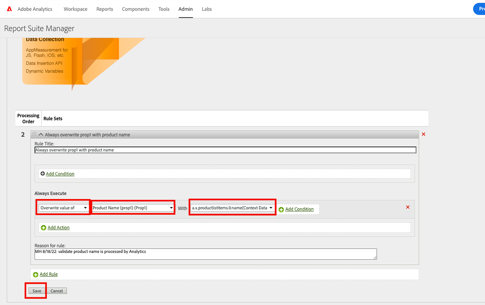

# 使用Platform Web SDK设置Adobe Analytics

了解如何使用设置Adobe Analytics [Experience PlatformWeb SDK](https://experienceleague.adobe.com/docs/platform-learn/data-collection/web-sdk/overview.html)，创建标记规则以将数据发送到Adobe Analytics，并验证Analytics是否按预期捕获数据。

[Adobe Analytics](https://experienceleague.adobe.com/docs/analytics.html?lang=zh-Hans) 是一款行业领先的应用程序，可帮助您充分了解客户的行为和需求，并根据客户情报掌控业务发展方向。

## 学习目标

在本课程结束后，您将能够：

* 配置数据流以启用Adobe Analytics
* 了解哪些标准XDM字段将自动映射到Analytics变量
* 使用Adobe Analytics ExperienceEvent模板字段组或处理规则设置自定义Analytics变量
* 通过覆盖数据流将数据发送到其他报表包
* 使用Debugger和Assurance验证Adobe Analytics变量

## 先决条件

要完成本课程，您必须首先：

* 熟悉并访问Adobe Analytics。

* 至少具有一个测试/开发报表包ID。 如果您没有可在本教程中使用的测试/开发报表包， [请创建一个](https://experienceleague.adobe.com/docs/analytics/admin/manage-report-suites/new-report-suite/t-create-a-report-suite.html).

* 完成本教程的初始配置和标记配置部分中之前的课程。

## 配置数据流

Platform Web SDK将数据从您的网站发送到PlatformEdge Network。 然后，您的数据流会告知PlatformEdge Network，您的数据应转发到哪些Adobe Analytics报表包。

1. 转到 [数据收集](https://experience.adobe.com/#/data-collection){target="blank"} 界面
1. 在左侧导航中，选择 **[!UICONTROL 数据流]**
1. 选择之前创建的 `Luma Web SDK: Development Environment` 数据流

   

1. 选择 **[!UICONTROL 添加服务]**
   
1. 选择 **[!UICONTROL Adobe Analytics]** 作为 **[!UICONTROL 服务]**
1. 输入  **[!UICONTROL 报表包ID]** 开发报表包的
1. 选择 **[!UICONTROL 保存]**

   

   >[!TIP]
   >
   >通过选择添加更多报表包 **[!UICONTROL 添加报表包]** 等同于多包标记。

>[!WARNING]
>
>在本教程中，您将仅为开发环境配置Adobe Analytics报表包。 在为您自己的网站创建数据流时，您将为暂存环境和生产环境创建其他数据流和报表包。

## XDM架构和Analytics变量

恭喜！您已在中配置了与Adobe Analytics兼容的架构 [配置架构](configure-schemas.md) 上课！

但您可能会想，我该如何设置所有的prop、evar和事件？

有多种方法可同时使用：

1. 设置标准XDM字段，某些字段会自动映射到Analytics变量。
1. 在Analytics处理规则中将其他XDM字段映射到Analytics变量。
1. 直接在XDM架构中映射到Analytics变量。

<!-- Implementing Platform Web SDK should be as product-agnostic as possible. For Adobe Analytics, mapping eVars, props, and events doesn't occur during schema creation, nor during the tag rules configuration as it has been done traditionally. Instead, every XDM key-value pair becomes a Context Data Variable that maps to an Analytics variable in one of two ways: 

1. Automatically mapped variables using reserved XDM fields
1. Manually mapped variables using Analytics Processing Rules

To understand what XDM variables are auto-mapped to Adobe Analytics, please see [Variables automatically mapped in Analytics](https://experienceleague.adobe.com/docs/experience-platform/edge/data-collection/adobe-analytics/automatically-mapped-vars.html?lang=en). Any variable that is not auto-mapped must be manually mapped. 

 1. **Product-agnostic XDM**: maintain a semantic key-value pair XDM schema and use [Adobe Analytics Processing Rules](https://experienceleague.adobe.com/docs/analytics/admin/admin-tools/manage-report-suites/edit-report-suite/report-suite-general/c-processing-rules/processing-rules.html) to map the XDM fields to eVars, props, and so on. By a semantic XDM schema, we mean that the field names themselves have meaning. For example, the field name `web.webPageDetails.pageName` has more meaning than say `prop1` or `evar3`.

 1. **Analytics-specific XDM**: Use a purpose-built Adobe Analytics field group in the XDM schema called `Adobe Analytics ExperienceEvent Template`
 
The approach Adobe has seen customers prefer is the **Analytics-specific XDM**, because it skips the mapping step in the Adobe Analytics Processing Rules interface. The steps in this lesson use the **Analytics-specific XDM** approach.
-->

### 自动映射的字段

许多XDM字段会自动映射到Analytics变量。

在中创建的架构 [配置架构](configure-schemas.md) 课程中包含一些自动映射到Analytics变量的变量，如下表所示：

| XDM到Analytics的自动映射变量 | Adobe Analytics变量 |
|-------|---------|
| `identitymap.ecid.[0].id` | mid |
| `web.webPageDetails.name` | s.pageName |
| `web.webPageDetails.server` | s.server |
| `web.webPageDetails.siteSection` | s.channel |
| `commerce.productViews.value` | prodView |
| `commerce.productListViews.value` | scView |
| `commerce.checkouts.value` | scCheckout |
| `commerce.purchases.value` | 购买 |
| `commerce.order.currencyCode` | s.currencyCode |
| `commerce.order.purchaseID` | s.purchaseID |
| `productListItems[].SKU` | s.products=；产品名称；；；；；（主要 — 请参阅下面的注释） |
| `productListItems[].name` | s.products=；产品名称；；；；；（回退 — 请参阅下面的注释） |
| `productListItems[].quantity` | s.products=；；product quantity；；； |
| `productListItems[].priceTotal` | s.product=；；；产品价格；； |

Analytics产品字符串的各个部分通过下的不同XDM变量进行设置。 `productListItems` 对象。
>截至2022年8月18日， `productListItems[].SKU` 具有映射到s.products变量中的产品名称的优先级。
>值设置为 `productListItems[].name` 仅在以下情况下映射到产品名称： `productListItems[].SKU` 不存在。 否则，它将被取消映射，并可用于上下文数据。
>请勿将空字符串或null设置为  `productListItems[].SKU`. 这会产生不需要的效果，即映射到s.products变量中的产品名称。

有关最新的映射列表，请参阅 [Analytics Experience Edge中的Adobe变量映射](https://experienceleague.adobe.com/docs/experience-platform/edge/data-collection/adobe-analytics/automatically-mapped-vars.html).

### 使用处理规则映射到Analytics变量

XDM架构中的所有字段均可用作具有以下前缀的上下文数据变量Adobe Analytics `a.x.`. 例如：`a.x.web.webinteraction.region`

在本练习中，您将一个XDM变量映射到prop。 对于任何自定义映射，请按照以下相同步骤执行操作 `eVar`， `prop`， `event`或变量访问，可通过处理规则访问。

1. 转到Analytics界面
1. 转到 [!UICONTROL 管理员] > [!UICONTROL 管理工具] > [!UICONTROL 报表包]
1. 选择您将在教程中使用的开发/测试报表包> [!UICONTROL 编辑设置] > [!UICONTROL 常规] > [!UICONTROL 处理规则]

   

1. 创建规则以 **[!UICONTROL 覆盖值]** `[!UICONTROL Product SKU (prop1)]` 到 `a.x.productlistitems.0.sku`. 请记住添加注释，说明创建规则的原因并命名规则标题。 选择 **[!UICONTROL 保存]**

   

   >[!IMPORTANT]
   >
   >首次映射到处理规则时，UI不会显示XDM对象中的上下文数据变量。 要修复该错误，请选择任意值，请保存并返回进行编辑。 此时应会显示所有XDM变量。

### 使用Adobe Analytics字段组映射到Analytics变量

处理规则的替代方法是使用 `Adobe Analytics ExperienceEvent Template` 字段组。 这种方法之所以受到欢迎，是因为许多用户发现它比配置处理规则更简单，但是，通过增加XDM有效负载的大小，它反过来可以增加其他应用程序(如Real-Time CDP)中的配置文件大小。

添加 `Adobe Analytics ExperienceEvent Template` 字段组到您的架构：

1. 打开 [数据收集](https://experience.adobe.com/#/data-collection){target="blank"} 界面
1. 选择 **[!UICONTROL 架构]** 从左侧导航
1. 确保您在教程中使用的沙盒中
1. 打开您的 `Luma Web Event Data` 架构
1. 在 **[!UICONTROL 字段组]** 部分，选择 **[!UICONTROL 添加]**
1. 查找 `Adobe Analytics ExperienceEvent Template` 字段组并将其添加到您的架构中

现在，在产品字符串中设置推销eVar。 使用 `Adobe Analytics ExperienceEvent Template` 字段组，则能够将变量映射到产品字符串中的促销eVar或事件。 这也称为设置 **产品语法促销**.

1. 返回标记属性

1. 打开规则 `ecommerce - library loaded - set product details variables - 20`

1. 打开 **[!UICONTROL 设置变量]** 操作

1. 选择以打开 `_experience > analytics > customDimensions > eVars > eVar1`

1. 设置 **[!UICONTROL 值]** 到 `%product.productInfo.title%`

1. 选择 **[!UICONTROL 保留更改]**

   

1. 选择 **[!UICONTROL 保存]** 保存规则

如您所见，基本上所有Analytics变量都可以在以下位置设置： `Adobe Analytics ExperienceEvent Template` 字段组。

>[!NOTE]
>
> 请注意 `_experience` 对象位于 `productListItems` > `Item 1`. 在此下设置任何变量 [!UICONTROL 对象] 设置产品语法eVar或事件。

## 将数据发送到其他报表包

您可能希望更改当访客出现在某些页面中时，要将哪些Adobe Analytics报表包数据发送到。 这需要数据流和规则中的配置。

### 为报表包覆盖配置数据流

要在数据流中配置Adobe Analytics报表包覆盖设置，请执行以下操作：

1. 打开您的数据流
1. 编辑 **[!UICONTROL Adobe Analytics]** 通过打开  菜单，然后选择 **[!UICONTROL 编辑]**

   

1. 选择 **[!UICONTROL 高级选项]** 以打开 **[!UICONTROL 报表包覆盖]**

1. 选择要覆盖的报表包。 在本例中， `Web SDK Course Dev` 和 `Web SDK Course Stg`

1. 选择 **[!UICONTROL 保存]**

   

### 为报表包覆盖配置规则

让我们创建一个规则以向其他报表包发送额外的页面查看调用。 使用数据流覆盖功能，使用以下方式更改页面的报表包： **[!UICONTROL 发送事件]** 操作。

1. 创建新规则，将其命名为 `homepage - library loaded - AA report suite override - 51`

1. 选择下的加号 **[!UICONTROL 事件]** 添加新触发器

1. 下 **[!UICONTROL 扩展名]**，选择 **[!UICONTROL 核心]**

1. 下 **[!UICONTROL 事件类型]**，选择 **[!UICONTROL 库已加载]**

1. 选择以打开 **[!UICONTROL 高级选项]**，键入 `51`. 这可确保规则在 `all pages - library loaded - send event - 50` 设置基线XDM **[!UICONTROL 更新变量]** 操作类型。

   

1. 下 **[!UICONTROL 条件]**，选择以 **[!UICONTROL 添加]**

1. 离开 **[!UICONTROL 逻辑类型]** 作为 **[!UICONTROL 常规]**

1. 离开 **[!UICONTROL 扩展]** 作为 **[!UICONTROL 核心]**

1. 选择 **[!UICONTROL 完成情况类型]** 作为 **[!UICONTROL 不含查询字符串的路径]**

1. 在右边，离开 **[!UICONTROL 正则表达式]** 切换已禁用

1. 下 **[!UICONTROL 路径等于]** 设置 `/content/luma/us/en.html`. 对于Luma演示站点，它确保规则仅在主页上触发

1. 选择 **[!UICONTROL 保留更改]**

   

1. 下 **[!UICONTROL 操作]** 选择 **[!UICONTROL 添加]**

1. 作为 **[!UICONTROL 扩展名]**，选择 **[!UICONTROL Adobe Experience Platform Web SDK]**

1. 作为 **[!UICONTROL 操作类型]**，选择 **[!UICONTROL 发送事件]**

1. 作为 **[!UICONTROL 类型]**，选择 `web.webpagedetails.pageViews`

1. 作为 **[!UICONTROL XDM数据]**，选择 `xdm.variable.content` 您已在 [创建数据元素](create-data-elements.md) 课程

   

1. 向下滚动到 **[!UICONTROL 数据流配置覆盖]** 部分

1. 离开 **[!UICONTROL 开发]** 选项卡处于选中状态。

   >[!TIP]
   >
   >    此选项卡确定覆盖发生在哪个标记环境中。 对于此练习，您只指定了开发环境，但在将此体验部署到生产环境时，请记得也在 **[!UICONTROL 生产]** 环境。

1. 选择 **[!UICONTROL 数据流]**，在本例中 `Luma Web SDK: Development Environment`

1. 下 **[!UICONTROL 报表包]**，选择要覆盖的报表站点。 在本例中， `tmd-websdk-course-stg`.

1. 选择 **[!UICONTROL 保留更改]**

1. 和 **[!UICONTROL 保存]** 您的规则

   

## 构建开发环境

将新的数据元素和规则添加到 `Luma Web SDK Tutorial` 标记库并重新构建开发环境。

恭喜！下一步是通过Experience PlatformWeb SDK验证Adobe Analytics实施。

## 使用Debugger验证Adobe Analytics

了解如何使用Experience PlatformDebugger的边缘跟踪功能验证Adobe Analytics是否正在捕获ECID、页面查看次数、产品字符串和电子商务事件。

在 [调试程序](validate-with-debugger.md) 在本课程中，您已了解如何使用Platform Debugger和浏览器开发人员控制台检查客户端XDM请求，这与您调试 `AppMeasurement.js` Analytics实施。 您还了解了如何验证发送到Adobe应用程序的平台Edge Network服务器端请求，以及如何使用Assurance查看完全处理的负载。

要验证Analytics是否通过Experience PlatformWeb SDK正确捕获数据，您必须进一步执行两个步骤：

1. 使用Experience PlatformDebugger的边缘跟踪功能，验证平台Edge Network上XDM对象如何处理数据
1. 使用Adobe Experience Platform保障验证Analytics完全处理数据的方式

### Experience CloudID验证

1. 转到 [Luma演示站点](https://luma.enablementadobe.com/content/luma/us/en.html){target="_blank"}
1. 选择右上角的登录按钮，并使用凭据u： test@adobe.com p：测试进行身份验证
1. 打开Experience PlatformDebugger并 [将网站上的tag属性切换到您自己的开发资产](validate-with-debugger.md#use-the-experience-platform-debugger-to-map-to-your-tags-property)

1. 要启用边缘跟踪，请转到Experience Platform调试器，在左侧导航中，选择 **[!UICONTROL 日志]**，然后选择 **[!UICONTROL Edge]** 选项卡，然后选择 **[!UICONTROL 连接]**

   

1. 现在它将为空

   

1. 刷新“Luma”页面并再次检查Experience Platform调试器，您应该会看到数据通过。 以开头的行 **[!UICONTROL Analytics自动映射]** 是Adobe Analytics信标
1. 选择以打开 `[!UICONTROL mappedQueryParams]` 下拉列表和查看Analytics变量的第二个下拉列表

   

   >[!TIP]
   >
   >第二个下拉列表对应于您要将数据发送到的分析报表包ID。 它应该与您自己的报表包匹配，而不是与屏幕快照中的报表包匹配。

1. 向下滚动以查找 `[!UICONTROL c.a.x.identitymap.ecid.[0].id]`. 它是一个捕获ECID的上下文数据变量
1. 一直向下滚动直到看到Analytics `[!UICONTROL mid]` 变量。 两个ID均与设备的Experience CloudID匹配。
1. 在Luma网站上，

   

   >[!NOTE]
   >
   >由于您已登录，请花些时间验证经过身份验证的ID `112ca06ed53d3db37e4cea49cc45b71e` 对于用户 **`test@adobe.com`** 也被捕获到 `[!UICONTROL c.a.x.identitymap.lumacrmid.[0].id]`

### 报表包覆盖验证

在上面，您为配置了数据流覆盖 [Luma主页](https://luma.enablementadobe.com/content/luma/us/en.html).  验证此配置的步骤

1. 查找包含 **[!UICONTROL 应用覆盖后的数据流配置]**. 在这里，您可以找到为报表包覆盖配置的主报表包和其他报表包。

   

1. 向下滚动到以开头的行 **[!UICONTROL Analytics自动映射]**  并确认 `[!UICONTROL reportSuiteIds]` 显示您在覆盖配置中指定的报表包

   

### 内容页面查看次数验证

转到产品页面，如 [Didi Sport Watch产品页](https://luma.enablementadobe.com/content/luma/us/en/products/gear/watches/didi-sport-watch.html#24-WG02).  验证Analytics是否捕获了内容页面查看。

1. 查找 `[!UICONTROL c.a.x.web.webpagedetails.pageviews.value]=1`.
1. 向下滚动以查看 `[!UICONTROL gn]` 变量。 它是的Analytics动态语法 `[!UICONTROL s.pageName]` 变量。 它从数据层捕获页面名称。

   

### 产品字符串和电子商务事件验证

由于您已在产品页面上，因此本练习将继续使用相同的边缘跟踪来验证Analytics捕获的产品数据。 产品字符串和电子商务事件都会自动将XDM变量映射到Analytics。 只要您已映射到适当的 `productListItem` XDM变量，而 [为Adobe Analytics配置XDM架构](setup-analytics.md#configure-an-xdm-schema-for-adobe-analytics)，PlatformEdge Network负责将数据映射到适当的Analytics变量。

**首先验证 `Product String` 已设置**

1. 查找 `[!UICONTROL c.a.x.productlistitems.][0].[!UICONTROL sku]`. 变量会捕获您映射到 `productListItems.item1.sku` 本课程前面部分
1. 同时查找 `[!UICONTROL c.a.x.productlistitems.][0].[!UICONTROL _experience.analytics.customdimensions.evars.evar1]`. 变量会捕获您映射到的数据元素值 `productListItems.item1._experience.analytics.customdimensions.evars.evar1`
1. 向下滚动以查看 `[!UICONTROL pl]` 变量。 它是Analytics产品字符串变量的动态语法
1. 请注意，数据层中的产品名称会同时映射到 `[!UICONTROL c.a.x.productlistitems.][0].[!UICONTROL sku]` 和 `[!UICONTROL product]` 产品字符串的参数。  此外，数据层中的产品标题会映射到products string中的推销evar1。

   

   边缘跟踪处理 `commerce` 事件与略有不同 `productList` 维度。 您不会看到上下文数据变量以与查看产品名称映射到的方式相同的方式进行映射 `[!UICONTROL c.a.x.productlistitem.[0].name]` 以上。 取而代之的是，边缘描摹显示Analytics中的最终事件自动映射 `event` 变量。 只要您映射到适当的XDM，平台Edge Network就会相应地映射它 `commerce` 变量while [为Adobe Analytics配置架构](setup-analytics.md#configure-an-xdm-schema-for-adobe-analytics)；在这种情况下， `commerce.productViews.value=1`.

1. 返回Experience Platform调试器窗口，向下滚动到 `[!UICONTROL events]` 变量中，它被设置为 `[!UICONTROL prodView]`

1. 另请注意 `[!UICONTROL c.a.x.eventType]` 设置为 `commerce.productViews` 因为您位于产品页面上。

   >[!TIP]
   >
   > 此 `ecommerce - pdp library loaded - AA (order 20)` 规则正在覆盖的值 `eventType` 由 `all pages global content variables - library loaded - AA (order 1)` 规则，因为该规则设置为在序列中稍后触发

   

**验证为Analytics设置的其余电子商务事件和产品字符串**

1. 添加 [滴滴出行手表](https://luma.enablementadobe.com/content/luma/us/en/products/gear/watches/didi-sport-watch.html#24-WG02) 到购物车
1. 转到 [购物车页面](https://luma.enablementadobe.com/content/luma/us/en/user/cart.html)，检查边缘跟踪

   * `eventType` 设置为 `commerce.productListViews`
   * `[!UICONTROL events: "scView"]`、和
   * 设置product string

   

1. 继续结帐，检查边缘跟踪

   * `eventType` 设置为 `commerce.checkouts`
   * `[!UICONTROL events: "scCheckout"]`、和
   * 设置product string

   

1. 仅填写 **名字** 和 **姓氏** 填写发货单上的字段并选择 **继续**. 在下一页，选择 **下单**
1. 在确认页面上，检查边缘跟踪

   * `eventType` 设置为 `commerce.purchases`
   * 正在设置购买事件 `[!UICONTROL events: "purchase"]`
   * 正在设置的货币代码变量 `[!UICONTROL cc: "USD"]`
   * 在中设置了购买ID `[!UICONTROL pi]`
   * 产品字符串 `[!UICONTROL pl]` 设置产品名称、数量和价格

   

## 使用Assurance验证Adobe Analytics

Adobe Experience Platform Assurance可帮助您检查、验证、模拟和验证您收集数据或向网站和移动应用程序提供体验的方式。

在上一个练习中，您已验证Adobe Analytics是否通过Experience PlatformDebugger的边缘跟踪功能来捕获ECID、页面查看次数、产品字符串以及电子商务事件。  接下来，使用Adobe Experience Platform Assurance验证这些相同的事件，这是用于在Edge Trace中访问相同数据的替代界面。

正如您在 [Assurance](validate-with-assurance.md) 课程，有几种方法可启动保证会话。 由于您已经使用上一个练习中启动的边缘跟踪会话打开了Adobe Experience Platform Debugger，因此我们建议您通过Debugger访问Assurance：

在 **[!UICONTROL “Web SDK教程3”]** 进入保证会话 **[!UICONTROL &quot;hitdebugger&quot;]** 放到事件搜索栏中，将结果筛选为AdobeAnalytics后处理数据。

### Experience CloudID验证

要验证Adobe Analytics是否正在捕获ECID，请选择一个信标并打开有效负载。  此信标的供应商应为 **[!UICONTROL com.adobe.analytics.hitdebugger]**

然后向下滚动到 **[!UICONTROL mcvisId]** 以验证是否已正确捕获ECID

### 内容页面查看次数验证

使用相同的信标，验证内容页面查看是否已映射到正确的Adobe Analytics变量。
向下滚动到 **[!UICONTROL pageName]** 以验证 `Page Name` 正确捕获

### 产品字符串和电子商务事件验证

按照使用上述Experience Platform调试器进行验证时所使用的相同验证用例，继续使用相同的信标来验证 `Ecommerce Events` 和 `Product String`.

1. 查找有效负荷，其中 **[!UICONTROL 事件]** contain `prodView`
   
1. 向下滚动到 **[!UICONTROL 产品字符串]** 验证 `Product String`.
   * 请注意 `Product SKU` 和 `Merchandizing eVar1`.
1. 进一步向下滚动并验证 `prop1`（在上一部分中使用处理规则配置的）包含 `Product SKU`\
   

通过查看购物车、结帐和购买事件来继续验证实施。

1. 查找有效负荷，其中 **[!UICONTROL 事件]** contain `scView` 并验证产品字符串。
   
1. 查找有效负荷，其中 **[!UICONTROL 事件]** contain `scCheckout` 并验证产品字符串。
   
1. 查找有效负荷，其中 **[!UICONTROL 事件]** contain `purchase`
   
1. 验证 `purchase` 事件，请注意 `Product String` 应包含 `Product SKU`， `Product Quantity` 、和 `Product Total Price`.
1. 此外，对于 `purchase` 验证 `purchase-id` 和/或 `purchaseId` 已设置

恭喜！你做到了！ 在本课程结束时，您已准备好使用Platform Web SDK为您自己的网站实施Adobe Analytics。

[下一步： ](setup-audience-manager.md)

>[!NOTE]
>
>感谢您投入时间学习Adobe Experience Platform Web SDK。 如果您有疑问、希望分享一般反馈或有关于未来内容的建议，请在此共享它们 [Experience League社区讨论帖子](https://experienceleaguecommunities.adobe.com/t5/adobe-experience-platform-launch/tutorial-discussion-implement-adobe-experience-cloud-with-web/td-p/444996)
