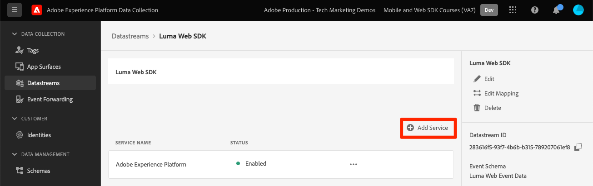
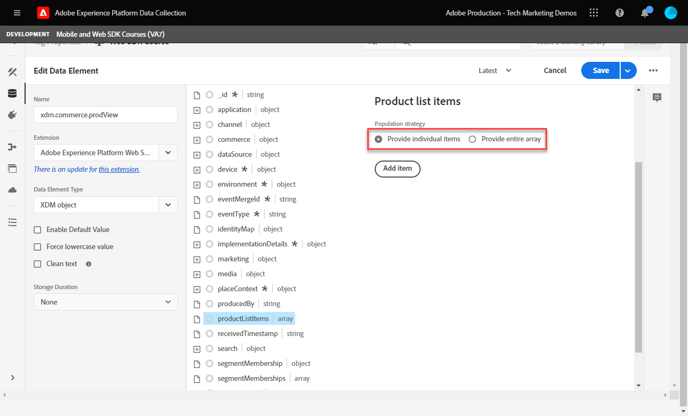
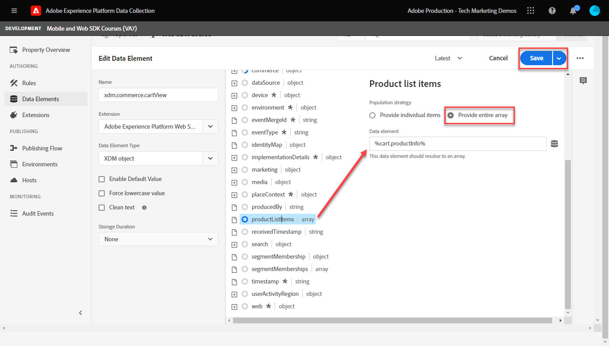

# 使用Platform Web SDK设置Adobe Analytics

了解如何使用设置Adobe Analytics [Experience PlatformWeb SDK](https://experienceleague.adobe.com/docs/platform-learn/data-collection/web-sdk/overview.html)，创建标记规则以将数据发送到Adobe Analytics，并验证Analytics是否按预期捕获数据。

[Adobe Analytics](https://experienceleague.adobe.com/docs/analytics.html) 是一款行业领先的应用程序，可帮助您充分了解客户的行为和需求，并根据客户情报掌控业务发展方向。

## 学习目标

在本课程结束后，您将能够：

* 为Adobe Analytics配置XDM架构，并了解自动映射和手动映射的XDM变量与Analytics的区别
* 配置数据流以启用Adobe Analytics
* 将单个或整个数组数据元素映射到XDM对象
* 使用XDM对象在Adobe Analytics中捕获页面查看
* 使用Adobe Analytics产品字符串的XDM对象捕获电子商务数据
* 验证是否使用Experience Platform调试器通过XDM对象设置了Adobe Analytics变量
* 使用Adobe Analytics处理规则设置自定义变量
* 验证Adobe Analytics使用实时报表捕获的数据

## 先决条件

您熟悉标记、Adobe Analytics和 [Luma演示站点](https://luma.enablementadobe.com/content/luma/us/en.html){target="_blank"} 登录和购物功能。

您至少需要一个测试/开发报表包ID。 如果您没有可在本教程中使用的测试/开发报表包， [请创建一个](https://experienceleague.adobe.com/docs/analytics/admin/manage-report-suites/new-report-suite/t-create-a-report-suite.html).

您必须已完成本教程前面各节中的所有步骤：

* 初始配置
   * [配置权限](configure-permissions.md)
   * [配置XDM架构](configure-schemas.md)
   * [配置身份命名空间](configure-identities.md)
   * [配置数据流](configure-datastream.md)
* 标记配置
   * [安装 Web SDK 扩展](install-web-sdk.md)
   * [创建数据元素](create-data-elements.md)
   * [创建标记规则](create-tag-rule.md)
   * [使用Adobe Experience Platform Debugger进行验证](validate-with-debugger.md)

## XDM架构和Analytics的变量

恭喜！您已在中配置了与Adobe Analytics兼容的架构 [配置架构](configure-schemas.md) 上课！

实施Platform Web SDK时应尽可能与产品无关。 对于Adobe Analytics，映射eVar、prop和事件不会在模式创建期间发生，也不会在标记规则配置期间发生（以传统方式执行）。 相反，每个XDM键值对都成为上下文数据变量，该变量通过以下两种方式之一映射到Analytics变量：

1. 使用保留的XDM字段自动映射变量
1. 使用Analytics处理规则手动映射变量

要了解哪些XDM变量会自动映射到Adobe Analytics，请参阅 [Analytics中自动映射的变量](https://experienceleague.adobe.com/docs/experience-platform/edge/data-collection/adobe-analytics/automatically-mapped-vars.html?lang=en). 任何非自动映射的变量都必须手动映射。

在中创建的架构 [配置架构](configure-schemas.md) 课程中包含一些自动映射到Analytics变量的变量，如下表所示：

| XDM到Analytics的自动映射变量 | Adobe Analytics变量 |
|-------|---------|
| `identitymap.ecid.[0].id` | mid |
| `web.webPageDetails.pageViews.value` | 页面查看s.t()调用 |
| `web.webPageDetails.name` | s.pageName |
| `web.webPageDetails.server` | s.server |
| `web.webPageDetails.siteSection` | s.channel |
| `commerce.productViews.value` | prodView |
| `commerce.productListViews.value` | scView |
| `commerce.checkouts.value` | scCheckout |
| `commerce.purchases.value` | 购买 |
| `commerce.order.currencyCode` | s.currencyCode |
| `commerce.order.purchaseID` | s.purchaseID |
| `productListItems[].SKU` | s.products=；产品名称；；；；；（主要 — 请参阅下面的注释） |
| `productListItems[].name` | s.products=；产品名称；；；；；（回退 — 请参阅下面的注释） |
| `productListItems[].quantity` | s.products=；；product quantity；；； |
| `productListItems[].priceTotal` | s.product=；；；产品价格；； |

>[!NOTE]
>
>Analytics产品字符串的各个部分通过下的不同XDM变量进行设置。 `productListItems` 对象。
>截至2022年8月18日， `productListItems[].SKU` 具有映射到s.products变量中的产品名称的优先级。
>值设置为 `productListItems[].name` 仅在以下情况下映射到产品名称： `productListItems[].SKU` 不存在。 否则，它将被取消映射，并可用于上下文数据。
>请勿将空字符串或null设置为  `productListItems[].SKU`. 这会产生不需要的效果，即映射到s.products变量中的产品名称。


## 配置数据流

Platform Web SDK将数据从您的网站发送到Platform Edge Network。 然后，您的数据流会告知Platform Edge Network在何处转发该数据，在本例中是转发哪些Adobe Analytics报表包。

1. 转到 [数据收集](https://experience.adobe.com/#/data-collection){target="blank"} 界面
1. 在左侧导航中，选择 **[!UICONTROL 数据流]**
1. 选择之前创建的 `Luma Web SDK` 数据流

   

1. 选择 **[!UICONTROL 添加服务]**
   
1. 选择 **[!UICONTROL Adobe Analytics]** 作为 **[!UICONTROL 服务]**
1. 输入  **[!UICONTROL 报表包ID]** 开发报表包的
1. 选择 **[!UICONTROL 保存]**

   

   >[!TIP]
   >
   >通过选择添加更多报表包 **[!UICONTROL 添加报表包]** 等同于多包标记。

>[!WARNING]
>
>在本教程中，您只需配置开发Adobe Analytics报表包。 在为您自己的网站创建数据流时，您将为暂存环境和生产环境创建其他数据流和报表包。


## 创建其他数据元素

接下来，从Luma数据层捕获其他数据并将其发送到Platform Edge Network。 虽然本课程重点关注常见的Adobe Analytics要求，但可以根据您的数据流配置将所有捕获的数据轻松发送到其他目标。 例如，如果您完成了Adobe Experience Platform课程，则您在本课程中捕获的其他数据也将发送到Platform。

### 创建电子商务数据元素

在创建数据元素课程中，您可以 [已创建JavaScript数据元素](create-data-elements.md#create-data-elements-to-capture-the-data-layer) 用于捕获内容和身份详细信息。 现在，您将创建其他数据元素以捕获电子商务数据。 因为 [Luma演示站点](https://luma.enablementadobe.com/content/luma/us/en.html){target="_blank"} 对于购物车中的产品详细信息页面和产品使用不同的数据层结构，您必须为每个方案创建数据元素。 您将必须创建一些自定义代码数据元素以从Luma数据层获取您所需的内容，在您自己的网站上实施时，无论是否需要，这些数据元素都可以获取。 在这种情况下，您需要循环访问一系列购物车项目以获取每个产品的特定详细信息。 使用以下提供的代码片段：

1. 打开您在本教程中使用的标记属性
1. 转到 **[!UICONTROL 数据元素]**
1. 选择 **[!UICONTROL 添加数据元素]**
1. 将其命名为 **`product.productInfo.sku`**
1. 使用 **[!UICONTROL 自定义代码]** **[!UICONTROL 数据元素类型]**
1. 保留复选框 **[!UICONTROL 强制使用小写值]** 和 **[!UICONTROL 清除文本]** 未选中
1. 离开 `None` 作为 **[!UICONTROL 存储持续时间]** 设置，因为该值在每个页面上都不相同
1. 选择 **[!UICONTROL 打开编辑器]**

   

1. 复制并粘贴以下代码

   ```javascript
   var cart = digitalData.product;
   var cartItem;
   cart.forEach(function(item){
   cartItem = item.productInfo.sku;
   });
   return cartItem;
   ```

1. 选择 **[!UICONTROL 保存]** 保存自定义代码

   

1. 选择 **[!UICONTROL 保存]** 保存数据元素

请按照相同的步骤创建这些附加数据元素：

* **`product.productInfo.title`**

  ```javascript
  var cart = digitalData.product;
  var cartItem;
  cart.forEach(function(item){
  cartItem = item.productInfo.title;
  });
  return cartItem;
  ```

* **`cart.productInfo`**

  ```javascript
  var cart = digitalData.cart.cartEntries;
  var cartItem = [];
  cart.forEach(function(item, index, array){
  var qty = parseInt(item.qty);
  var price = parseInt(item.price);
  cartItem.push({
  "SKU": item.sku,
  "name":item.title,
  "quantity":qty,
  "priceTotal":price
  });
  });
  return cartItem;
  ```

添加这些数据元素并在中创建了以前的数据元素之后 [创建数据元素](create-data-elements.md) 课程，您应该拥有以下数据元素：

| 数据元素 |
-----------------------------|
| `cart.orderId` |
| `cart.productInfo` |
| `identityMap.loginID` |
| `page.pageInfo.hierarchie1` |
| `page.pageInfo.pageName` |
| `page.pageInfo.server` |
| `product.productInfo.sku` |
| `product.productInfo.title` |
| `user.profile.attributes.loggedIn` |
| `user.profile.attributes.username` |
| `xdm.content` |

>[!IMPORTANT]
>
>在本教程中，您将为每个事件创建不同的XDM对象。 这意味着您必须重新映射被视为在每次点击时“全局”可用的变量，例如页面名称和标识映射。 但是，您可以 [合并对象](https://experienceleague.adobe.com/docs/experience-platform/tags/extensions/adobe/core/overview.html#merged-objects) 或使用 [映射表](https://exchange.adobe.com/experiencecloud.details.103136.mapping-table.html) 在现实生活中更有效地管理XDM对象。 在本课程中，全局变量将考虑为：
>
>* **[!UICONTROL identityMap]** 以捕获经过身份验证的ID，如 [创建身份映射数据元素](create-data-elements.md#create-identity-map-data-element) 练习 [创建数据元素](create-data-elements.md) 上课。
>* **[!UICONTROL Web]** 根据以下规则捕获内容的对象： [内容XDM对象](create-data-elements.md#map-content-data-elements-to-XDM-Schema-individually) 练习 [创建数据元素](create-data-elements.md) 上面每个数据元素上的课程。

### 递增页面查看次数

在创建数据元素课程中，您可以 [创建了 `xdm.content` 数据元素](create-data-elements.md#map-content-data-elements-to-xdm-schema-individually) 以捕获内容维度。 由于您现在将数据发送到Adobe Analytics，因此还必须映射一个额外的XDM字段，以指示应当将信标作为Analytics的页面查看进行处理。

1. 打开您的 `xdm.content` 数据元素
1. 向下滚动并选择以打开，直到 `web.webPageDetails`
1. 选择以打开 **[!UICONTROL 页面查看次数]** 对象
1. 设置 **[!UICONTROL 值]** 到 `1`
1. 选择 [!UICONTROL **保存**]

   

>[!TIP]
>
>此字段等同于发送 **`s.t()`** 使用以下方式查看Analytics的页面信标 `AppMeasurement.js`. 对于链接点击信标，请设置 `webInteraction.linkClicks.value` 到 `1`


### 设置产品字符串

在映射到产品字符串之前，请务必了解XDM架构中有两个主要对象，它们用于捕获与Adobe Analytics具有特殊关系的电子商务数据：

1. 此 `commerce` 对象设置Analytics事件，例如 `prodView`， `scView`、和 `purchase`
1. 此 `productListItems` 对象设置Analytics维度，例如 `productID`.

请参阅 [收集商业和产品数据](https://experienceleague.adobe.com/docs/experience-platform/edge/data-collection/collect-commerce-data.html?lang=en) 以了解更多详细信息。

此外，了解您可以 **[!UICONTROL 提供单个属性]** 至各个XDM字段或 **[!UICONTROL 提供整个阵列]** 到XDM对象。



### 将单个属性映射到XDM对象

您可以映射到单个变量以捕获Luma演示网站的产品详细信息页面上的数据：

1. 创建 **[!UICONTROL XDM对象]** **[!UICONTROL 数据元素类型]** 已命名 **`xdm.commerce.prodView`**
1. 选择以前课程中使用的相同Platform沙盒和XDM架构
1. 打开 **[!UICONTROL 商务]** 对象
1. 打开 **[!UICONTROL 产品视图]** 对象和设置 **[!UICONTROL 值]** 到 `1`

   

   >[!TIP]
   >
   >此步骤等同于设置 `prodView` Analytics中的事件


1. 向下滚动到并选择 `productListItems` 数组
1. 选择 **[!UICONTROL 提供单个项目]**
1. 选择 **[!UICONTROL 添加项目]**

   

   >[!CAUTION]
   >
   >此 **`productListItems`** 是 `array` 数据类型，以便它希望数据以元素集合的形式输入。 由于Luma演示站点的数据层结构，并且由于一次只能在Luma站点上查看一个产品，因此您将单独添加项目。 在您自己的网站上实施时，根据数据层结构，您可能能够提供整个阵列。

1. 选择以打开 **[!UICONTROL 项目1]**
1. 将以下XDM变量映射到数据元素

   * **`productListItems.item1.SKU`** 到 `%product.productInfo.sku%`
   * **`productListItems.item1.name`** 到 `%product.productInfo.title%`

   

   >[!IMPORTANT]
   >
   >在保存此XDM对象之前，请确保同时设置“全局”变量和页面查看递增器：
   >

1. 选择 **[!UICONTROL 保存]**

### 将整个数组映射到XDM对象

如前所述，Luma演示站点为购物车中的产品使用不同的数据层结构。 自定义代码数据元素 `cart.productInfo` 之前创建的数据元素通过 `digitalData.cart.cartEntries` 数据层对象并将其转换为所需的XDM对象模式。 新格式 **必须完全匹配** 由定义的架构 `productListItems` XDM模式的对象。

要说明此问题，请参阅Luma站点数据层（左）与转换后的数据元素（右）的以下比较：


将数据元素与 `productListItems` 结构（提示，它应该匹配）。

>[!IMPORTANT]
>
>请注意数值变量的转换方式，以及数据层中字符串值的转换方式，例如 `price` 和 `qty` 已重新格式化为数据元素中的数字。 这些格式要求对于Platform中的数据完整性非常重要，并且在 [配置架构](configure-schemas.md) 步骤。 在本例中， **[!UICONTROL 数量]** 使用 **[!UICONTROL 整数]** 数据类型。
> 

现在返回到将XDM对象映射到整个数组。 创建XDM对象数据元素以捕获购物车页面上的产品：

1. 创建 **[!UICONTROL XDM对象]** **[!UICONTROL 数据元素类型]** 已命名 **`xdm.commerce.cartView`**
1. 选择您在本教程中使用的相同Platform沙盒和XDM架构
1. 打开 **[!UICONTROL 商务]** 对象
1. 打开 **[!UICONTROL productListView]** 对象和设置 `value` 到 `1`

   >[!TIP]
   >
   >此步骤等同于设置 `scView` Analytics中的事件

1. 向下滚动到并选择 **[!UICONTROL productListItems]** 数组
1. 选择 **[!UICONTROL 提供整个阵列]**
1. 将映射到 **`cart.productInfo`** 数据元素

   

   >[!IMPORTANT]
   >
   >在保存此XDM对象之前，请确保同时设置“全局”变量和页面查看递增器：
   >

1. 选择 **[!UICONTROL 保存]**

创建另一个 **[!UICONTROL XDM对象]**  **[!UICONTROL 数据元素类型]** 用于结帐，名为 `xdm.commerce.checkout`. 这次设置 **[!UICONTROL commerce.checkouts.value]** 到 `1`，映射 **[!UICONTROL productListItems]** 到 **`cart.productInfo`** ，并添加“全局”变量和页面查看计数器。

>[!TIP]
>
>此步骤等同于设置 `scCheckout` Analytics中的事件


还有其他步骤可以捕获 `purchase` 事件：

1. 创建另一个  **[!UICONTROL XDM对象]**  **[!UICONTROL 数据元素类型]** 对于调用的购买 `xdm.commerce.purchase`
1. 打开 **[!UICONTROL 商务]** 对象
1. 打开 **[!UICONTROL 订购]** 对象
1. 地图 **[!UICONTROL purchaseID]** 到 `cart.orderId` 数据元素
1. 设置 **[!UICONTROL currencyCode]** 到硬编码值 `USD`

   

   >[!TIP]
   >
   >这相当于设置 `s.purcahseID` 和 `s.currencyCode` Analytics中的变量

1. 选择以打开 `purchases` 对象和设置 `value` 到 `1`
   >[!TIP]
   >
   >这相当于设置 `purchase` Analytics中的事件

   >[!IMPORTANT]
   >
   >在保存此XDM对象之前，请确保同时设置“全局”变量和页面查看递增器：
   >

1. 选择 **[!UICONTROL 保存]**

在这些步骤结束时，您应该创建以下五个XDM对象数据元素：

| XDM对象数据元素 |
-----------------------------|
| `xdm.commerce.cartView` |
| `xdm.commerce.checkout` |
| `xdm.commerce.prodView` |
| `xdm.commerce.purchase` |
| `xdm.content` |


## 为Platform Web SDK创建其他规则

创建了多个XDM对象数据元素后，您便可以使用规则设置信标。 在本练习中，您将为每个电子商务事件创建各个规则并使用条件，以便在正确的页面上触发规则。 让我们从产品查看事件开始。

1. 从左侧导航中，选择 **[!UICONTROL 规则]** 然后选择 **[!UICONTROL 添加规则]**
1. 将其命名为  [!UICONTROL `product view - library load - AA`]
1. 下 **[!UICONTROL 活动]**，选择 **[!UICONTROL Library Loaded (Page Top)]**
1. 下 **[!UICONTROL 条件]**，选择以 **[!UICONTROL 添加]**

   

1. 离开 **[!UICONTROL 逻辑类型]** 作为 **[!UICONTROL 常规]**
1. 离开 **[!UICONTROL 扩展]** 作为 **[!UICONTROL 核心]**
1. 选择 **[!UICONTROL 完成情况类型]** 作为 **[!UICONTROL 不含查询字符串的路径]**
1. 在右侧，启用 **[!UICONTROL 正则表达式]** 切换
1. 下 **[!UICONTROL 路径等于]** 设置 `/products/`. 对于Luma演示站点，它确保规则仅在产品页面上触发
1. 选择 **[!UICONTROL 保留更改]**

   

1. 下 **[!UICONTROL 操作]** 选择 **[!UICONTROL 添加]**
1. 选择 **[!UICONTROL Adobe Experience Platform Web SDK]** 扩展
1. 选择 **[!UICONTROL 操作类型]** 作为 **[!UICONTROL 发送事件]**
1. 此 **[!UICONTROL 类型]** 字段有一个值下拉列表可供选择。 选择 `[!UICONTROL commerce.productViews]`

   >[!TIP]
   >
   >此处选择的值对将数据映射到Analytics的方式没有任何影响，但建议仔细应用此变量，因为它在Adobe Experience Platform的区段生成器界面中使用。 所选值可在以下位置使用 `[!UICONTROL c.a.x.eventtype]` 上下文数据变量下游。

1. 下 **[!UICONTROL XDM数据]**，选择 `[!UICONTROL xdm.commerce.prodView]` XDM对象数据元素
1. 选择 **[!UICONTROL 保留更改]**

   

1. 您的规则应类似于下文。 选择 **[!UICONTROL 保存]**

   


使用以下参数对所有其他电子商务事件重复相同操作：

**规则名称**：购物车视图 — 库加载 — AA

* **[!UICONTROL 事件类型]**：Library Loaded (Page Top)
* **[!UICONTROL 条件]**： /content/luma/us/en/user/cart.html
* **在Web SDK下键入值 — 发送操作**： commerce.productListViews
* **Web SDK的XDM数据 — 发送操作：** `%xdm.commerce.cartView%`

**规则名称**：签出 — 库加载 — AA

* **[!UICONTROL 事件类型]**：Library Loaded (Page Top)
* **[!UICONTROL 条件]** /content/luma/us/en/user/checkout.html
* **Web SDK的类型 — 发送操作**：commerce.checkouts
* **Web SDK的XDM数据 — 发送操作：** `%xdm.commerce.checkout%`

**规则名称**：购买 — 库加载 — AA

* **[!UICONTROL 事件类型]**：Library Loaded (Page Top)
* **[!UICONTROL 条件]** /content/luma/us/en/user/checkout/order/thank-you.html
* **Web SDK的类型 — 发送操作**：commerce.purchases
* **Web SDK的XDM数据 — 发送操作：** `%xdm.commerce.purchase%`

完成后，您应该会看到创建了以下规则。


## 构建开发环境

将新的数据元素和规则添加到 `Luma Web SDK Tutorial` 标记库并重新构建开发环境。


## 验证适用于Platform Web SDK的Adobe Analytics

在 [调试程序](validate-with-debugger.md) 在本课程中，您已了解如何使用Platform Debugger和浏览器开发人员控制台检查客户端XDM对象信标，这与您调试 `AppMeasurement.js` Analytics实施。 要验证Analytics是否通过Platform Web SDK正确捕获数据，您必须进一步执行两个步骤：

1. 使用Experience Platform调试器的边缘跟踪功能，验证平台边缘网络上的XDM对象如何处理数据
1. 验证Analytics如何使用处理规则和实时报表来处理数据。

### 使用边缘跟踪

了解如何使用Experience PlatformDebugger的边缘跟踪功能验证Adobe Analytics是否正在捕获ECID、页面查看次数、产品字符串和电子商务事件。

### Experience CloudID验证

1. 转到 [Luma演示站点](https://luma.enablementadobe.com/content/luma/us/en.html){target="_blank"} 并使用Experience Platform调试器来 [将网站上的tag属性切换到您自己的开发资产](validate-with-debugger.md#use-the-experience-platform-debugger-to-map-to-your-tags-property)

   >[!WARNING]
   >
   >在继续之前，请确保您已登录Luma网站。  如果您未登录，则Luma网站不允许您签出。
   >
   > 1. 在Luma上，选择右上角的登录按钮，然后使用凭据 **u： test@adobe.com p：测试** 进行身份验证
   >
   > 1. 系统会自动将您重定向到 [Didi Sport Watch产品页](https://luma.enablementadobe.com/content/luma/us/en/products/gear/watches/didi-sport-watch.html#24-WG02) 在下一页面加载时

1. 要启用边缘跟踪，请转到Experience Platform调试器，在左侧导航中，选择 **[!UICONTROL 日志]**，然后选择 **[!UICONTROL Edge]** 选项卡，然后选择 **[!UICONTROL 连接]**

   

1. 现在它将为空

   

1. 刷新 [Didi Sport Watch产品页](https://luma.enablementadobe.com/content/luma/us/en/products/gear/watches/didi-sport-watch.html#24-WG02) 并再次检查Experience Platform调试器，此时您应该会看到数据已通过。 以开头的行 **[!UICONTROL Analytics自动映射RSID]** 是Adobe Analytics信标
1. 选择以打开 `[!UICONTROL mappedQueryParams]` 下拉列表和查看Analytics变量的第二个下拉列表

   

   >[!TIP]
   >
   >第二个下拉列表对应于您要将数据发送到的分析报表包ID。 它应该与您自己的报表包匹配，而不是与屏幕快照中的报表包匹配。

1. 向下滚动以查找 `[!UICONTROL c.a.x.identitymap.ecid.[0].id]`. 它是一个捕获ECID的上下文数据变量
1. 一直向下滚动直到看到Analytics `[!UICONTROL mid]` 变量。 两个ID均与设备的Experience CloudID匹配。

   

   >[!NOTE]
   >
   >由于您已登录，请花些时间验证经过身份验证的ID `112ca06ed53d3db37e4cea49cc45b71e` 对于用户 **test@adobe.com** 也被捕获到 `[!UICONTROL c.a.x.identitymap.lumacrmid.[0].id]`


### 内容页面查看次数

可使用同一信标验证Analytics捕获的内容页面查看次数。

1. 查找 `[!UICONTROL c.a.x.web.webpagedetails.pageviews.value]=1`. 它告诉您一个 `s.t()` 正在将页面查看信标发送到Analytics
1. 向下滚动以查看 `[!UICONTROL gn]` 变量。 它是的Analytics动态语法 `[!UICONTROL s.pageName]` 变量。 它从数据层捕获页面名称。

   

### 产品字符串和电子商务事件

由于您已在产品页面上，因此本练习将继续使用相同的边缘跟踪来验证Analytics捕获的产品数据。 产品字符串和电子商务事件都会自动将XDM变量映射到Analytics。 只要您已映射到适当的 `productListItem` XDM变量，而 [为Adobe Analytics配置XDM架构](setup-analytics.md#configure-an-xdm-schema-for-adobe-analytics)，Platform Edge Network负责将数据映射到适当的Analytics变量。

1. 首先验证 `Product String` 已设置
1. 查找 `[!UICONTROL c.a.x.productlistitems.][0].[!UICONTROL sku]`. 变量会捕获您映射到 `productListItems.item1.sku` 本课程前面部分
1. 向下滚动以查看 `[!UICONTROL pl]` 变量。 它是Analytics产品字符串变量的动态语法
1. 这两个值均与数据层中可用的产品名称匹配

   

边缘跟踪处理 `commerce` 事件与略有不同 `productList` 维度。 您不会看到上下文数据变量以与查看产品名称映射到的方式相同的方式进行映射 `[!UICONTROL c.a.x.productlistitem.[0].name]` 以上。 取而代之的是，边缘描摹显示Analytics中的最终事件自动映射 `event` 变量。 只要映射到适当的XDM，Platform Edge Network就会相应地映射它 `commerce` 变量while [为Adobe Analytics配置架构](setup-analytics.md#configure-an-xdm-schema-for-adobe-analytics)；在这种情况下， `commerce.productViews.value=1`.

1. 返回Experience Platform调试器窗口，向下滚动到 `[!UICONTROL event]` 变量中，它被设置为 `[!UICONTROL prodView]`

   

验证其余的电子商务事件和产品字符串是否针对Analytics进行了设置。

1. 添加 [滴滴出行手表](https://luma.enablementadobe.com/content/luma/us/en/products/gear/watches/didi-sport-watch.html#24-WG02) 到购物车
1. 转到 [购物车页面](https://luma.enablementadobe.com/content/luma/us/en/user/cart.html)，检查边缘跟踪 `[!UICONTROL events: "scView"]` 和产品字符串

   

1. 继续结帐，检查边缘跟踪 `[!UICONTROL events: "scCheckout"]` 和产品字符串

   

1. 仅填写 **名字** 和 **姓氏** 填写发货单上的字段并选择 **继续**. 在下一页，选择 **下单**
1. 在确认页面上，检查边缘跟踪

   * 正在设置购买事件 `[!UICONTROL events: "purchase"]`
   * 正在设置的货币代码变量 `[!UICONTROL cc: "USD"]`
   * 在中设置了购买ID `[!UICONTROL pi]`
   * 产品字符串 `[!UICONTROL pl]` 设置产品名称、数量和价格

   

## 处理规则和实时报表

现在，您已通过边缘跟踪验证Analytics信标，接下来还可以使用实时报表验证Analytics是否对数据进行了处理。 在检查实时报表之前，必须配置Analytics的处理规则 `props` 根据需要。

### 自定义Analytics映射的处理规则

在本练习中，您将一个XDM变量映射到一个prop，以便在实时报表中查看。 对于任何自定义映射，请按照以下相同步骤执行操作 `eVar`， `prop`， `event`或变量访问，可通过处理规则访问。

1. 在Analytics UI中，转到 [!UICONTROL 管理员] > [!UICONTROL 管理工具] > [!UICONTROL 报表包]
1. 选择您将在教程中使用的开发/测试报表包> [!UICONTROL 编辑设置] > [!UICONTROL 常规] > [!UICONTROL 处理规则]

   

1. 创建规则以 **[!UICONTROL 覆盖值]** `[!UICONTROL Product Name (prop1)]` 到 `a.x.productlistitems.0.name`. 请记住添加您创建规则的原因并命名规则标题。 选择 **[!UICONTROL 保存]**

   

   >[!IMPORTANT]
   >
   >首次映射到处理规则时，UI不会显示XDM对象中的上下文数据变量。 要修复该错误，请选择任意值，请保存并返回进行编辑。 此时应会显示所有XDM变量。

1. 转到 [!UICONTROL 编辑设置] >  [!UICONTROL 实时]. 使用下面显示的以下参数配置所有这三个参数，以便您可以验证内容页面查看次数、产品查看次数和购买次数

   

1. 重复验证步骤，您应该会看到实时报表相应地填充数据。

   **页面查看次数**
   

   **产品查看次数**
   

   **购买**
   

1. 在工作区UI中，创建一个表以查看您所购买产品的完整电子商务流程

   

要了解有关将XDM字段映射到Analytics变量的更多信息，请观看视频 [将Web SDK变量映射到Adobe Analytics](https://experienceleague.adobe.com/docs/analytics-learn/tutorials/analysis-use-cases/internal-site-search/map-web-sdk-variables-into-adobe-analytics.html).

恭喜！在本课程结束时，您已准备好使用Platform Web SDK为您自己的网站实施Adobe Analytics。

[下一步： ](setup-audience-manager.md)

>[!NOTE]
>
>感谢您投入时间学习Adobe Experience Platform Web SDK。 如果您有疑问、希望分享一般反馈或有关于未来内容的建议，请在此共享它们 [Experience League社区讨论帖子](https://experienceleaguecommunities.adobe.com/t5/adobe-experience-platform-launch/tutorial-discussion-implement-adobe-experience-cloud-with-web/td-p/444996)
