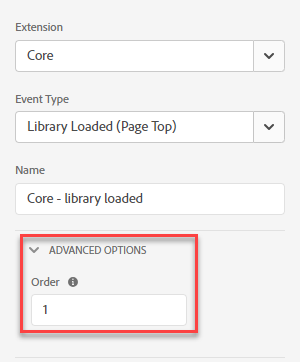
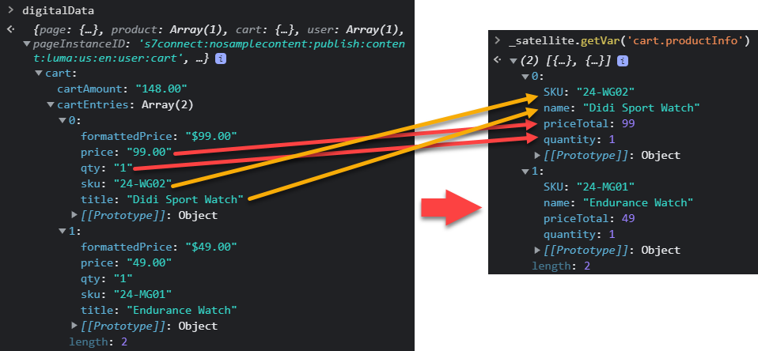
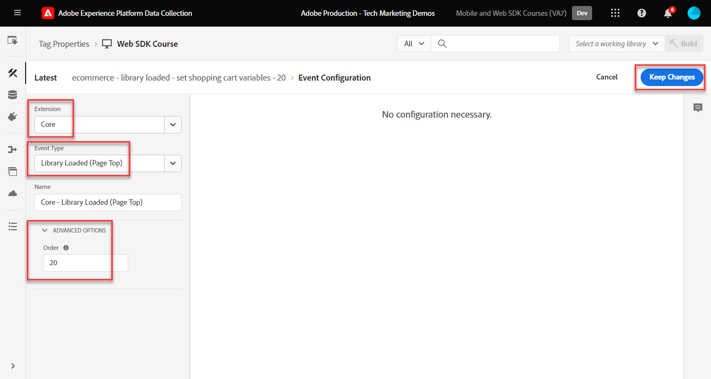
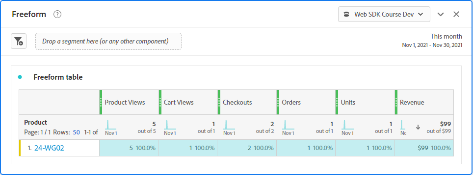

# 使用Platform Web SDK设置Adobe Analytics

了解如何使用设置Adobe Analytics [Experience PlatformWeb SDK](https://experienceleague.adobe.com/docs/platform-learn/data-collection/web-sdk/overview.html)，创建标记规则以将数据发送到Adobe Analytics，并验证Analytics是否按预期捕获数据。

[Adobe Analytics](https://experienceleague.adobe.com/docs/analytics.html) 是一款行业领先的应用程序，可帮助您充分了解客户的行为和需求，并根据客户情报掌控业务发展方向。

## 学习目标

在本课程结束后，您将能够：

* 为Adobe Analytics配置XDM架构
* 了解自动映射和手动映射的XDM变量与Analytics的区别
* 配置数据流以启用Adobe Analytics
* 覆盖数据流以将数据发送到另一个Adobe Analytics报表包
* 将单个或整个数组数据元素映射到XDM对象
* 使用更新变量规则操作类型将多个规则栈叠到一个XDM事件中
* 使用XDM对象在Adobe Analytics中捕获页面查看
* 使用Adobe Analytics产品字符串的XDM对象捕获电子商务数据
* 使用XDM设置产品语法促销eVar
* 验证是否使用Experience Platform调试器通过XDM对象设置了Adobe Analytics变量
* 使用Adobe Analytics处理规则设置自定义变量
* 验证Adobe Analytics使用Adobe Experience Platform Assurance捕获的数据
* 验证Adobe Analytics使用实时报表捕获的数据

## 先决条件

您熟悉标记、Adobe Analytics和 [Luma演示站点](https://luma.enablementadobe.com/content/luma/us/en.html){target="_blank"} 登录和购物功能。

您至少需要一个测试/开发报表包ID。 如果您没有可在本教程中使用的测试/开发报表包， [请创建一个](https://experienceleague.adobe.com/docs/analytics/admin/manage-report-suites/new-report-suite/t-create-a-report-suite.html).

您必须已完成本教程前面各节中的所有步骤：

* 初始配置
   * [配置XDM架构](configure-schemas.md)
   * [配置身份命名空间](configure-identities.md)
   * [配置数据流](configure-datastream.md)
* 标记配置
   * [安装 Web SDK 扩展](install-web-sdk.md)
   * [创建数据元素](create-data-elements.md)
   * [创建身份](create-identities.md)
   * [创建标记规则](create-tag-rule.md)
   * [使用Adobe Experience Platform Debugger进行验证](validate-with-debugger.md)

您还需要 [允许用户访问Adobe Experience Platform保障](https://experienceleague.adobe.com/docs/experience-platform/assurance/user-access.html) 以便您能够使用Adobe Experience Platform Assurance验证Adobe Analytics数据。

## XDM架构和Analytics变量

恭喜！您已在中配置了与Adobe Analytics兼容的架构 [配置架构](configure-schemas.md) 上课！ 但是，对于Adobe Analytics，可通过两种常规方法为Adobe Analytics定义XDM。

<!-- Implementing Platform Web SDK should be as product-agnostic as possible. For Adobe Analytics, mapping eVars, props, and events doesn't occur during schema creation, nor during the tag rules configuration as it has been done traditionally. Instead, every XDM key-value pair becomes a Context Data Variable that maps to an Analytics variable in one of two ways: 

1. Automatically mapped variables using reserved XDM fields
1. Manually mapped variables using Analytics Processing Rules

To understand what XDM variables are auto-mapped to Adobe Analytics, please see [Variables automatically mapped in Analytics](https://experienceleague.adobe.com/docs/experience-platform/edge/data-collection/adobe-analytics/automatically-mapped-vars.html?lang=en). Any variable that is not auto-mapped must be manually mapped. -->

1. **与产品无关的XDM**：维护语义键值对XDM架构并使用 [Adobe Analytics处理规则](https://experienceleague.adobe.com/docs/analytics/admin/admin-tools/manage-report-suites/edit-report-suite/report-suite-general/c-processing-rules/processing-rules.html) 以将XDM字段映射到eVar、prop等

   >[!IMPORTANT]
   >
   > XDM架构中的所有字段均可用作具有以下前缀的上下文数据变量Adobe Analytics `a.x.`. 例如：`a.x.web.webinteraction.region`

1. **特定于Analytics的XDM**：在XDM架构中使用专门构建的Adobe Analytics字段组，称为 `Adobe Analytics ExperienceEvent Template`

Adobe发现，客户更喜欢的方法是 **特定于Analytics的XDM**，因为它会跳过“Adobe Analytics处理规则”界面中的映射步骤。 本课程中的步骤使用 **特定于Analytics的XDM** 方针。

## 将XDM映射到Adobe Analytics

许多XDM字段会自动映射到Analytics变量。

在中创建的架构 [配置架构](configure-schemas.md) 课程中包含一些自动映射到Analytics变量的变量，如下表所示：

| XDM到Analytics的自动映射变量 | Adobe Analytics变量 |
|-------|---------|
| `identitymap.ecid.[0].id` | mid |
| `web.webPageDetails.name` | s.pageName |
| `web.webPageDetails.server` | s.server |
| `web.webPageDetails.siteSection` | s.channel |
| `commerce.productViews.value` | prodView |
| `commerce.productListViews.value` | scView |
| `commerce.checkouts.value` | scCheckout |
| `commerce.purchases.value` | 购买 |
| `commerce.order.currencyCode` | s.currencyCode |
| `commerce.order.purchaseID` | s.purchaseID |
| `productListItems[].SKU` | s.products=；产品名称；；；；；（主要 — 请参阅下面的注释） |
| `productListItems[].name` | s.products=；产品名称；；；；；（回退 — 请参阅下面的注释） |
| `productListItems[].quantity` | s.products=；；product quantity；；； |
| `productListItems[].priceTotal` | s.product=；；；产品价格；； |

>[!NOTE]
>
>Analytics产品字符串的各个部分通过下的不同XDM变量进行设置。 `productListItems` 对象。
>截至2022年8月18日， `productListItems[].SKU` 具有映射到s.products变量中的产品名称的优先级。
>值设置为 `productListItems[].name` 仅在以下情况下映射到产品名称： `productListItems[].SKU` 不存在。 否则，它将被取消映射，并可用于上下文数据。
>请勿将空字符串或null设置为  `productListItems[].SKU`. 这会产生不需要的效果，即映射到s.products变量中的产品名称。

有关最新的映射列表，请参阅 [Analytics Experience Edge中的Adobe变量映射](https://experienceleague.adobe.com/docs/experience-platform/edge/data-collection/adobe-analytics/automatically-mapped-vars.html).

对于未自动映射的XDM变量，请使用 `Adobe Analytics ExperienceEvent Template` 字段组，详情见下面即将推出的部分。


## 配置数据流

Platform Web SDK将数据从您的网站发送到Platform Edge Network。 然后，您的数据流会告知Platform Edge Network将相关数据转发到您的Adobe Analytics报表包中的哪个报表包。

1. 转到 [数据收集](https://experience.adobe.com/#/data-collection){target="blank"} 界面
1. 在左侧导航中，选择 **[!UICONTROL 数据流]**
1. 选择之前创建的 `Luma Web SDK: Development Environment` 数据流

   

1. 选择 **[!UICONTROL 添加服务]**
   
1. 选择 **[!UICONTROL Adobe Analytics]** 作为 **[!UICONTROL 服务]**
1. 输入  **[!UICONTROL 报表包ID]** 开发报表包的
1. 选择 **[!UICONTROL 保存]**

   

   >[!TIP]
   >
   >通过选择添加更多报表包 **[!UICONTROL 添加报表包]** 等同于多包标记。

>[!WARNING]
>
>在本教程中，您将仅为开发环境配置Adobe Analytics报表包。 在为您自己的网站创建数据流时，您将为暂存环境和生产环境创建其他数据流和报表包。

### 配置数据流报表包覆盖

您可能希望更改当访客出现在某些页面中时，要将哪些Adobe Analytics报表包数据发送到。 要为Adobe Analytics配置数据流覆盖设置，请执行以下操作：

1. 编辑 **[!UICONTROL Adobe Analytics]** 通过打开shish-kabab菜单，然后选择 **[!UICONTROL 编辑]**

   

1. 选择 **[!UICONTROL 高级选项]** 以打开 **[!UICONTROL 报表包覆盖]**

1. 选择要覆盖的报表包。 在本例中， `Web SDK Course Dev` 和 `Web SDK Course Stg`

1. 选择保存

   

在本课程的后面部分 [创建规则以通过数据流覆盖将页面查看发送到其他报表包](setup-analytics.md###send-a-page-view-to-a-different-report-suite-with-datastream-override).

## 创建其他电子商务数据元素

接下来，从Luma数据层捕获其他数据并将其发送到Platform Edge Network。 虽然本课程重点关注常见的Adobe Analytics要求，但可以根据您的数据流配置将所有捕获的数据轻松发送到其他目标。 例如，如果您完成了Adobe Experience Platform课程，则您在本课程中捕获的其他数据也将发送到Platform。

在创建数据元素课程中，您可以 [已创建JavaScript数据元素](create-data-elements.md#create-data-elements-to-capture-the-data-layer) 用于捕获内容和身份详细信息。 现在，您可以创建其他数据元素来捕获电子商务数据。 因为 [Luma演示站点](https://luma.enablementadobe.com/content/luma/us/en.html){target="_blank"} 对于购物车中的产品详细信息页面和产品使用不同的数据层结构，您必须为每个方案创建单独的数据元素。 使用自定义代码数据元素从Luma数据层获取您所需的内容，在您自己的网站上实施时，无论是否需要，这样做。 在这种情况下，您必须循环访问一系列购物车项目以获取每个产品的特定详细信息。 使用以下提供的代码片段：

1. 打开您在本教程中使用的标记属性

1. 转到 **[!UICONTROL 数据元素]**

1. 选择 **[!UICONTROL 添加数据元素]**

1. 将其命名为 **`product.productInfo.sku`**

1. 使用 **[!UICONTROL 自定义代码]** **[!UICONTROL 数据元素类型]**

1. 保留复选框 **[!UICONTROL 强制使用小写值]** 和 **[!UICONTROL 清除文本]** 未选中

1. 离开 `None` 作为 **[!UICONTROL 存储持续时间]** 设置，因为该值在每个页面上都不相同

1. 选择 **[!UICONTROL 打开编辑器]**

   

1. 复制并粘贴以下代码


   ```javascript
   var cart = digitalData.product;
   var cartItem;
   cart.forEach(function(item){
   cartItem = item.productInfo.sku;
   });
   return cartItem;
   ```

1. 选择 **[!UICONTROL 保存]** 保存自定义代码

1. 选择 **[!UICONTROL 保存]** 保存数据元素

请按照相同的步骤创建这些附加数据元素：

* **`product.productInfo.title`**

  ```javascript
  var cart = digitalData.product;
  var cartItem;
  cart.forEach(function(item){
  cartItem = item.productInfo.title;
  });
  return cartItem;
  ```

<!--* **`product.productInfo.name`**

    ```javascript
    var cart = digitalData.product;
    var cartItem;
    cart.forEach(function(item){
    cartItem = item.productInfo.name;
    });
    return cartItem;
    ```-->

<!--* **`cart.productInfo`**

    ```javascript
    var cart = digitalData.cart.cartEntries; 
    var cartItem = [];
    cart.forEach(function(item, index, array){
    var qty;
    if(window.location.pathname.includes("thank-you.html")){
    qty = parseInt(item.qty);
    }else{
    qty = "";
    }
    var price = parseInt(item.price);
    cartItem.push({
    "SKU": item.sku,
    "quantity": qty,
    "priceTotal": price
    });
    });
    return cartItem; 
    ```-->

* **`cart.productInfo`**

  ```javascript
  var cart = digitalData.cart.cartEntries; 
  var cartItem = [];
  cart.forEach(function(item, index, array){
  cartItem.push({
  "SKU": item.sku
  });
  });
  return cartItem; 
  ```

* **`cart.productInfo.purchase`**

  ```javascript
  var cart = digitalData.cart.cartEntries; 
  var cartItem = [];
  cart.forEach(function(item, index, array){
  var qty = parseInt(item.qty);
  var price = parseInt(item.price);
  cartItem.push({
  "SKU": item.sku,
  "quantity": qty,
  "priceTotal": price
  });
  });
  return cartItem; 
  ```

  >[!TIP]
  >
  > 此代码片段包含在产品促销eVar课程中使用的自定义eVar1设置

添加这些数据元素并在中创建了以前的数据元素之后 [创建数据元素](create-data-elements.md) 课程，您应该拥有以下数据元素：

| 数据元素 |
-----------------------------|
| `cart.orderId` |
| `cart.productInfo` |
| `cart.productInfo.purchase` |
| `identityMap.loginID` |
| `page.pageInfo.hierarchie1` |
| `page.pageInfo.pageName` |
| `page.pageInfo.server` |
| `product.productInfo.sku` |
| `product.productInfo.title` |
| `user.profile.attributes.loggedIn` |
| `user.profile.attributes.username` |
| `xdm.variable.content` |

<!-- 
>[!IMPORTANT]
>
>In this tutorial, you will create a different XDM object for each event. That means you must remap variables that would be considered to be "globally" available on every hit, such as page name and identityMap. However, you may [Merge Objects](https://experienceleague.adobe.com/docs/experience-platform/tags/extensions/adobe/core/overview.html#merged-objects) or use [Mapping Tables](https://exchange.adobe.com/experiencecloud.details.103136.mapping-table.html) to manage your XDM objects more efficiently in a real-life situation. For this lesson, the global variables are considered as:
>
>* **[!UICONTROL identityMap]** to capture the authenticated ID as per the [Create Identity Map Data Element](create-data-elements.md#create-identity-map-data-element) exercise in the [Create Data Elements](create-data-elements.md) lesson.
>* **[!UICONTROL web]** object to capture content as per the [content XDM object](create-data-elements.md#map-content-data-elements-to-XDM-Schema-individually) exercise in the [Create Data Elements](create-data-elements.md) lesson on every data element above. 
-->

## 创建其他规则

在 [创建标记规则](create-tag-rule.md) 课程，你设置了一个 `all pages global content variables - page bottom - AA (order 1)` 规则 [已使用创建基线XDM对象 **[!UICONTROL 更新变量]** **[!UICONTROL 操作类型]**](create-tag-rule.md#create-tag-rule). 以下练习扩充了该XDM对象以捕获特定于某些页面的其他数据。

### 递增页面查看次数

由于您现在将数据发送到Adobe Analytics，因此还必须映射一个额外的XDM字段，以指示应当将信标作为Analytics页面查看进行处理。

1. 打开 `all pages global content variables - page bottom - AA (order 1)` 规则
1. 向下滚动并选择以打开，直到 `web.webPageDetails`
1. 选择以打开 **[!UICONTROL 页面查看次数]** 对象
1. 设置 **[!UICONTROL 值]** 到 `1`
1. 选择 **[!UICONTROL 保留更改]**

   

   >[!TIP]
   >
   >此字段等同于发送 **`s.t()`** 使用以下方式查看Analytics的页面信标 `AppMeasurement.js`. 对于链接点击信标，请设置 `webInteraction.linkClicks.value` 到 `1`


### 使用数据流覆盖将页面查看发送到其他报表包

创建规则以向其他报表包发送额外的页面查看调用。 使用数据流覆盖功能，使用以下方式更改页面的报表包： **[!UICONTROL 发送事件]** 操作。

1. 创建新规则，将其命名为 `homepage report suite override - page bottom - AA (order 51)`

1. 选择下的加号 **[!UICONTROL 事件]** 添加新触发器

1. 下 **[!UICONTROL 扩展名]**，选择 **[!UICONTROL 核心]**

1. 下 **[!UICONTROL 事件类型]**，选择 **[!UICONTROL Page Bottom]**

1. 将其命名为 `Core - Page Bottom - order 51`

1. 选择以打开 **[!UICONTROL 高级选项]**，键入 `51`. 这可确保规则在 `all pages global content variables - page bottom - AA (order 50)` 设置基线XDM **[!UICONTROL 更新变量]** 操作类型。

   

1. 下 **[!UICONTROL 条件]**，选择以 **[!UICONTROL 添加]**

1. 离开 **[!UICONTROL 逻辑类型]** 作为 **[!UICONTROL 常规]**

1. 离开 **[!UICONTROL 扩展]** 作为 **[!UICONTROL 核心]**

1. 选择 **[!UICONTROL 完成情况类型]** 作为 **[!UICONTROL 不含查询字符串的路径]**

1. 在右边，离开 **[!UICONTROL 正则表达式]** 切换已禁用

1. 下 **[!UICONTROL 路径等于]** 设置 `/content/luma/us/en.html`. 对于Luma演示站点，它确保规则仅在主页上触发

1. 选择 **[!UICONTROL 保留更改]**

   

1. 下 **[!UICONTROL 操作]** 选择 **[!UICONTROL 添加]**

1. 作为 **[!UICONTROL 扩展名]**，选择 **[!UICONTROL Adobe Experience Platform Web SDK]**

1. 作为 **[!UICONTROL 操作类型]**，选择 **[!UICONTROL 发送事件]**

1. 作为 **[!UICONTROL 类型]**，选择 `web.webpagedetails.pageViews`

1. 作为 **[!UICONTROL XDM数据]**，选择 `xdm.variable.content` 您已在 [创建数据元素](create-data-elements.md) 课程

   

1. 向下滚动到 **[!UICONTROL 数据流配置覆盖]** 部分

1. 离开 **[!UICONTROL 开发]** 选项卡处于选中状态。

   >[!TIP]
   >
   >    此选项卡确定覆盖发生在哪个标记环境中。 对于此练习，您只指定了开发环境，但在将此体验部署到生产环境时，请记得也在 **[!UICONTROL 生产]** 环境。


1. 选择 **[!UICONTROL 数据流]**，在本例中 `Luma Web SDK: Development Environment`

1. 下 **[!UICONTROL 报表包]**，选择要覆盖的报表站点。 在本例中， `tmd-websdk-course-stg`.


>[!TIP]
>
>此处显示的报表包列表由 [配置数据流报表包覆盖](configure-datastream.md###configure-a-datastream-report-suite-override) 步骤。 添加报表包相当于使用多包标记。

1. 选择 **[!UICONTROL 保留更改]**

1. 和 **[!UICONTROL 保存]** 您的规则

   

### 使用更新变量扩充XDM对象

使用 **[!UICONTROL 更新变量]** 操作类型，您可以创建其他规则以扩充“全局内容XDM”，然后再将其发送到 [!UICONTROL Platform边缘网络]. 通过在规则之前对新规则进行排序，完成此操作。 `all pages send event - page bottom - AA (order 50)` 发送事件 [!UICONTROL Platform边缘网络].

>[!TIP]
>
>规则顺序确定在触发事件时首先运行的规则。 如果两个规则具有相同的事件类型，则编号最低的规则会先运行。
> 
>

## 设置产品字符串

在映射到产品字符串之前，请务必了解XDM架构中有两个主要对象，它们用于捕获与Adobe Analytics具有特殊关系的电子商务数据：

1. 此 `commerce` 对象设置Analytics事件，例如 `prodView`， `scView`、和 `purchase`
1. 此 `productListItems` 对象设置Analytics维度，例如 `productID`.

请参阅 [收集商业和产品数据](https://experienceleague.adobe.com/docs/experience-platform/edge/data-collection/collect-commerce-data.html?lang=en) 以了解更多详细信息。


首先，在Luma的产品详细信息页面上跟踪产品查看。

1. 从左侧导航中，选择 **[!UICONTROL 规则]** 然后选择 **[!UICONTROL 添加规则]**
1. 将其命名为  [!UICONTROL `ecommerce - pdp page bottom - AA (order 20)`]
1. 下 **[!UICONTROL 扩展名]**，选择 **[!UICONTROL 核心]**
1. 下 **[!UICONTROL 事件类型]**，选择 **[!UICONTROL Page Bottom]**
1. 将其命名为 `Core - Page Bottom - order 20`
1. 选择以打开 **[!UICONTROL 高级选项]**，键入 `20`. 这可确保规则在 `all pages global content variables - page bottom - AA (order 1)` ，用于设置全局内容变量，但在 `all pages send event - page bottom - AA (order 50)` 发送XDM事件。

   

1. 下 **[!UICONTROL 条件]**，选择以 **[!UICONTROL 添加]**
1. 离开 **[!UICONTROL 逻辑类型]** 作为 **[!UICONTROL 常规]**
1. 离开 **[!UICONTROL 扩展]** 作为 **[!UICONTROL 核心]**
1. 选择 **[!UICONTROL 完成情况类型]** 作为 **[!UICONTROL 不含查询字符串的路径]**
1. 在右侧，启用 **[!UICONTROL 正则表达式]** 切换
1. 下 **[!UICONTROL 路径等于]** 设置 `/products/`. 对于Luma演示站点，它确保规则仅在产品页面上触发
1. 选择 **[!UICONTROL 保留更改]**

   

1. 下 **[!UICONTROL 操作]** 选择 **[!UICONTROL 添加]**
1. 选择 **[!UICONTROL Adobe Experience Platform Web SDK]** 扩展
1. 选择 **[!UICONTROL 操作类型]** 作为 **[!UICONTROL 更新变量]**
1. 向下滚动到 `commerce` 对象并选择以将其打开。
1. 打开 **[!UICONTROL 产品视图]** 对象和设置 **[!UICONTROL 值]** 到 `1`

   

   >[!TIP]
   >
   >在XDM中设置commerce.productViews.value=1会自动映射到 `prodView` Analytics中的事件

此外，了解您可以 **[!UICONTROL 提供单个属性]** 至各个XDM字段或 **[!UICONTROL 提供整个阵列]** 到XDM对象。


### 将单个属性映射到XDM对象

由于Luma上的数据层结构，您可以映射到单个变量以捕获Luma演示网站的产品详细信息页面上的数据。

1. 向下滚动到并选择 `productListItems` 数组
1. 选择 **[!UICONTROL 提供单个项目]**
1. 选择 **[!UICONTROL 添加项目]**

   

   >[!CAUTION]
   >
   >此 **`productListItems`** 是 `array` 数据类型，以便它希望数据以元素集合的形式输入。 由于Luma演示站点的数据层结构，并且由于一次只能在Luma站点上查看一个产品，因此需要单独添加项目。 在您自己的网站上实施时，根据数据层结构，您可能能够提供整个阵列。

1. 选择以打开 **[!UICONTROL 项目1]**
1. 将 **`productListItems.item1.SKU`** 映射到 `%product.productInfo.sku%`

   

1. 查找 `eventType` 并将其设置为 `commerce.productViews`

1. 不要选择“保留更改”

### 在产品字符串中设置推销eVar

通过使用 `Adobe Analytics ExperienceEvent Template` 字段组要定义XDM架构，您可以将变量映射到产品字符串中的促销eVar或事件。 这也称为设置 **产品语法促销**. 请注意 `_experience` 对象位于 `productListItems` > `Item 1`. 在此下设置任何变量 [!UICONTROL 对象] 设置产品语法eVar或事件。

1. 选择以打开 `_experience > analytics > customDimensions > eVars > eVar1`

1. 设置 **[!UICONTROL 值]** 到 `%product.productInfo.title%`

1. 选择 **[!UICONTROL 保留更改]**

   

1. 选择 **[!UICONTROL 保存]** 保存规则

<!--
1. The **[!UICONTROL Type]** field has a drop-down list of values to choose from. Select `[!UICONTROL commerce.productViews]`

    [!TIP]
    >
    >The value selected here has no effect on how data is mapped to Analytics, however it is recommended to thoughtfully apply this variable, as it is used in Adobe Experience Platform's segment builder interface. The value selected is available to use in the `[!UICONTROL c.a.x.eventtype]` context data variable downstream.

1. Under **[!UICONTROL XDM Data]**, select the `[!UICONTROL xdm.commerce.prodView]` XDM object data element
1. Select **[!UICONTROL Keep Changes]**

    

1. Your rule should look similar to the below. Select **[!UICONTROL Save]**

     -->


### 将整个数组映射到XDM对象

如前所述，Luma演示站点为购物车中的产品使用不同的数据层结构。 自定义代码数据元素 `cart.productInfo` 之前创建的循环是通过 `digitalData.cart.cartEntries` 数据层对象并将其转换为所需的XDM对象模式。 新格式 **必须完全匹配** 由定义的架构 `productListItems` XDM模式的对象。

要说明此问题，请参阅Luma站点数据层（左）与转换后的数据元素（右）的以下比较：



将数据元素与 `productListItems` 结构（提示，它应该匹配）。

>[!IMPORTANT]
>
>请注意数值变量的转换方式，以及数据层中字符串值的转换方式，例如 `price` 和 `qty` 已重新格式化为数据元素中的数字。 这些格式要求对于Platform中的数据完整性非常重要，并且在 [配置架构](configure-schemas.md) 步骤。 在本例中， **[!UICONTROL 数量]** 使用 **[!UICONTROL 整数]** 数据类型。
> 

现在返回到将XDM对象映射到整个数组。 重复与创建 `ecommerce - pdp page bottom - AA (order 20)` 规则：

1. 将其命名为  [!UICONTROL `ecommerce - cart page bottom - AA (order 20)`]
1. 下 **[!UICONTROL 扩展名]**，选择 **[!UICONTROL 核心]**
1. 下 **[!UICONTROL 事件类型]**，选择 **[!UICONTROL Page Bottom]**
1. 将其命名为 `Core - Page Bottom - order 20`
1. 选择以打开 **[!UICONTROL 高级选项]**，键入 `20`
1. 选择 **[!UICONTROL 保留更改]**

   

1. 下 **[!UICONTROL 条件]**，选择以 **[!UICONTROL 添加]**
1. 离开 **[!UICONTROL 逻辑类型]** 作为 **[!UICONTROL 常规]**
1. 离开 **[!UICONTROL 扩展]** 作为 **[!UICONTROL 核心]**
1. 选择 **[!UICONTROL 完成情况类型]** 作为 **[!UICONTROL 不含查询字符串的路径]**
1. 在右边， **不要** 启用 **[!UICONTROL 正则表达式]** 切换
1. 下 **[!UICONTROL 路径等于]** 设置 `/content/luma/us/en/user/cart.html`. 对于Luma演示站点，它确保规则仅在购物车页面上触发
1. 选择 **[!UICONTROL 保留更改]**

   

1. 下 **[!UICONTROL 操作]** 选择 **[!UICONTROL 添加]**
1. 选择 **[!UICONTROL Adobe Experience Platform Web SDK]** 扩展
1. 选择 **[!UICONTROL 操作类型]** 作为 **[!UICONTROL 更新变量]**
1. 向下滚动到 `commerce` 对象并选择以将其打开。
1. 打开 **[!UICONTROL productListView]** 对象和设置 **[!UICONTROL 值]** 到 `1`

   

   >[!TIP]
   >
   >在XDM中设置commerce.productListViews.value=1会自动映射到 `scView` Analytics中的事件

<!--1. Create an **[!UICONTROL XDM object]** **[!UICONTROL Data Element Type]** named **`xdm.commerce.cartView`**
1. Select the same Platform sandbox and XDM schema you are using for this tutorial
1. Open the **[!UICONTROL commerce]** object
1. Open the **[!UICONTROL productListViews]** object and set `value` to `1`

    >[!TIP]
    >
    >This step is equivalent to setting `scView` event in Analytics -->

1. 向下滚动到并选择 **[!UICONTROL productListItems]** 数组

1. 选择 **[!UICONTROL 提供整个阵列]**

1. 将映射到 **`cart.productInfo`** 数据元素

1. 选择 `eventType` 并设置为 `commerce.productListViews`

1. 选择 **[!UICONTROL 保留更改]**

1. 选择 **[!UICONTROL 保存]** 保存规则

按照相同的模式为结账和购买创建其他两个规则，但存在以下差异：

**规则名称**： `ecommerce - checkout page bottom - AA (order 20)`

* **[!UICONTROL 条件]**： /content/luma/us/en/user/checkout.html
* 将 `eventType` 设置为 `commerce.checkouts`
* 设置 **XDM商务事件**： commerce.checkout.value到 `1`

  >[!TIP]
  >
  >这相当于设置 `scCheckout` Analytics中的事件

**规则名称**： `ecommerce - purchase page bottom - AA (order 20)`

* **[!UICONTROL 条件]**： /content/luma/us/en/user/checkout/order/thank-you.html
* 将 `eventType` 设置为 `commerce.purchases`
* 设置 **XDM商务事件**： commerce.purchases.value到 `1`

  >[!TIP]
  >
  >这相当于设置 `purchase` Analytics中的事件

还有其他步骤可捕获所有必需的 `purchase` 事件变量：

1. 打开 **[!UICONTROL 商务]** 对象
1. 打开 **[!UICONTROL 订购]** 对象
1. 地图 **[!UICONTROL purchaseID]** 到 `cart.orderId` 数据元素
1. 设置 **[!UICONTROL currencyCode]** 到硬编码值 `USD`

   

   >[!TIP]
   >
   >这相当于设置 `s.purchaseID` 和 `s.currencyCode` Analytics中的变量


1. 向下滚动到并选择 **[!UICONTROL productListItems]** 数组
1. 选择 **[!UICONTROL 提供整个阵列]**
1. 将映射到 **`cart.productInfo.purchase`** 数据元素
1. 选择 **[!UICONTROL 保存]**

完成后，您应该会看到创建了以下规则。


<!--
## Create additional rules for Platform Web SDK

With the **[!UICONTROL Update variabl]**e and **[!UICONTROL Send Event]** Action Types of Platform Web SDK, its possible to sequence the **[!UICONTROL Send Event]** action to trigger after all **[!UICONTROL Update variable]** action types run. This is called Rule Stacking, and you use it to customize the baseline XDM created depending on the type of page you are on.  

In this exercise, you create individual rules per e-commerce event and use conditions so the rules fire on the right pages. 

Repeat the same for all other e-commerce events using the following parameters:

**Rule name**: cart view - library load - AA

* **[!UICONTROL Event Type]**: Library Loaded (Page Top)
* **[!UICONTROL Condition]**: /content/luma/us/en/user/cart.html
* **Type value under Web SDK - Send Action**: commerce.productListViews
* **XDM data for Web SDK - Send Action:** `%xdm.commerce.cartView%`

**Rule name**: checkout - library load - AA

* **[!UICONTROL Event Type]**: Library Loaded (Page Top)
* **[!UICONTROL Condition]** /content/luma/us/en/user/checkout.html
* **Type for Web SDK - Send Action**: commerce.checkouts
* **XDM data for Web SDK - Send Action:** `%xdm.commerce.checkout%`

**Rule name**: purchase - library load - AA

* **[!UICONTROL Event Type]**: Library Loaded (Page Top)
* **[!UICONTROL Condition]** /content/luma/us/en/user/checkout/order/thank-you.html
* **Type for Web SDK - Send Action**: commerce.purchases
* **XDM data for Web SDK - Send Action:** `%xdm.commerce.purchase%`
-->


## 构建开发环境

将新的数据元素和规则添加到 `Luma Web SDK Tutorial` 标记库并重新构建开发环境。

恭喜！下一步是通过Experience PlatformWeb SDK验证Adobe Analytics实施。

## 验证适用于Platform Web SDK的Adobe Analytics

在 [调试程序](validate-with-debugger.md) 在本课程中，您已了解如何使用Platform Debugger和浏览器开发人员控制台检查客户端XDM请求，这与您调试 `AppMeasurement.js` Analytics实施。 您还了解了如何验证发送到Adobe应用程序的Platform Edge Network服务器端请求，以及如何使用Assurance查看完全处理的负载。

要验证Analytics是否通过Experience PlatformWeb SDK正确捕获数据，您必须进一步执行两个步骤：

1. 使用Experience Platform调试器的边缘跟踪功能，验证平台边缘网络上的XDM对象如何处理数据
1. 验证Analytics如何使用处理规则和实时报表来处理数据
1. 使用Adobe Experience Platform保障验证Analytics完全处理数据的方式

### 使用边缘跟踪

了解如何使用Experience PlatformDebugger的边缘跟踪功能验证Adobe Analytics是否正在捕获ECID、页面查看次数、产品字符串和电子商务事件。

### Experience CloudID验证

1. 转到 [Luma演示站点](https://luma.enablementadobe.com/content/luma/us/en.html){target="_blank"} 并使用Experience Platform调试器来 [将网站上的tag属性切换到您自己的开发资产](validate-with-debugger.md#use-the-experience-platform-debugger-to-map-to-your-tags-property)


   >[!WARNING]
   >
   >在继续之前，请确保您已登录Luma网站。  如果您未登录，则Luma网站不允许您签出。
   >
   > 1. 在Luma上，选择右上角的登录按钮，然后使用凭据 **ù： `test@adobe.com` p：测试** 进行身份验证
   >
   > 1. 系统会自动将您重定向到 [Didi Sport Watch产品页](https://luma.enablementadobe.com/content/luma/us/en/products/gear/watches/didi-sport-watch.html#24-WG02) 在下一页面加载时

1. 要启用边缘跟踪，请转到Experience Platform调试器，在左侧导航中，选择 **[!UICONTROL 日志]**，然后选择 **[!UICONTROL Edge]** 选项卡，然后选择 **[!UICONTROL 连接]**

   

1. 现在它将为空

   

1. 刷新 [Didi Sport Watch产品页](https://luma.enablementadobe.com/content/luma/us/en/products/gear/watches/didi-sport-watch.html#24-WG02) 并再次检查Experience Platform调试器，此时您应该会看到数据已通过。 以开头的行 **[!UICONTROL Analytics自动映射]** 是Adobe Analytics信标
1. 选择以打开 `[!UICONTROL mappedQueryParams]` 下拉列表和查看Analytics变量的第二个下拉列表

   

   >[!TIP]
   >
   >第二个下拉列表对应于您要将数据发送到的分析报表包ID。 它应该与您自己的报表包匹配，而不是与屏幕快照中的报表包匹配。

1. 向下滚动以查找 `[!UICONTROL c.a.x.identitymap.ecid.[0].id]`. 它是一个捕获ECID的上下文数据变量
1. 一直向下滚动直到看到Analytics `[!UICONTROL mid]` 变量。 两个ID均与设备的Experience CloudID匹配。

   

   >[!NOTE]
   >
   >由于您已登录，请花些时间验证经过身份验证的ID `112ca06ed53d3db37e4cea49cc45b71e` 对于用户 **`test@adobe.com`** 也被捕获到 `[!UICONTROL c.a.x.identitymap.lumacrmid.[0].id]`

### 报表包覆盖

在上面，您为配置了数据流覆盖 [Luma主页](https://luma.enablementadobe.com/content/luma/us/en.html).  验证此配置的步骤

1. 查找包含 **[!UICONTROL 应用覆盖后的数据流配置。]**&#x200B;的问题。在这里，您可以找到为报表包覆盖配置的主报表包和其他报表包。

   

1. 向下滚动到以开头的行 **[!UICONTROL Analytics自动映射]**  并确认 `[!UICONTROL reportSuiteIds]` 显示您在覆盖配置中指定的报表包

   

### 内容页面查看次数

返回 [Didi Sport Watch产品页](https://luma.enablementadobe.com/content/luma/us/en/products/gear/watches/didi-sport-watch.html#24-WG02).  这次，您将验证Analytics是否捕获了内容页面查看。

1. 查找 `[!UICONTROL c.a.x.web.webpagedetails.pageviews.value]=1`. 它告诉您一个 `s.t()` 正在将页面查看信标发送到Analytics
1. 向下滚动以查看 `[!UICONTROL gn]` 变量。 它是的Analytics动态语法 `[!UICONTROL s.pageName]` 变量。 它从数据层捕获页面名称。

   

### 产品字符串和电子商务事件

由于您已在产品页面上，因此本练习将继续使用相同的边缘跟踪来验证Analytics捕获的产品数据。 产品字符串和电子商务事件都会自动将XDM变量映射到Analytics。 只要您已映射到适当的 `productListItem` XDM变量，而 [为Adobe Analytics配置XDM架构](setup-analytics.md#configure-an-xdm-schema-for-adobe-analytics)，Platform Edge Network负责将数据映射到适当的Analytics变量。

**首先验证 `Product String` 已设置**

1. 查找 `[!UICONTROL c.a.x.productlistitems.][0].[!UICONTROL sku]`. 变量会捕获您映射到 `productListItems.item1.sku` 本课程前面部分
1. 同时查找 `[!UICONTROL c.a.x.productlistitems.][0].[!UICONTROL _experience.analytics.customdimensions.evars.evar1]`. 变量会捕获您映射到的数据元素值 `productListItems.item1._experience.analytics.customdimensions.evars.evar1`
1. 向下滚动以查看 `[!UICONTROL pl]` 变量。 它是Analytics产品字符串变量的动态语法
1. 请注意，数据层中的产品名称会同时映射到 `[!UICONTROL c.a.x.productlistitems.][0].[!UICONTROL sku]` 和 `[!UICONTROL product]` 生产字符串的参数。  此外，数据层中的产品标题会映射到生产字符串中的推销evar1。

   

   边缘跟踪处理 `commerce` 事件与略有不同 `productList` 维度。 您不会看到上下文数据变量以与查看产品名称映射到的方式相同的方式进行映射 `[!UICONTROL c.a.x.productlistitem.[0].name]` 以上。 取而代之的是，边缘描摹显示Analytics中的最终事件自动映射 `event` 变量。 只要映射到适当的XDM，Platform Edge Network就会相应地映射它 `commerce` 变量while [为Adobe Analytics配置架构](setup-analytics.md#configure-an-xdm-schema-for-adobe-analytics)；在这种情况下， `commerce.productViews.value=1`.

1. 返回Experience Platform调试器窗口，向下滚动到 `[!UICONTROL events]` 变量中，它被设置为 `[!UICONTROL prodView]`

1. 另请注意 `[!UICONTROL c.a.x.eventType]` 设置为 `commerce.productViews` 因为您位于产品页面上。

   >[!TIP]
   >
   > 此 `ecommerce - pdp page bottom - AA (order 20)` 规则正在覆盖的值 `eventType` 由 `all pages global content variables - page bottom - AA (order 1)` 规则，因为该规则设置为在序列中稍后触发


   

**验证为Analytics设置的其余电子商务事件和产品字符串**

1. 添加 [滴滴出行手表](https://luma.enablementadobe.com/content/luma/us/en/products/gear/watches/didi-sport-watch.html#24-WG02) 到购物车
1. 转到 [购物车页面](https://luma.enablementadobe.com/content/luma/us/en/user/cart.html)，检查边缘跟踪

   * `eventType` 设置为 `commerce.productListViews`
   * `[!UICONTROL events: "scView"]`、和
   * 设置product string

   

1. 继续结帐，检查边缘跟踪

   * `eventType` 设置为 `commerce.checkouts`
   * `[!UICONTROL events: "scCheckout"]`、和
   * 设置product string

   

1. 仅填写 **名字** 和 **姓氏** 填写发货单上的字段并选择 **继续**. 在下一页，选择 **下单**
1. 在确认页面上，检查边缘跟踪

   * `eventType` 设置为 `commerce.purchases`
   * 正在设置购买事件 `[!UICONTROL events: "purchase"]`
   * 正在设置的货币代码变量 `[!UICONTROL cc: "USD"]`
   * 在中设置了购买ID `[!UICONTROL pi]`
   * 产品字符串 `[!UICONTROL pl]` 设置产品名称、数量和价格

   

## 处理规则和实时报表

现在，您已通过边缘跟踪验证Analytics信标，接下来还可以使用实时报表验证Analytics是否对数据进行了处理。 在检查实时报表之前，必须配置Analytics的处理规则 `props` 根据需要。

### 自定义Analytics映射的处理规则

在本练习中，您将一个XDM变量映射到一个prop，以便在实时报表中查看。 对于任何自定义映射，请按照以下相同步骤执行操作 `eVar`， `prop`， `event`或变量访问，可通过处理规则访问。

1. 在Analytics UI中，转到 [!UICONTROL 管理员] > [!UICONTROL 管理工具] > [!UICONTROL 报表包]
1. 选择您将在教程中使用的开发/测试报表包> [!UICONTROL 编辑设置] > [!UICONTROL 常规] > [!UICONTROL 处理规则]

   

1. 创建规则以 **[!UICONTROL 覆盖值]** `[!UICONTROL Product SKU (prop1)]` 到 `a.x.productlistitems.0.sku`. 请记住添加您创建规则的原因并命名规则标题。 选择 **[!UICONTROL 保存]**

   

   >[!IMPORTANT]
   >
   >首次映射到处理规则时，UI不会显示XDM对象中的上下文数据变量。 要修复该错误，请选择任意值，请保存并返回进行编辑。 此时应会显示所有XDM变量。

1. 转到 [!UICONTROL 编辑设置] >  [!UICONTROL 实时]. 使用下面显示的以下参数配置所有这三个参数，以便您可以验证内容页面查看次数、产品查看次数和购买次数

   

1. 重复验证步骤，您应该会看到实时报表相应地填充数据。

   **页面查看次数**
   

   **产品查看次数**
   

   **购买**
   

1. 在工作区UI中，创建一个表以查看您所购买产品的完整电子商务流程

   

要了解有关将XDM字段映射到Analytics变量的更多信息，请观看视频 [将Web SDK变量映射到Adobe Analytics](https://experienceleague.adobe.com/docs/analytics-learn/tutorials/analysis-use-cases/internal-site-search/map-web-sdk-variables-into-adobe-analytics.html).

## 使用Adobe Experience Platform Assurance验证Adobe Analytics

Adobe Experience Platform Assurance是Adobe Experience Cloud的一个产品，可帮助您检查、验证、模拟和验证如何收集数据或向网站和移动应用程序提供体验。

上面您已验证Adobe Analytics是否使用Experience PlatformDebugger的边缘跟踪功能捕获ECID、页面查看次数、产品字符串和电子商务事件。  您还使用处理规则和实时报表验证了prop1的映射。  接下来，使用Adobe Experience Platform Assurance验证这些相同的事件。

>[!NOTE]
>
>要使用Adobe Experience Platform保障验证Adobe Analytics数据，您必须 [允许用户访问Adobe Experience Platform保障](https://experienceleague.adobe.com/docs/experience-platform/assurance/user-access.html)

### 访问Adobe Experience Platform保障

有几种方式可以访问Assurance ：

1. 通过Adobe Experience Platform提供访问保证
1. 通过Adobe Experience Platform数据收集提供访问保证
1. 通过Adobe Experience Platform Debugger中的日志提供访问保证

要通过Adobe Experience Platform访问保证，请向下滚动并选择 **[!UICONTROL Assurance]** 在左边栏导航中的 **[!UICONTROL 数据收集]**.  选择 **[!UICONTROL “Web SDK教程3”]** 会话来访问上一节中生成的事件。


要通过Adobe Experience Platform数据收集访问保证，请选择 **[!UICONTROL Assurance]** 在左边栏导航中的 **[!UICONTROL 数据收集]**.  选择 **[!UICONTROL “Web SDK教程3”]** 会话来访问上一节中生成的事件。\


要通过Adobe Experience Platform Debugger访问Assurance，请转到Experience PlatformDebugger，在左侧导航栏中选择 **[!UICONTROL 日志]**，然后选择 **[!UICONTROL Edge]** 选项卡，然后选择 **[!UICONTROL 连接]**.  建立与Edge Network的连接后，选择外部链接图标\


在 **[!UICONTROL “Web SDK教程3”]** 进入保证会话 **[!UICONTROL &quot;hitdebugger&quot;]** 放到事件搜索栏中，将结果筛选为AdobeAnalytics后处理数据。


### 使用保证进行Experience CloudID验证

要验证Adobe Analytics是否正在捕获ECID，请选择一个信标并打开有效负载。  此信标的供应商应为 **[!UICONTROL com.adobe.analytics.hitdebugger]**


然后向下滚动到 **[!UICONTROL mcvisId]** 以验证是否已正确捕获ECID


### 使用Assurance验证内容页面视图

使用相同的信标，验证内容页面查看是否已映射到正确的Adobe Analytics变量。
向下滚动到 **[!UICONTROL pageName]** 以验证 `Page Name` 正确捕获


### 使用Assurance验证产品字符串和电子商务事件

按照使用上述Experience Platform调试器进行验证时所使用的相同验证用例，继续使用相同的信标来验证 `Ecommerce Events` 和 `Product String`.

1. 查找有效负荷，其中 **[!UICONTROL 事件]** contain `prodView`
   
1. 向下滚动到 **[!UICONTROL 产品字符串]** 验证 `Product String`.
   * 请注意 `Product SKU` 和 `Merchandizing eVar1`.
1. 进一步向下滚动并验证 `prop1`（在上一部分中使用处理规则配置的）包含 `Product SKU`\
   

通过查看购物车、结帐和购买事件来继续验证实施。

1. 查找有效负荷，其中 **[!UICONTROL 事件]** contain `scView` 并验证产品字符串。
   
1. 查找有效负荷，其中 **[!UICONTROL 事件]** contain `scCheckout` 并验证产品字符串。
   
1. 查找有效负荷，其中 **[!UICONTROL 事件]** contain `purchase`
   
1. 验证 `purchase` 事件，请注意 `Product String` 应包含 `Product SKU`， `Product Quantity` 、和 `Product Total Price`.
1. 此外，对于 `purchase` 验证 `purchase-id` 和/或 `purchaseId` 已设置


恭喜！你做到了！ 在本课程结束时，您已准备好使用Platform Web SDK为您自己的网站实施Adobe Analytics。

[下一步： ](setup-audience-manager.md)

>[!NOTE]
>
>感谢您投入时间学习Adobe Experience Platform Web SDK。 如果您有疑问、希望分享一般反馈或有关于未来内容的建议，请在此共享它们 [Experience League社区讨论帖子](https://experienceleaguecommunities.adobe.com/t5/adobe-experience-platform-launch/tutorial-discussion-implement-adobe-experience-cloud-with-web/td-p/444996)
