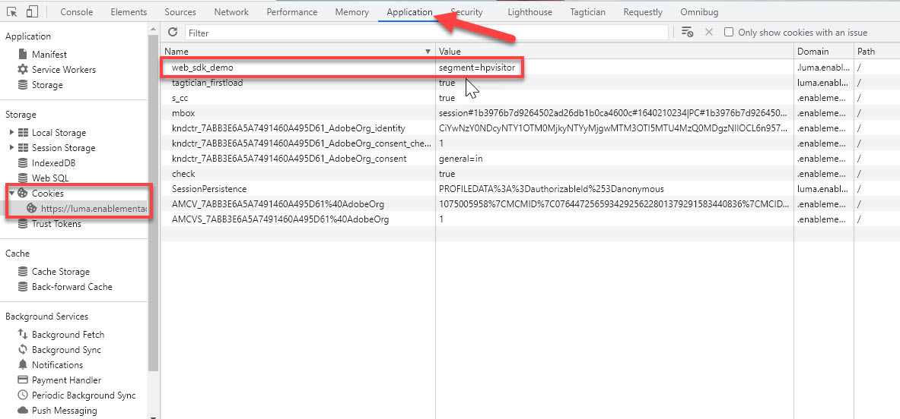
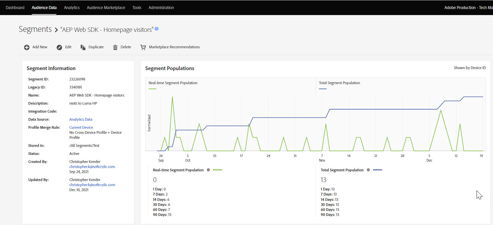

# 使用Platform Web SDK设置Audience Manager

了解如何使用Platform Web SDK设置Adobe Audience Manager，并使用Cookie目标验证实施。

[Adobe Audience Manager](https://experienceleague.adobe.com/docs/audience-manager.html) 是一种Adobe Experience Cloud解决方案，它提供了收集与网站访客有关的商业相关信息、创建可销售的区段以及向合适的受众提供定向广告和内容所需的一切。

## 学习目标

在本课程结束后，您将能够：

* 配置数据流以启用Audience Manager
* 在Audience Manager中启用Cookie目标
* 通过Adobe Experience Platform Debugger确认受众资格来验证Audience Manager实施

## 先决条件

要完成本课程，您必须首先：

* 完成本教程的初始配置和标记配置部分中之前的课程。
* 有权访问Adobe Audience Manager以及创建、读取和写入特征、区段和目标的相应权限。 有关详细信息，请查阅 [Audience Manager基于角色的访问控制](https://experienceleague.adobe.com/docs/audience-manager-learn/tutorials/setup-and-admin/user-management/setting-permissions-with-role-based-access-control.html?lang=en).

## 配置数据流

使用Platform Web SDK实现的Audience Manager与使用 [服务器端转发(SSF)](https://experienceleague.adobe.com/docs/analytics/admin/admin-tools/server-side-forwarding/ssf.html?lang=zh-Hans). 服务器端转发将Adobe Analytics请求数据传递给Audience Manager。 Platform Web SDK实现将发送到Platform Edge Network的XDM数据传递给Audience Manager。 数据流中启用了Audience Manager：

1. 转到 [数据收集](https://experience.adobe.com/#/data-collection){target="blank"} 界面
1. 在左侧导航中，选择 **[!UICONTROL 数据流]**
1. 选择之前创建的 `Luma Web SDK` 数据流

   

1. 选择 **[!UICONTROL 添加服务]**
   
1. 选择 **[!UICONTROL Adobe Audience Manager]** 作为 **[!UICONTROL 服务]**
1. 确认 **[!UICONTROL Cookie目标已启用]** 和 **[!UICONTROL 已启用URL目标]** 已选定
1. 选择 **[!UICONTROL 保存]**
   

## 创建数据源

接下来，创建 [数据源](https://experienceleague.adobe.com/docs/audience-manager/user-guide/features/data-sources/datasources-list-and-settings.html?lang=en)，用于在Audience Manager中整理数据的基本工具：

1. 转到 [Audience Manager](https://experience.adobe.com/#/audience-manager/) 界面
1. 选择 **[!UICONTROL 受众数据]** 从顶部导航
1. 选择 **[!UICONTROL 数据源]** 从下拉菜单中
1. 选择 **[!UICONTROL 新增]** “数据源”页面顶部的按钮

   

1. 为数据源提供易记的名称和描述。 对于初始设置，您可以将其命名为 `Platform Web SDK tutorial`.
1. 设置 **[!UICONTROL ID类型]** 到 **[!UICONTROL Cookie]**
1. 在 **[!UICONTROL 数据导出控制]** 部分，选择 **[!UICONTROL 无限制]**

   

1. **[!UICONTROL 保存]** 数据源

## 创建特征

保存数据源后，设置 [特征](https://experienceleague.adobe.com/docs/audience-manager/user-guide/features/traits/traits-overview.html?lang=zh-Hans). 特征是Audience Manager中一个或多个信号的组合。 为主页访客创建特征。

>[!NOTE]
>
>所有XDM数据都会发送到Audience Manager（如果在数据流中启用），但是，数据可能需要24小时才能在“未使用的信号”报表中可用。 为要立即在Audience Manager中使用的XDM数据创建显式特征，如本练习中所述。

1. 选择 **[!UICONTROL 受众数据]** >  **[!UICONTROL 特征]**
1. 选择 **[!UICONTROL 新增]** >  **[!UICONTROL 基于规则]** 特征

   

1. 为您的特征提供一个友好的名称和描述， `Luma homepage view`
1. 选择 **[!UICONTROL 数据源]** 您在上一节中创建了。
1. **[!UICONTROL 选择文件夹]** 将您的特征保存在右侧的窗格中。 您可以通过以下方式创建文件夹 **选择+图标** 位于现有父文件夹旁边。 您可以命名此新文件夹 `Platform Web SDK tutorial`.
1. 展开 **[!UICONTROL 特征表达式]** 插入符号并选择 **[!UICONTROL 表达式生成器]** 您必须提供一个表示访问主页的键值对。
1. 打开 [Luma主页](https://luma.enablementadobe.com/content/luma/us/en.html) （映射到您的标记属性）和 **Adobe Experience Platform Debugger** 并刷新页面。
1. 查看Platform Web SDK的网络请求和事件详细信息，找到主页的键和名称值。
   
1. 返回到Audience ManagerUI中的表达式生成器，并输入键为 **`web.webPageDetails.name`** 和的值 **`content:luma:us:en`**. 此步骤可确保每次加载主页时都会触发一个特征。
1. **[!UICONTROL 保存]** 特征。

## 创建区段

下一步是创建 **区段**，并将新定义的特性分配给此区段。

1. 选择 **[!UICONTROL 受众数据]** 在顶部导航中选择 **[!UICONTROL 区段]**
1. 选择 **[!UICONTROL 新增]** 以打开区段生成器
1. 为您的区段提供友好的名称和描述，例如 `Platform Web SDK - Homepage visitors`
1. **[!UICONTROL 选择文件夹]** 您的区段将保存在右侧的窗格中。 您可以通过以下方式创建文件夹 **选择+图标** 位于现有父文件夹旁边。 您可以命名此新文件夹 `Platform Web SDK tutorial`.
1. 添加一个集成代码，在本例中为一组随机数字。
1. 在 **[!UICONTROL 数据源]** 部分，选择 **[!UICONTROL Audience Manager]** 以及您之前创建的数据源
1. 展开 **[!UICONTROL 特征]** 部分并搜索您创建的特征
1. 选择 **[!UICONTROL 添加特征]**.
1. 选择 **[!UICONTROL 保存]** 在页面底部

   

   

## 创建目标

接下来，创建 **基于Cookie的目标** 使用 **目标生成器**. 目标生成器允许您创建和管理Cookie、URL和服务器到服务器目标。

1. 通过选择以打开目标生成器 **[!UICONTROL 目标]** 内部 **受众数据** 顶部导航中的菜单
1. 选择 **[!UICONTROL 创建目标]**
1. 输入名称和说明， `Platform Web SDK tutorial`
1. 作为 **[!UICONTROL 类别]**，选择 **[!UICONTROL 自定义]**
1. 作为 **[!UICONTROL 类型]**，选择 **[!UICONTROL Cookie]**

   

1. 打开 **[!UICONTROL 配置]** 部分，以输入有关Cookie目标的详细信息
1. 为您的Cookie提供一个友好名称， `platform_web_sdk_tutorial`
1. 作为 **[!UICONTROL Cookie域]**，添加您计划集成的网站的域，对于教程，请输入Luma域， `luma.enablementadobe.com`
1. 作为 **[!UICONTROL 将数据发布到]** 选项，选择 **[!UICONTROL 仅选定域]**
1. 选择您的域（如果尚未添加）
1. 作为 **[!UICONTROL 数据格式]**，选择 **[!UICONTROL 单键]** 然后给你的Cookie钥匙。 在本教程中，请使用 `segment` 作为键值。
1. 最后，选择 **[!UICONTROL 保存]** 以保存目标配置详细信息。

   

<!--
   

   
-->

1. 在 **[!UICONTROL 区段映射]** 部分，使用 **[!UICONTROL 搜索并添加区段]** 功能，可搜索您之前创建的 `Platform Web SDK - Homepage visitors` 并选择 **[!UICONTROL 添加]**.

1. 添加区段后，将打开一个弹出窗口，您必须在Cookie中提供预期值。 对于此练习，请输入值“hpvisitor”。

1. 选择 **[!UICONTROL 保存]**

1. 选择 **[!UICONTROL 完成]**
   

区段映射期间需要几个小时才能激活。 完成后，您可以刷新Audience Manager界面并查看 **映射的区段** 列表已更新。

## 验证区段

在最初创建区段数小时后，您可以验证它是否正常运行。

首先，确认您符合该区段的条件

1. 打开 [Luma演示站点主页](https://luma.enablementadobe.com/content/luma/us/en.html) 并将其映射到您的标记属性以符合新创建的区段的条件。
1. 打开浏览器的 **开发人员工具**  > **网络** 选项卡
1. 使用以下方式筛选到Platform Web SDK请求 `interact` 作为文本筛选器
1. 选择呼叫并打开 **预览** 选项卡以查看响应详细信息
1. 展开 **有效负荷** 查看之前在Audience Manager中配置的预期Cookie详细信息。 在此示例中，您将看到预期的Cookie名称 `platform_web_sdk_tutorial`.

   

1. 打开 **应用程序** 选项卡，然后打开 **Cookies** 从 **存储** 菜单。
1. 选择 **`https://luma.enablementadobe.com`** 域并确认已在列表中正确写入您的Cookie

   

最后，您应该在Audience Manager界面中打开区段，并确保 **区段人口** 已递增：

现在您已完成本课程，您应该能够了解Platform Web SDK如何将数据传递到Audience Manager，以及如何使用Cookie目标设置特定于区段的第一方Cookie。

[下一步： ](setup-target.md)

>[!NOTE]
>
>感谢您投入时间学习Adobe Experience Platform Web SDK。 如果您有疑问、希望分享一般反馈或有关于未来内容的建议，请在此共享它们 [Experience League社区讨论帖子](https://experienceleaguecommunities.adobe.com/t5/adobe-experience-platform-launch/tutorial-discussion-implement-adobe-experience-cloud-with-web/td-p/444996)
