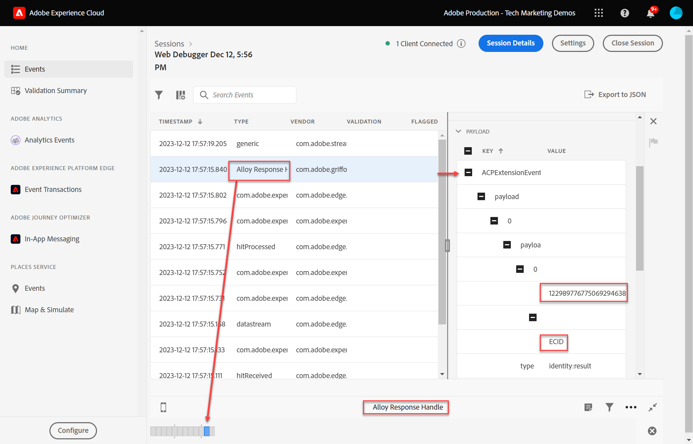

# 通过Experience Platform保证验证Web SDK实施

## 启动保证会话

Adobe Experience Platform Assurance是Adobe Experience Cloud的一个产品，可帮助您检查、验证、模拟和验证数据收集或提供体验的方式。

详细了解 [Adobe保证](https://experienceleague.adobe.com/docs/experience-platform/assurance/home.html?lang=en).

每次启用边缘跟踪时，都会在后台启动保证会话。

要查看保证会话，

1. 启用边缘跟踪后，您会在顶部看到一个传出链接图标。 选择图标以打开“保证”。 此时将在您的浏览器中打开一个新选项卡。

   

1. 选择带有称为“Adobe响应句柄”的事件的行。
1. 右侧将显示一个菜单。 选择 `+` 签名到 `[!UICONTROL ACPExtensionEvent]`
1. 通过选择 `[!UICONTROL payload > 0 > payload > 0 > namespace]`. 显示在最后一个 `0` 对应于 `ECID`. 根据以下显示的值，您知道 `namespace` 匹配 `ECID`

   

   >[!CAUTION]
   >
   >由于窗口宽度，您可能会看到截断的ECID值。 只需选择界面中的手柄栏并向左拖动即可查看整个ECID。

在将来的课程中，您可以使用Assurance验证完全处理的负载，这些负载将到达在数据流中启用的Adobe应用程序。

现在，通过在页面上触发XDM对象，并了解如何验证您的数据收集，您便可以使用Platform Web SDK设置单独的Adobe应用程序。