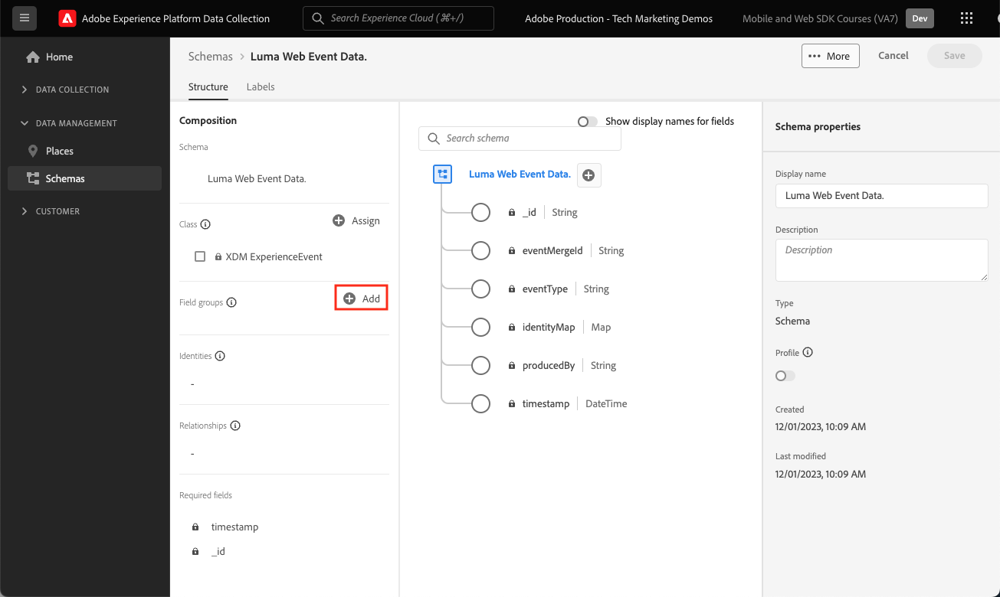

# 为Web数据创建XDM架构

了解如何在 Adobe Experience Platform 数据收集界面中为 Web 数据创建 XDM 架构。

体验数据模型(XDM)架构是在Adobe Experience Platform中收集数据的构建块、原则和最佳实践。

Platform Web SDK使用您的架构来标准化Web事件数据，将其发送到Platform Edge Network，并最终将数据转发到数据流中配置的任何Experience Cloud应用程序。 此步骤至关重要，因为它定义了将客户体验数据摄取到Experience Platform所需的标准数据模型，并支持基于这些标准构建的下游服务和应用程序。

>[!NOTE]
>
>使用Web SDK实施Adobe Analytics、Adobe Target或Adobe Audience Manager时，_不需要XDM架构_（数据可以在`data`对象中传递，而不是稍后看到的`xdm`对象中传递）。 对于平台原生应用程序(如Journey Optimizer、Real-Time Customer Data Platform、Customer Journey Analytics)的最高性能实施，需要XDM架构。 虽然您可以决定不在自己的实施中使用XDM架构，但您应在本教程中这样做。

## 为什么要为数据建模？

企业有自己的语言来沟通自己的领域。 汽车经销商处理厂家、型号和汽缸。 航空公司负责航班号、服务等级和座位安排。 其中一些术语是特定公司所独有的，一些术语在垂直行业中共享，一些术语几乎在所有企业中都共享。 对于在垂直行业甚至更广的行业中共享的术语，当您以通用方式命名和构建这些术语时，可以开始使用您的数据执行强大的操作。

例如，许多企业处理订单。 如果这些企业集体决定以类似的方式为订单建模，结果会怎样？ 例如，如果数据模型包含一个对象，该对象具有表示订单总价的`priceTotal`属性，该怎么办？ 如果此对象还具有名为`currencyCode`和`purchaseOrderNumber`的属性，该怎么办？ order对象可能包含名为`payments`的属性，该属性将是付款对象的数组。 每个对象将代表订单的付款。 例如，客户可能使用礼品卡支付部分订单，而使用信用卡支付部分订单。 您可以开始构建类似于下面的模型：

```json
{
  "order": {
    "priceTotal": 89.50,
    "currencyCode": "EUR",
    "purchaseOrderNumber": "JWN20192388410012",
    "payments": [
      {
        "paymentType": "gift_card",
        "paymentAmount": 50
      },
      {
        "paymentType": "credit_card",
        "paymentAmount": 39.50
      }
    ]
  }
}
```

如果所有处理订单的企业都决定以一致的方式为订单数据建模，并采用业内通用的术语，那么奇迹般的事情可能就会开始发生。 信息可以在您的组织内外的交流更加流畅，而不是不断地解释和翻译数据（ prop和evar ，任何人？ ）。 机器学习可以更轻松地了解数据&#x200B;_的含义_&#x200B;并提供可操作分析。 用于呈现相关数据的用户界面可以变得更加直观。 您的数据可以与遵循相同建模的合作伙伴和供应商无缝集成。

这是Adobe的[体验数据模型](https://business.adobe.com/products/experience-platform/experience-data-model.html)的目标。 XDM为行业中常见的数据提供规范性建模，同时允许您扩展模型以满足特定需求。 Adobe Experience Platform是围绕XDM构建的，因此，发送到Experience Platform的数据需要位于XDM中。 您无需考虑在将数据发送到Experience Platform之前可以在何处以及如何将当前数据模型转换为XDM，而是可以考虑在整个组织中更普遍地采用XDM，以便几乎不需要进行翻译。


>[!NOTE]
>
> 出于演示目的，本课程中的练习构建了一个示例架构，用于捕获客户在[Luma演示站点](https://luma.enablementadobe.com/content/luma/us/en.html)中查看的内容和购买的产品。 虽然您可以使用这些步骤创建不同的架构以满足您自己的目的，但建议您首先在创建示例架构的同时学习架构编辑器的功能。

要了解有关XDM架构的更多信息，请观看播放列表[使用XDM对您的客户体验数据进行建模](https://experienceleague.adobe.com/en/playlists/experience-platform-model-your-customer-experience-data-with-xdm)，或查看[XDM系统概述](https://experienceleague.adobe.com/en/docs/experience-platform/xdm/home)。

## 学习目标

在本课程结束后，您将能够：

* 从数据收集界面中创建XDM架构
* 将字段组添加到XDM架构
* 使用最佳实践为Web事件数据创建XDM架构

## 先决条件

[概述](overview.md)页面上介绍了数据收集和Adobe Experience Platform的所有必要设置和用户权限。

## 创建 XDM 架构

XDM架构是描述Experience Platform中数据的标准方式，允许与架构匹配的所有数据在组织内重复使用，而不会产生冲突，甚至可以在多个组织之间共享。 若要了解详细信息，请参阅架构组合的[基础知识](https://experienceleague.adobe.com/en/docs/experience-platform/xdm/schema/composition)。

在本练习中，您将使用建议的基线字段组创建一个XDM架构，用于捕获[Luma演示站点](https://luma.enablementadobe.com/content/luma/us/en.html){target="_blank"}上的Web事件数据：

1. 打开[数据收集接口](https://experience.adobe.com/data-collection/){target="_blank"}
1. 确保您在正确的沙盒中。 在右上角找到沙盒

   >[!NOTE]
   >
   >如果您是基于Platform的应用程序(如Real-Time CDP或Journey Optimizer)的客户，我们建议您在本教程中使用开发沙盒。 如果不是，请使用&#x200B;**[!UICONTROL Prod]**&#x200B;沙盒。

1. 在左侧导航中转到&#x200B;**[!UICONTROL 架构]**
1. 选择右上方的&#x200B;**[!UICONTROL 创建架构]**&#x200B;按钮

   
1. 在以下屏幕中选择&#x200B;**[!UICONTROL 体验事件]**
1. 选择&#x200B;**[!UICONTROL 下一步]**

   

1. 在&#x200B;**[!UICONTROL 架构显示名称]**&#x200B;字段中输入架构的名称，在本例中为`Luma Web Event Data`

   >[!TIP]
   >
   >XDM架构的常见命名惯例是按数据源命名架构。


1. 选择完成

   

## 添加字段组

如前所述，XDM是通过提供在下游Adobe Experience Platform服务中使用的通用结构和定义来标准化客户体验数据的核心框架。 通过遵守XDM标准，可以将&#x200B;_所有客户体验数据_&#x200B;合并到通用表示中。 通过这种方法，您可以从客户操作中获得有价值的见解，通过区段定义客户受众，并使用来自多个来源的数据表示客户属性以进行个性化。 有关详细信息，请参阅[数据建模的最佳实践](https://experienceleague.adobe.com/en/docs/experience-platform/xdm/schema/best-practices)。

如果可能，建议使用现有字段组并遵守与产品无关的模型和命名约定。 对于特定于您的组织、不适合上述预定义字段组的任何数据，您可以创建自定义字段组。 有关自定义架构的更多详细步骤，请参阅[使用架构编辑器创建架构](https://experienceleague.adobe.com/en/docs/experience-platform/xdm/tutorials/create-schema-ui#create)。

>[!TIP]
> 
>在本练习中，您将为Web数据收集添加推荐的预定义字段组：_&#x200B;**[!UICONTROL AEP Web SDK ExperienceEvent]**&#x200B;_&#x200B;和&#x200B;_&#x200B;**[!UICONTROL 使用者体验事件]**&#x200B;_。
>


1. 在&#x200B;**[!UICONTROL 字段组]**&#x200B;部分中，选择&#x200B;**[!UICONTROL 添加]**

   

1. 搜索[!UICONTROL `AEP Web SDK ExperienceEvent`]
1. 选中框
1. 搜索[!UICONTROL `Consumer Experience Event`]
1. 选中框
1. 选择&#x200B;**[!UICONTROL 添加字段组]**

   

对于这两个字段组，请注意，您有权访问Web上数据收集所需的最常用键值对。 在基于平台的应用程序的区段生成器界面中，营销人员可以看到每个字段的[!UICONTROL 显示名称]，您可以根据需要更改标准字段的显示名称。 您还可以删除不需要的字段。 单击任一字段组名称时，界面会突出显示属于它的键值对分组。 在以下示例中，您看到哪些字段属于&#x200B;**[!UICONTROL 使用者体验事件]**。


这个课程只是一个起点。 在构建您自己的Web事件架构时，您必须探索并记录您的业务要求。 此过程类似于为Adobe Analytics实施创建[业务需求文档](https://experienceleague.adobe.com/en/docs/analytics-learn/tutorials/implementation/implementation-basics/creating-a-business-requirements-document)和[解决方案设计参考](https://experienceleague.adobe.com/en/docs/analytics-learn/tutorials/implementation/implementation-basics/creating-and-maintaining-an-sdr)，但应包括对&#x200B;_所有下游数据收件人_&#x200B;的需求，例如平台、Target和事件转发目标。


### identityMap对象

有一个特殊字段用于标识Web用户，称为`[!UICONTROL identityMap]`。


它是任何与Web相关的数据收集所必需的Object，因为它包含识别Web上的用户所需的Experience Cloud ID。 此外，它还是为经过身份验证的用户设置内部客户ID的关键。 `[!UICONTROL identityMap]`将在[配置身份](configure-identities.md)课程中详细讨论。 它自动包含在使用&#x200B;**[!UICONTROL XDM ExperienceEvent]**&#x200B;类的所有架构中。


>[!IMPORTANT]
>
> 在保存架构之前，可以为架构启用&#x200B;**[!UICONTROL 配置文件]**。 **此时不要**&#x200B;启用它。 为配置文件启用架构后，如果不重置整个沙盒，则无法禁用或删除该架构。 此时也无法从架构中删除字段，但可以[弃用UI中的字段](https://experienceleague.adobe.com/en/docs/experience-platform/xdm/tutorials/field-deprecation-ui#deprecate)。 在生产环境中使用您自己的数据时，请务必牢记这些含义。
>
>
>此设置将在[设置Experience Platform](setup-experience-platform.md)课程中详细讨论。
>&#x200B;>

要完成本课程，请选择右上方的&#x200B;**[!UICONTROL 保存]**。


现在，在将Web SDK扩展添加到标记属性时，您可以引用此架构。

>[!NOTE]
>
>感谢您投入时间学习Adobe Experience Platform Web SDK。 如果您有疑问、希望分享一般反馈或有关于未来内容的建议，请在此[Experience League社区讨论帖子](https://experienceleaguecommunities.adobe.com/t5/adobe-experience-platform-data/tutorial-discussion-implement-adobe-experience-cloud-with-web/td-p/444996)上分享这些内容
