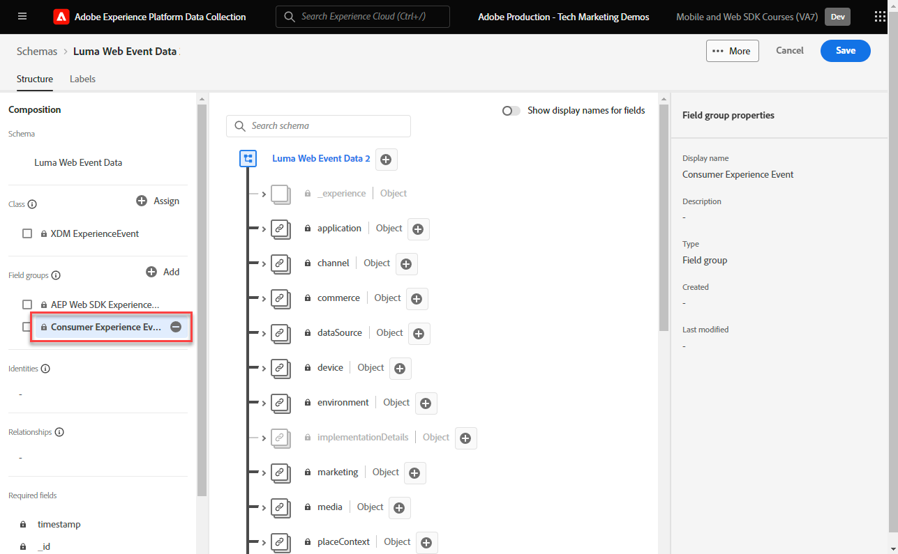
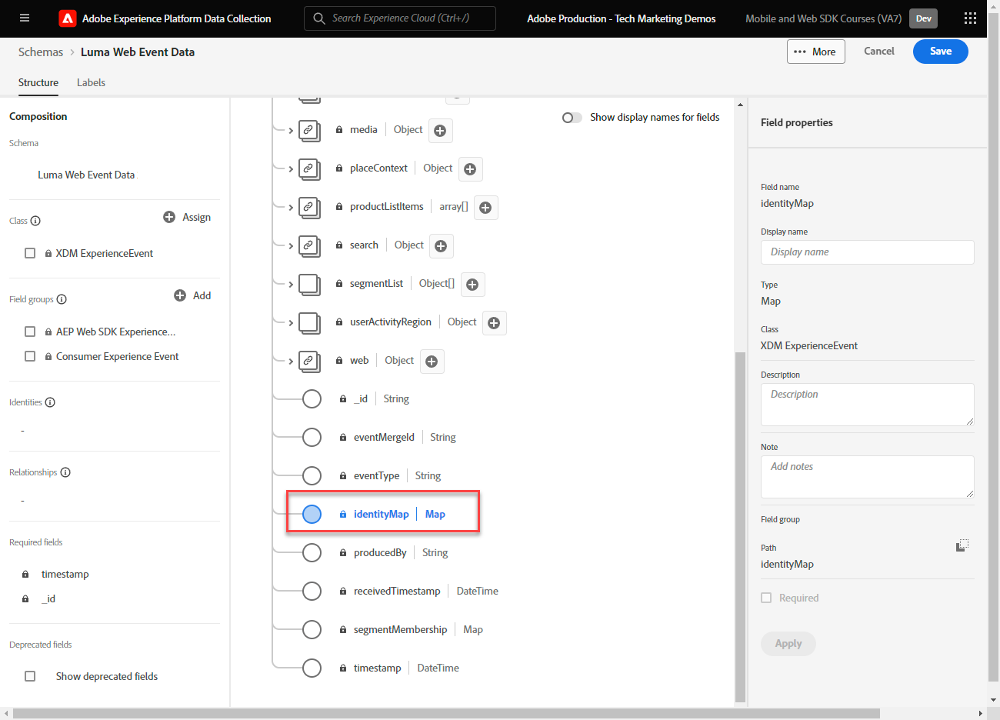

# 为Web数据创建XDM架构

了解如何在Adobe Experience Platform数据收集界面中为Web数据创建XDM架构。

体验数据模型(XDM)架构是在Adobe Experience Platform中收集数据的构建块、原则和最佳实践。

Platform Web SDK使用您的架构来标准化Web事件数据，将其发送到PlatformEdge Network，并最终将数据转发到数据流中配置的任何Experience Cloud应用程序。 此步骤至关重要，因为它定义了将客户体验数据提取到Experience Platform中所需的标准数据模型，并支持基于这些标准构建的下游服务和应用程序。

## 为什么要为数据建模？

企业有自己的语言来沟通自己的领域。 汽车经销商处理厂家、型号和汽缸。 航空公司负责航班号、服务等级和座位安排。 其中一些术语是特定公司所独有的，一些术语在垂直行业中共享，一些术语几乎在所有企业中都共享。 对于在垂直行业甚至更广的行业中共享的术语，当您以通用方式命名和构建这些术语时，可以开始使用您的数据执行强大的操作。

例如，许多企业处理订单。 如果这些企业集体决定以类似的方式为订单建模，结果会怎样？ 例如，如果数据模型包含一个对象，且该对象具有 `priceTotal` 代表订单总价的属性？ 如果该对象还具有名为的属性，该怎么办 `currencyCode` 和 `purchaseOrderNumber`？ order对象可能包含名为的属性 `payments` 那将是一系列付款对象。 每个对象将代表订单的付款。 例如，客户可能使用礼品卡支付部分订单，而使用信用卡支付部分订单。 您可以开始构建类似于下面的模型：

```json
{
  "order": {
    "priceTotal": 89.50,
    "currencyCode": "EUR",
    "purchaseOrderNumber": "JWN20192388410012",
    "payments": [
      {
        "paymentType": "gift_card",
        "paymentAmount": 50
      },
      {
        "paymentType": "credit_card",
        "paymentAmount": 39.50
      }
    ]
  }
}
```

如果所有处理订单的企业都决定以一致的方式为订单数据建模，并采用业内通用的术语，那么奇迹般的事情可能就会开始发生。 信息可以在您的组织内外的交流更加流畅，而不是不断地解释和翻译数据（ prop和evar ，任何人？ ）。 机器学习可以更轻松地了解您的数据 _方法_ 并提供切实可行的见解。 用于呈现相关数据的用户界面可以变得更加直观。 您的数据可以与遵循相同建模的合作伙伴和供应商无缝集成。

这是Adobe的目标 [体验数据模型](https://business.adobe.com/products/experience-platform/experience-data-model.html). XDM为行业中常见的数据提供规范性建模，同时允许您扩展模型以满足特定需求。 Adobe Experience Platform是围绕XDM构建的，因此，发送到Experience Platform的数据需要采用XDM格式。 您无需考虑在将数据发送到Experience Platform之前可以在何处以及如何将当前数据模型转换为XDM，而是可以更普遍地在整个组织中采用XDM，以便几乎不需要进行翻译。


>[!NOTE]
>
> 出于演示目的，本课程中的练习构建了一个示例架构，用于捕获客户在中查看的内容和购买的产品。 [Luma演示站点](https://luma.enablementadobe.com/content/luma/us/en.html). 虽然您可以使用这些步骤创建不同的架构以满足您自己的目的，但建议您首先在创建示例架构的同时学习架构编辑器的功能。

要了解有关XDM架构的更多信息，请参加课程 [使用XDM对您的客户体验数据进行建模](https://experienceleague.adobe.com/?recommended=ExperiencePlatform-D-1-2021.1.xdm) 或查看 [XDM系统概述](https://experienceleague.adobe.com/en/docs/experience-platform/xdm/home).

## 学习目标

在本课程结束后，您将能够：

* 从数据收集界面中创建XDM架构
* 将字段组添加到XDM架构
* 使用最佳实践为Web事件数据创建XDM架构

## 先决条件

有关数据收集和Adobe Experience Platform的所有必要配置和用户权限，请参见 [概述](overview.md) 页面。

## 创建 XDM 架构

XDM架构是描述Experience Platform数据的标准方式，允许与架构匹配的所有数据在组织内重复使用，而不会产生冲突，甚至可以在多个组织之间共享。 要了解更多信息，请参阅 [架构组合基础](https://experienceleague.adobe.com/en/docs/experience-platform/xdm/schema/composition).

在本练习中，您将使用建议的基线字段组创建一个XDM架构，以便捕获 [Luma演示站点](https://luma.enablementadobe.com/content/luma/us/en.html){target="_blank"}：

1. 打开 [数据收集界面](https://launch.adobe.com/){target="_blank"}
1. 确保您在正确的沙盒中。 在右上角找到沙盒

   >[!NOTE]
   >
   >如果您是基于Platform的应用程序(如Real-Time CDP或Journey Optimizer)的客户，我们建议您在本教程中使用开发沙盒。 如果不是，请使用 **[!UICONTROL Prod]** 沙盒。

1. 转到 **[!UICONTROL 架构]** 在左侧导航中
1. 选择 **[!UICONTROL 创建架构]** 右上角的按钮

   
1. 选择 **[!UICONTROL 体验事件]** 在下面的屏幕中
1. 选择 **[!UICONTROL 下一个]**

   

1. 在以下位置输入架构的名称： **[!UICONTROL 架构显示名称]** 字段，在此例中 `Luma Web Event Data`

   >[!TIP]
   >
   >XDM架构的常见命名惯例是按数据源命名架构。


1. 选择完成

   

## 添加字段组

如前所述，XDM是通过提供在下游Adobe Experience Platform服务中使用的通用结构和定义来标准化客户体验数据的核心框架。 通过遵守XDM标准， _所有客户体验数据_ 可以并入共同表示法中。 通过这种方法，您可以从客户操作中获得有价值的见解，通过区段定义客户受众，并使用来自多个来源的数据表示客户属性以进行个性化。 请参阅 [数据建模的最佳实践](https://experienceleague.adobe.com/en/docs/experience-platform/xdm/schema/best-practices) 以了解更多信息。

如果可能，建议使用现有字段组并遵守与产品无关的模型和命名约定。 对于特定于您的组织、不适合上述预定义字段组的任何数据，您可以创建自定义字段组。 请参阅 [使用架构编辑器创建架构](https://experienceleague.adobe.com/en/docs/experience-platform/xdm/tutorials/create-schema-ui#create) 有关自定义架构的更多详细步骤。

>[!TIP]
> 
>在本练习中，您将为Web数据收集添加推荐的预定义字段组： _**[!UICONTROL AEP Web SDK ExperienceEvent]**_ 和 _**[!UICONTROL 使用者体验事件]**_.
>
>
> 如果您仅实施 **Adobe Analytics** 使用Web SDK，并且不向发送任何数据 **Experience Platform**，使用 [!UICONTROL Adobe Analytics ExperienceEvent模板] 字段组以定义XDM架构。 此函数用于 [设置Analytics](setup-analytics.md) 上课。

1. 在 **[!UICONTROL 字段组]** 部分，选择 **[!UICONTROL 添加]**

   

1. 搜索 [!UICONTROL `AEP Web SDK ExperienceEvent`]
1. 选中框
1. 搜索 [!UICONTROL `Consumer Experience Event`]
1. 选中框
1. 选择 **[!UICONTROL 添加字段组]**

   

对于这两个字段组，请注意，您有权访问Web上数据收集所需的最常用键值对。 此 [!UICONTROL 显示名称] 的区段生成器界面中向营销人员显示的每个字段的显示名称，您可以根据自己的需求更改标准字段的显示名称。 您还可以删除不需要的字段。 单击任一字段组名称时，界面会突出显示属于它的键值对分组。 在下面的示例中，您可以看到哪些字段属于 **[!UICONTROL 使用者体验事件]**.



这个课程只是一个起点。 在构建您自己的Web事件架构时，您必须探索并记录您的业务要求。 此过程与创建 [业务要求文档](https://experienceleague.adobe.com/en/docs/analytics-learn/tutorials/implementation/implementation-basics/creating-a-business-requirements-document) 和 [解决方案设计参考](https://experienceleague.adobe.com/en/docs/analytics-learn/tutorials/implementation/implementation-basics/creating-and-maintaining-an-sdr) 适用于Adobe Analytics实施，但应包括以下要求 _所有下游数据收件人_ 例如，平台、Target和事件转发目标。


### identityMap对象

有一个特殊字段用于识别Web用户，其名称为 `[!UICONTROL identityMap]`.



它是任何与Web相关的数据收集所必需的Experience Cloud对象，因为它包含识别Web上的用户所需的用户ID。 此外，它还是为经过身份验证的用户设置内部客户ID的关键。 `[!UICONTROL identityMap]` 在中详细讨论 [配置身份](configure-identities.md) 上课。 它自动包含在使用 **[!UICONTROL XDM ExperienceEvent]** 类。


>[!IMPORTANT]
>
> 可以启用 **[!UICONTROL 个人资料]** ，然后再保存架构。 **不要** 此时启用它。 为配置文件启用架构后，如果不重置整个沙盒，则无法禁用或删除该架构。 此时也无法从架构中删除字段，但可以 [弃用用户界面中的字段](https://experienceleague.adobe.com/en/docs/experience-platform/xdm/tutorials/field-deprecation-ui#deprecate). 在生产环境中使用您自己的数据时，请务必牢记这些含义。
>
>
>此设置将在以下过程中详细讨论 [设置Experience Platform](setup-experience-platform.md) 上课。
>

要完成本课程，请选择 **[!UICONTROL 保存]** 在右上角。


现在，在将Web SDK扩展添加到标记属性时，您可以引用此架构。


[下一步： ](configure-identities.md)

>[!NOTE]
>
>感谢您投入时间学习Adobe Experience Platform Web SDK。 如果您有疑问、希望分享一般反馈或有关于未来内容的建议，请在此共享它们 [Experience League社区讨论帖子](https://experienceleaguecommunities.adobe.com/t5/adobe-experience-platform-data/tutorial-discussion-implement-adobe-experience-cloud-with-web/td-p/444996)
