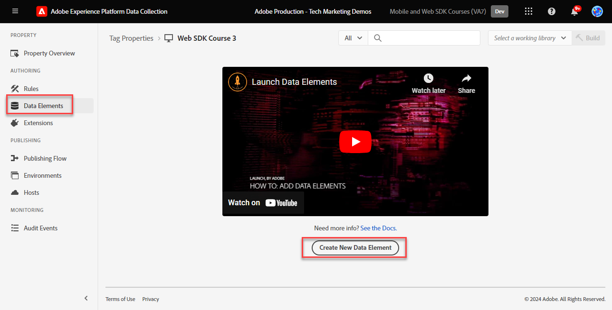
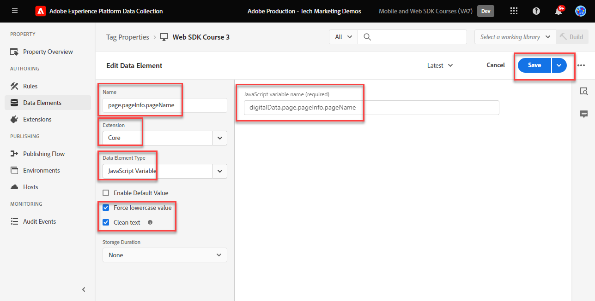

# 创建数据元素

了解如何在[Luma演示网站](https://luma.enablementadobe.com/content/luma/us/en.html)上的内容、商业和身份数据的标记中创建数据元素。 然后，使用Adobe Experience Platform Web SDK扩展Variable数据元素类型填充XDM架构中的字段。


>[!WARNING]
>
> 本教程中使用的Luma网站预计将在2026年2月16日这一周内被替换。 作为本教程的一部分完成的工作可能不适用于新网站。

## 学习目标

在本课程结束时，您能够：

* 了解将数据层映射到XDM的不同方法
* 创建数据元素以捕获数据
* 将数据元素映射到XDM对象


## 先决条件

您已了解数据层是什么，并完成了本教程中之前的课程：

* [配置XDM架构](configure-schemas.md)
* [配置身份命名空间](configure-identities.md)
* [配置数据流](configure-datastream.md)
* [Web SDK扩展安装在标记属性中](install-web-sdk.md)


>[!IMPORTANT]
>
>本课程的数据来自Luma网站上的`[!UICONTROL digitalData]`数据层。 要查看数据层，请打开您的开发人员控制台并键入`[!UICONTROL digitalData]`，以查看完整可用的数据层。


## 数据层方法

使用Adobe Experience Platform的标记功能，可通过多种方式将数据从数据层映射到XDM。 以下是三种不同方法的一些优点和缺点。 如果需要，可以合并方法：

1. 在数据层中实施XDM
1. 在标记中映射到XDM
1. 在数据流中映射到XDM

>[!NOTE]
>
>本教程中的示例遵循标记中映射到XDM的方法。


### 在数据层中实施XDM

此方法涉及使用完全定义的XDM对象作为数据层的结构。 然后，将整个数据层映射到标记中的XDM对象数据元素。 如果您的实施不使用标签管理器，则此方法可能比较理想，因为您可以使用[XDM sendEvent命令](https://experienceleague.adobe.com/en/docs/experience-platform/edge/fundamentals/tracking-events#sending-xdm-data)直接从应用程序向XDM发送数据。 如果您确实使用标记，则可以创建一个自定义代码数据元素，它将整个数据层作为传递到XDM的JSON对象进行捕获。 然后，将传递JSON映射到发送事件操作中的XDM对象字段。

以下是使用Adobe客户端数据层格式时数据层的外观示例：

+++数据层中的XDM示例

```JSON
window.adobeDataLayer.push({
"eventType": "web.webPageDetails.pageViews",
"web":{
         "webInteraction":{
            "linkClicks":{
               "id":"",
               "value":""
            },
            "URL":"",
            "name":"",
            "region":"",
            "type":""
         },
         "webPageDetails":{
            "pageViews":{
               "id":"",
               "value":"1"
            },
            "URL":"https://luma.enablementadobe.com/",
            "isErrorPage":"",
            "isHomePage":"",
            "name":"luma:home",
            "server":"enablementadobe.com",
            "siteSection":"home",
            "viewName":""
         },
         "webReferrer":{
            "URL":"",
            "type":""
         }
      }
});
```

+++

优点

* 无需重新映射到数据层变量到XDM的其他步骤
* 如果您的Web开发团队也拥有标记数字行为，则部署可能会更快

缺点

* 完全依靠开发团队和开发周期来更新要传输到XDM的数据
* XDM从数据层接收确切的有效负载时灵活性有限
* 无法使用内置标记功能（例如刮擦功能、持久性功能和快速部署功能）
* 将数据层用于第三方像素更困难(但您可能希望将这些像素移动到[事件转发](setup-event-forwarding.md)！
* 无法转换数据层和XDM之间的数据

### 在标记中映射数据层

此方法包括将单独的数据层变量或数据层对象映射到标记中的数据元素，并最终映射到XDM。 这是使用标签管理系统实施的传统方法。

#### 优点

* 最灵活的方法，因为您可以控制单个变量并在数据进入XDM之前转换数据
* 可以使用Adobe标记触发器和刮取功能将数据传递到XDM
* 可以将数据元素映射到客户端的第三方像素

#### 缺点

* 将数据层重构为数据元素需要时间


>[!TIP]
>
> Google Data Layer
> 
> 如果贵组织已使用Google Analytics，并且网站上具有传统的Google数据层对象，则可以在标记中使用[Google数据层扩展](https://experienceleague.adobe.com/en/docs/experience-platform/tags/extensions/client/google-data-layer/overview)。 这样，您就可以更快地部署Adobe技术，而无需请求IT团队提供支持。 将Google数据层映射到XDM将遵循与上述相同的步骤。

### 在数据流中映射到XDM

此方法使用名为[数据收集](https://experienceleague.adobe.com/en/docs/experience-platform/datastreams/data-prep)的数据准备的数据流配置中内置的功能，并跳过将数据层变量映射到标记中的XDM。

#### 优点

* 灵活，因为您可以将各个变量映射到XDM
* 能够在数据层转到XDM之前[计算新值](https://experienceleague.adobe.com/en/docs/experience-platform/data-prep/functions)或[转换数据类型](https://experienceleague.adobe.com/en/docs/experience-platform/data-prep/data-handling)
* 利用[映射UI](https://experienceleague.adobe.com/en/docs/experience-platform/datastreams/data-prep#create-mapping)，通过点击式UI将源数据中的字段映射到XDM

#### 缺点

* 不能将数据层变量用作客户端第三方像素的数据元素，但可以将它们用于事件转发
* 无法使用Adobe Experience Platform的标记功能的刮擦功能
* 如果在标记和数据流中同时映射数据层，则维护复杂性会增加


>[!IMPORTANT]
>
>如前所述，本教程中的示例遵循标记中映射到XDM的方法。

## 创建数据元素以捕获数据层

在创建XDM对象之前，请为[Luma演示站点](https://luma.enablementadobe.com/content/luma/us/en.html){target="_blank"}数据层创建以下数据元素集：

1. 转到&#x200B;**[!UICONTROL 数据元素]**&#x200B;并选择&#x200B;**[!UICONTROL 添加数据元素]**（或者&#x200B;**[!UICONTROL 新建数据元素]**，如果标记属性中没有现有的数据元素）

   

1. 将数据元素命名为 `page.pageInfo.pageName`
1. 使用&#x200B;**[!UICONTROL JavaScript变量]** **[!UICONTROL 数据元素类型]**&#x200B;指向Luma数据层中的一个值： `digitalData.page.pageInfo.pageName`

1. 选中&#x200B;**[!UICONTROL 强制小写值]**&#x200B;和&#x200B;**[!UICONTROL 清除文本]**&#x200B;复选框，以使大小写标准化，并删除无关空格

1. 将`None`保留为&#x200B;**[!UICONTROL 存储持续时间]**&#x200B;设置，因为此值在每个页面上都不相同

1. 选择&#x200B;**[!UICONTROL 保存]**

   

按照以下相同步骤创建这些附加数据元素：

* **`page.pageInfo.server`**&#x200B;映射到
  `digitalData.page.pageInfo.server`

* **`page.pageInfo.hierarchie1`**&#x200B;映射到
  `digitalData.page.pageInfo.hierarchie1`

* **`user.profile.attributes.username`**&#x200B;映射到
  `digitalData.user.0.profile.0.attributes.username`

* **`user.profile.attributes.loggedIn`**&#x200B;映射到
  `digitalData.user.0.profile.0.attributes.loggedIn`

* **`product.productInfo.sku`**&#x200B;映射到`digitalData.product.0.productInfo.sku`
<!--digitalData.product.0.productInfo.sku
    ```javascript
    var cart = digitalData.product;
    var cartItem;
    cart.forEach(function(item){
    cartItem = item.productInfo.sku;
    });
    return cartItem;
    ```
    -->
* **`product.productInfo.title`**&#x200B;映射到`digitalData.product.0.productInfo.title`
* **`cart.orderId`**&#x200B;映射到`digitalData.cart.orderId`
<!--
    ```javascript
    var cart = digitalData.product;
    var cartItem;
    cart.forEach(function(item){
    cartItem = item.productInfo.title;
    });
    return cartItem;
    ```
    -->
* **`product.category`**&#x200B;使用&#x200B;**[!UICONTROL 自定义代码]** **[!UICONTROL 数据元素类型]**&#x200B;和以下自定义代码来解析顶级类别的网站URL：

  ```javascript
  var cat = location.pathname.split(/[/.]+/);
  if (cat[5] == 'products') {
     return (cat[6]);
  } else if (cat[5] != 'html') { 
     return (cat[5]);
  }
  ```

* **`cart.productInfo`**&#x200B;使用以下自定义代码：

  ```javascript
  var cart = digitalData.cart.cartEntries; 
  var cartItem = [];
  cart.forEach(function(item, index, array){
  cartItem.push({
  "SKU": item.sku
  });
  });
  return cartItem; 
  ```

* **`cart.productInfo.purchase`**&#x200B;使用以下自定义代码：

  ```javascript
  var cart = digitalData.cart.cartEntries; 
  var cartItem = [];
  cart.forEach(function(item, index, array){
  var qty = parseInt(item.qty);
  var price = parseInt(item.price);
  cartItem.push({
  "SKU": item.sku,
  "quantity": qty,
  "priceTotal": price
  });
  });
  return cartItem; 
  ```


>[!CAUTION]
>
>[!UICONTROL JavaScript变量]数据元素类型将数组引用视为圆点，而不是括号，因此将用户名数据元素引用为`digitalData.user[0].profile[0].attributes.username` **将不起作用**。

## 为XDM和数据对象创建变量数据元素

您刚刚创建的数据元素将用于构建XDM对象（适用于Platform应用程序）和数据对象(适用于Analytics、Target和Audience Manager)。 这些对象具有自己的特殊数据元素，称为&#x200B;**[!UICONTROL 变量]**&#x200B;数据元素，这些数据元素非常易于创建。

要为XDM创建Variable数据元素，请将其绑定到您在[配置架构](configure-schemas.md)课程中创建的架构：

1. 选择&#x200B;**[!UICONTROL 添加数据元素]**
1. 命名您的数据元素`xdm.variable.content`。 建议您为特定于XDM的数据元素添加“xdm”前缀，以便更好地组织标记属性
1. 选择&#x200B;**[!UICONTROL Adobe Experience Platform Web SDK]**&#x200B;作为&#x200B;**[!UICONTROL 扩展]**
1. 选择&#x200B;**[!UICONTROL 变量]**&#x200B;作为&#x200B;**[!UICONTROL 数据元素类型]**
1. 选择&#x200B;**[!UICONTROL XDM]**&#x200B;作为&#x200B;**[!UICONTROL 属性]**
1. 选择您创建架构的&#x200B;**[!UICONTROL 沙盒]**
1. 选择适当的&#x200B;**[!UICONTROL 架构]**，在本例中为`Luma Web Event Data`
1. 选择&#x200B;**[!UICONTROL 保存]**

   XDM变量数据元素

接下来，为数据对象创建变量数据元素：

1. 选择&#x200B;**[!UICONTROL 添加数据元素]**
1. 命名您的数据元素`data.variable`。 建议您在数据对象的特定数据元素中添加“data”作为前缀，以更好地组织标记属性
1. 选择&#x200B;**[!UICONTROL Adobe Experience Platform Web SDK]**&#x200B;作为&#x200B;**[!UICONTROL 扩展]**
1. 选择&#x200B;**[!UICONTROL 变量]**&#x200B;作为&#x200B;**[!UICONTROL 数据元素类型]**
1. 选择&#x200B;**[!UICONTROL 数据]**&#x200B;作为&#x200B;**[!UICONTROL 属性]**
1. 在本教程中，选择要实施的Experience Cloud解决方案
1. 选择&#x200B;**[!UICONTROL 保存]**

   


在这些步骤结束时，您应该创建以下数据元素：

| 核心扩展数据元素 | Platform Web SDK扩展数据元素 |
-----------------------------|-------------------------------
| `cart.orderId` | `data.variable` |
| `cart.productInfo` | `xdm.variable.content` |
| `cart.productInfo.purchase` | |
| `page.pageInfo.hierarchie1` | |
| `page.pageInfo.pageName` | |
| `page.pageInfo.server` | |
| `product.category` | |
| `product.productInfo.sku` | |
| `product.productInfo.title` | |
| `user.profile.attributes.loggedIn` | |
| `user.profile.attributes.username` | |

>[!TIP]
>
>在将来的[创建标记规则](create-tag-rule.md)课程中，您将了解&#x200B;**[!UICONTROL 变量]**&#x200B;数据元素如何允许您使用&#x200B;**[!UICONTROL 更新变量操作类型]**&#x200B;栈叠标记中的多个规则。

设置这些数据元素后，您就可以开始使用标记规则将数据发送到Platform Edge Network。 但首先，了解如何使用Web SDK收集身份。

>[!NOTE]
>
>感谢您投入时间学习Adobe Experience Platform Web SDK。 如果您有疑问、希望分享一般反馈或有关于未来内容的建议，请在此[Experience League社区讨论帖子](https://experienceleaguecommunities.adobe.com/t5/adobe-experience-platform-data/tutorial-discussion-implement-adobe-experience-cloud-with-web/td-p/444996)上分享这些内容
