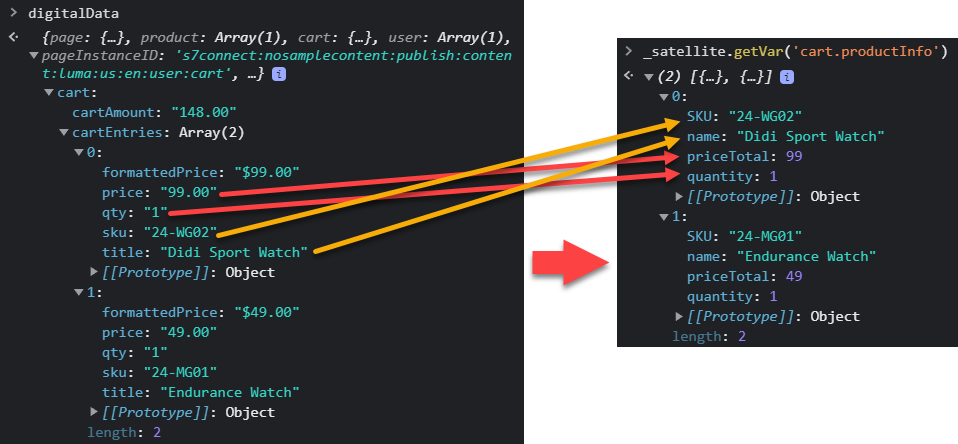
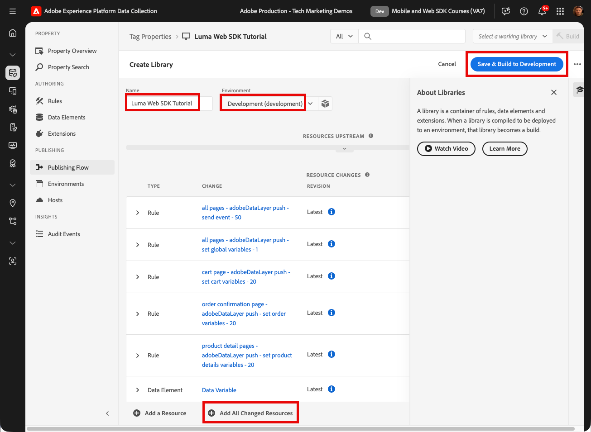

# 创建标记规则

了解如何使用标记规则将事件发送到Adobe Experience Platform Edge Network。 标记规则是事件、条件和操作的组合，用于告知标记属性执行一些操作。 使用Platform Web SDK时，可以使用规则将事件与正确的数据发送到Platform Edge Network。

## 学习目标

在本课程结束时，您能够：

* 使用命名惯例来管理标记中的规则
* 使用“更新变量”和“发送事件”操作，发送包含XDM字段的事件
* 跨多个规则栈叠多组XDM字段
* 将单个或整个数组数据元素映射到XDM对象
* 将标记规则发布到开发库

## 先决条件

您熟悉“数据收集”标记和[Luma演示网站](https://luma.enablementadobe.com)，并已完成本教程中以前的课程：

* [配置XDM架构](configure-schemas.md)
* [配置身份命名空间](configure-identities.md)
* [配置数据流](configure-datastream.md)
* [安装 Web SDK 扩展](install-web-sdk.md)
* [创建数据元素](create-data-elements.md)
* [捕获身份](create-identities.md)

## 命名约定

要管理标记中的规则，建议遵循标准命名约定。 本教程使用四部分命名约定：

* [**位置**] - [**事件**] - [**目的**] - [**订单**]

其中；

1. **location**&#x200B;是触发规则的网站上的一个或多个页面
1. **event**&#x200B;是规则的触发器
1. **purpose**&#x200B;是规则执行的主要操作
1. **order**&#x200B;是规则相对于共享相同事件的其他规则应触发的顺序
<!-- minor update -->

## 添加Adobe客户端数据层扩展

Luma网站使用事件驱动的数据层，称为Adobe客户端数据层(ACDL)。 每当发生数据层事件时，它都会被推送到`adobeDataLayer`数组中。 本教程使用名为Adobe Client Data Layer的标记扩展方便地挖掘这些事件来构建我们的规则。

要添加扩展，请执行以下操作：

1. 转到&#x200B;**[!UICONTROL 扩展]**
1. 筛选到&#x200B;**[!UICONTROL Adobe客户端数据层]**
1. 选择&#x200B;**[!UICONTROL 安装]**

   

1. 保留默认设置
1. 选择&#x200B;**[!UICONTROL 保存]**

>[!NOTE]
>
> 无需使用Adobe客户端数据层即可实施Experience Platform Web SDK。 标记实施中通常使用许多其他类型的事件（Library Loaded、DOM Ready、Window Loaded等）来触发规则。

## 创建标记规则

在标记中，规则用于执行各种操作，例如设置变量并在各种条件下触发网络调用。 Experience Platform Web SDK标记扩展包括规则中使用的两个操作：

* **[!UICONTROL 更新变量]**&#x200B;将数据元素映射到您的XDM或数据变量
* **[!UICONTROL 发送事件]**&#x200B;进行网络调用以将数据发送到Experience Platform Edge Network

在本课程的其余部分中，我们将：

1. 使用&#x200B;**[!UICONTROL 更新变量]**&#x200B;操作定义XDM字段的“全局配置”。

1. 再次使用&#x200B;**[!UICONTROL 更新变量]**&#x200B;操作可覆盖我们的“全局配置”，并在某些条件下（例如，在产品页面上添加产品详细信息）贡献额外的XDM字段。

1. 使用&#x200B;**[!UICONTROL 发送事件]**&#x200B;操作将数据发送到Adobe Experience Platform Edge Network。

所有这些规则将使用“[!UICONTROL 顺序]”选项正确排序。

此视频概述了此过程：

>[!VIDEO](https://video.tv.adobe.com/v/3427710/?learn=on&enablevpops)

### 全局配置字段

要为全局XDM字段创建标记规则：

1. 打开您在本教程中使用的标记属性

1. 在左侧导航中转到&#x200B;**[!UICONTROL 规则]**

1. 选择&#x200B;**[!UICONTROL 创建新规则]**&#x200B;按钮

   

1. 将规则命名为 `all pages - adobeDataLayer push - set global variables - 1`

1. 在&#x200B;**[!UICONTROL 事件]**&#x200B;部分中，选择&#x200B;**[!UICONTROL 添加]**

   

1. 使用&#x200B;**[!UICONTROL Adobe客户端数据层]**&#x200B;扩展并选择&#x200B;**[!UICONTROL 推送的数据]**&#x200B;作为&#x200B;**[!UICONTROL 事件类型]**

1. 选择&#x200B;**[!UICONTROL 高级]**&#x200B;下拉菜单并输入`1`作为&#x200B;**[!UICONTROL 顺序]**

   >[!NOTE]
   >
   > 订单编号越低，执行的时间就越早。 因此，我们给予“全球配置”一个较低的订单编号。

1. 收听&#x200B;**[!UICONTROL 所有活动]**
1. 选择&#x200B;**[!UICONTROL Keep Changes]**&#x200B;以返回主规则屏幕
   

1. 在&#x200B;**[!UICONTROL 操作]**&#x200B;部分中，选择&#x200B;**[!UICONTROL 添加]**

1. 作为&#x200B;**[!UICONTROL 扩展]**，请选择&#x200B;**[!UICONTROL Adobe Experience Platform Web SDK]**

1. 作为&#x200B;**[!UICONTROL 操作类型]**，请选择&#x200B;**[!UICONTROL 更新变量]**

1. 作为&#x200B;**[!UICONTROL 数据元素]**，选择您在`XDM Variable`创建数据元素[课程中创建的](create-data-elements.md)

   

1. 现在，通过将XDM字段映射到相应的值来指定XDM字段：

   | XDM字段 | 将映射到 |
   |---|---|
   | `eventType` | `Web Webpagedetails Page Views` （开始键入以查看建议值） |
   | `identityMap` | `Identity Map`数据元素 |
   | `web.webPageDetails.name` | `Page Name`数据元素 |
   | `web.webPageDetails.pageViews.value` | `1` |

   >[!TIP]
   >
   > 如果数据元素为空，则XDM字段将不会包含在网络请求中。 因此，当用户未经身份验证并且`Identity Map`数据元素为null时，将不会发送`identityMap`对象。 这就是为什么我们可以放心地在“全球配置”中定义它。

   >[!TIP]
   >
   > 设置`web.webPageDetails.pageViews.value`为指示其他下游应用程序的页面查看提供了一种标准方式。 Adobe Analytics不需要将网络调用作为页面查看进行处理。

1. 完成后，您的`XDM Variable`将类似于此。 请注意已填充和未完全填充的字段如何使用蓝色圆圈指示：
   
1. 选择&#x200B;**[!UICONTROL 保留更改]**，然后选择&#x200B;**[!UICONTROL 保存]**&#x200B;规则

### 产品页面字段

现在，在将XDM对象发送到&#x200B;**[!UICONTROL Platform Edge Network]**&#x200B;之前，开始在其他顺序规则中使用[!UICONTROL 更新变量]以扩充该对象。

>[!TIP]
>
>规则顺序确定在触发事件时首先运行的规则。 如果两个规则具有相同的事件类型，则顺序编号最低的规则将首先运行。
> 

首先在Luma的产品详细信息页面上跟踪产品查看：

1. 选择&#x200B;**[!UICONTROL 添加规则]**
1. 将其命名为[!UICONTROL `product detail pages - adobeDataLayer push - set product details variables - 20`]
1. 选择“事件”下的以添加新触发器
1. 在&#x200B;**[!UICONTROL 扩展]**&#x200B;下，选择&#x200B;**[!UICONTROL Adobe客户端数据层]**
1. 在&#x200B;**[!UICONTROL 事件类型]**&#x200B;下，选择&#x200B;**[!UICONTROL 推送的数据]**
1. 选择以打开&#x200B;**[!UICONTROL 高级选项]**，键入`20`。 此顺序值可确保规则在&#x200B;_全局变量规则_&#x200B;之后运行。
1. 收听&#x200B;**[!UICONTROL 特定事件]**
1. 输入`productView`作为&#x200B;**[!UICONTROL 要注册的]**&#x200B;事件/密钥
1. 选择&#x200B;**[!UICONTROL 保留更改]**

   

1. 在&#x200B;**[!UICONTROL 操作]**&#x200B;下，选择&#x200B;**[!UICONTROL 添加]**
1. 选择&#x200B;**[!UICONTROL Adobe Experience Platform Web SDK]**&#x200B;扩展
1. 选择&#x200B;**[!UICONTROL 操作类型]**&#x200B;作为&#x200B;**[!UICONTROL 更新变量]**
1. 选择`XDM Variable`作为&#x200B;**[!UICONTROL 数据元素]**
1. 将这些XDM字段映射到相应的值：

   | XDM字段 | 将映射到 |
   |---|---|
   | `eventType` | `Commerce Product Views` （开始键入以查看建议值） |
   | `commerce.productViews.value` | `1` |
   | `productListItems.name` | `Ecommerce Product Name`数据元素（选择&#x200B;**[!UICONTROL 提供单个项目]**&#x200B;和&#x200B;**[!UICONTROL 首先添加项目]**） |
   | `productListItems.sku` | `Ecommerce Product Id`数据元素 |

1. 选择&#x200B;**[!UICONTROL 保留更改]**

1. 选择&#x200B;**[!UICONTROL 保存]**&#x200B;以保存规则

   >[!NOTE]
   >
   >由于此规则的顺序较高，因此它将覆盖“全局配置”规则中设置的`eventType`。 `eventType`只能包含一个值，我们建议使用最有价值的事件来设置它。

   >[!TIP]
   >
   >在XDM中设置commerce.productViews.value=1会自动映射到Analytics中的`prodView`事件

### 购物车字段

您可以将整个数组映射到XDM对象，前提是数组与XDM架构的格式匹配。 您创建的自定义代码数据元素`Ecommerce Cart Products`将通过Luma网站上的`adobeDataLayer.ecommerce.cart.items`数据层对象进行早期循环，并将其转换为XDM架构的`productListItems`对象的所需格式。

要说明此问题，请参阅Luma站点数据层（左）与转换后的数据元素（右）的以下比较：

比较数据元素与`productListItems`结构（提示，它应该匹配）。

>[!NOTE]
>
> 在本教程中，此时您将无法运行`_satellite.getVar('Ecommerce Cart Products')`。

>[!IMPORTANT]
>
>将字段从数据层映射到XDM时，请确保这些字段与XDM字段的数据类型匹配。 在上面的示例中，`quantity`和`priceTotal`必须是整数，否则该记录不会摄取到Platform。
> 

现在，让我们将数组映射到XDM对象：

1. 创建名为`cart page - adobeDataLayer push - set cart variables - 20`的新规则
1. 选择“事件”下的以添加新触发器
1. 在&#x200B;**[!UICONTROL 扩展]**&#x200B;下，选择&#x200B;**[!UICONTROL Adobe客户端数据层]**
1. 在&#x200B;**[!UICONTROL 事件类型]**&#x200B;下，选择&#x200B;**[!UICONTROL 推送的数据]**
1. 选择以打开&#x200B;**[!UICONTROL 高级选项]**，键入`20`。 此顺序值可确保规则在&#x200B;_全局变量规则_&#x200B;之后运行。
1. 收听&#x200B;**[!UICONTROL 特定事件]**
1. 输入`cartView`作为&#x200B;**[!UICONTROL 要注册的]**&#x200B;事件/密钥
1. 选择&#x200B;**[!UICONTROL 保留更改]**

   购物车规则的

1. 在&#x200B;**[!UICONTROL 操作]**&#x200B;下，选择&#x200B;**[!UICONTROL 添加]**
1. 选择&#x200B;**[!UICONTROL Adobe Experience Platform Web SDK]**&#x200B;扩展
1. 选择&#x200B;**[!UICONTROL 操作类型]**&#x200B;作为&#x200B;**[!UICONTROL 更新变量]**
1. 选择`XDM Variable`作为&#x200B;**[!UICONTROL 数据元素]**
1. 将这些XDM字段映射到相应的值：

   | XDM字段 | 将映射到 |
   |---|---|
   | `eventType` | `Commerce Product List (Cart) Views` （开始键入以查看建议值） |
   | `commerce.productListViews.value` | `1` |
   | `productListItems` | `Ecommerce Cart Products`数据元素（选择&#x200B;**[!UICONTROL 首先提供整个数组]**） |

   >[!TIP]
   >
   >在XDM中设置commerce.productListViews.value=1会自动映射到Analytics中的`scView`事件

1. 选择&#x200B;**[!UICONTROL 保留更改]**

1. 选择&#x200B;**[!UICONTROL 保存]**&#x200B;以保存规则

### 订单确认字段

为购买事件创建其他规则：

1. 创建名为`order confirmation - adobeDataLayer push - set purchase variables -  20`的新规则
1. 选择“事件”下的以添加新触发器
1. 在&#x200B;**[!UICONTROL 扩展]**&#x200B;下，选择&#x200B;**[!UICONTROL Adobe客户端数据层]**
1. 在&#x200B;**[!UICONTROL 事件类型]**&#x200B;下，选择&#x200B;**[!UICONTROL 推送的数据]**
1. 选择以打开&#x200B;**[!UICONTROL 高级选项]**，键入`20`。 此顺序值可确保规则在&#x200B;_全局变量规则_&#x200B;之后运行。
1. 收听&#x200B;**[!UICONTROL 特定事件]**
1. 输入`purchase`作为&#x200B;**[!UICONTROL 要注册的]**&#x200B;事件/密钥
1. 选择&#x200B;**[!UICONTROL 保留更改]**
1. 在&#x200B;**[!UICONTROL 操作]**&#x200B;下，选择&#x200B;**[!UICONTROL 添加]**
1. 选择&#x200B;**[!UICONTROL Adobe Experience Platform Web SDK]**&#x200B;扩展
1. 选择&#x200B;**[!UICONTROL 操作类型]**&#x200B;作为&#x200B;**[!UICONTROL 更新变量]**
1. 选择`XDM Variable`作为&#x200B;**[!UICONTROL 数据元素]**
1. 将这些XDM字段映射到相应的值：

   | XDM字段 | 将映射到 |
   |---|---|
   | `eventType` | `Commerce Purchases` （开始键入以查看建议值） |
   | `commerce.productListViews.value` | `1` |
   | `commerce.order.purchaseID` | `Ecommerce Purchase Id`数据元素 |
   | `commerce.order.currencyCode` | `USD` |
   | `productListItems` | `Ecommerce Cart Products`数据元素（选择&#x200B;**[!UICONTROL 首先提供整个数组]**） |

   >[!TIP]
   >
   >在XDM中将`commerce.productListViews.value`设置为`1`、`commerce.order.purchaseID`和`commerce.order.currencyCode`会自动分别映射到Analytics中的`purchase`、`s.purchaseID`和`s.currencyCode`变量。

1. 选择&#x200B;**[!UICONTROL 保留更改]**
1. 选择&#x200B;**[!UICONTROL 保存]**

### 发送事件规则

现在，您已设置变量，接下来可以创建规则以使用&#x200B;**[!UICONTROL 发送事件]**&#x200B;操作将完整的XDM对象发送到Platform Edge Network。

1. 创建名为`all pages - adobeDataLayer push - send event - 50`的新规则
1. 选择“事件”下的以添加新触发器
1. 在&#x200B;**[!UICONTROL 扩展]**&#x200B;下，选择&#x200B;**[!UICONTROL Adobe客户端数据层]**
1. 在&#x200B;**[!UICONTROL 事件类型]**&#x200B;下，选择&#x200B;**[!UICONTROL 推送的数据]**
1. 选择以打开&#x200B;**[!UICONTROL 高级选项]**，键入`50`（可能是默认值）。 此顺序值可确保规则在&#x200B;_变量设置规则之后_&#x200B;运行。
1. 收听&#x200B;**[!UICONTROL 所有活动]**
1. 选择&#x200B;**[!UICONTROL 保留更改]**
1. 在&#x200B;**[!UICONTROL 操作]**&#x200B;下，选择&#x200B;**[!UICONTROL 添加]**
1. 选择&#x200B;**[!UICONTROL Adobe Experience Platform Web SDK]**&#x200B;扩展
1. 选择&#x200B;**[!UICONTROL 操作类型]**&#x200B;作为&#x200B;**[!UICONTROL 发送事件变量]**

1. 作为&#x200B;**[!UICONTROL 操作类型]**，选择&#x200B;**[!UICONTROL 发送事件]**

1. 作为&#x200B;**[!UICONTROL XDM]**，选择在上一课程中创建的`XDM Variable`数据元素

1. 选择&#x200B;**[!UICONTROL Keep Changes]**&#x200B;以返回主规则屏幕

   
1. 选择&#x200B;**[!UICONTROL 保存]**&#x200B;以保存规则

   

您的资产中应该具有以下规则：

## 在库中发布规则

接下来，将规则发布到开发环境，以便您可以验证它是否有效。

要创建库，请执行以下操作：

1. 在左侧导航中转到&#x200B;**[!UICONTROL 发布流]**

1. 选择&#x200B;**[!UICONTROL 添加库]**

   
1. 对于&#x200B;**[!UICONTROL Name]**，输入`Luma Web SDK Tutorial`
1. 对于&#x200B;**[!UICONTROL 环境]**，请选择`Development`
1. 选择&#x200B;**[!UICONTROL 添加所有更改的资源]**

   >[!NOTE]
   >
   >    您应会看到在前面的课程中创建的所有标记组件。 核心扩展包含所有Web标记属性所需的基本JavaScript。

1. 选择&#x200B;**[!UICONTROL 保存并生成以进行开发]**

   

库可能需要几分钟才能构建，完成后，库名称左侧会显示一个绿色圆点：

如您在[!UICONTROL 发布流]屏幕上所见，发布流程还有许多其他内容，这不在本教程的涵盖范围内。 本教程仅在开发环境中使用单个库。

现在，您可以使用Adobe Experience Platform Debugger验证请求中的数据。

>[!NOTE]
>
>感谢您投入时间学习Adobe Experience Platform Web SDK。 如果您有疑问、希望分享一般反馈或有关于未来内容的建议，请在此[Experience League社区讨论帖子](https://experienceleaguecommunities.adobe.com/adobe-experience-platform-18/tutorial-discussion-implement-adobe-experience-cloud-with-web-sdk-tutorial-248848?profile.language=zh-Hans)上分享这些内容
