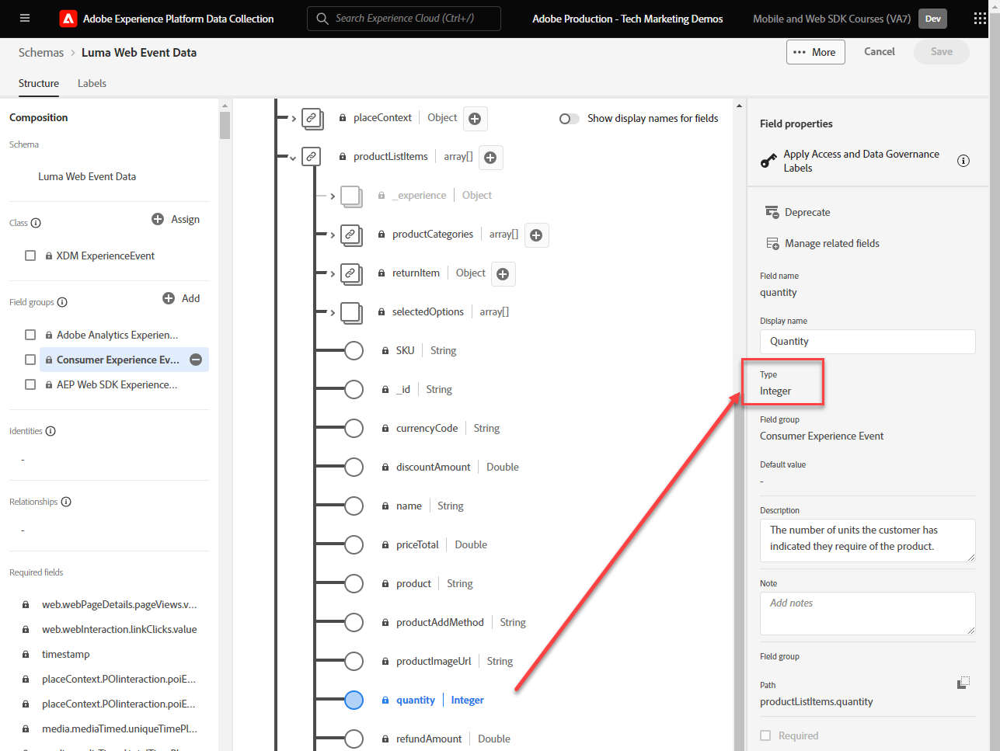

# 创建标记规则

了解如何使用标记规则将事件与XDM对象一起发送到Adobe Experience Platform Edge Network。 标记规则是事件、条件和操作的组合，用于告知标记属性执行一些操作。 使用Platform Web SDK时，可以使用规则将事件与正确的数据发送到Platform Edge Network。

>[!WARNING]
>
> 本教程中使用的Luma网站预计将在2026年2月16日这一周内被替换。 作为本教程的一部分完成的工作可能不适用于新网站。

## 学习目标

在本课程结束时，您能够：

* 使用命名惯例来管理标记中的规则
* 使用“更新变量”和“发送事件”操作，发送包含XDM字段的事件
* 跨多个规则栈叠多组XDM字段
* 将单个或整个数组数据元素映射到XDM对象
* 将标记规则发布到开发库

## 先决条件

您熟悉数据收集标记和[Luma演示网站](https://luma.enablementadobe.com/content/luma/us/en.html)，并完成了本教程中以前的课程：

* [配置XDM架构](configure-schemas.md)
* [配置身份命名空间](configure-identities.md)
* [配置数据流](configure-datastream.md)
* [安装 Web SDK 扩展](install-web-sdk.md)
* [创建数据元素](create-data-elements.md)
* [创建身份](create-identities.md)

## 命名约定

要管理标记中的规则，建议遵循标准命名约定。 本教程使用由五部分组成的命名约定：

* [**位置**] - [**事件**] - [**目的**] - [**订单**]

其中；

1. **location**&#x200B;是触发规则的网站上的一个或多个页面
1. **event**&#x200B;是规则的触发器
1. **purpose**&#x200B;是规则执行的主要操作
1. **order**&#x200B;是规则相对于其他规则应触发的顺序
<!-- minor update -->

## 创建标记规则

在标记中，规则用于在各种条件下执行操作（触发调用）。 Platform Web SDK标记扩展包括本课程中使用的两个操作：

* **[!UICONTROL 更新变量]**&#x200B;将数据元素映射到XDM对象中的属性
* **[!UICONTROL 发送事件]**&#x200B;将XDM对象发送到Experience Platform Edge Network

在本课程的其余部分中，我们将：

1. 使用&#x200B;**[!UICONTROL 更新变量]**&#x200B;操作创建规则以定义XDM字段的“全局配置”。

1. 使用&#x200B;**[!UICONTROL 更新变量]**&#x200B;操作创建其他规则，这些规则将覆盖我们的“全局配置”，并在某些条件下（例如，在产品页面上添加产品详细信息）提供其他XDM字段。

1. 使用&#x200B;**[!UICONTROL 发送事件]**&#x200B;操作创建另一个规则，该操作会将完整的XDM对象发送到Adobe Experience Platform Edge Network。

所有这些规则将使用“[!UICONTROL 顺序]”选项正确排序。

此视频概述了此过程：

>[!VIDEO](https://video.tv.adobe.com/v/3427710/?learn=on&enablevpops)

### 全局配置字段

要为全局XDM字段创建标记规则：

1. 打开您在本教程中使用的标记属性

1. 在左侧导航中转到&#x200B;**[!UICONTROL 规则]**

1. 选择&#x200B;**[!UICONTROL 创建新规则]**&#x200B;按钮

   

1. 将规则命名为 `all pages - library loaded - set global variables - 1`

1. 在&#x200B;**[!UICONTROL 事件]**&#x200B;部分中，选择&#x200B;**[!UICONTROL 添加]**

   

1. 使用&#x200B;**[!UICONTROL 核心扩展]**&#x200B;并选择&#x200B;**[!UICONTROL Library Loaded (Page Top)]**&#x200B;作为&#x200B;**[!UICONTROL 事件类型]**

1. 选择&#x200B;**[!UICONTROL 高级]**&#x200B;下拉菜单并输入`1`作为&#x200B;**[!UICONTROL 顺序]**

   >[!NOTE]
   >
   > 订单编号越低，执行的时间就越早。 因此，我们给予“全球配置”一个较低的订单编号。

1. 选择&#x200B;**[!UICONTROL Keep Changes]**以返回主规则屏幕
   

1. 在&#x200B;**[!UICONTROL 操作]**&#x200B;部分中，选择&#x200B;**[!UICONTROL 添加]**

1. 作为&#x200B;**[!UICONTROL 扩展]**，请选择&#x200B;**[!UICONTROL Adobe Experience Platform Web SDK]**

1. 作为&#x200B;**[!UICONTROL 操作类型]**，请选择&#x200B;**[!UICONTROL 更新变量]**

1. 作为&#x200B;**[!UICONTROL 数据元素]**，选择您在`xdm.variable.content`创建数据元素[课程中创建的](create-data-elements.md)

   

现在，将您的[!UICONTROL 数据元素]映射到XDM对象使用的[!UICONTROL 架构]。 您可以映射到单个属性或整个对象。 在本例中，您将映射到各个属性：

1. 找到eventType字段并将其选定

1. 输入值`web.webpagedetails.pageViews`

   >[!TIP]
   >
   > 要了解在`eventType`字段中要填充哪些值，您必须转到架构页面并选择`eventType`字段以在右边栏上查看建议值。 如果需要，您还可以输入新值。
   > 架构页面上的

1. 接下来，在架构中找到`identityMap`对象并将其选定

1. 映射到`identityMap.loginID`数据元素

   

   >[!TIP]
   >
   > 如果数据元素为空，则XDM字段将不会包含在网络请求中。 因此，当用户未经身份验证并且`identityMap.loginID`数据元素为null时，将不会发送`identityMap`对象。 这就是为什么我们可以在我们的“全球配置”中定义它。

1. 向下滚动直到到达&#x200B;**`web`**&#x200B;对象

1. 选择以将其打开

1. 将以下数据元素映射到相应的`web` XDM变量

   * **`web.webPageDetials.name`**&#x200B;至`%page.pageInfo.pageName%`
   * **`web.webPageDetials.server`**&#x200B;至`%page.pageInfo.server%`
   * **`web.webPageDetials.siteSection`**&#x200B;至`%page.pageInfo.hierarchie1%`

1. 将 `web.webPageDetials.pageViews.value` 设置为 `1`

   

   >[!TIP]
   >
   > 虽然Adobe Analytics不需要将设置为`eventType`的`web.webpagedetails.pageViews`和`web.webPageDetails.pageViews.value`来处理作为页面查看的信标，但使用标准方式为其他下游应用程序指示页面查看很有用。

1. 选择&#x200B;**[!UICONTROL 保留更改]**，然后在下一个屏幕中选择&#x200B;**[!UICONTROL 保存]**&#x200B;规则以完成创建规则

### 产品页面字段

现在，在将XDM对象发送到&#x200B;**[!UICONTROL Platform Edge Network]**&#x200B;之前，开始在其他顺序规则中使用[!UICONTROL 更新变量]以扩充该对象。

>[!TIP]
>
>规则顺序确定在触发事件时首先运行的规则。 如果两个规则具有相同的事件类型，则编号最低的规则会先运行。
> 

首先在Luma的产品详细信息页面上跟踪产品查看：

1. 选择&#x200B;**[!UICONTROL 添加规则]**
1. 将其命名为[!UICONTROL `ecommerce - library loaded - set product details variables - 20`]
1. 选择“事件”下的以添加新触发器
1. 在&#x200B;**[!UICONTROL 扩展]**&#x200B;下，选择&#x200B;**[!UICONTROL 核心]**
1. 在&#x200B;**[!UICONTROL Event Type]**&#x200B;下，选择&#x200B;**[!UICONTROL Library Loaded (Page Top)]**
1. 选择以打开&#x200B;**[!UICONTROL 高级选项]**，键入`20`。 此顺序值确保规则在&#x200B;_之后运行_ `all pages - library loaded - set global variables - 1`，该规则设置全局配置。
1. 选择&#x200B;**[!UICONTROL 保留更改]**

   

1. 在&#x200B;**[!UICONTROL 条件]**&#x200B;下，选择&#x200B;**[!UICONTROL 添加]**
1. 将&#x200B;**[!UICONTROL 逻辑类型]**&#x200B;保留为&#x200B;**[!UICONTROL 常规]**
1. 将&#x200B;**[!UICONTROL 扩展]**&#x200B;保留为&#x200B;**[!UICONTROL 核心]**
1. 选择&#x200B;**[!UICONTROL 条件类型]**&#x200B;作为不含查询字符串&#x200B;**[!UICONTROL 的]**&#x200B;路径
1. 在右侧，启用&#x200B;**[!UICONTROL 正则表达式]**&#x200B;切换开关
1. 在&#x200B;**[!UICONTROL 路径下，等于]**&#x200B;设置`/products/`。 对于Luma演示站点，它确保规则仅在产品页面上触发
1. 选择&#x200B;**[!UICONTROL 保留更改]**

   

1. 在&#x200B;**[!UICONTROL 操作]**&#x200B;下，选择&#x200B;**[!UICONTROL 添加]**
1. 选择&#x200B;**[!UICONTROL Adobe Experience Platform Web SDK]**&#x200B;扩展
1. 选择&#x200B;**[!UICONTROL 操作类型]**&#x200B;作为&#x200B;**[!UICONTROL 更新变量]**
1. 选择`xdm.variable.content`作为&#x200B;**[!UICONTROL 数据元素]**
1. 向下滚动到`commerce`对象
1. 打开&#x200B;**[!UICONTROL productViews]**&#x200B;对象并将&#x200B;**[!UICONTROL 值]**&#x200B;设置为`1`

   

   >[!TIP]
   >
   >在XDM中设置commerce.productViews.value=1会自动映射到Analytics中的`prodView`事件

1. 向下滚动到`eventType`并将其设置为`commerce.productViews`

   >[!NOTE]
   >
   >由于此规则的顺序较高，因此它将覆盖“全局配置”规则中设置的`eventType`。 `eventType`只能包含一个值，我们建议使用最有价值的事件来设置它。

1. 向下滚动到并选择`productListItems`数组
1. 选择&#x200B;**[!UICONTROL 提供单个项目]**
1. 选择&#x200B;**[!UICONTROL 添加项]**

   

   >[!CAUTION]
   >
   >**`productListItems`**&#x200B;是`array`数据类型，因此它期望数据作为元素集合进入。 由于Luma演示站点的数据层结构，并且由于一次只能在Luma站点上查看一个产品，因此需要单独添加项目。 在您自己的网站上实施时，根据数据层结构，您可能能够提供整个阵列。

1. 选择以打开&#x200B;**[!UICONTROL 项目1]**
1. 将&#x200B;**`productListItems.item1.SKU`**&#x200B;映射到`%product.productInfo.sku%`

   

1. 选择&#x200B;**[!UICONTROL 保留更改]**

1. 选择&#x200B;**[!UICONTROL 保存]**&#x200B;以保存规则

### 购物车字段

您可以将整个数组映射到XDM对象，前提是数组与XDM架构的格式匹配。 您创建的自定义代码数据元素`cart.productInfo`将通过Luma上的`digitalData.cart.cartEntries`数据层对象进行循环，并将其转换为XDM架构的`productListItems`对象的所需格式。

要说明此问题，请参阅Luma站点数据层（左）与转换后的数据元素（右）的以下比较：

比较数据元素与`productListItems`结构（提示，它应该匹配）。

>[!IMPORTANT]
>
>请注意数值变量的转换方式，数据层中的字符串值（如`price`和`qty`）将重新格式化为数据元素中的数字。 这些格式要求对于Platform中的数据完整性非常重要，可以在[配置架构](configure-schemas.md)步骤中确定。 在示例中，**[!UICONTROL 数量]**&#x200B;使用&#x200B;**[!UICONTROL 整数]**数据类型。
> 

现在，让我们将数组映射到XDM对象：

1. 创建名为`ecommerce - library loaded - set shopping cart variables - 20`的新规则
1. 选择“事件”下的以添加新触发器
1. 在&#x200B;**[!UICONTROL 扩展]**&#x200B;下，选择&#x200B;**[!UICONTROL 核心]**
1. 在&#x200B;**[!UICONTROL Event Type]**&#x200B;下，选择&#x200B;**[!UICONTROL Library Loaded (Page Top)]**
1. 选择以打开&#x200B;**[!UICONTROL 高级选项]**，键入`20`
1. 选择&#x200B;**[!UICONTROL 保留更改]**

   

1. 在&#x200B;**[!UICONTROL 条件]**&#x200B;下，选择&#x200B;**[!UICONTROL 添加]**
1. 将&#x200B;**[!UICONTROL 逻辑类型]**&#x200B;保留为&#x200B;**[!UICONTROL 常规]**
1. 将&#x200B;**[!UICONTROL 扩展]**&#x200B;保留为&#x200B;**[!UICONTROL 核心]**
1. 选择&#x200B;**[!UICONTROL 条件类型]**&#x200B;作为不含查询字符串&#x200B;**[!UICONTROL 的]**&#x200B;路径
1. 在右侧，**不**&#x200B;启用&#x200B;**[!UICONTROL 正则表达式]**&#x200B;切换开关
1. 在&#x200B;**[!UICONTROL 路径下，等于]**&#x200B;设置`/content/luma/us/en/user/cart.html`。 对于Luma演示站点，它确保规则仅在购物车页面上触发
1. 选择&#x200B;**[!UICONTROL 保留更改]**

   

1. 在&#x200B;**[!UICONTROL 操作]**&#x200B;下，选择&#x200B;**[!UICONTROL 添加]**
1. 选择&#x200B;**[!UICONTROL Adobe Experience Platform Web SDK]**&#x200B;扩展
1. 选择&#x200B;**[!UICONTROL 操作类型]**&#x200B;作为&#x200B;**[!UICONTROL 更新变量]**
1. 选择`xdm.variable.content`作为&#x200B;**[!UICONTROL 数据元素]**
1. 向下滚动到`commerce`对象并选择以将其打开。
1. 打开&#x200B;**[!UICONTROL productListViews]**&#x200B;对象并将&#x200B;**[!UICONTROL 值]**&#x200B;设置为`1`

   

   >[!TIP]
   >
   >在XDM中设置commerce.productListViews.value=1会自动映射到Analytics中的`scView`事件

1. 选择`eventType`并设置为`commerce.productListViews`

1. 向下滚动到并选择&#x200B;**[!UICONTROL productListItems]**&#x200B;数组

1. 选择&#x200B;**[!UICONTROL 提供整个数组]**

1. 映射到&#x200B;**`cart.productInfo`**&#x200B;数据元素

1. 选择&#x200B;**[!UICONTROL 保留更改]**

1. 选择&#x200B;**[!UICONTROL 保存]**&#x200B;以保存规则

按照相同的模式为结账和购买创建其他两个规则，但存在以下差异：

**规则名称**： `ecommerce  - library loaded - set checkout variables - 20`

1. **[!UICONTROL 条件]**： /content/luma/us/en/user/checkout.html
1. 将 `eventType` 设置为 `commerce.checkouts`
1. 将 `commerce.checkout.value` 设置为 `1`

   >[!TIP]
   >
   >这等同于在Analytics中设置`scCheckout`事件

**规则名称**： `ecommerce - library loaded - set purchase variables -  20`

1. **[!UICONTROL 条件]**： /content/luma/us/en/user/checkout/order/thank-you.html
1. 将 `eventType` 设置为 `commerce.purchases`
1. 将 `commerce.purchases.value` 设置为 `1`

   >[!TIP]
   >
   >这等同于在Analytics中设置`purchase`事件

1. 将`commerce.order.purchaseID`设置为`cart.orderId`数据元素
1. 将`commerce.order.currencyCode`设置为硬编码值`USD`

   

   >[!TIP]
   >
   >这等同于Analytics中的设置`s.purchaseID`和`s.currencyCode`变量

1. 向下滚动到并选择&#x200B;**[!UICONTROL productListItems]**&#x200B;数组
1. 选择&#x200B;**[!UICONTROL 提供整个数组]**
1. 映射到&#x200B;**`cart.productInfo.purchase`**&#x200B;数据元素
1. 选择&#x200B;**[!UICONTROL 保留更改]**
1. 选择&#x200B;**[!UICONTROL 保存]**

完成后，您应该会看到创建了以下规则。

### 发送事件规则

现在，您已设置变量，接下来可以创建规则以使用&#x200B;**[!UICONTROL 发送事件]**&#x200B;操作将完整的XDM对象发送到Platform Edge Network。

1. 在右侧，选择&#x200B;**[!UICONTROL 添加规则]**&#x200B;以创建另一个规则

1. 将规则命名为 `all pages - library loaded - send event - 50`

1. 在&#x200B;**[!UICONTROL 事件]**&#x200B;部分中，选择&#x200B;**[!UICONTROL 添加]**

1. 使用&#x200B;**[!UICONTROL 核心扩展]**&#x200B;并选择`Library Loaded (Page Top)`作为&#x200B;**[!UICONTROL 事件类型]**

1. 选择&#x200B;**[!UICONTROL 高级]**&#x200B;下拉菜单并在`50`顺序&#x200B;**[!UICONTROL 中输入]**。 这将确保此规则在您配置的所有其他规则（这些规则将`1`或`20`作为其[!UICONTROL 顺序]）之后触发。

1. 选择&#x200B;**[!UICONTROL Keep Changes]**以返回主规则屏幕
   

1. 在&#x200B;**[!UICONTROL 操作]**&#x200B;部分中，选择&#x200B;**[!UICONTROL 添加]**

1. 作为&#x200B;**[!UICONTROL 扩展]**，请选择&#x200B;**[!UICONTROL Adobe Experience Platform Web SDK]**

1. 作为&#x200B;**[!UICONTROL 操作类型]**，选择&#x200B;**[!UICONTROL 发送事件]**

1. 作为&#x200B;**[!UICONTROL XDM]**，选择在上一课程中创建的`xdm.variable.content`数据元素

1. 选择&#x200B;**[!UICONTROL Keep Changes]**&#x200B;以返回主规则屏幕

   
1. 选择&#x200B;**[!UICONTROL 保存]**&#x200B;以保存规则

   

## 在库中发布规则

接下来，将规则发布到开发环境，以便您可以验证它是否有效。

要创建库，请执行以下操作：

1. 在左侧导航中转到&#x200B;**[!UICONTROL 发布流]**

1. 选择&#x200B;**[!UICONTROL 添加库]**

   
1. 对于&#x200B;**[!UICONTROL Name]**，输入`Luma Web SDK Tutorial`
1. 对于&#x200B;**[!UICONTROL 环境]**，请选择`Development`
1. 选择&#x200B;**[!UICONTROL 添加所有更改的资源]**

   >[!NOTE]
   >
   >    您应会看到在前面的课程中创建的所有标记组件。 核心扩展包含所有Web标记属性所需的基本JavaScript。

1. 选择&#x200B;**[!UICONTROL 保存并生成以进行开发]**

   

库可能需要几分钟才能构建，完成后，库名称左侧会显示一个绿色圆点：

如您在[!UICONTROL 发布流]屏幕上所见，发布流程还有许多其他内容，这不在本教程的涵盖范围内。 本教程仅在开发环境中使用单个库。

现在，您可以使用Adobe Experience Platform Debugger验证请求中的数据。

>[!NOTE]
>
>感谢您投入时间学习Adobe Experience Platform Web SDK。 如果您有疑问、希望分享一般反馈或有关于未来内容的建议，请在此[Experience League社区讨论帖子](https://experienceleaguecommunities.adobe.com/t5/adobe-experience-platform-data/tutorial-discussion-implement-adobe-experience-cloud-with-web/td-p/444996)上分享这些内容
