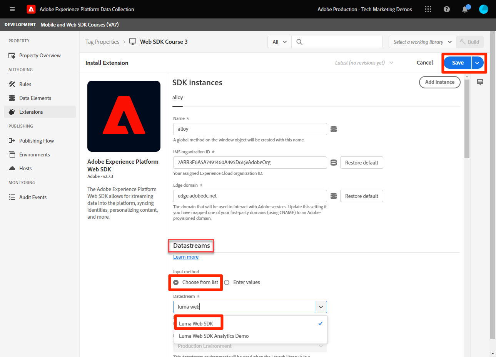

# 安装Adobe Experience Platform Web SDK标记扩展

了解如何安装和配置Adobe Experience Platform Web SDK标记扩展。 实施Web SDK的最简单方法是使用Adobe的标签管理器“标签”（以前称为Launch）。 Platform Web SDK标记扩展是向&#x200B;_所有Adobe Experience Cloud应用程序_&#x200B;发送数据所需的&#x200B;_仅标记扩展_，包括[Analytics](setup-analytics.md)、[Target](setup-target.md)、[Audience Manager](setup-audience-manager.md)、Real-Time Customer Data Platform和[Journey Optimizer](setup-web-channel.md)！

## 学习目标

在本课程结束后，您将能够：

* 在数据收集界面中创建标记属性
* 安装Platform Web SDK标记扩展
* 将之前创建的数据流映射到扩展

## 先决条件

您必须完成本教程中之前的课程：

* [配置数据流](configure-datastream.md)

### 添加标记属性

首先，您必须具有标记属性。 资产是一个容器，其中包含从网页收集详细信息并将其发送到不同位置所需的所有JavaScript、规则和其他功能。

为教程创建新的标记属性：

1. 打开[数据收集接口](https://experience.adobe.com/data-collection/){target="_blank"}
1. 在左侧导航中选择&#x200B;**[!UICONTROL 标记]**
1. 选择&#x200B;**[!UICONTROL 新建属性]**&#x200B;按钮
   
1. 作为&#x200B;**[!UICONTROL Name]**，输入`Web SDK Course` （如果贵公司的多个人员参加本教程，请添加您的姓名到结尾）
1. 作为&#x200B;**[!UICONTROL 域]**，请输入`enablementadobe.com`（稍后解释）
1. 选择&#x200B;**[!UICONTROL 保存]**
   

## 添加Web SDK扩展

现在通过创建XDM架构、数据流和标记属性，您可以安装Platform Web SDK扩展：

1. 打开您的新标记属性
1. 转到&#x200B;**[!UICONTROL 扩展]** > **[!UICONTROL 目录]**
1. 搜索`Adobe Experience Platform Web SDK`
1. 选择&#x200B;**[!UICONTROL 安装]**

   

## 将扩展链接到数据流

保留大部分默认设置，以后根据需要进行更新。 您现在必须执行的唯一操作是将扩展链接到数据流：

1. 在&#x200B;**[!UICONTROL 数据流]**&#x200B;下，选择&#x200B;**[!UICONTROL 从列表中选择]**&#x200B;输入法
1. 选择您在其中创建架构、身份命名空间和数据流的沙盒
1. 选择您之前创建的数据流，`Luma Web SDK`
1. 选择&#x200B;**[!UICONTROL 保存]**

   >[!NOTE]
   >
   > 如果找不到数据流，请转到[配置数据流](configure-datastream.md)课程，然后按照步骤创建一个数据流

   

有关扩展的每个部分的详细信息，请参阅[配置Adobe Experience Platform Web SDK扩展](https://experienceleague.adobe.com/en/docs/experience-platform/tags/extensions/client/web-sdk/web-sdk-extension-configuration)。

>[!NOTE]
>
>虽然在本课程的[!UICONTROL Edge域]设置中未配置CNAME，但Adobe建议在您自己的网站上实施Platform Web SDK时使用CNAME。 虽然 CNAME 实施未提供 Cookie 生命周期方面的好处，但可能会带来其他一些好处。这些好处包括广告拦截器和不太常见的浏览器，可防止数据被发送到它们归类为跟踪器的域。 在这些情况下，使用 CNAME 可以在对使用这些工具的用户进行数据收集时防止中断。

>[!NOTE]
>
>在本教程中，您只需配置一个数据流，并将其与所有标记环境（开发、暂存和生产）关联。 在您自己的网站上实施Platform Web SDK时，您应该为每个环境配置单独的数据流，并在扩展配置中相应地映射它们。

现在您已经安装了Platform Web SDK并将其与数据流关联，您可以开始收集数据了。

[下一步： ](create-data-elements.md)

>[!NOTE]
>
>感谢您投入时间学习Adobe Experience Platform Web SDK。 如果您有疑问、希望分享一般反馈或有关于未来内容的建议，请在此[Experience League社区讨论帖子](https://experienceleaguecommunities.adobe.com/t5/adobe-experience-platform-data/tutorial-discussion-implement-adobe-experience-cloud-with-web/td-p/444996)上分享这些内容
