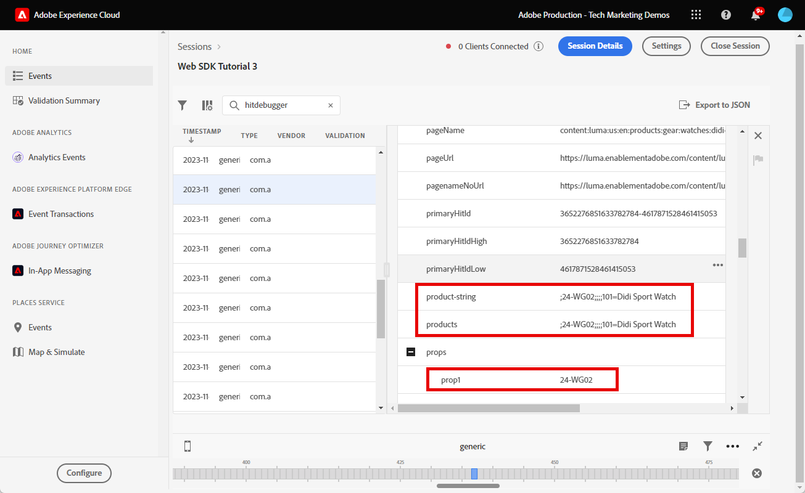

# 使用Adobe Experience Platform Web SDK设置Adobe Analytics

了解如何使用[Adobe Experience Platform Web SDK](https://experienceleague.adobe.com/en/docs/platform-learn/data-collection/web-sdk/overview)设置Adobe Analytics，创建标记规则以将数据发送到Adobe Analytics，并验证Analytics是否按预期捕获数据。

[Adobe Analytics](https://experienceleague.adobe.com/zh-hans/docs/analytics)是一款行业领先的应用程序，可帮助您了解客户的行为和需求，并根据客户情报掌控业务发展方向。

## 学习目标

在本课程结束后，您将能够：

* 配置数据流以启用Adobe Analytics
* 了解哪些标准XDM字段自动映射到Analytics变量
* 在数据对象中设置Analytics变量
* 通过覆盖数据流将数据发送到其他报表包
* 使用Debugger和Assurance验证Adobe Analytics变量

## 先决条件

要完成本课程，您必须首先：

* 熟悉并访问Adobe Analytics。

* 至少具有一个测试/开发报表包ID。 如果您没有可用于本教程的测试/开发报表包，[请创建一个](https://experienceleague.adobe.com/en/docs/analytics/admin/admin-tools/manage-report-suites/c-new-report-suite/t-create-a-report-suite)。

* 完成本教程的初始配置和标记配置部分中之前的课程。

## 配置数据流

Platform Web SDK将数据从您的网站发送到PlatformEdge Network。 然后，您的数据流会告知PlatformEdge Network，您的数据应该发送到哪个Adobe Analytics报表包。

1. 转到[数据收集](https://experience.adobe.com/#/data-collection){target="blank"}接口
1. 在左侧导航中，选择&#x200B;**[!UICONTROL 数据流]**
1. 选择之前创建的`Luma Web SDK: Development Environment`数据流

   

1. 选择&#x200B;**[!UICONTROL 添加服务]**
   
1. 选择&#x200B;**[!UICONTROL Adobe Analytics]**&#x200B;作为&#x200B;**[!UICONTROL 服务]**
1. 输入开发报表包的&#x200B;**[!UICONTROL 报表包ID]**
1. 选择&#x200B;**[!UICONTROL 保存]**

   

   >[!TIP]
   >
   >通过选择&#x200B;**[!UICONTROL 添加报表包]**&#x200B;添加更多报表包等同于多包标记。

>[!WARNING]
>
>在本教程中，您将仅为开发环境配置Adobe Analytics报表包。 在为您自己的网站创建数据流时，您应该为暂存环境和生产环境创建其他数据流和报表包。

## 设置Analytics变量

有多种方法可以在Web SDK实施中设置Analytics变量：

1. XDM字段到Analytics变量的自动映射（自动）。
1. 在`data`对象中设置字段（推荐）。
1. 在Analytics处理规则中将XDM字段映射到Analytics变量（不再推荐）。
1. 直接在XDM架构中映射到Analytics变量（不再推荐）。

自2024年5月起，您不再需要创建XDM模式来使用Platform Web SDK实施Adobe Analytics。 `data`对象（以及您在[创建数据元素](create-data-elements.md)课程中创建的`data.variable`数据元素）可用于设置所有自定义Analytics变量。 现有Analytics客户将会很熟悉在数据对象中设置这些变量，并且比使用处理规则界面更有效，还可以防止不必要的数据占用实时客户配置文件中的空间(如果您有Real-time Customer Data Platform或Journey Optimizer，这一点很重要)。

### 自动映射的字段

许多XDM字段会自动映射到Analytics变量。 有关最新的映射列表，请参阅AdobeExperience Edge](https://experienceleague.adobe.com/en/docs/experience-platform/edge/data-collection/adobe-analytics/automatically-mapped-vars)中的[Analytics变量映射。

即使您尚未定义自定义架构&#x200B;_，如果_&#x200B;也会发生这种情况。 Experience PlatformWeb SDK会自动收集一些数据，并将其作为XDM字段发送到PlatformEdge Network。 例如，Web SDK读取当前页面URL并将其作为XDM字段`web.webPageDetails.URL`发送。 此字段将转发到Adobe Analytics，并且它会自动在Adobe Analytics中填充页面URL报表。

如果您使用XDM架构实施适用于Adobe Analytics的Web SDK，如本教程中所述，则您已经自定义实施了一些自动映射到Analytics变量的XDM字段，如下表所述：

| XDM到Analytics的自动映射变量 | Adobe Analytics变量 |
|-------|---------|
| `identitymap.ecid.[0].id` | mid |
| `web.webPageDetails.name` | s.pageName |
| `web.webPageDetails.server` | s.server |
| `web.webPageDetails.siteSection` | s.channel |
| `commerce.productViews.value` | prodView |
| `commerce.productListViews.value` | scView |
| `commerce.checkouts.value` | scCheckout |
| `commerce.purchases.value` | 购买 |
| `commerce.order.currencyCode` | s.currencyCode |
| `commerce.order.purchaseID` | s.purchaseID |
| `productListItems[].SKU` | s.products=；产品名称；；；；；（主要 — 请参阅下面的注释） |
| `productListItems[].name` | s.products=；产品名称；；；；；（回退 — 请参阅下面的注释） |
| `productListItems[].quantity` | s.products=；；product quantity；；； |
| `productListItems[].priceTotal` | s.product=；；；产品价格；； |

Analytics产品字符串的各个部分通过`productListItems`对象下的不同XDM变量进行设置。

>[!NOTE]
>
>自2022年8月18日起，`productListItems[].SKU`优先映射到s.products变量中的产品名称。
>仅当`productListItems[].SKU`不存在时，设置为`productListItems[].name`的值才会映射到产品名称。 否则，它将被取消映射，并可用于上下文数据。
>请勿将空字符串或null设置为`productListItems[].SKU`。 这会产生不需要的效果，即映射到s.products变量中的产品名称。

### 在数据对象中设置变量

但evar、prop和事件呢？ 建议使用Web SDK在`data`对象中设置变量来设置这些Analytics变量。 在数据对象中设置变量还可以覆盖任何自动映射的变量。

首先，`data`对象是什么？ 在任何Web SDK事件中，您可以使用自定义数据发送两个对象： `xdm`对象和`data`对象。 两者都会发送到PlatformEdge Network，但只将`xdm`对象发送到Experience Platform数据集。 可以使用为数据收集准备数据功能，将Edge上`data`对象中的属性映射到`xdm`字段，否则不会发送到Experience Platform。 这使其成为将数据发送到Analytics等并非基于Experience Platform构建的原生应用程序的理想方式。

以下是通用Web SDK调用中的两个对象：

Adobe Analytics配置为在`data.__adobe.analytics`对象中查找任何属性，并将其用于Analytics变量。

现在，让我们看看这是如何运行的。 让我们使用页面名称设置`eVar1`和`prop1`，看看如何覆盖XDM映射的值

1. 打开标记规则`all pages - library loaded - set global variables - 1`
1. 添加新的&#x200B;**[!UICONTROL 操作]**
1. 选择&#x200B;**[!UICONTROL Adobe Experience Platform Web SDK]**&#x200B;扩展
1. 选择&#x200B;**[!UICONTROL 操作类型]**&#x200B;作为&#x200B;**[!UICONTROL 更新变量]**
1. 选择`data.variable`作为&#x200B;**[!UICONTROL 数据元素]**
1. 选择&#x200B;**[!UICONTROL analytics]**&#x200B;对象
1. 将`eVar1`设置为`page.pageInfo.pageName`数据元素
1. 设置`prop1`以复制`eVar1`的值
1. 要测试XDM映射值的覆盖，请在&#x200B;**[!UICONTROL 其他属性]**&#x200B;部分中将页面名称设置为静态值`test`
1. 保存规则

现在，我们需要在发送事件规则中包含数据对象。

1. 打开标记规则`all pages - library loaded - send event - 50`
1. 打开&#x200B;**[!UICONTROL 发送事件]**&#x200B;操作
1. 选择`data.variable`作为&#x200B;**[!UICONTROL 数据]**
1. 选择&#x200B;**[!UICONTROL 保留更改]**
1. 选择&#x200B;**[!UICONTROL 保存]**

<!--

### Map to Analytics variables with processing rules

All fields in the XDM schema become available to Adobe Analytics as Context Data Variables with the following prefix `a.x.`. For example, `a.x.web.webinteraction.region`

In this exercise, you map one XDM variable to a prop. Follow these same steps for any custom mapping that you must do for any `eVar`, `prop`, `event`, or variable accessible via Processing Rules.

1. Go to the Analytics interface
1. Go to [!UICONTROL Admin] > [!UICONTROL Admin Tools] > [!UICONTROL Report Suites ]
1. Select the dev/test report suite that you are using for the tutorial > [!UICONTROL Edit Settings] > [!UICONTROL General] > [!UICONTROL Processing Rules]

       

1. Create a rule to **[!UICONTROL Overwrite value of]** `[!UICONTROL Product SKU (prop1)]` to `a.x.productlistitems.0.sku`. Remember to add a note about why you are creating the rule and name your rule title. Select **[!UICONTROL Save]**

       

    >[!IMPORTANT]
    >
    >The first time you map to a processing rule, the UI does not show you the context data variables from the XDM object. To fix that select any value, Save, and come back to edit. All XDM variables should now appear.

### Map to Analytics variables using the Adobe Analytics field group

An alternative to processing rules is to map to Analytics variables in the XDM schema using the `Adobe Analytics ExperienceEvent Template` field group. This approach has gained popularity because many users find it simpler than configuring processing rules, however, by increasing the size of the XDM payload it could in turn increase the profile size in other applications like Real-Time CDP.

To add the `Adobe Analytics ExperienceEvent Template` field group to your schema:

1. Open the [Data Collection](https://experience.adobe.com/#/data-collection){target="blank"} interface
1. Select **[!UICONTROL Schemas]** from the left navigation
1. Make sure you are in the sandbox you are using from the tutorial
1. Open your `Luma Web Event Data` schema
1. In the **[!UICONTROL Field Groups]** section, select **[!UICONTROL Add]**
1. Find the `Adobe Analytics ExperienceEvent Template` field group and add it to your schema

Now, set a merchandising eVar in the product string. With the `Adobe Analytics ExperienceEvent Template` field group, you are able to map variables to merchandising eVars or events within the product string. This is also known as setting **Product Syntax Merchandising**. 

1. Go back to your tag property

1. Open the rule `ecommerce - library loaded - set product details variables - 20`

1. Open the **[!UICONTROL Set Variable]** action

1. Select to open `_experience > analytics > customDimensions > eVars > eVar1`

1. Set the **[!UICONTROL Value]** to `%product.productInfo.title%`

1. Select **[!UICONTROL Keep Changes]**

    

1. Select **[!UICONTROL Save]** to save the rule

As you just saw, basically all of the Analytics variables can be set in the `Adobe Analytics ExperienceEvent Template` field group.

>[!NOTE]
>
> Notice the `_experience` object under `productListItems` > `Item 1`. Setting any variable under this [!UICONTROL object] sets Product Syntax eVars or Events.

-->

## 将数据发送到其他报表包

您可能希望更改当访客出现在某些页面中时，要将哪些Adobe Analytics报表包数据发送到。 这需要数据流和规则中的配置。

### 为报表包覆盖配置数据流

要在数据流中配置Adobe Analytics报表包覆盖设置，请执行以下操作：

1. 打开您的数据流
1. 编辑&#x200B;**[!UICONTROL Adobe Analytics]**&#x200B;配置，方法是打开菜单，然后选择&#x200B;**[!UICONTROL 编辑]**

   

1. 选择&#x200B;**[!UICONTROL 高级选项]**&#x200B;以打开&#x200B;**[!UICONTROL 报表包覆盖]**

1. 选择要覆盖的报表包。 在这种情况下，`Web SDK Course Dev`和`Web SDK Course Stg`

1. 选择&#x200B;**[!UICONTROL 保存]**

   

### 为报表包覆盖配置规则

让我们创建一个规则以向其他报表包发送额外的页面查看调用。 使用数据流覆盖功能，通过&#x200B;**[!UICONTROL 发送事件]**&#x200B;操作更改页面的报表包。

1. 创建新规则，将其命名为`homepage - library loaded - AA report suite override - 51`

1. 选择&#x200B;**[!UICONTROL 事件]**&#x200B;下的加号以添加新触发器

1. 在&#x200B;**[!UICONTROL 扩展]**&#x200B;下，选择&#x200B;**[!UICONTROL 核心]**

1. 在&#x200B;**[!UICONTROL Event Type]**&#x200B;下，选择&#x200B;**[!UICONTROL Library Loaded (Page Top)]**

1. 选择以打开&#x200B;**[!UICONTROL 高级选项]**，键入`51`。 这将确保规则在设置具有&#x200B;**[!UICONTROL 更新变量]**&#x200B;操作类型的基线XDM的`all pages - library loaded - send event - 50`之后运行。
1. 选择&#x200B;**[!UICONTROL 保留更改]**

   

1. 在&#x200B;**[!UICONTROL 条件]**&#x200B;下，选择&#x200B;**[!UICONTROL 添加]**

1. 将&#x200B;**[!UICONTROL 逻辑类型]**&#x200B;保留为&#x200B;**[!UICONTROL 常规]**

1. 将&#x200B;**[!UICONTROL 扩展]**&#x200B;保留为&#x200B;**[!UICONTROL 核心]**

1. 选择&#x200B;**[!UICONTROL 条件类型]**&#x200B;作为不含查询字符串&#x200B;]**的**[!UICONTROL &#x200B;路径

1. 在右侧，将&#x200B;**[!UICONTROL 正则表达式]**&#x200B;切换保持禁用状态

1. 在&#x200B;**[!UICONTROL 路径下，等于]**&#x200B;设置`/content/luma/us/en.html`。 对于Luma演示站点，它确保规则仅在主页上触发

1. 选择&#x200B;**[!UICONTROL 保留更改]**

   

1. 在&#x200B;**[!UICONTROL 操作]**&#x200B;下，选择&#x200B;**[!UICONTROL 添加]**

1. 作为&#x200B;**[!UICONTROL 扩展]**，请选择&#x200B;**[!UICONTROL Adobe Experience Platform Web SDK]**

1. 作为&#x200B;**[!UICONTROL 操作类型]**，请选择&#x200B;**[!UICONTROL 发送事件]**

1. 对于&#x200B;**[!UICONTROL XDM数据]**，请选择您在[创建数据元素](create-data-elements.md)课程中创建的`xdm.variable.content`数据元素

1. 作为&#x200B;**[!UICONTROL 数据]**，选择您在[创建数据元素](create-data-elements.md)课程中创建的`data.variable`数据元素

   

1. 向下滚动到&#x200B;**[!UICONTROL 数据流配置覆盖]**&#x200B;部分

1. 保持选中&#x200B;**[!UICONTROL 开发]**&#x200B;选项卡。

   >[!TIP]
   >
   >    此选项卡确定覆盖发生在哪个标记环境中。 对于此练习，您仅指定了开发环境，但在将此环境部署到生产环境时，请记得也在&#x200B;**[!UICONTROL 生产]**&#x200B;环境中指定该环境。

1. 选择您用于本教程的&#x200B;**[!UICONTROL 沙盒]**
1. 选择&#x200B;**[!UICONTROL 数据流]**，在此例中为`Luma Web SDK: Development Environment`

1. 在&#x200B;**[!UICONTROL 报表包]**&#x200B;下，选择要覆盖的报表站点。 在这种情况下，`tmd-websdk-course-stg`。

1. 选择&#x200B;**[!UICONTROL 保留更改]**

1. 并&#x200B;**[!UICONTROL 保存]**&#x200B;您的规则

   

## 构建开发环境

将更新的规则添加到`Luma Web SDK Tutorial`标记库中，并重新构建开发环境。

恭喜！下一步是通过Experience PlatformWeb SDK验证Adobe Analytics实施。

## 使用Debugger验证Adobe Analytics

了解如何使用Adobe Analytics Debugger的Edge跟踪功能验证Experience Platform是否正在捕获ECID、页面查看、产品字符串和电子商务事件。

在[Debugger](validate-with-debugger.md)课程中，您已了解如何使用Platform Debugger和浏览器开发人员控制台检查客户端XDM请求，这与您调试`AppMeasurement.js` Analytics实施的方法类似。 您还了解了如何验证发送到Adobe应用程序的平台Edge Network服务器端请求，以及如何使用Assurance查看完全处理的负载。

要验证Analytics是否通过Experience PlatformWeb SDK正确捕获数据，您必须进一步执行两个步骤：

1. 使用Experience PlatformDebugger的Edge跟踪功能，验证平台Edge Network上的XDM对象如何处理数据
1. 使用Adobe Experience Platform保障验证Analytics完全处理数据的方式

### Experience CloudID验证

1. 转到[Luma演示网站](https://luma.enablementadobe.com/content/luma/us/en.html){target="_blank"}
1. 选择右上角的登录按钮，并使用凭据u： test@adobe.com p：测试进行身份验证
1. 打开Experience Platform调试器，然后[将网站上的标记属性切换到您自己的开发属性](validate-with-debugger.md#use-the-experience-platform-debugger-to-map-to-your-tags-property)

1. 要启用Edge跟踪，请转到Experience Platform调试器，在左侧导航中选择&#x200B;**[!UICONTROL 日志]**，然后选择&#x200B;**[!UICONTROL Edge]**&#x200B;选项卡，然后选择&#x200B;**[!UICONTROL 连接]**

   

1. 现在它将为空

   

1. 刷新“Luma”页面并再次检查Experience Platform调试器，您应该会看到数据通过。 以&#x200B;**[!UICONTROL Analytics自动映射]**&#x200B;开头的行是Adobe Analytics信标
1. 选择以打开`[!UICONTROL mappedQueryParams]`下拉列表和第二个下拉列表以查看Analytics变量

   

   >[!TIP]
   >
   >第二个下拉列表对应于您要将数据发送到的分析报表包ID。 它应该与您自己的报表包匹配，而不是与屏幕快照中的报表包匹配。

1. 向下滚动以查找`[!UICONTROL c.a.x.identitymap.ecid.[0].id]`。 它是一个捕获ECID的上下文数据变量
1. 继续向下滚动，直到看到Analytics `[!UICONTROL mid]`变量。 两个ID均与设备的Experience CloudID匹配。
1. 在Luma网站上，

   

   >[!NOTE]
   >
   >由于您已登录，请花些时间验证`[!UICONTROL c.a.x.identitymap.lumacrmid.[0].id]`中已捕获的用户&#x200B;**`test@adobe.com`**&#x200B;的身份验证ID `112ca06ed53d3db37e4cea49cc45b71e`

### 报表包覆盖验证

您在上面为[Luma主页](https://luma.enablementadobe.com/content/luma/us/en.html)配置了数据流覆盖。  验证此配置的步骤

1. 在应用覆盖后查找具有&#x200B;**[!UICONTROL 数据流配置的行]**。 在这里，您可以找到为报表包覆盖配置的主报表包和其他报表包。

   

1. 向下滚动到以&#x200B;**[!UICONTROL Analytics自动映射]**&#x200B;开头的行，并验证`[!UICONTROL reportSuiteIds]`是否显示您在覆盖配置中指定的报表包

   

### 内容页面查看次数验证

转到[Didi Sport Watch产品页](https://luma.enablementadobe.com/content/luma/us/en/products/gear/watches/didi-sport-watch.html#24-WG02)等产品页。  验证Analytics是否捕获了内容页面查看。

1. 查找`[!UICONTROL c.a.x.web.webpagedetails.pageviews.value]=1`。
1. 向下滚动以查看`[!UICONTROL gn]`变量。 它是`[!UICONTROL s.pageName]`变量的Analytics动态语法。 它从数据层捕获页面名称。

   

### 产品字符串和电子商务事件验证

由于您已在产品页面上，因此本练习将继续使用相同的Edge跟踪来验证Analytics捕获的产品数据。 产品字符串和电子商务事件都会自动将XDM变量映射到Analytics。 只要您在[为Adobe Analytics](setup-analytics.md#configure-an-xdm-schema-for-adobe-analytics)配置XDM架构时映射到适当的`productListItem` XDM变量，PlatformEdge Network就会负责将数据映射到适当的Analytics变量。

**首先验证`Product String`是否已设置**

1. 查找`[!UICONTROL c.a.x.productlistitems.][0].[!UICONTROL sku]`。 变量会捕获您在本课程中之前映射到`productListItems.item1.sku`的数据元素值
1. 同时查找`[!UICONTROL c.a.x.productlistitems.][0].[!UICONTROL _experience.analytics.customdimensions.evars.evar1]`。 变量捕获您映射到`productListItems.item1._experience.analytics.customdimensions.evars.evar1`的数据元素值
1. 向下滚动以查看`[!UICONTROL pl]`变量。 它是Analytics产品字符串变量的动态语法
1. 请注意，数据层中的产品名称同时映射到产品字符串的`[!UICONTROL c.a.x.productlistitems.][0].[!UICONTROL sku]`和`[!UICONTROL product]`参数。  此外，数据层中的产品标题会映射到products string中的推销evar1。

   

   Edge跟踪对`commerce`事件的处理方式与`productList`维度略有不同。 您不会看到上下文数据变量以与看到映射到上述`[!UICONTROL c.a.x.productlistitem.[0].name]`的产品名称相同的方式进行映射。 Edge跟踪反而会在Analytics `event`变量中显示最终事件自动映射。 在[为Adobe Analytics配置架构](setup-analytics.md#configure-an-xdm-schema-for-adobe-analytics)时，只要映射到适当的XDM `commerce`变量，平台Edge Network就会相应地映射它；在本例中为`commerce.productViews.value=1`。

1. 返回Experience Platform调试器窗口，向下滚动到`[!UICONTROL events]`变量，该变量设置为`[!UICONTROL prodView]`

1. 另请注意，`[!UICONTROL c.a.x.eventType]`设置为`commerce.productViews`，因为您位于产品页面上。

   >[!TIP]
   >
   > `ecommerce - pdp library loaded - AA (order 20)`规则正在覆盖`all pages global content variables - library loaded - AA (order 1)`规则设置的`eventType`的值，因为该规则设置为稍后在序列中触发

   

**验证为Analytics设置的其余电子商务事件和产品字符串**

1. 将[Didi Sport Watch](https://luma.enablementadobe.com/content/luma/us/en/products/gear/watches/didi-sport-watch.html#24-WG02)添加到购物车
1. 转到[购物车页面](https://luma.enablementadobe.com/content/luma/us/en/user/cart.html)，查看Edge跟踪

   * `eventType`设置为`commerce.productListViews`
   * `[!UICONTROL events: "scView"]`，和
   * 设置product string

   

1. 继续结帐，检查Edge跟踪

   * `eventType`设置为`commerce.checkouts`
   * `[!UICONTROL events: "scCheckout"]`，和
   * 设置product string

   

1. 只需填写发货单上的&#x200B;**名字**&#x200B;和&#x200B;**姓氏**&#x200B;字段，然后选择&#x200B;**继续**。 在下一页上，选择&#x200B;**下订单**
1. 在确认页面上，检查Edge跟踪

   * `eventType`设置为`commerce.purchases`
   * 正在设置`[!UICONTROL events: "purchase"]`的购买事件
   * 正在设置的货币代码变量`[!UICONTROL cc: "USD"]`
   * 在`[!UICONTROL pi]`中设置购买ID
   * 产品字符串`[!UICONTROL pl]`设置产品名称、数量和价格

   

## 使用Assurance验证Adobe Analytics

Adobe Experience Platform Assurance可帮助您检查、验证、模拟和验证您收集数据或向网站和移动应用程序提供体验的方式。

在上一个练习中，您已验证Adobe Analytics是否使用Debugger的Edge跟踪功能捕获ECID、页面查看次数、产品字符串和Experience Platform事件。  接下来，使用Adobe Experience Platform Assurance(用于在Edge跟踪中访问相同数据的替代界面)验证这些相同事件。

如您在[保证](validate-with-assurance.md)课程中所学的，有几种方法可启动保证会话。 由于您已经使用上一个练习中启动的Edge跟踪会话打开了Adobe Experience Platform Debugger，因此我们建议您通过Debugger访问Assurance：
通过Adobe Experience Platform数据收集提供

在&#x200B;**[!UICONTROL “Web SDK教程3”]**&#x200B;保障会话中，在事件搜索栏中输入&#x200B;**[!UICONTROL “hitdebugger”]**，以便通过Adobe Analytics Post已处理数据筛选结果。

### Experience CloudID验证

要验证Adobe Analytics是否正在捕获ECID，请选择一个信标并打开有效负载。  此信标的供应商应为&#x200B;**[!UICONTROL com.adobe.analytics.hitdebugger]**

然后向下滚动到&#x200B;**[!UICONTROL mcvisId]**以验证是否正确捕获了ECID

### 内容页面查看次数验证

使用相同的信标，验证内容页面查看是否已映射到正确的Adobe Analytics变量。
向下滚动到**[!UICONTROL pageName]**&#x200B;以验证是否正确捕获了`Page Name`

### 产品字符串和电子商务事件验证

按照使用上述Experience Platform调试器进行验证时所使用的相同验证用例，继续使用相同的信标来验证`Ecommerce Events`和`Product String`。

1. 查找&#x200B;**[!UICONTROL 事件]**&#x200B;包含`prodView`的有效负载
   
1. 向下滚动到&#x200B;**[!UICONTROL product-string]**&#x200B;以验证`Product String`。
   * 注意`Product SKU`和`Merchandizing eVar1`。
1. 进一步向下滚动，验证您使用上一节中的处理规则配置的`prop1`是否包含`Product SKU`\
   

通过查看购物车、结帐和购买事件来继续验证实施。

1. 查找&#x200B;**[!UICONTROL 事件]**&#x200B;包含`scView`的有效负载并验证产品字符串。
   
1. 查找&#x200B;**[!UICONTROL 事件]**&#x200B;包含`scCheckout`的有效负载并验证产品字符串。
   
1. 查找&#x200B;**[!UICONTROL 事件]**&#x200B;包含`purchase`的有效负载
   
1. 验证`purchase`事件时，请注意`Product String`应包含`Product SKU`、`Product Quantity`和`Product Total Price`。
1. 此外，对于`purchase`，请验证`purchase-id`和/或`purchaseId`是否已设置

恭喜！你做到了！ 在本课程结束时，您已准备好使用Platform Web SDK为您自己的网站实施Adobe Analytics。

[下一步： ](setup-audience-manager.md)

>[!NOTE]
>
>感谢您投入时间学习Adobe Experience Platform Web SDK。 如果您有疑问、希望分享一般反馈或有关于未来内容的建议，请在此[Experience League社区讨论帖子](https://experienceleaguecommunities.adobe.com/t5/adobe-experience-platform-data/tutorial-discussion-implement-adobe-experience-cloud-with-web/td-p/444996)上分享这些内容
