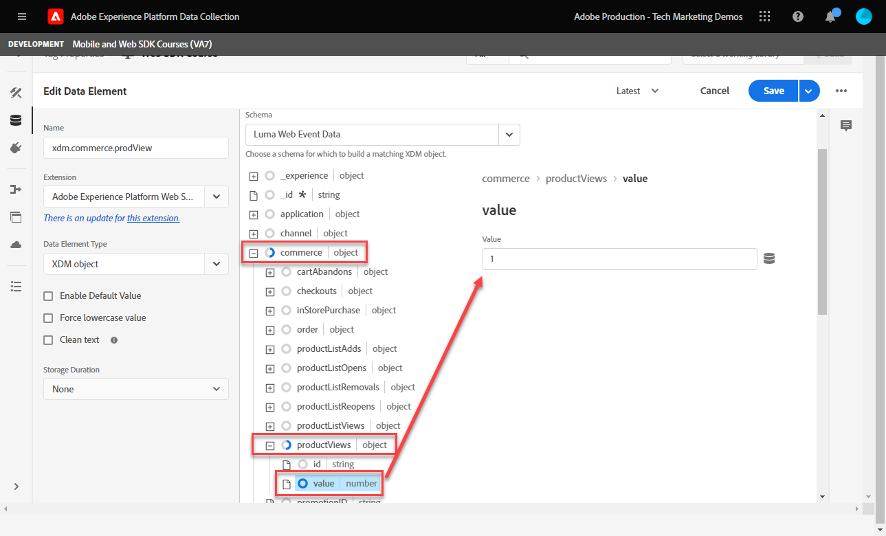
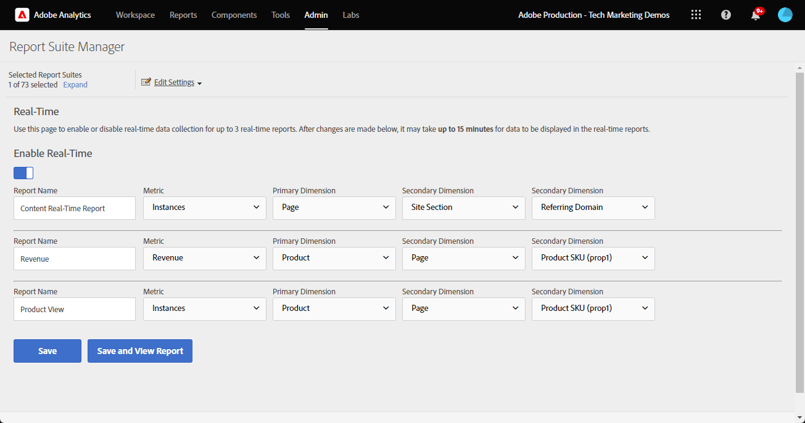

# 使用Platform Web SDK设置Adobe Analytics

了解如何使用 [Experience PlatformWeb SDK](https://experienceleague.adobe.com/docs/platform-learn/data-collection/web-sdk/overview.html)，创建标记规则以将数据发送到Adobe Analytics，并验证Analytics是否正在按预期捕获数据。

[Adobe Analytics](https://experienceleague.adobe.com/docs/analytics.html?lang=zh-Hans) 是一款行业领先的应用程序，可帮助您了解客户的身份和行为，并根据客户情报掌控业务发展方向。

## 学习目标

在本课程结束后，您将能够：

* 为Adobe Analytics配置XDM架构，并了解用于Analytics的自动映射XDM变量与手动映射XDM变量之间的区别
* 配置数据流以启用Adobe Analytics
* 将单个或整个数组数据元素映射到XDM对象
* 使用XDM对象在Adobe Analytics中捕获页面查看次数
* 使用Adobe Analytics产品字符串的XDM对象捕获电子商务数据
* 使用Debugger验证Adobe Analytics变量是通过XDM对象设置的
* 使用Adobe Analytics处理规则设置自定义变量
* 验证Adobe Analytics使用实时报表捕获的数据

## 先决条件

您熟悉标记、Adobe Analytics和 [Luma演示网站](https://luma.enablementadobe.com/content/luma/us/en.html){target=&quot;_blank&quot;}登录和购物功能。

您至少需要一个测试/开发报表包ID。 如果您没有可在本教程中使用的测试/开发报表包， [请创建一个](https://experienceleague.adobe.com/docs/analytics/admin/manage-report-suites/new-report-suite/t-create-a-report-suite.html).

您必须已完成教程中前几部分中的所有步骤：

* 初始配置
   * [配置权限](configure-permissions.md)
   * [配置XDM架构](configure-schemas.md)
   * [配置身份命名空间](configure-identities.md)
   * [配置数据流](configure-datastream.md)
* 标记配置
   * [安装Web SDK扩展](install-web-sdk.md)
   * [创建数据元素](create-data-elements.md)
   * [创建标记规则](create-tag-rule.md)
   * [使用Adobe Experience Platform Debugger进行验证](validate-with-debugger.md)

## XDM架构和Analytics变量

恭喜！您已在 [配置架构](configure-schemas.md) 课！

实施Platform Web SDK应尽可能与产品无关。 对于Adobe Analytics，在架构创建期间，或在标记规则配置期间，不会像传统方法那样映射eVar、prop和事件。 相反，每个XDM键值对都会变成一个上下文数据变量，该变量可通过以下两种方式之一映射到Analytics变量：

1. 使用保留的XDM字段自动映射变量
1. 使用Analytics处理规则手动映射的变量

要了解哪些XDM变量自动映射到Adobe Analytics，请参阅 [在Analytics中自动映射的变量](https://experienceleague.adobe.com/docs/experience-platform/edge/data-collection/adobe-analytics/automatically-mapped-vars.html?lang=en). 任何未自动映射的变量都必须手动映射。

在中创建的架构 [配置架构](configure-schemas.md) 本课程包含一些自动映射到Analytics变量的内容，如下表所示：

| XDM到Analytics的自动映射变量 | Adobe Analytics变量 |
|-------|---------|
| `identitymap.ecid.[0].id` | mid |
| `web.webPageDetails.pageViews.value` | 页面查看s.t()调用 |
| `web.webPageDetails.name` | s.pageName |
| `web.webPageDetails.server` | s.server |
| `web.webPageDetails.siteSection` | s.channel |
| `commerce.productViews.value` | prodView |
| `commerce.productListViews.value` | scView |
| `commerce.checkouts.value` | scCheckout |
| `commerce.purchases.value` | 购买 |
| `commerce.order.currencyCode` | s.currencyCode |
| `commerce.order.purchaseID` | s.purchaseID |
| `productListItems[].SKU` | s.products=;product name;;;（主要 — 请参阅下文的注释） |
| `productListItems[].name` | s.products=;product name;;;（回退 — 请参阅下面的注释） |
| `productListItems[].quantity` | s.products=;;product quantity;; |
| `productListItems[].priceTotal` | s.product=;;；产品价格； |

>[!NOTE]
>
>Analytics产品字符串的各个部分通过 `productListItems` 对象。
>自2022年8月18日起， `productListItems[].SKU` 优先映射到s.products变量中的产品名称。
>值设置为 `productListItems[].name` 仅在 `productListItems[].SKU` 不存在。 否则，该变量将处于未映射状态，并可在上下文数据中使用。
>请勿将空字符串或null设置为  `productListItems[].SKU`. 这会产生不希望的效果，即映射到s.products变量中的产品名称。


## 配置数据流

Platform Web SDK将数据从您的网站发送到Platform Edge Network。 然后，您的数据流会告知Platform Edge Network将该数据转发到何处(在本例中为哪些Adobe Analytics报表包)。

1. 转到 [数据收集](https://experience.adobe.com/#/data-collection){target=&quot;blank&quot;}接口
1. 在左侧导航中，选择 **[!UICONTROL 数据流]**
1. 选择之前创建的 `Luma Web SDK` 数据流

   

1. 选择 **[!UICONTROL 添加服务]**

   
1. 选择 **[!UICONTROL Adobe Analytics]** 作为 **[!UICONTROL 服务]**
1. 输入  **[!UICONTROL 报表包ID]** 开发报表包
1. 选择 **[!UICONTROL 保存]**

   

   >[!TIP]
   >
   >通过选择 **[!UICONTROL 添加报表包]** 等同于多包标记。

>[!WARNING]
>
>在本教程中，您只需配置开发Adobe Analytics报表包。 在为您自己的网站创建数据流时，您会为暂存和生产环境创建其他数据流和报表包。


## 创建其他数据元素

接下来，从Luma数据层捕获其他数据，并将其发送到Platform Edge Network。 虽然本课程重点介绍Adobe Analytics的常见要求，但根据您的数据流配置，您可以轻松地将捕获的所有数据发送到其他目标。 例如，如果您完成了Adobe Experience Platform课程，则您在本课程中捕获的其他数据也会发送到Platform。

### 创建电子商务数据元素

在创建数据元素课程中，您 [创建的JavaScript数据元素](create-data-elements.md#create-data-elements-to-capture-the-data-layer) 捕获了内容和身份详细信息。 现在，您将创建其他数据元素以捕获电子商务数据。 因为 [Luma演示网站](https://luma.enablementadobe.com/content/luma/us/en.html){target=&quot;_blank&quot;}对购物车中的产品详细信息页面和产品使用不同的数据层结构，您必须为每个方案创建数据元素。 使用以下提供的代码片段：

1. 打开您在教程中使用的标记属性
1. 转到 **[!UICONTROL 数据元素]**
1. 选择 **[!UICONTROL 添加数据元素]**
1. 将其命名为 **`product.productInfo.sku`**
1. 使用 **[!UICONTROL 自定义代码]** **[!UICONTROL 数据元素类型]**
1. 保留复选框 **[!UICONTROL 强制使用小写值]** 和 **[!UICONTROL 清理文本]** 未选中
1. 离开 `None` 作为 **[!UICONTROL 存储持续时间]** 设置，因为该值在每个页面上都不同
1. 选择 **[!UICONTROL Open Editor]**

   

1. 复制并粘贴以下代码

   ```javascript
   var cart = digitalData.product;
   var cartItem;
   cart.forEach(function(item){
   cartItem = item.productInfo.sku;
   });
   return cartItem;
   ```

1. 选择 **[!UICONTROL 保存]** 保存自定义代码

   

1. 选择 **[!UICONTROL 保存]** 保存数据元素

按照相同的步骤创建这些附加数据元素：

* **`product.productInfo.title`**

   ```javascript
   var cart = digitalData.product;
   var cartItem;
   cart.forEach(function(item){
   cartItem = item.productInfo.title;
   });
   return cartItem;
   ```

* **`cart.productInfo`**

   ```javascript
   var cart = digitalData.cart.cartEntries;
   var cartItem = [];
   cart.forEach(function(item, index, array){
   var qty = parseInt(item.qty);
   var price = parseInt(item.price);
   cartItem.push({
   "SKU": item.sku,
   "name":item.title,
   "quantity":qty,
   "priceTotal":price
   });
   });
   return cartItem;
   ```

添加这些数据元素并在 [创建数据元素](create-data-elements.md) 课程中，您应具有以下数据元素：

| 数据元素 |
-----------------------------|
| `cart.orderId` |
| `cart.productInfo` |
| `identityMap.loginID` |
| `page.pageInfo.hierarchie1` |
| `page.pageInfo.pageName` |
| `page.pageInfo.server` |
| `product.productInfo.sku` |
| `product.productInfo.title` |
| `user.profile.attributes.loggedIn` |
| `user.profile.attributes.username` |
| `xdm.content` |

>[!IMPORTANT]
>
>在本教程中，您将为每个事件创建一个不同的XDM对象。 这意味着您必须重新映射每次点击时都被视为“全局”可用的变量，如页面名称和identityMap。 但是，您可以 [合并对象](https://experienceleague.adobe.com/docs/experience-platform/tags/extensions/adobe/core/overview.html#merged-objects) 或使用 [映射表](https://exchange.adobe.com/experiencecloud.details.103136.mapping-table.html) 以在真实环境中更高效地管理XDM对象。 在本课程中，全局变量被视为：
>
>* **[!UICONTROL identityMap]** 以根据 [创建身份映射数据元素](create-data-elements.md#create-identity-map-data-element) 在 [创建数据元素](create-data-elements.md) 课程。
>* **[!UICONTROL web]** 用于根据 [内容XDM对象](create-data-elements.md#map-content-data-elements-to-XDM-Schema-individually) 在 [创建数据元素](create-data-elements.md) 上述每个数据元素的相关课程。


### 递增页面查看次数

在创建数据元素课程中，您 [已创建 `xdm.content` 数据元素](create-data-elements.md#map-content-data-elements-to-xdm-schema-individually) 以捕获内容维度。 由于您现在向Adobe Analytics发送数据，因此还必须映射额外的XDM字段，以指示应将信标作为Analytics的页面查看进行处理。

1. 打开 `xdm.content` 数据元素
1. 向下滚动并选择以打开，直到 `web.webPageDetails`
1. 选择以打开 **[!UICONTROL pageViews]** 对象
1. 已设置 **[!UICONTROL 值]** to `1`
1. 选择 [!UICONTROL **保存**]

   

>[!TIP]
>
>此字段等同于发送 **`s.t()`** 用于Analytics的页面查看信标(使用 `AppMeasurement.js`. 对于链接点击信标，请设置 `webInteraction.linkClicks.value` to `1`


### 设置产品字符串

在映射到产品字符串之前，请务必了解XDM架构中有两个用于捕获与Adobe Analytics有特殊关系的电子商务数据的主要对象：

1. 的 `commerce` 对象设置Analytics事件，例如 `prodView`, `scView`和 `purchase`
1. 的 `productListItems` 对象设置Analytics维度，例如 `productID`.

请参阅 [收集商务和产品数据](https://experienceleague.adobe.com/docs/experience-platform/edge/data-collection/collect-commerce-data.html?lang=en) 以了解更多详细信息。

另外，您还必须了解 **[!UICONTROL 提供单个属性]** 到单个XDM字段或 **[!UICONTROL 提供整个阵列]** 到XDM对象。


### 将单个属性映射到XDM对象

您可以映射到各个变量，以捕获Luma演示网站产品详细信息页面上的数据：

1. 创建 **[!UICONTROL XDM对象]** **[!UICONTROL 数据元素类型]** 已命名 **`xdm.commerce.prodView`**
1. 选择之前课程中使用的相同平台沙箱和XDM架构
1. 打开 **[!UICONTROL 商务]** 对象
1. 打开 **[!UICONTROL productViews]** 对象和集 **[!UICONTROL 值]** to `1`

   

   >[!TIP]
   >
   >此步骤等同于设置 `prodView` Analytics中的事件


1. 向下滚动到并选择 `productListItems` 阵列
1. 选择 **[!UICONTROL 提供单个项目]**
1. 选择 **[!UICONTROL 添加项目]**

   

   >[!CAUTION]
   >
   >的 **`productListItems`** 是 `array` 数据类型，以便它希望数据作为元素集合传入。 由于Luma演示网站的数据层结构，并且由于一次只能在Luma网站上查看一个产品，因此您将逐个添加项目。 在您自己的网站上实施时，根据数据层结构的不同，您可能能够提供整个阵列。

1. 选择以打开 **[!UICONTROL 项目1]**
1. 将以下XDM变量映射到数据元素

   * **`productListItems.item1.SKU`** to `%product.productInfo.sku%`
   * **`productListItems.item1.name`** to `%product.productInfo.title%`

   

   >[!IMPORTANT]
   >
   >在保存此XDM对象之前，请确保还设置“全局”变量和页面查看增量：
   >

1. 选择 **[!UICONTROL 保存]**

### 将整个数组映射到XDM对象

如前所述，Luma演示网站对购物车中的产品使用不同的数据层结构。 自定义代码数据元素 `cart.productInfo` 您之前创建的数据元素通过 `digitalData.cart.cartEntries` 数据层对象，并将其转换为所需的XDM对象模式。 新格式 **必须完全匹配** 由 `productListItems` 对象。

要说明这一点，请参阅下面Luma网站数据层（左）与已翻译数据元素（右）的比较：


比较数据元素与 `productListItems` 结构（提示，应匹配）。

>[!IMPORTANT]
>
>请注意数字变量的翻译方式，以及数据层中的字符串值，例如 `price` 和 `qty` 已重新格式化为数据元素中的数字。 这些格式要求对平台中的数据完整性非常重要，在 [配置架构](configure-schemas.md) 中。 在示例中， **[!UICONTROL 数量]** 使用 **[!UICONTROL 整数]** 数据类型。
> 

现在，返回到将XDM对象映射到整个数组。 创建XDM对象数据元素以捕获购物车页面上的产品：

1. 创建 **[!UICONTROL XDM对象]** **[!UICONTROL 数据元素类型]** 已命名 **`xdm.commerce.cartView`**
1. 选择您在本教程中使用的相同平台沙盒和XDM架构
1. 打开 **[!UICONTROL 商务]** 对象
1. 打开 **[!UICONTROL productListViews]** 对象和集 `value` to `1`

   >[!TIP]
   >
   >此步骤等同于设置 `scView` Analytics中的事件

1. 向下滚动到并选择 **[!UICONTROL productListItems]** 阵列
1. 选择 **[!UICONTROL 提供整个阵列]**
1. 映射到 **`cart.productInfo`** 数据元素

   

   >[!IMPORTANT]
   >
   >在保存此XDM对象之前，请确保还设置“全局”变量和页面查看增量：
   >

1. 选择 **[!UICONTROL 保存]**

创建其他 **[!UICONTROL XDM对象]**  **[!UICONTROL 数据元素类型]** 的结账 `xdm.commerce.checkout`. 这次将 **[!UICONTROL commerce.checkouts.value]** to `1`，地图 **[!UICONTROL productListItems]** to **`cart.productInfo`** ，并添加“全局”变量和页面查看计数器。

>[!TIP]
>
>此步骤等同于设置 `scCheckout` Analytics中的事件


捕获 `purchase` 事件：

1. 创建其他  **[!UICONTROL XDM对象]**  **[!UICONTROL 数据元素类型]** 已调用 `xdm.commerce.purchase`
1. 打开 **[!UICONTROL 商务]** 对象
1. 打开 **[!UICONTROL 订购]** 对象
1. 地图 **[!UICONTROL purchaseID]** 到 `cart.orderId` 数据元素
1. 已设置 **[!UICONTROL currencyCode]** 硬编码值 `USD`

   

   >[!TIP]
   >
   >这等同于设置 `s.purcahseID` 和 `s.currencyCode` 变量

1. 选择以打开 `purchases` 对象和集 `value` to `1`
   >[!TIP]
   >
   >这等同于设置 `purchase` Analytics中的事件

   >[!IMPORTANT]
   >
   >在保存此XDM对象之前，请确保还设置“全局”变量和页面查看增量：
   >

1. 选择 **[!UICONTROL 保存]**

在这些步骤的末尾，您应该创建以下五个XDM对象数据元素：

| XDM对象数据元素 |
-----------------------------|
| `xdm.commerce.cartView` |
| `xdm.commerce.checkout` |
| `xdm.commerce.prodView` |
| `xdm.commerce.purchase` |
| `xdm.content` |


## 为平台Web SDK创建其他规则

创建多个XDM对象数据元素后，您便可以使用规则设置信标。 在本练习中，您可以为每个电子商务事件创建单独的规则，并使用条件，以便规则在正确的页面上触发。 让我们从产品查看事件开始。

1. 从左侧导航中，选择 **[!UICONTROL 规则]** 然后选择 **[!UICONTROL 添加规则]**
1. 将其命名为  [!UICONTROL `product view - library load - AA`]
1. 在 **[!UICONTROL 事件]**，选择 **[!UICONTROL Library Loaded(Page Top)]**
1. 在 **[!UICONTROL 条件]**，选择 **[!UICONTROL 添加]**

   

1. 离开 **[!UICONTROL 逻辑类型]** as **[!UICONTROL 常规]**
1. 离开 **[!UICONTROL 扩展]** as **[!UICONTROL 核心]**
1. 选择 **[!UICONTROL 条件类型]** as **[!UICONTROL 不含查询字符串的路径]**
1. 在右侧，启用 **[!UICONTROL Regex]** 切换
1. 在 **[!UICONTROL 路径等于]** set `/products/`. 对于Luma演示网站，它可确保规则仅在产品页面上触发
1. 选择 **[!UICONTROL 保留更改]**

   

1. 在 **[!UICONTROL 操作]** 选择 **[!UICONTROL 添加]**
1. 选择 **[!UICONTROL Adobe Experience Platform Web SDK]** 扩展
1. 选择 **[!UICONTROL 操作类型]** as **[!UICONTROL 发送事件]**
1. 的 **[!UICONTROL 类型]** 字段中有一个值下拉列表可供选择。 选择 `[!UICONTROL commerce.productViews]`

   >[!TIP]
   >
   >此处选择的值对数据映射到Analytics的方式没有影响，但建议仔细应用此变量，因为它用在Adobe Experience Platform的区段生成器界面中。 所选值可在 `[!UICONTROL c.a.x.eventtype]` 下游的上下文数据变量。

1. 在 **[!UICONTROL XDM数据]**，选择 `[!UICONTROL xdm.commerce.prodView]` XDM对象数据元素
1. 选择 **[!UICONTROL 保留更改]**

   

1. 您的规则应类似于以下内容。 选择 **[!UICONTROL 保存]**

   


使用以下参数对所有其他电子商务事件重复相同的步骤：

**规则名称**:购物车视图 — 库加载 — AA

* **[!UICONTROL 事件类型]**:Library Loaded(Page Top)
* **[!UICONTROL 条件]**:/content/luma/us/en/user/cart.html
* **在“Web SDK — 发送操作”下键入值**:commerce.productListViews
* **适用于Web SDK的XDM数据 — 发送操作：** `%xdm.commerce.cartView%`

**规则名称**:checkout — 库加载 — AA

* **[!UICONTROL 事件类型]**:Library Loaded(Page Top)
* **[!UICONTROL 条件]** /content/luma/us/en/user/checkout.html
* **Web SDK类型 — 发送操作**:commerce.checkouts
* **适用于Web SDK的XDM数据 — 发送操作：** `%xdm.commerce.checkout%`

**规则名称**:purchase — 库加载 — AA

* **[!UICONTROL 事件类型]**:Library Loaded(Page Top)
* **[!UICONTROL 条件]** /content/luma/us/en/user/checkout/order/thank-you.html
* **Web SDK类型 — 发送操作**:commerce.purches
* **适用于Web SDK的XDM数据 — 发送操作：** `%xdm.commerce.purchase%`

完成后，您应会看到已创建的以下规则。


## 构建开发环境

将新数据元素和规则添加到 `Luma Web SDK Tutorial` 标记库并重新构建开发环境。


## 验证Adobe Analytics的Platform Web SDK

在 [Debugger](validate-with-debugger.md) 课程中，您学习了如何使用Platform Debugger和浏览器开发人员控制台检查客户端XDM对象信标，这与调试方式类似 `AppMeasurement.js` Analytics实施。 要验证Analytics是否通过Platform Web SDK正确捕获数据，您必须进一步执行两个步骤：

1. 使用Platform Edge Network上Debugger的Edge Trace功能验证Experience Platform由XDM对象处理数据的方式
1. 使用处理规则和实时报表验证Analytics如何处理数据。

### 使用边缘描摹

了解如何使用Debugger的“边缘跟踪”功能验证Adobe Analytics是否正在捕获ECID、页面查看次数、产品字符串和电子商务事件。

### Experience CloudID验证

1. 转到 [Luma演示网站](https://luma.enablementadobe.com/content/luma/us/en.html){target=&quot;_blank&quot;}并使用Experience Platform调试器 [将网站上的标记资产切换到您自己的开发资产](validate-with-debugger.md#use-the-experience-platform-debugger-to-map-to-your-tags-property)

   >[!WARNING]
   >
   >在继续之前，请确保您已登录Luma网站。  如果您未登录，则Luma网站将不允许您结帐。
   >
   > 1. 在Luma中，选择右上方的登录按钮，然后使用凭据 **u:test@adobe.com p:测试** 验证
   >
   > 1. 系统会自动将您重定向到 [滴滴体育观看产品页](https://luma.enablementadobe.com/content/luma/us/en/products/gear/watches/didi-sport-watch.html#24-WG02) 在下次加载页面时


1. 要启用“边缘跟踪”，请转到Experience Platform调试器，在左侧导航中选择 **[!UICONTROL 日志]**，然后选择 **[!UICONTROL Edge]** ，然后选择 **[!UICONTROL 连接]**

   

1. 现在为空

   

1. 刷新 [滴滴体育观看产品页](https://luma.enablementadobe.com/content/luma/us/en/products/gear/watches/didi-sport-watch.html#24-WG02) 然后再次检查Experience Platform调试器，您应会看到数据传入。 以开头的行 **[!UICONTROL Analytics自动映射RSID]** 是Adobe Analytics信标
1. 选择以同时打开 `[!UICONTROL mappedQueryParams]` 下拉菜单和第二个下拉菜单，用于查看Analytics变量

   

   >[!TIP]
   >
   >第二个下拉列表对应于您将数据发送到的Analytics报表包ID。 它应该与您自己的报表包相匹配，而不是屏幕截图中的报表包。

1. 向下滚动以查找 `[!UICONTROL c.a.x.identitymap.ecid.[0].id]`. 它是一个可捕获ECID的上下文数据变量
1. 继续向下滚动直到看到Analytics为止 `[!UICONTROL mid]` 变量。 两个ID都与您设备的Experience CloudID匹配。

   

   >[!NOTE]
   >
   >由于您已登录，请花些时间验证已验证的ID `112ca06ed53d3db37e4cea49cc45b71e` 对于用户 **test@adobe.com** 也会在 `[!UICONTROL c.a.x.identitymap.lumacrmid.[0].id]`


### 内容页面查看次数

您可以使用相同的信标来验证Analytics捕获的内容页面查看次数。

1. 查找 `[!UICONTROL c.a.x.web.webpagedetails.pageviews.value]=1`. 它告诉你 `s.t()` 页面查看信标正在被发送到Analytics
1. 向下滚动以查看 `[!UICONTROL gn]` 变量。 它是 `[!UICONTROL s.pageName]` 变量。 它会从数据层捕获页面名称。

   

### 产品字符串和电子商务事件

由于您已在产品页面上，因此本练习将继续使用相同的边缘跟踪来验证Analytics捕获的产品数据。 产品字符串事件和电子商务事件都会自动将XDM变量映射到Analytics。 只要您已映射到 `productListItem` XDM变量，而 [为Adobe Analytics配置XDM架构](setup-analytics.md#configure-an-xdm-schema-for-adobe-analytics)，平台边缘网络负责将数据映射到正确的分析变量。

1. 首先验证 `Product String` 已设置
1. 查找 `[!UICONTROL c.a.x.productlistitems.][0].[!UICONTROL sku]`. 变量可捕获您映射到的数据元素值 `productListItems.item1.sku` 本课的前面
1. 向下滚动以查看 `[!UICONTROL pl]` 变量。 它是Analytics产品字符串变量的动态语法
1. 这两个值都与数据层中可用的产品名称匹配

   

边迹处理 `commerce` 事件与 `productList` 维度。 您看不到映射到的上下文数据变量的方式与查看映射到的产品名称的方式相同 `[!UICONTROL c.a.x.productlistitem.[0].name]` 上。 边缘跟踪而是会在Analytics中显示最终事件自动映射 `event` 变量。 只要您映射到适当的XDM，平台边缘网络就会相应地映射该ID `commerce` 变量 [配置Adobe Analytics架构](setup-analytics.md#configure-an-xdm-schema-for-adobe-analytics);在本例中， `commerce.productViews.value=1`.

1. 返回Experience Platform调试器窗口，向下滚动到 `[!UICONTROL event]` 变量，则会将其设置为 `[!UICONTROL prodView]`

   

验证为Analytics设置的其余电子商务事件和产品字符串。

1. 添加 [滴滴运动手表](https://luma.enablementadobe.com/content/luma/us/en/products/gear/watches/didi-sport-watch.html#24-WG02) 购物车
1. 转到 [购物车页面](https://luma.enablementadobe.com/content/luma/us/en/user/cart.html)，检查边缘跟踪 `[!UICONTROL events: "scView"]` 和产品字符串

   

1. 继续检出，检查Edge Trace以查找 `[!UICONTROL events: "scCheckout"]` 和产品字符串

   

1. 只填写 **名字** 和 **姓氏** 字段，然后选择 **继续**. 在下一页，选择 **下单**
1. 在确认页面上，检查Edge Trace以查找

   * 正在设置购买事件 `[!UICONTROL events: "purchase"]`
   * 正在设置的货币代码变量 `[!UICONTROL cc: "USD"]`
   * 正在设置的购买ID `[!UICONTROL pi]`
   * 产品字符串 `[!UICONTROL pl]` 设置产品名称、数量和价格

   

## 处理规则和实时报表

现在，您已通过边缘跟踪验证Analytics信标，接下来您还可以使用实时报表验证Analytics处理的数据。 在检查实时报表之前，必须配置Analytics的处理规则 `props` 根据需要。

### 自定义Analytics映射的处理规则

在本练习中，您会将一个XDM变量映射到一个prop，以便在实时报表中查看。 对于必须对任何 `eVar`, `prop`, `event`，或可通过处理规则访问的变量。

1. 在Analytics UI中，转到 [!UICONTROL 管理员] > [!UICONTROL 管理工具] > [!UICONTROL 报表包 ]
1. 选择您在教程中使用的开发/测试报表包> [!UICONTROL 编辑设置] > [!UICONTROL 常规] > [!UICONTROL 处理规则]

   

1. 创建规则以 **[!UICONTROL 覆盖的值]** `[!UICONTROL Product Name (prop1)]` to `a.x.productlistitems.0.name`. 请记住添加注释以说明创建规则的原因，并命名规则标题。 选择 **[!UICONTROL 保存]**

   

   >[!IMPORTANT]
   >
   >首次映射到处理规则时，UI不会显示XDM对象中的上下文数据变量。 要修复该问题，请选择任意值，请保存，然后返回以进行编辑。 此时应会显示所有XDM变量。

1. 转到 [!UICONTROL 编辑设置] >  [!UICONTROL 实时]. 使用以下显示的参数配置所有这三个参数，以便您能够验证内容页面查看、产品查看和购买

   

1. 重复验证步骤，您应会看到实时报表会相应地填充数据。

   **Page Views**
   

   **产品查看次数**
   

   **购买**
   

1. 在工作区UI中，创建一个表格以查看您购买产品的整个电子商务流程

   

要了解有关将XDM字段映射到Analytics变量的更多信息，请观看视频 [将Web SDK变量映射到Adobe Analytics](https://experienceleague.adobe.com/docs/analytics-learn/tutorials/analysis-use-cases/internal-site-search/map-web-sdk-variables-into-adobe-analytics.html).

恭喜！本课程将结束，现在，您准备好使用Platform Web SDK为自己的网站实施Adobe Analytics。

[下一个： ](setup-audience-manager.md)

>[!NOTE]
>
>感谢您花时间学习Adobe Experience Platform Web SDK。 如果您有任何疑问、想要分享一般反馈或对未来内容提出建议，请就此分享 [Experience League社区讨论帖子](https://experienceleaguecommunities.adobe.com/t5/adobe-experience-platform-launch/tutorial-discussion-implement-adobe-experience-cloud-with-web/td-p/444996)
