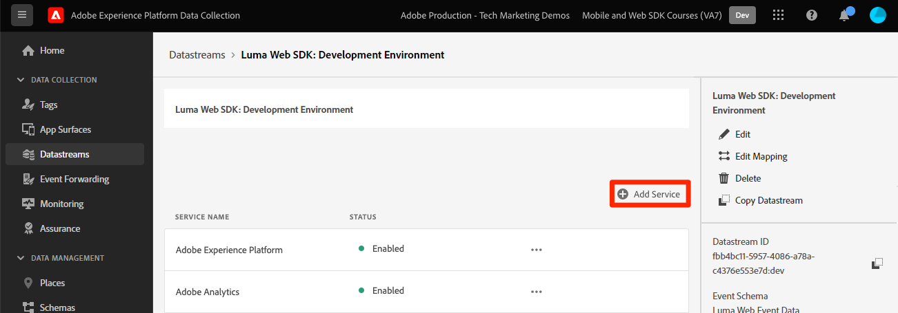

# 使用Platform Web SDK设置Audience Manager

了解如何使用 Adobe Experience Platform Web SDK 设置 Adobe Audience Manager 并使用 cookie 目标验证实施。

[Adobe Audience Manager](https://experienceleague.adobe.com/zh-hans/docs/audience-manager)是一种Adobe Experience Cloud解决方案，它提供了收集与网站访客有关的商业相关信息、创建可销售的区段以及向合适的受众提供定向广告和内容所需的一切。

## 学习目标

在本课程结束后，您将能够：

* 配置数据流以启用Audience Manager
* 在Audience Manager中启用Cookie目标
* 通过Adobe Experience Platform Debugger确认受众资格来验证Audience Manager实施

## 先决条件

要完成本课程，您必须首先：

* 完成本教程的初始配置和标记配置部分中之前的课程。
* 有权访问Adobe Audience Manager以及创建、读取和写入特征、区段和目标的相应权限。 有关详细信息，请查阅[Audience Manager基于角色的访问控制](https://experienceleague.adobe.com/zh-hans/docs/audience-manager-learn/tutorials/setup-and-admin/user-management/setting-permissions-with-role-based-access-control)。

## 配置数据流

使用Platform Web SDK的Audience Manager实施与使用[服务器端转发(SSF)](https://experienceleague.adobe.com/zh-hans/docs/analytics/admin/admin-tools/manage-report-suites/edit-report-suite/report-suite-general/server-side-forwarding/ssf)的实施不同。 服务器端转发将Adobe Analytics请求数据传递到Audience Manager。 Platform Web SDK实施将发送到Platform Edge Network的XDM数据传递到Audience Manager。 在数据流中启用了Audience Manager：

1. 转到[数据收集](https://experience.adobe.com/#/data-collection){target="blank"}接口
1. 在左侧导航中，选择&#x200B;**[!UICONTROL 数据流]**
1. 选择之前创建的`Luma Web SDK: Development Environment`数据流

   

1. 选择&#x200B;**[!UICONTROL 添加服务]**
   
1. 选择&#x200B;**[!UICONTROL Adobe Audience Manager]**&#x200B;作为&#x200B;**[!UICONTROL 服务]**
1. 确认已选择&#x200B;**[!UICONTROL 已启用Cookie目标]**&#x200B;和&#x200B;**[!UICONTROL 已启用URL目标]**
1. 选择&#x200B;**[!UICONTROL 保存]**
   

## 创建数据源

接下来，创建一个[Data Source](https://experienceleague.adobe.com/zh-hans/docs/audience-manager/user-guide/features/data-sources/datasources-list-and-settings)，这是用于在Audience Manager中组织数据的基本工具：

1. 转到[Audience Manager](https://experience.adobe.com/#/audience-manager/)界面
1. 从顶部导航中选择&#x200B;**[!UICONTROL 受众数据]**
1. 从下拉菜单中选择&#x200B;**[!UICONTROL 数据源]**
1. 从数据源页面顶部选择&#x200B;**[!UICONTROL 新增]**&#x200B;按钮

   

1. 为数据Source提供一个易记的名称和描述。 对于初始设置，您可以为此`Platform Web SDK tutorial`命名。
1. 将&#x200B;**[!UICONTROL ID类型]**&#x200B;设置为&#x200B;**[!UICONTROL Cookie]**
1. 在&#x200B;**[!UICONTROL 数据导出控件]**&#x200B;部分中，选择&#x200B;**[!UICONTROL 无限制]**

   

1. **[!UICONTROL 保存]**&#x200B;数据Source

## 创建特征

保存数据Source后，设置[特征](https://experienceleague.adobe.com/zh-hans/docs/audience-manager/user-guide/features/traits/traits-overview)。 特征是Audience Manager中一个或多个信号的组合。 为主页访客创建特征。

>[!NOTE]
>
>所有XDM数据都会发送到Audience Manager（如果在数据流中启用），但是，数据可能需要24小时才能在“未使用的信号”报表中可用。 为您希望在Audience Manager中立即使用的XDM数据创建显式特征，如本练习中所述。

1. 选择&#x200B;**[!UICONTROL 受众数据]** > **[!UICONTROL 特征]**
1. 选择&#x200B;**[!UICONTROL 添加新]** > **[!UICONTROL 基于规则的]**&#x200B;特征

   

1. 为您的特征提供一个友好名称和描述，`Luma homepage view`
1. 选择您在上一部分中创建的&#x200B;**[!UICONTROL Data Source]**。
1. **[!UICONTROL 选择要在右窗格中保存特征的文件夹]**。 您可能希望通过&#x200B;**选择现有父文件夹旁边的+图标**&#x200B;来创建文件夹。 您可以命名此新文件夹`Platform Web SDK tutorial`。
1. 展开&#x200B;**[!UICONTROL 特征表达式]**&#x200B;插入符号并选择&#x200B;**[!UICONTROL 表达式生成器]**&#x200B;您必须提供一个表示访问主页的键值对。
1. 打开[Luma主页](https://luma.enablementadobe.com/content/luma/us/en.html)（映射到您的标记属性）和&#x200B;**Adobe Experience Platform Debugger**，然后刷新该页面。
1. 查看Platform Web SDK的网络请求和事件详细信息，找到主页的密钥和名称值。
   
1. 返回到Audience Manager UI中的表达式生成器，并输入键为&#x200B;**`web.webPageDetails.name`**&#x200B;和值&#x200B;**`content:luma:us:en`**。 此步骤可确保每次加载主页时都会触发一个特征。
1. **[!UICONTROL 保存]**&#x200B;特征。

## 创建区段

后续步骤是创建&#x200B;**区段**&#x200B;并将新定义的特征分配给此区段。

1. 在顶部导航中选择&#x200B;**[!UICONTROL 受众数据]**，然后选择&#x200B;**[!UICONTROL 区段]**
1. 选择页面左上角的&#x200B;**[!UICONTROL 新增]**&#x200B;以打开区段生成器
1. 为您的区段提供一个友好的名称和描述，如`Platform Web SDK - Homepage visitors`
1. **[!UICONTROL 选择将区段保存在右窗格中的文件夹]**。 您可能希望通过&#x200B;**选择现有父文件夹旁边的+图标**&#x200B;来创建文件夹。 您可以命名此新文件夹`Platform Web SDK tutorial`。
1. 添加一个集成代码，在本例中为一组随机数字。
1. 在&#x200B;**[!UICONTROL 数据Source]**&#x200B;部分中，选择&#x200B;**[!UICONTROL Audience Manager]**&#x200B;以及您之前创建的数据源
1. 展开&#x200B;**[!UICONTROL 特征]**&#x200B;部分并搜索您创建的特征
1. 选择&#x200B;**[!UICONTROL 添加特征]**。
1. 选择页面底部的&#x200B;**[!UICONTROL 保存]**

   

   

## 创建目标

接下来，使用&#x200B;**目标生成器**&#x200B;创建基于&#x200B;**Cookie的目标**。 目标生成器允许您创建和管理Cookie、URL和服务器到服务器目标。

1. 通过在顶部导航的&#x200B;**[!UICONTROL 受众数据]**&#x200B;菜单中选择&#x200B;**目标**&#x200B;打开目标生成器
1. 选择&#x200B;**[!UICONTROL 创建目标]**
1. 输入名称和描述，`Platform Web SDK tutorial`
1. 作为&#x200B;**[!UICONTROL 类别]**，选择&#x200B;**[!UICONTROL 自定义]**
1. 对于&#x200B;**[!UICONTROL Type]**，请选择&#x200B;**[!UICONTROL Cookie]**

   

1. 打开&#x200B;**[!UICONTROL 配置]**&#x200B;部分以输入有关Cookie目标的详细信息
1. 为您的Cookie提供一个友好名称`platform_web_sdk_tutorial`
1. 作为&#x200B;**[!UICONTROL Cookie域]**，添加您计划集成的网站的域，在教程中输入Luma域`luma.enablementadobe.com`
1. 作为&#x200B;**[!UICONTROL 将数据发布到]**&#x200B;选项，请仅选择&#x200B;**[!UICONTROL 选定的域]**
1. 选择您的域（如果尚未添加）
1. 以&#x200B;**[!UICONTROL 数据格式]**&#x200B;形式，选择&#x200B;**[!UICONTROL Single Key]**，并为您的Cookie提供一个密钥。 对于本教程，请使用`segment`作为键值。
1. 最后，选择&#x200B;**[!UICONTROL 保存]**&#x200B;以保存目标配置详细信息。

   

<!--
   

   
-->

1. 在&#x200B;**[!UICONTROL 区段映射]**&#x200B;部分中，使用&#x200B;**[!UICONTROL 搜索并添加区段]**&#x200B;功能搜索您之前创建的`Platform Web SDK - Homepage visitors`并选择&#x200B;**[!UICONTROL 添加]**。

1. 添加区段后，将打开一个弹出窗口，您必须在Cookie中提供预期值。 对于此练习，请输入值“hpvisitor”。

1. 选择&#x200B;**[!UICONTROL 保存]**

1. 选择&#x200B;**[!UICONTROL 完成]**
   

区段映射期间需要几个小时才能激活。 完成后，您可以刷新Audience Manager界面并看到&#x200B;**映射的区段**&#x200B;列表已更新。

## 验证区段

在最初创建区段数小时后，您可以验证它是否正常运行。

首先，确认您符合该区段的条件

1. 打开[Luma演示网站主页](https://luma.enablementadobe.com/content/luma/us/en.html)并将其映射到您的标记属性，以符合您新创建的区段的条件。
1. 打开浏览器的&#x200B;**开发人员工具** > **网络**&#x200B;选项卡
1. 使用`interact`作为文本筛选器筛选到Platform Web SDK请求
1. 选择呼叫并打开&#x200B;**预览**&#x200B;选项卡以查看响应详细信息
1. 展开&#x200B;**有效负载**&#x200B;以查看预期的Cookie详细信息，如之前在Audience Manager中所配置。 在此示例中，您将看到预期的Cookie名称`platform_web_sdk_tutorial`。

   

1. 打开&#x200B;**应用程序**&#x200B;选项卡，然后从&#x200B;**存储**&#x200B;菜单中打开&#x200B;**Cookie**。
1. 选择&#x200B;**`https://luma.enablementadobe.com`**&#x200B;域并确认您的Cookie已正确写入列表中

   

最后，您应该在Audience Manager界面中打开区段，并确保&#x200B;**区段人口**&#x200B;已增加：

现在您已完成本课程，应该能够了解Platform Web SDK如何将数据传递到Audience Manager，以及如何使用Cookie目标设置特定于区段的第一方Cookie。

>[!NOTE]
>
>感谢您投入时间学习Adobe Experience Platform Web SDK。 如果您有疑问、希望分享一般反馈或有关于未来内容的建议，请在此[Experience League社区讨论帖子](https://experienceleaguecommunities.adobe.com/t5/adobe-experience-platform-data/tutorial-discussion-implement-adobe-experience-cloud-with-web/td-p/444996)上分享这些内容
