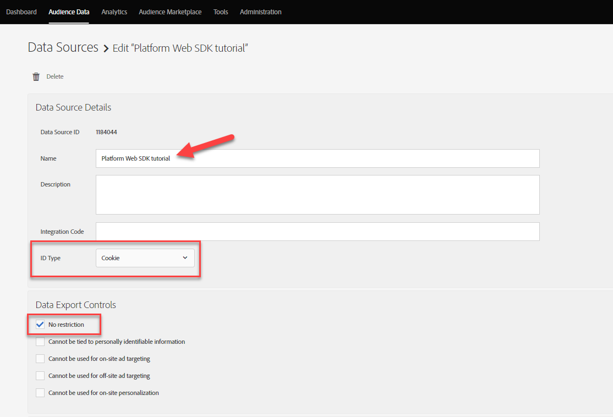

# 使用Platform Web SDK设置Audience Manager

了解如何使用Platform Web SDK设置Adobe Audience Manager，以及使用Cookie目标验证实施。

[Adobe Audience Manager](https://experienceleague.adobe.com/docs/audience-manager.html) 是Adobe Experience Cloud解决方案，可提供收集与网站访客有关的商业相关信息、创建可销售的区段以及向正确的受众提供有针对性的广告和内容所需的一切功能。

## 学习目标

在本课程结束后，您将能够：

* 配置数据流以启用Audience Manager
* 在Audience Manager中启用Cookie目标
* 通过使用Adobe Experience Platform Debugger确认受众资格来验证Audience Manager实施

## 先决条件

要完成本课程，您必须先：

* 完成本教程初始配置和标记配置部分中的前面课程。
* 拥有Adobe Audience Manager的访问权限，以及创建、读取和写入特征、区段和目标的相应权限。 欲知更多信息，请查阅 [Audience Manager基于角色的访问控制](https://experienceleague.adobe.com/docs/audience-manager-learn/tutorials/setup-and-admin/user-management/setting-permissions-with-role-based-access-control.html?lang=en).

## 配置数据流

使用Platform Web SDK的Audience Manager实施与使用的实施不同 [服务器端转发(SSF)](https://experienceleague.adobe.com/docs/analytics/admin/admin-tools/server-side-forwarding/ssf.html?lang=zh-Hans). 服务器端转发将Adobe Analytics请求数据传递到Audience Manager。 Platform Web SDK实施可将发送到Platform Edge Network的XDM数据传递到Audience Manager。 Audience Manager在数据流中启用：

1. 转到 [数据收集](https://experience.adobe.com/#/data-collection){target=&quot;blank&quot;}接口
1. 在左侧导航中，选择 **[!UICONTROL 数据流]**
1. 选择之前创建的 `Luma Web SDK` 数据流

   

1. 选择 **[!UICONTROL 添加服务]**

   
1. 选择 **[!UICONTROL Adobe Audience Manager]** 作为 **[!UICONTROL 服务]**
1. 确认 **[!UICONTROL Cookie目标已启用]** 和 **[!UICONTROL 启用URL目标]** 已选定
1. 选择 **[!UICONTROL 保存]**

   

## 创建数据源

接下来，创建 [数据源](https://experienceleague.adobe.com/docs/audience-manager/user-guide/features/data-sources/datasources-list-and-settings.html?lang=en)，这是在Audience Manager中组织数据的基本工具：

1. 转到 [Audience Manager](https://experience.adobe.com/#/audience-manager/) 界面
1. 选择 **[!UICONTROL 受众数据]** 从顶部导航
1. 选择 **[!UICONTROL 数据源]** 从下拉菜单
1. 选择 **[!UICONTROL 新增]** 按钮

   

1. 为数据源提供易记名称和描述。 对于初始设置，您可以将其命名为`Platform Web SDK tutorial`.
1. 已设置 **[!UICONTROL ID类型]** to **[!UICONTROL Cookie]**
1. 在 **[!UICONTROL 数据导出控制]** 选择 **[!UICONTROL 无限制]**

   

1. **[!UICONTROL 保存]** 数据源

## 创建特征

保存数据源后，设置 [特征](https://experienceleague.adobe.com/docs/audience-manager/user-guide/features/traits/traits-overview.html?lang=en). 特征是Audience Manager中一个或多个信号的组合。 为主页访客创建特征。

>[!NOTE]
>
>如果在数据流中启用了所有XDM数据，则会将其发送到Audience Manager，但在未使用的信号报表中提供该数据之前，可能会花费24小时。 如本练习中所述，为要在Audience Manager中立即使用的XDM数据创建显式特征。

1. 选择 **[!UICONTROL 受众数据]** >  **[!UICONTROL 特征]**
1. 选择 **[!UICONTROL 新增]** >  **[!UICONTROL 基于规则]** 特征

   

1. 为您的特征提供一个友好名称和描述， `Luma homepage view`
1. 选择 **[!UICONTROL 数据源]** 您在上一部分中创建。
1. **[!UICONTROL 选择文件夹]** 在右侧窗格中保存您的特征。 您可能想要通过 **选择+图标** 父文件夹旁边。 您可以将此新文件夹命名为 `Platform Web SDK tutorial`.
1. 展开 **[!UICONTROL 特征表达式]** 插入符号和选择 **[!UICONTROL 表达式生成器]** 您必须提供表示主页访问的键值对。
1. 打开 [Luma主页](https://luma.enablementadobe.com/content/luma/us/en.html) （映射到您的标记属性）和 **Platform Web SDK调试器** 并刷新页面。
1. 查看Platform Web SDK的“网络请求”和事件详细信息，以查找主页的键和名称值。
   
1. 返回到Audience ManagerUI中的表达式生成器，然后输入键作为 **`web.webPageDetails.name`** 和 **`content:luma:us:en`**. 此步骤可确保您在每次加载主页时触发特征。
1. **[!UICONTROL 保存]** 特征。

## 创建区段

下一步是创建 **区段**，并将新定义的特征分配给此区段。

1. 选择 **[!UICONTROL 受众数据]** ，然后选择 **[!UICONTROL 区段]**
1. 选择 **[!UICONTROL 新增]** ，以打开区段生成器
1. 为区段提供友好名称和描述，例如 `Platform Web SDK - Homepage visitors`
1. **[!UICONTROL 选择文件夹]** 区段将保存在右侧窗格中的位置。 您可能想要通过 **选择+图标** 父文件夹旁边。 您可以将此新文件夹命名为 `Platform Web SDK tutorial`.
1. 添加集成代码，在本例中，该代码是一组随机数。 1.在 **[!UICONTROL 数据源]** 选择 **[!UICONTROL Audience Manager]** 和您之前创建的数据源
1. 展开 **[!UICONTROL 特征]** 部分并搜索您创建的特征
1. 选择 **[!UICONTROL 添加特征]**.
1. 选择 **[!UICONTROL 保存]** 页面底部

   

   

## 创建目标

接下来，创建 **基于Cookie的目标** 使用 **目标生成器**. 通过目标生成器，您可以创建和管理Cookie、URL以及服务器到服务器目标。

1. 通过选择 **[!UICONTROL 目标]** 在 **受众数据** 菜单
1. 选择 **[!UICONTROL 创建目标]**
1. 输入名称和描述， `Platform Web SDK tutorial`
1. 作为 **[!UICONTROL 类别]**，选择 **[!UICONTROL 自定义]**
1. 作为 **[!UICONTROL 类型]**，选择 **[!UICONTROL Cookie]**

   

1. 打开 **[!UICONTROL 配置]** 部分，输入有关cookie目标的详细信息
1. 为您的Cookie提供一个友好名称， `platform_web_sdk_tutorial`
1. 作为 **[!UICONTROL Cookie域]**，在您计划集成的网站的域中添加域，在教程中输入Luma域， `luma.enablementadobe.com`
1. 作为 **[!UICONTROL 将数据发布到]** 选项，选择 **[!UICONTROL 仅选定域]**
1. 如果尚未添加，请选择您的域
1. 作为 **[!UICONTROL 数据格式]**，选择 **[!UICONTROL 单键]** 给Cookie一个密钥。 在本教程中，使用 `segment` 作为键值。
1. 最后，选择 **[!UICONTROL 保存]** 以保存目标配置详细信息。

   

<!--
   

   
-->

1. 在 **[!UICONTROL 区段映射]** 部分，使用 **[!UICONTROL 搜索和添加区段]** 用于搜索您之前创建的 `Platform Web SDK - Homepage visitors` 选择 **[!UICONTROL 添加]**.

1. 添加区段后，会打开一个弹出窗口，您必须在其中为Cookie提供预期值。 在本练习中，输入值“hpvisitor”。

1. 选择 **[!UICONTROL 保存]**

1. 选择 **[!UICONTROL 完成]**

   

区段映射期间需要几个小时才能激活。 完成后，您可以刷新Audience Manager界面，并查看 **映射的区段** 列表已更新。

## 验证区段

在初始创建区段后几小时，您可以验证该区段是否正常工作。

首先，确认您有资格加入该区段

1. 打开 [Luma演示网站主页](https://luma.enablementadobe.com/content/luma/us/en.html) 并将其映射到标记属性以符合新创建区段的条件。
1. 打开浏览器 **开发人员工具**  > **网络** 选项卡
1. 使用过滤到Platform Web SDK请求 `interact` 作为文本过滤器
1. 选择调用并打开 **预览** 选项卡查看响应详细信息
1. 展开 **负载** 查看预期的cookie详细信息(如之前在Audience Manager中配置的)。 在此示例中，您将看到预期的Cookie名称 `platform_web_sdk_tutorial`.

   

1. 打开 **应用程序** 选项卡，然后打开 **Cookie** 从 **存储** 菜单。
1. 选择 **`https://luma.enablementadobe.com`** 域，并确认您的cookie已正确写入列表

   

最后，您应在Audience Manager界面中打开区段，并确保 **区段人口** 已递增：

现在，您已完成本课程，接下来应该能够了解Platform Web SDK如何将数据传递到Audience Manager，以及如何通过Cookie目标设置特定于区段的第一方Cookie。

[下一个： ](setup-target.md)

>[!NOTE]
>
>感谢您花时间学习Adobe Experience Platform Web SDK。 如果您有任何疑问、想要分享一般反馈或对未来内容提出建议，请就此分享 [Experience League社区讨论帖子](https://experienceleaguecommunities.adobe.com/t5/adobe-experience-platform-launch/tutorial-discussion-implement-adobe-experience-cloud-with-web/td-p/444996)
