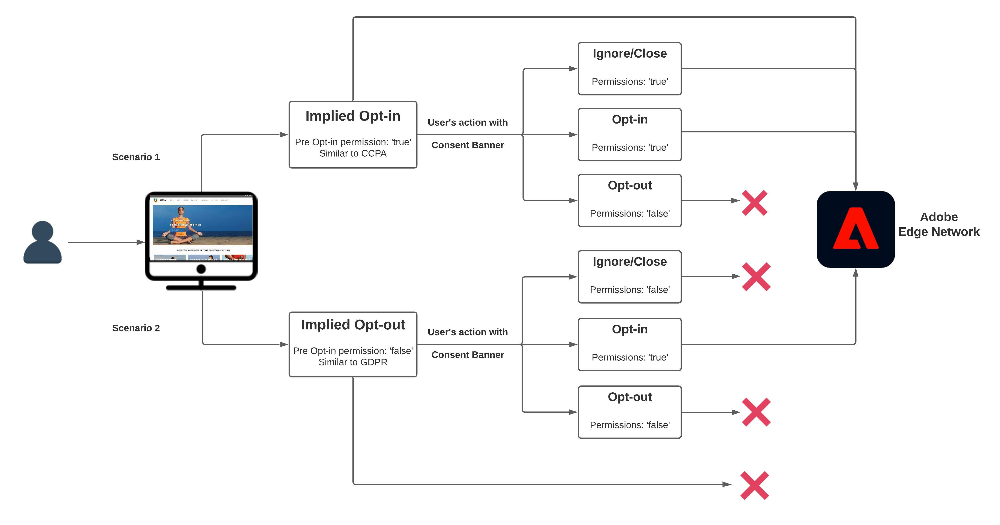
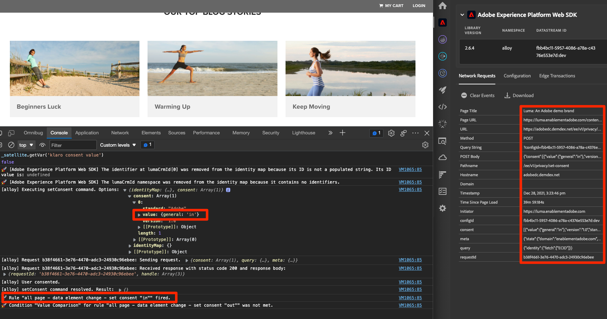

# 使用Platform Web SDK设置同意

了解如何配置Experience PlatformWeb SDK标记扩展的隐私设置。 根据访客与同意管理平台(CMP)中的横幅的交互来设置同意。

>[!NOTE]
> 
>出于演示目的，本教程使用 [克拉罗](https://heyklaro.com/){target="_blank"} 作为一名CMP。 欢迎您使用Klaro或您在网站中使用的CMP来遵循。


## 学习目标

在本课程结束时，您能够：

* 使用标记加载CMP
* 在Experience PlatformWeb SDK标记扩展中配置隐私设置
* 根据访客的操作为Experience PlatformWeb SDK设置同意

## 先决条件

您应该熟悉标记以及使用Debugger创建规则、数据元素、生成库到Experience Platform和切换标记库的步骤。

在开始配置隐私设置并创建用于设置同意的规则之前，请确保已将同意管理平台脚本插入网站并正常运行。 CMP可以在站点开发人员的帮助下直接加载到源代码中，也可以通过标记本身进行加载。 这一课表明了后一种方法。
>[!NOTE]
> 
>1. 同意管理平台（或CMP）由组织用来在收集、共享或销售来自在线源（如网站和应用程序）的访客数据之前，合法记录和管理访客的同意选择。
>
>2. 插入CMP的推荐方法是直接通过源代码在标签管理器脚本之前插入。

### 配置Klaro

在跳转到标记配置之前，请详细了解本教程Klaro中使用的同意管理平台。

1. 访问 [克拉罗](https://heyklaro.com/) 并建立一个帐户。
1. 转到 **隐私管理器** 并根据说明创建实例。
1. 使用 **集成代码** 将Klaro插入到您的标记属性中（下面的练习将介绍相关说明）。
1. 跳过 **扫描** 部分，因为它将检测Luma演示网站上经过硬编码的标记属性，而不是您为本教程构建的标记属性。
1. 添加名为的服务 `aep web sdk` 并打开 **服务默认状态**. 打开时，默认同意值为 `true`，否则为 `false`. 当您想要确定您的Web应用程序的默认同意状态（在访客同意之前）时，此配置会很方便。 例如：
   * 对于CCPA，默认同意通常设置为 `true`. 您即将引用此方案为 **隐含的选择加入** 在本教程中
   * 对于GDPR，默认同意通常设置为 `false`. 您即将引用此方案为 **隐含的选择退出** 在本教程中。

<!--
    This consent value can be verified by returning the JavaScript object ```klaro.getManager().consents``` in the browser's developer console.
-->
    >[！注意]
    >
    >通常，负责处理CMP的团队或个人（如OneTrust或TrustArc）会完成并注意上述步骤。

## 插入CMP

>[!WARNING]
>
>实施同意管理平台的最佳实践通常是加载CMP _早于_ 正在加载您的标记管理器。 为便于阅读本教程，您将加载CMP _替换为_ 标记管理器。 本课程旨在向您展示如何使用Platform Web SDK中的同意功能，但不应将其用作正确配置Klaro或任何其他CMP的指南。


现在，完成Klaro的配置后，请使用以下配置创建标记规则：

* [!UICONTROL 名称]：`all pages - library load - Klaro`
* [!UICONTROL 事件]： [!UICONTROL Library Loaded (Page Top)] 替换为 [!UICONTROL 高级选项] > [!UICONTROL 订购] 设置为1
* [!UICONTROL 操作]： [!UICONTROL 自定义代码]， [!UICONTROL 语言]：用于加载CMP脚本的HTML。


自定义代码块应类似于以下内容：


现在，请保存此规则并将其构建到开发库中，通过将标记库从Luma网站切换到您自己的网站来验证是否显示同意横幅。 您应会在网站上看到如下所示的CMP横幅。 要检查当前访客的同意权限，您可以在浏览器控制台上使用以下代码片段。

```javascript
    klaro.getManager().consents 
```


要进入调试模式，请在Adobe Experience Platform Debugger中使用以下复选框。


此外，在阅读本教程时，您可能必须多次清除Cookie和本地存储，因为访客的同意值会存储在该处。 您只需执行以下操作即可：


## 同意方案

GDPR、CCPA和其他隐私行为在如何设计同意实施方面起着至关重要的作用。 在本课程中，您将探索访客如何与两个最显眼隐私行为下的同意横幅进行交互。



### 场景1：隐式选择加入

隐含的选择加入意味着，在收集访客数据之前，企业不需要获得访客的同意（或“选择加入”），因此默认情况下，网站的所有访客都被视为选择加入。 但是，访客可以通过同意横幅拒绝Cookie来选择退出。 此用例类似于CCPA。

现在，您将为此方案配置并实施同意：

1. 在 **[!UICONTROL 隐私]** Experience PlatformWeb SDK标记扩展的部分，确保  **[!UICONTROL 默认同意]** 设置为 **[!UICONTROL 在]** ：


   

   >[!NOTE]
   > 
   >对于动态解决方案，请选择“提供数据元素”选项，并传递返回值的数据元素 ```klaro.getManager().consents```
   >
   >如果在源代码中插入CMP，则使用此选项 *早于* 标记嵌入代码，以便在Experience PlatformWeb SDK扩展开始加载之前提供默认同意。 在本例中，我们无法使用此选项，因为CMP是和标记一起加载的，而不是在标记之前。


2. 将此更改保存并生成到您的标记库
3. 在Luma演示网站上加载标记库
4. 在Luma网站上启用标记调试并重新加载页面。 在浏览器的开发人员控制台中，您应看到defaultConsent等于 **[!UICONTROL 在]**
5. 对于此配置，Experience PlatformWeb SDK扩展将继续发出网络请求，除非访客决定拒绝Cookie并选择退出：

   


如果访客决定选择退出（拒绝跟踪Cookie），您必须将同意更改为 **[!UICONTROL 去话]**. 按照以下步骤更改同意设置：

<!--
1. Create a data element to store the consent value of the visitor. Let's call it `klaro consent value`. Use the code snippet to create a custom code type data element:
    
    ```javascript
    return klaro.getManager().consents["aep web sdk"]
    ```

    


1. Create another custom code data element, `consent confirmed`, with the following snippet which returns ```true``` only after a visitor confirms consent:

    
    ```javascript
    return klaro.getManager().confirmed
    ```

    
-->

1. 创建访客点击时触发的规则 **我拒绝**.  将此规则命名为： `all pages - click consent banner - set consent "out"`

1. 作为 **[!UICONTROL 事件]**，使用 **[!UICONTROL 单击]** 日期 **[!UICONTROL 匹配CSS选择器的元素]** `#klaro .cn-decline`

   

1. 现在，使用Experience PlatformWeb SDK， [!UICONTROL 设置同意] [!UICONTROL 操作类型] 要将同意设置为“out”，请执行以下操作：

   

1. 选择 **[!UICONTROL 保存到库并生成]**：

   

现在，当访客选择退出时，将触发以上述方式配置的规则，并将Web SDK同意设置为 **[!UICONTROL 去话]**.

通过转到Luma演示网站进行验证，拒绝Cookie，并确认在选择退出后不会触发任何Web SDK请求。

### 场景2：隐式选择退出


隐含的选择退出意味着默认情况下应将访客视为选择退出，且不应设置Cookie。 除非访客决定通过同意横幅接受这些Cookie来手动选择加入，否则不应触发Web SDK请求。 您可能必须在适用GDPR的欧盟地区处理此类用例。

以下是如何为隐含的选择退出方案设置配置的：

1. 在克拉罗，关闭 **服务默认状态** 在您的 `aep web sdk` 并保存更新的配置。

1. 在 **[!UICONTROL 隐私]** Experience PlatformWeb SDK扩展的部分，将默认同意设置为 **[!UICONTROL 去话]** 或 **[!UICONTROL 待处理]** 根据需要。

   

1. **保存** 更新了标记库的配置并重新构建它。

   使用此配置时，Experience PlatformWeb SDK可确保不会触发任何请求，除非同意权限更改为 **[!UICONTROL 在]**. 访客通过选择加入手动接受Cookie可能会导致这种情况。

1. 在Debugger中，确保Luma网站已映射到您的标记属性并且标记控制台日志记录已打开。
1. 使用浏览器的开发人员控制台 **清除站点数据** 在 **应用程序** > **存储**

1. 重新加载Luma网站，您应该会看到 `defaultConsent` 设置为 **[!UICONTROL 去话]** 并且尚未发出任何Web SDK请求

   

如果访客决定选择加入（接受跟踪Cookie），您必须更改同意并将其设置为 **[!UICONTROL 在]**. 以下是如何使用规则来实现此目的：

1. 创建访客点击时触发的规则 **没关系**.  将此规则命名为： `all pages - click consent banner - set consent "in"`

1. 作为 **[!UICONTROL 事件]**，使用 **[!UICONTROL 单击]** 日期 **[!UICONTROL 匹配CSS选择器的元素]** `#klaro .cm-btn-success`

   

1. 使用Experience PlatformWeb SDK添加操作 [!UICONTROL 扩展名]， **[!UICONTROL 操作类型]** 之 **[!UICONTROL 设置同意]**， **[!UICONTROL 一般同意]** 作为 **[!UICONTROL 在]**.

   

   这里要注意的一点是 [!UICONTROL 设置同意] 操作将是第一个发出并建立身份的请求。 因此，同步第一个请求本身的身份可能很重要。 可以将身份映射添加到 [!UICONTROL 设置同意] 操作。

1. 选择 **[!UICONTROL 保存到库并生成]**：

   

1. **[!UICONTROL 保存]** 将规则保存到您的库并重新构建它。

一旦设置好此规则，事件收集就应在访客选择加入时开始。




有关Web SDK中同意的更多信息，请参阅 [支持客户同意首选项](https://experienceleague.adobe.com/docs/experience-platform/edge/consent/supporting-consent.html?lang=en).


欲知关于 [!UICONTROL 设置同意] 操作，请参见 [设置同意](https://experienceleague.adobe.com/docs/experience-platform/edge/extension/action-types.html?lang=en#set-consent).

[下一步： ](setup-event-forwarding.md)

>[!NOTE]
>
>感谢您投入时间学习Adobe Experience Platform Web SDK。 如果您有疑问、希望分享一般反馈或有关于未来内容的建议，请在此共享它们 [Experience League社区讨论帖子](https://experienceleaguecommunities.adobe.com/t5/adobe-experience-platform-launch/tutorial-discussion-implement-adobe-experience-cloud-with-web/td-p/444996)
