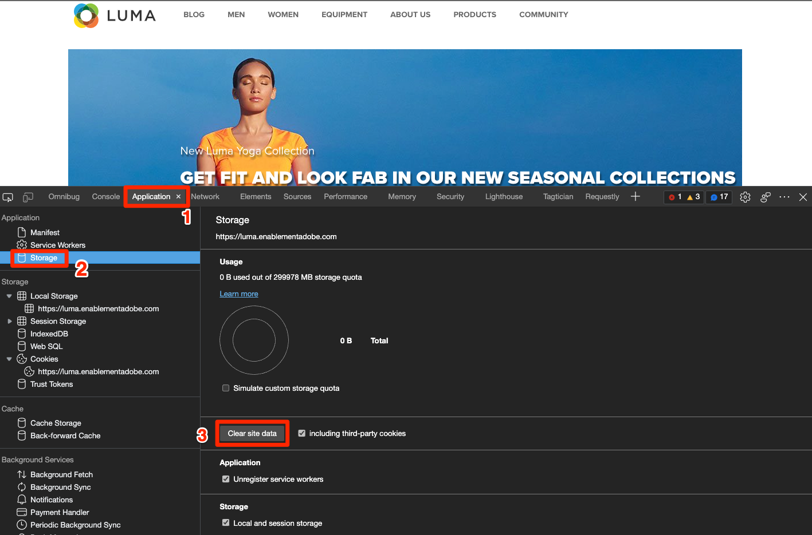
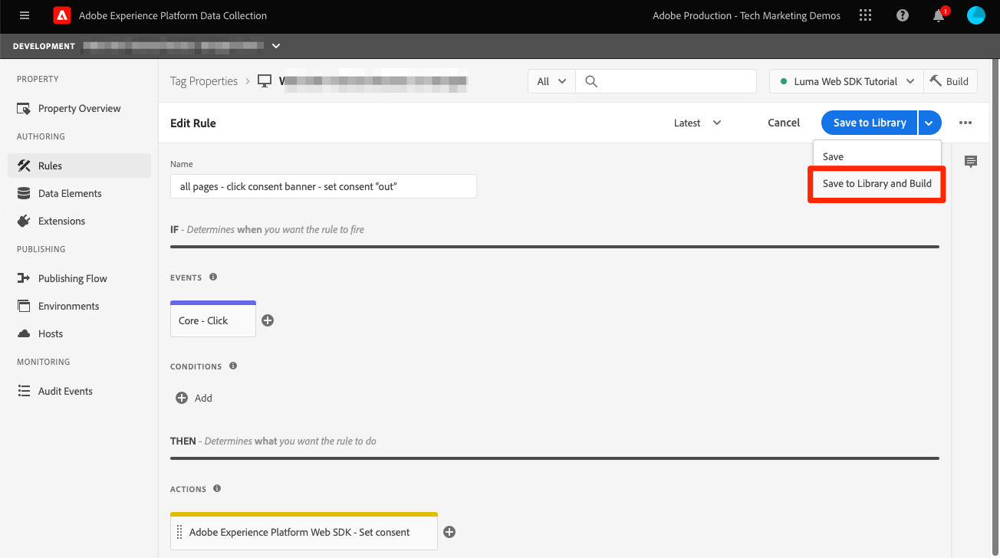

# 使用Platform Web SDK设置同意

了解如何配置Experience PlatformWeb SDK标记扩展的隐私设置。 根据访客与同意管理平台(CMP)中横幅的交互情况设置同意。

>[!NOTE]
> 
>出于演示目的，本教程使用 [克拉罗](https://heyklaro.com/) 作为CMP。 欢迎您继续使用Klaro或您在网站中使用的CMP。


## 学习目标

在本课程结束时，您能够：

* 使用标记加载CMP
* 在Experience PlatformWeb SDK标记扩展中配置隐私设置
* 根据访客的操作设置Experience PlatformWeb SDK的同意

## 先决条件

您应该熟悉标记以及创建规则、数据元素、将库构建到环境以及使用Experience Platform调试器切换标记库的步骤。

在开始配置隐私设置并创建用于设置同意的规则之前，请确保已将您的同意管理平台脚本插入网站并且工作正常。 CMP可以在站点开发人员的帮助下直接加载到源代码中，也可以通过标记本身加载。 这一教训证明了后一种方法。
>[!NOTE]
> 
>1. 组织使用同意管理平台（或CMP），在从网站和应用程序等在线来源收集、共享或销售访客数据之前，可合法记录和管理访客的同意选项。
>
>2. 建议直接通过源代码在标签管理器脚本之前插入CMP的方法。


### 配置Klaro

在跳转到标记配置之前，请了解有关本教程Klaro中使用的同意管理平台的更多信息。

1. 访问 [克拉罗](https://heyklaro.com/) 并设置一个帐户。
1. 转到 **隐私管理器** 并根据说明创建实例。
1. 使用 **集成代码** 将Klaro注入标记属性（下一个练习中将提供相关说明）。
1. 跳过 **扫描** 部分，因为它将检测Luma演示网站上经过硬编码的标记属性，而不是您为本教程构建的标记属性。
1. 添加名为 `aep web sdk` 并打开 **服务默认状态**. 打开后，默认同意值为 `true`，否则 `false`. 当您想要确定Web应用程序的默认同意状态（在访客同意之前）时，此配置非常方便。 例如：
   * 对于CCPA，默认同意通常设置为 `true`. 您将引用此方案，作为 **默示的选择加入** 整个教程
   * 对于GDPR，默认同意通常设置为 `false`. 您将引用此方案，作为 **默示选择退出** 在本教程中。

<!--
    This consent value can be verified by returning the JavaScript object ```klaro.getManager().consents``` in the browser's developer console.
-->
    >[!NOTE]
    >
    >通常，负责处理CMP的团队或个人（如OneTrust或TrustArc）会完成并注意上述步骤。

## 注入CMP

>[!WARNING]
>
>实施同意管理平台的最佳实践通常是加载CMP _之前_ 加载标签管理器。 为便于学习本教程，您将加载CMP _with_ 标签管理器。 本课程旨在向您展示如何使用Platform Web SDK中的同意功能，不应用作正确配置Klaro或任何其他CMP的指南。


现在，完成Klaro的配置后，请使用以下配置创建一个标记规则：

* [!UICONTROL 名称]: `all pages - library load - Klaro`
* [!UICONTROL 事件]: [!UICONTROL Library Loaded(Page Top)] with [!UICONTROL 高级选项] > [!UICONTROL 订购] 设置为1
* [!UICONTROL 操作]: [!UICONTROL 自定义代码], [!UICONTROL 语言]:HTML加载CMP脚本。


自定义代码块应类似于以下内容：


现在，将此规则保存并构建到您的开发库，通过将标记库从Luma网站切换到您自己的网站，验证是否显示同意横幅。 您应会在网站上看到以下CMP横幅。 要检查当前访客的同意权限，您可以在浏览器控制台中使用以下代码片段。

```javascript
    klaro.getManager().consents 
```


要进入调试模式，请使用Adobe Experience Platform调试器中的以下复选框。


此外，在完成本教程时，您可能必须多次清除Cookie和本地存储，因为访客的同意值会存储在此处。 您只需执行以下操作即可：



## 同意方案

隐私法案（如GDPR、CCPA等）和其他法案在您构建同意实施的方式中起着至关重要的作用。 在本课程中，您将根据两项最引人注目的隐私法案，探索访客如何与同意横幅进行交互。


### 场景1:默示选择加入

隐含的选择加入意味着企业在收集其数据之前不需要获得访客的同意（或“选择加入”），因此网站的所有访客默认都会被视为选择加入。 但是，访客可以通过同意横幅拒绝Cookie来选择退出。 此用例与CCPA类似。

现在，您将为此方案配置和实施同意：

1. 在 **[!UICONTROL 隐私]** Experience PlatformWeb SDK标记扩展的部分，请确保  **[!UICONTROL 默认同意]** 设置为 **[!UICONTROL 在]** :


   

   >[!NOTE]
   > 
   >对于动态解决方案，选择“提供数据元素”选项，并传递返回值的数据元素 ```klaro.getManager().consents```
   >
   >如果CMP插入到源代码中，则使用此选项 *之前* 标记嵌入代码，以便在Experience PlatformWeb SDK扩展开始加载之前，可以获得默认同意。 在我们的示例中，我们不能使用此选项，因为CMP已加载标记，而不是在标记之前。


2. 将此更改保存并构建到标记库
3. 在Luma演示网站上加载标记库
4. 在Luma网站上启用标记调试并重新加载页面。 在浏览器的开发人员控制台中，您应会看到defaultConsent等于 **[!UICONTROL 在]**
5. 通过此配置，Experience PlatformWeb SDK扩展将继续发出网络请求，除非访客决定拒绝Cookie并选择退出：

   


如果访客决定选择退出（拒绝跟踪Cookie），则您必须将同意更改为 **[!UICONTROL 输出]**. 按照以下步骤更改同意设置：

<!--
1. Create a data element to store the consent value of the visitor. Let's call it `klaro consent value`. Use the code snippet to create a custom code type data element:
    
    ```javascript
    return klaro.getManager().consents["aep web sdk"]
    ```

    


1. Create another custom code data element, `consent confirmed`, with the following snippet which returns ```true``` only after a visitor confirms consent:

    
    ```javascript
    return klaro.getManager().confirmed
    ```

    
-->

1. 创建在访客单击时触发的规则 **我拒绝了**.  将此规则命名为： `all pages - click consent banner - set consent "out"`

1. 作为 **[!UICONTROL 事件]**，使用 **[!UICONTROL 单击]** on **[!UICONTROL 与CSS选择器匹配的元素]** `#klaro .cn-decline`

   

1. 现在，使用Experience PlatformWeb SDK， [!UICONTROL 设置同意] [!UICONTROL 操作类型] 将同意设置为“out”：

   

1. 选择 **[!UICONTROL 保存到库并构建]**:

   

现在，当访客选择禁用时，使用上述方式配置的规则将触发并将Web SDK同意设置为 **[!UICONTROL 输出]**.

通过转到Luma演示网站进行验证，拒绝Cookie，并确认在选择退出后未触发任何Web SDK请求。

### 场景2:默示选择退出


隐含的选择退出表示默认情况下应将访客视为选择退出，且不应设置Cookie。 除非访客决定通过同意横幅接受Cookie以手动选择加入，否则不应触发Web SDK请求。 您可能必须在适用GDPR的欧盟地区处理此类用例。

以下是如何为隐含的选择退出方案设置配置：

1. 在Klaro中，关闭 **服务默认状态** 在 `aep web sdk` 服务，并保存更新的配置。

1. 在 **[!UICONTROL 隐私]** Experience PlatformWeb SDK扩展的部分，将默认同意设置为 **[!UICONTROL 输出]** 或 **[!UICONTROL 待定]** 。

   

1. **保存** 标记库的更新配置并重新构建该库。

   通过此配置，Experience PlatformWeb SDK可确保在同意权限更改为 **[!UICONTROL 在]**. 如果访客通过选择加入手动接受Cookie，则可能会发生这种情况。

1. 在Debugger中，确保Luma网站已映射到您的标记属性，并且已打开标记控制台日志记录。
1. 使用浏览器的开发人员控制台，可以 **清除网站数据** in **应用程序** > **存储**

1. 重新加载Luma网站，您应会看到 `defaultConsent` 设置为 **[!UICONTROL 输出]** 且尚未发出任何Web SDK请求

   

如果访客决定选择加入（接受跟踪Cookie），则您必须更改同意并将其设置为 **[!UICONTROL 在]**. 以下是如何使用规则执行此操作：

1. 创建在访客单击时触发的规则 **没关系**.  将此规则命名为： `all pages - click consent banner - set consent "in"`

1. 作为 **[!UICONTROL 事件]**，使用 **[!UICONTROL 单击]** on **[!UICONTROL 与CSS选择器匹配的元素]** `#klaro .cm-btn-success`

   

1. 使用Experience PlatformWeb SDK添加操作 [!UICONTROL 扩展], **[!UICONTROL 操作类型]** of **[!UICONTROL 设置同意]**, **[!UICONTROL 一般同意]** as **[!UICONTROL 在]**.

   

   这里需要注意的一点是 [!UICONTROL 设置同意] 操作将是发出并建立身份的第一个请求。 因此，在第一个请求本身上同步身份可能很重要。 身份映射可添加到 [!UICONTROL 设置同意] 操作。

1. 选择 **[!UICONTROL 保存到库并构建]**:

   

1. **[!UICONTROL 保存]** 规则中，然后重新构建该规则。

设置此规则后，事件收集应在访客选择加入时开始。


有关Web SDK中同意的更多信息，请参阅 [支持客户同意首选项](https://experienceleague.adobe.com/docs/experience-platform/edge/consent/supporting-consent.html?lang=en).


有关 [!UICONTROL 设置同意] 操作，请参阅 [设置同意](https://experienceleague.adobe.com/docs/experience-platform/edge/extension/action-types.html?lang=en#set-consent).

[下一个： ](setup-event-forwarding.md)

>[!NOTE]
>
>感谢您花时间学习Adobe Experience Platform Web SDK。 如果您有任何疑问、想要分享一般反馈或对未来内容提出建议，请就此分享 [Experience League社区讨论帖子](https://experienceleaguecommunities.adobe.com/t5/adobe-experience-platform-launch/tutorial-discussion-implement-adobe-experience-cloud-with-web/td-p/444996)
