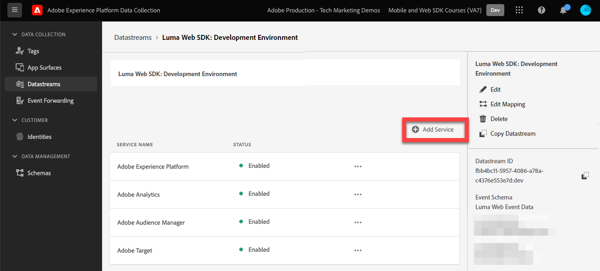

# 使用Platform Web SDK数据设置事件转发

了解如何使将事件转发功能与 Adobe Experience Platform Web SDK 数据一起使用。

事件转发是数据收集中可用的一种新属性。 事件转发让您能够直接从Adobe Experience PlatformEdge Network而不是传统的客户端浏览器向第三方非Adobe供应商发送数据。 在[事件转发概述](https://experienceleague.adobe.com/zh-hans/docs/experience-platform/tags/event-forwarding/overview)中进一步了解事件转发的优势。

要在Adobe Experience Platform中使用事件转发，必须首先使用以下三个选项中的一个或多个将数据发送到Adobe Experience PlatformEdge Network：

* [Adobe Experience Platform Web SDK](overview.md)
* [Adobe Experience Platform Mobile SDK](https://developer.adobe.com/client-sdks/home/)
  <!--* [Server-to-Server API](https://experienceleague.adobe.com/zh-hans/docs/audience-manager/user-guide/api-and-sdk-code/dcs/dcs-apis/dcs-s2s)-->

>[!NOTE]
>Platform Web SDK和Platform Mobile SDK不需要通过标记进行部署，但是，建议使用标记来部署这些SDK。

完成本教程中之前的课程后，您应该使用Web SDK将数据发送到PlatformEdge Network。 数据进入平台Edge Network后，您可以启用事件转发并使用event-forwarding属性将数据发送到非Adobe解决方案。

## 学习目标

在本课程结束时，您将能够：

* 创建事件转发属性
* 将事件转发属性链接到Platform Web SDK数据流
* 了解标记属性数据元素和规则与事件转发属性数据元素和规则之间的差异
* 创建事件转发数据元素
* 配置事件转发规则
* 验证事件转发属性是否已成功发送数据

## 先决条件

* 包含事件转发的软件许可证。 事件转发是数据收集的一项付费功能。 有关更多详细信息，请联系您的Adobe客户团队。
* 已在您的Experience Cloud组织中启用事件转发。
* 用于事件转发的用户权限。 (在[Admin Console](https://adminconsole.adobe.com/)中，在Adobe Experience Platform Launch产品下，[!UICONTROL 平台] > [!UICONTROL Edge]的权限项和所有[!UICONTROL 属性权限])。 获得授权后，您应该会在数据收集界面的左侧导航中看到[!UICONTROL 事件转发]：
  

* Adobe Experience Platform Web或Mobile SDK配置为将数据发送到Edge Network。 您必须完成本教程中的以下课程：

   * 初始配置

      * [配置XDM架构](configure-schemas.md)
      * [配置身份命名空间](configure-identities.md)
      * [配置数据流](configure-datastream.md)

   * 标记配置

      * [安装 Web SDK 扩展](install-web-sdk.md)
      * [创建数据元素](create-data-elements.md)
      * [创建身份](create-identities.md)
      * [创建标记规则](create-tag-rule.md)
      * [使用Adobe Experience Platform Debugger进行验证](validate-with-debugger.md)

## 创建事件转发属性

首先，创建事件转发属性：

1. 打开[数据收集接口](https://experience.adobe.com/#/data-collection)
1. 从左侧导航中选择&#x200B;**[!UICONTROL 事件转发]**
1. 选择&#x200B;**[!UICONTROL 新属性]**。
   

1. 命名资产。 在这种情况下，`Server-Side - Web SDK Course`

1. 选择&#x200B;**[!UICONTROL 保存]**。
   

## 配置数据流

要使事件转发使用您发送到PlatformEdge Network的数据，您必须将新创建的事件转发属性链接到用于将数据发送到Adobe解决方案的相同数据流。

要在数据流中配置Target，请执行以下操作：

1. 转到[数据收集](https://experience.adobe.com/#/data-collection){target="blank"}接口
1. 在左侧导航中，选择&#x200B;**[!UICONTROL 数据流]**
1. 选择之前创建的`Luma Web SDK: Development Environment`数据流

   

1. 选择&#x200B;**[!UICONTROL 添加服务]**
   
1. 选择&#x200B;**[!UICONTROL 事件转发]**&#x200B;作为&#x200B;**[!UICONTROL 服务]**

1. 在&#x200B;**[!UICONTROL 属性ID]**&#x200B;下拉列表下，选择您为事件转发属性提供的名称，在本例中为`Server-Side - Web SDK Course`

1. 在&#x200B;**[!UICONTROL 环境ID]**&#x200B;下拉列表下，选择要将事件转发环境链接到的标记环境，在本例中为`Development`

   >[!TIP]
   >
   >    若要将数据发送到Adobe组织外部的事件转发环境，请选择&#x200B;**[!UICONTROL 手动输入ID]**&#x200B;并粘贴到ID中。 此ID是在创建事件转发属性时提供的。

1. 选择&#x200B;**[!UICONTROL 保存]**。

   

当您准备好通过发布流提升所做更改时，请为暂存和生产数据流重复这些步骤。

## 将数据从平台Edge Network转发到非Adobe解决方案

在本练习中，您将学习如何设置事件转发数据元素、配置事件转发规则，以及使用名为[Webhook.site](https://webhook.site/)的第三方工具进行验证。

>[!NOTE]
>
>webhook是一种半实时地集成不同系统的方法。 [Webhook.site](https://webhook.site/)是第三方工具，可让您轻松检查、测试和自动化（使用可视化自定义操作生成器或WebhookScript）任何传入的HTTP请求或电子邮件。

>[!IMPORTANT]
>
>您必须已创建数据元素并将其映射到XDM对象，且已配置标记规则并在库中将这些更改构建到标记环境才能继续。 如果没有，请参阅[先决条件](setup-event-forwarding.md#prerequisites)部分中的&#x200B;**标记配置**&#x200B;步骤。 这些步骤可确保将数据发送到PlatformEdge Network，并且您可从此处配置事件转发属性以将数据转发到非Adobe解决方案。

### 创建事件转发数据元素

您之前使用Platform Web SDK标记扩展配置的XDM对象将成为事件转发属性中数据元素的数据源。 您可以使用已在标记属性中配置的数据作为事件转发的数据源。

>[!IMPORTANT]
>
>在事件转发中引用XDM字段与其他上下文时，有一个关键语法差异。 要在事件转发属性中引用数据，数据元素路径必须包含`arc.event`前缀：
>
> * 其中，`arc` 表示 Adobe 响应上下文。
> * 例如：`arc.event.xdm.web.webPageDetails.URL`
>
>如果未正确指定此路径，则不会收集数据。

在本练习中，您要将浏览器视区高度和Experience CloudID从XDM对象转发到webhook。 XDM字段路径由[配置XDM架构](configure-schemas.md)课程中创建的XDM架构确定。

>[!TIP]
>
>您还可以通过使用Web浏览器网络工具、筛选`/ee`请求、打开信标&#x200B;[!UICONTROL **有效负载**]并向下钻取到要查找的变量来查找XDM对象路径。 然后，使用鼠标右键单击并选择“复制属性路径”。 以下是浏览器视区高度的示例：
> 

1. 转到您最近创建的&#x200B;**[!UICONTROL 事件转发]**&#x200B;属性

1. 在左侧导航中，选择&#x200B;**[!UICONTROL 数据元素]**

1. 选择以&#x200B;**[!UICONTROL 创建新数据元素]**

   

1. **[!UICONTROL 名称]**&#x200B;数据元素`environment.browserDetails.viewportHeight`

1. 在&#x200B;**[!UICONTROL 扩展]**&#x200B;下，离开`CORE`

1. 在&#x200B;**[!UICONTROL 数据元素类型]**&#x200B;下，选择`Path`

1. 键入包含浏览器视区高度`arc.event.xdm.environment.browserDetails.viewportHeight`的XDM对象路径

1. 选择&#x200B;**[!UICONTROL 保存]**

   

1. 创建另一个数据元素

1. **[!UICONTROL 名称]**，它`ecid`

1. 在&#x200B;**[!UICONTROL 扩展]**&#x200B;下，离开`CORE`

1. 在&#x200B;**[!UICONTROL 数据元素类型]**&#x200B;下，选择`Path`

1. 键入包含Experience CloudID `arc.event.xdm.identityMap.ECID.0.id`的XDM对象路径

1. 选择&#x200B;**[!UICONTROL 保存]**

   

   >[!CAUTION]
   >
   > 确保在路径中包含`arc.event.`前缀。 此外，请确保遵循与XDM对象字段名称完全相同的大小写 — ECID命名空间必须全部大写。

   >[!TIP]
   >
   >使用您自己的网站时，您可以使用Web浏览器网络工具找到XDM对象路径，过滤`/ee`请求，打开信标&#x200B;[!UICONTROL **有效负载**]并向下钻取到要查找的变量。 然后，使用鼠标右键单击并选择“复制属性路径”。 以下是浏览器视区高度的示例：
   > 

### 安装Adobe云连接器扩展

若要将数据发送到第三方位置，您将首先安装[!UICONTROL Adobe云连接器]扩展。

1. 在左侧导航中选择&#x200B;**[!UICONTROL 扩展]**

1. 选择&#x200B;**[!UICONTROL 目录]**&#x200B;选项卡

1. 搜索&#x200B;**[!UICONTROL Adobe云连接器]**，选择&#x200B;**[!UICONTROL 安装]**

   

无需扩展配置。 通过此扩展，您现在可以将数据转发到非Adobe解决方案！

### 创建事件转发规则

配置标记属性中的规则与事件转发属性中的规则有一些主要区别：

* **[!UICONTROL 事件]和[!UICONTROL 条件]**：

   * **标记**：所有规则均由必须在规则中指定的事件触发，例如`Library Loaded - Page Top`。 条件为可选。
   * **事件转发**：假定每个发送到PlatformEdge Network的事件都是转发数据的触发器。 因此，在事件转发规则中不能选择[!UICONTROL 事件]。 要管理哪些事件会触发事件转发规则，您必须配置条件。

* **数据元素标记化**：

   * **标记**：在规则中使用数据元素名称时，其开头和结尾分别使用`%`来标记数据元素名称。 例如：`%viewportHeight%`。

   * **事件转发**：在规则中使用数据元素名称时，数据元素名称的开头以`{{`标记，结尾以`}}`标记。 例如：`{{viewportHeight}}`。

* **规则操作序列**：

   * 事件转发规则的“操作”部分始终按顺序执行。 保存规则时，请确保操作顺序正确。 无法像对标记执行操作一样异步执行此执行序列。

<!--
  * **Tags**: Rule actions can easily be reordered using drag-and-drop functionality.
  * **Event forwarding**: Rule actions are always executed sequentially. Make sure the order of actions is correct when you save a rule.
-->

要配置用于将数据转发到webhook的规则，您必须先获取个人webhook：

1. 转到[Webhook.site](https://webhook.site)

1. 查找&#x200B;**您的唯一URL**，在事件转发规则中将此作为URL请求

1. 选择&#x200B;**[!UICONTROL 复制到剪贴板]**

1. 保持此窗口处于打开状态，因为您将能够验证Webhook实时捕获的事件转发数据

   

1. 从左侧导航中返回&#x200B;**[!UICONTROL 数据收集]** > **[!UICONTROL 事件转发]** > **[!UICONTROL 规则]**

1. 选择&#x200B;**[!UICONTROL 创建新规则]**

   

1. 将其命名为`all events - ad cloud connector - webhook`

1. 添加操作

1. 在&#x200B;**[!UICONTROL 扩展]**&#x200B;下，选择&#x200B;**[!UICONTROL Adobe云连接器]**

1. 在&#x200B;**[!UICONTROL 操作类型]**&#x200B;下，选择&#x200B;**[!UICONTROL 发出获取调用]**

1. 将Webhook URL粘贴到&#x200B;**[!UICONTROL URL]**&#x200B;字段中

   

1. 在&#x200B;**[Query Params]**&#x200B;下，您将添加之前创建的两个数据元素。

1. 在`viewPortHeight`中的&#x200B;**[!UICONTROL 键]**&#x200B;列类型上。 在&#x200B;**[!UICONTROL 值]**&#x200B;列上，通过键入`{{environment.browserDetails.viewportHeight}}`数据元素或从数据元素选择器图标中进行选择来输入该数据元素

1. 选择&#x200B;[!UICONTROL **+添加另一个**]&#x200B;以添加另一个查询参数

1. 在`ecid`中的&#x200B;**[!UICONTROL 键]**&#x200B;列类型上。 在值列中，输入`{{ecid}}`数据元素

1. 选择&#x200B;**[!UICONTROL 保留更改]**

   

1. 您的规则应如下所示

1. 选择&#x200B;**[!UICONTROL 保存]**

   

### 创建并生成库

创建一个库并生成对事件转发开发环境的所有更改，就像在标记属性中通常所做的那样。

>[!NOTE]
>
>如果尚未将暂存和生产事件转发属性链接到数据流，则您将看到开发环境作为生成库的唯一选项。

## 验证事件转发规则

现在，您可以使用Platform Debugger和Webhook.site验证事件转发属性：

1. 按照以下步骤[&#128279;](validate-with-debugger.md#use-the-experience-platform-debugger-to-map-to-your-tag-property)将[Luma演示网站](https://luma.enablementadobe.com/content/luma/us/en/men.html)上的标记库切换到您在数据流中映射了事件转发属性的Web SDK标记属性。

1. 在重新加载页面之前，在Experience Platform调试器上，从左侧导航中打开&#x200B;**[!UICONTROL 日志]**

1. 选择&#x200B;**[!UICONTROL Edge]**&#x200B;选项卡，然后选择&#x200B;**[!UICONTROL 连接]**&#x200B;以查看PlatformEdge Network请求

   

1. 重新加载页面

1. 您将看到其他请求，这些请求使您能够了解平台Edge Network发送到WebHook的服务器端请求

1. 需要重点验证的请求是显示由Edge网络发送的完全构建的URL的请求

   

1. 请注意viewPortHeight和ecid查询字符串参数

   

1. 它们与XDM对象中看到的数据匹配

   

1. 最后，通过查看打开的Webhook窗口来验证[Webhook.site](https://webhook.site)中的数据匹配

   

恭喜！您已配置事件转发！

[下一步： ](conclusion.md)

>[!NOTE]
>
>感谢您投入时间学习Adobe Experience Platform Web SDK。 如果您有疑问、希望分享一般反馈或有关于未来内容的建议，请在此[Experience League社区讨论帖子](https://experienceleaguecommunities.adobe.com/t5/adobe-experience-platform-data/tutorial-discussion-implement-adobe-experience-cloud-with-web/td-p/444996)上分享这些内容
