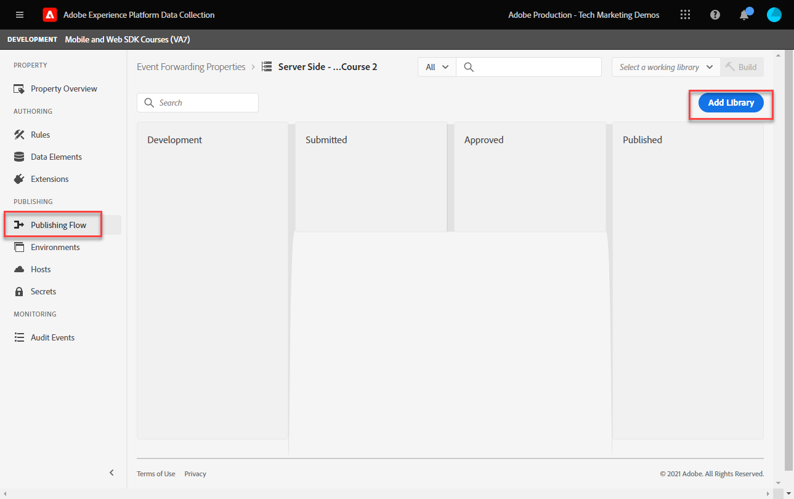

# 设置事件转发属性

了解如何使用Experience PlatformWeb SDK数据来使用事件转发属性。

事件转发是数据收集中可用的一种新属性类型。 通过事件转发，您能够直接从Adobe Experience Platform边缘网络（而不是传统的客户端浏览器）向第三方非Adobe供应商发送数据。 在 [事件转发概述](https://experienceleague.adobe.com/docs/experience-platform/tags/event-forwarding/overview.html?lang=en).

要在Adobe Experience Platform中使用事件转发，必须先使用以下三个选项中的一个或多个选项将数据发送到Adobe Experience Platform边缘网络：

* [Adobe Experience Platform Web SDK](overview.md)
* [Adobe Experience Platform Mobile SDK](https://aep-sdks.gitbook.io/docs/)
<!--* [Server-to-Server API](https://experienceleague.adobe.com/docs/audience-manager/user-guide/api-and-sdk-code/dcs/dcs-apis/dcs-s2s.html?lang=en)-->

>[!NOTE]
>Platform Web SDK和Platform Mobile SDK不需要通过标记进行部署，但是，建议使用标记来部署这些SDK。

完成本教程中前面的课程后，您应使用Web SDK将数据发送到Platform Edge Network。 数据进入Platform Edge Network后，您可以启用事件转发，并使用事件转发属性将数据发送到非Adobe解决方案。

## 学习目标

在本课程的本节结束时，您将能够：

* 创建事件转发属性
* 将事件转发属性链接到Platform Web SDK数据流
* 了解标记属性数据元素和规则与事件转发属性数据元素和规则之间的差异
* 创建事件转发数据元素
* 配置事件转发规则
* 验证事件转发属性是否成功发送数据

## 先决条件

* 包括事件转发的软件许可证。 事件转发是数据收集的一项付费功能。 有关更多详细信息，请联系您的Adobe客户团队。
* 在您的Experience Cloud组织中启用事件转发。
* 事件转发的用户权限。 (在 [Admin Console](https://adminconsole.adobe.com/)，在Adobe Experience Platform Launch产品下，[!UICONTROL 平台] > [!UICONTROL Edge] 全部 [!UICONTROL 资产权限])。 一旦获得授权，您应会看到 [!UICONTROL 事件转发] 在数据收集界面的左侧导航中：
   

* Adobe Experience Platform Web SDK或Mobile SDK，配置为将数据发送到边缘网络。 您必须完成本教程的以下课程：

   * 初始配置

      * [配置权限](configure-permissions.md)
      * [配置XDM架构](configure-schemas.md)
      * [配置身份命名空间](configure-identities.md)
      * [配置数据流](configure-datastream.md)
   * 标记配置

      * [安装Web SDK扩展](install-web-sdk.md)
      * [创建数据元素](create-data-elements.md)
      * [创建标记规则](create-tag-rule.md)
      * [使用Adobe Experience Platform Debugger进行验证](validate-with-debugger.md)

## 创建事件转发属性

首先，创建事件转发属性：

1. 打开 [数据收集界面](https://experience.adobe.com/#/data-collection)
1. 选择 **[!UICONTROL 事件转发]** 从左侧导航
1. 选择 **[!UICONTROL 新建资产]**.
   

1. 命名资产。在这种情况下 `Server-Side - Web SDK Course`

1. 选择&#x200B;**[!UICONTROL 保存]**。
   

## 配置数据流

要使事件转发使用您发送到边缘网络的数据，必须将新创建的事件转发属性链接到用于将数据发送到Adobe解决方案的相同数据流。

要在数据流中配置Target，请执行以下操作：

1. 转到 [数据收集](https://experience.adobe.com/#/data-collection){target=&quot;blank&quot;}接口
1. 在左侧导航中，选择 **[!UICONTROL 数据流]**
1. 选择之前创建的 `Luma Web SDK` 数据流

   

1. 选择 **[!UICONTROL 添加服务]**

   
1. 选择 **[!UICONTROL 事件转发]** 作为 **[!UICONTROL 服务]**

1. 在 **[!UICONTROL 属性ID]** 下拉列表，选择您为事件转发属性提供的名称，在此例中为 `Server-Side - Web SDK Course`

1. 在 **[!UICONTROL 环境ID]** 下拉列表，选择要将事件转发环境链接到的标记环境，在此例中为 `Development`

   >[!TIP]
   >
   >    要向Adobe组织以外的事件转发环境发送数据，请选择 **[!UICONTROL 手动输入ID]** 并粘贴ID。 在创建事件转发属性时，会提供该ID。

1. 选择&#x200B;**[!UICONTROL 保存]**。

   

准备好通过发布流程来促销更改时，请为暂存和生产数据流重复这些步骤。

## 将数据从平台边缘网络转发到非Adobe解决方案

在本练习中，您将学习如何设置事件转发数据元素、配置事件转发规则，以及使用名为的第三部分工具进行验证 [Webhook.site](https://webhook.site/).

>[!NOTE]
>
>Webhook是一种半实时集成不同系统的方法。 [Webhook.site](https://webhook.site/) 是第三方工具，可让您轻松检查、测试和自动（使用可视化的自定义操作生成器或WebhookScript）任何传入的HTTP请求或电子邮件。

>[!IMPORTANT]
>
>您必须已创建数据元素并将其映射到XDM对象，并且已配置标记规则，且已在库中构建了这些更改以用于标记环境，才能继续进一步操作。 如果没有，请参阅 **标记配置** 步骤 [先决条件](setup-event-forwarding.md#prerequisites) 中。 这些步骤可确保数据被发送到平台边缘网络，并且从该处，您可以配置事件转发属性以将数据转发到非Adobe解决方案。

### 创建事件转发数据元素

您之前使用Platform Web SDK标记扩展配置的XDM对象将成为事件转发属性中数据元素的数据源。 您使用的数据与您在标记属性中已配置的数据相同，以用作事件转发的数据源。

>[!IMPORTANT]
>
>在事件转发中引用XDM字段与其他上下文相比，有一个关键语法差异。 要在事件转发属性中引用数据，数据元素路径必须包含 `arc.event` 前缀：
>
> * 其中，`arc` 表示 Adobe 响应上下文。
> * 例如：`arc.event.xdm.web.webPageDetails.URL`
>
>如果此路径指定不正确，则不会收集数据。

在本练习中，您将将浏览器视区高度和Experience CloudID从XDM对象转发到Webhook。 XDM字段路径由 [配置XDM架构](configure-schemas.md) 课程。

>[!TIP]
>
>您还可以使用Web浏览器网络工具，通过筛选 `/ee` 请求，打开信标 [!UICONTROL **负载**] 并向下钻取到要查找的变量。 然后，使用鼠标右键单击并选择“复制资产路径”。 以下是浏览器视区高度的示例：
> 

1. 转到 **[!UICONTROL 事件转发]** 您最近创建的资产

1. 在左侧导航中，选择 **[!UICONTROL 数据元素]**

1. 选择 **[!UICONTROL 创建新数据元素]**

   

1. ****&#x200B;将数据元素命名为 `environment.browserDetails.viewportHeight`

1. 在 **[!UICONTROL 扩展]**，离开 `CORE`

1. 在 **[!UICONTROL 数据元素类型]**，选择 `Path`

1. 键入包含浏览器视区高度的XDM对象路径 `arc.event.xdm.environment.browserDetails.viewportHeight`

1. 选择 **[!UICONTROL 保存]**

   

1. 创建另一个数据元素

1. **[!UICONTROL 名称]** it `ecid`

1. 在 **[!UICONTROL 扩展]**，离开 `CORE`

1. 在 **[!UICONTROL 数据元素类型]**，选择 `Path`

1. 键入包含Experience CloudID的XDM对象路径 `arc.event.xdm.identityMap.ECID.0.id`

1. 选择 **[!UICONTROL 保存]**

   

   >[!CAUTION]
   >
   > 确保包含 `arc.event.` 前缀。 此外，请确保遵循XDM对象字段名称的确切大小写，即ECID命名空间必须全部大写。

   >[!TIP]
   使用您自己的网站时，您可以使用Web浏览器网络工具找到XDM对象路径，筛选 `/ee` 请求，打开信标 [!UICONTROL **负载**] 并向下钻取到要查找的变量。 然后，使用鼠标右键单击并选择“复制资产路径”。 以下是浏览器视区高度的示例：
   

### 安装AdobeCloud Connector扩展

要将数据发送到第三方位置，您首先需要安装 [!UICONTROL Adobe云连接器] 扩展。

1. 选择 **[!UICONTROL 扩展]** 在左侧导航中

1. 选择 **[!UICONTROL 目录]** 选项卡

1. 搜索 **[!UICONTROL Adobe云连接器]**，选择 **[!UICONTROL 安装]**

   

无需扩展配置。 利用此扩展，您现在可以将数据转发到非Adobe解决方案！

### 创建事件转发规则

在标记属性中配置规则与在事件转发属性中配置规则之间主要存在以下差异：

* **[!UICONTROL 事件] &amp; [!UICONTROL 条件]**:

   * **标记**:所有规则都由必须在规则中指定的事件触发，例如， `Library Loaded - Page Top`. 条件是可选的。
   * **事件转发**:假设发送到Platform Edge Network的每个事件都是转发数据的触发器。 因此，没有 [!UICONTROL 事件] 事件转发规则中必须选择的事件转发。 要管理哪些事件会触发事件转发规则，您必须配置条件。

* **数据元素标记化**:

   * **标记**:数据元素名称以 `%` 在规则中使用时，位于数据元素名称的开头和结尾。 例如：`%viewportHeight%`。

   * **事件转发**:数据元素名称的标记为 `{{` 开始时和 `}}` 在规则中使用时，位于数据元素名称的末尾。 例如：`{{viewportHeight}}`。

* **规则的操作顺序**:

   * 事件转发规则的“操作”部分始终按顺序执行。 您在保存规则时，应确保操作顺序正确。无法像使用标记一样异步执行此执行序列。

<!--
  * **Tags**: Rule actions can easily be reordered using drag-and-drop functionality.
  * **Event forwarding**: Rule actions are always executed sequentially. Make sure the order of actions is correct when you save a rule.
-->

要配置规则以将数据转发到WebHook，您必须先获取您的个人WebHook:

1. 转到 [Webhook.site](https://webhook.site)

1. 查找 **您的唯一URL**，则会将其用作事件转发规则中的URL请求

1. 选择 **[!UICONTROL 复制到剪贴板]**

1. 保持此窗口处于打开状态，因为您将能够验证Webhook正在实时捕获的事件转发数据

   

1. 回去 **[!UICONTROL 数据收集]** > **[!UICONTROL 事件转发]** > **[!UICONTROL 规则]** 从左侧导航

1. 选择 **[!UICONTROL 创建新规则]**

   

1. 将其命名为 `all events - ad cloud connector - webhook`

1. 添加操作

1. 在 **[!UICONTROL 扩展]**，选择 **[!UICONTROL Adobe云连接器]**

1. 在 **[!UICONTROL 操作类型]**，选择 **[!UICONTROL 进行获取调用]**

1. 将您的Webhook URL粘贴到 **[!UICONTROL URL]** 字段

   

1. 在 **[查询参数]**，则会添加之前创建的两个数据元素。

1. 在 **[!UICONTROL 键]** 列类型 `viewPortHeight`. 在 **[!UICONTROL 值]** 列，输入 `{{environment.browserDetails.viewportHeight}}` 通过在中键入数据元素或从数据元素选择器图标中选择数据元素

1. 选择 [!UICONTROL **+添加其他**] 添加另一个查询参数

1. 在 **[!UICONTROL 键]** 列类型 `ecid`. 在值列中，输入 `{{ecid}}` 数据元素

1. 选择 **[!UICONTROL 保留更改]**

   

1. 您的规则应如下所示

1. 选择 **[!UICONTROL 保存]**

   

### 创建和构建库

与在标记属性中的常规操作一样，创建库并构建对事件转发开发环境的所有更改。

>[!NOTE]
如果您尚未将暂存和生产事件转发属性链接到数据流，则会将开发环境视为构建库的唯一选项。

## 验证事件转发规则

现在，您可以使用Platform Debugger和Webhook.site验证事件转发属性：

1. 按照 [切换标记库](validate-with-debugger.md#use-the-experience-platform-debugger-to-map-to-your-tag-property) 在 [Luma演示网站](https://luma.enablementadobe.com/content/luma/us/en/men.html) 到您在数据流中将事件转发属性映射到的Web SDK标记属性。

1. 在重新加载页面之前，请在Experience Platform调试器上打开 **[!UICONTROL 日志]** 从左侧导航

1. 选择 **[!UICONTROL Edge]** 选项卡，然后选择 **[!UICONTROL 连接]** 查看平台边缘网络请求

   

1. 重新加载页面

1. 您将看到其他请求，以便您能够查看平台边缘网络向WebHook发送的服务器端请求

1. 集中验证的请求是显示边缘网络发送的完整构造URL的请求

   

1. 请注意viewPortHeight和ecid查询字符串参数

   

1. 它们与XDM对象中显示的数据匹配

   

1. 最后，在中验证数据匹配 [Webhook.site](https://webhook.site) 以及查看打开的Webhook窗口

   

恭喜！您已配置事件转发！

[下一个： ](conclusion.md)

>[!NOTE]
感谢您花时间学习Adobe Experience Platform Web SDK。 如果您有任何疑问、想要分享一般反馈或对未来内容提出建议，请就此分享 [Experience League社区讨论帖子](https://experienceleaguecommunities.adobe.com/t5/adobe-experience-platform-launch/tutorial-discussion-implement-adobe-experience-cloud-with-web/td-p/444996)