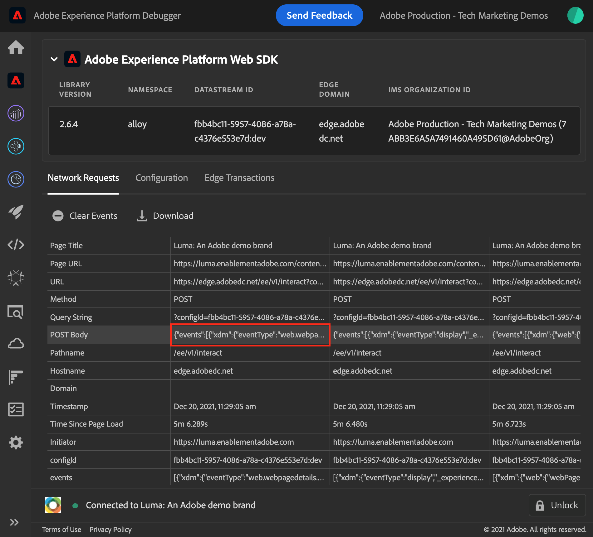
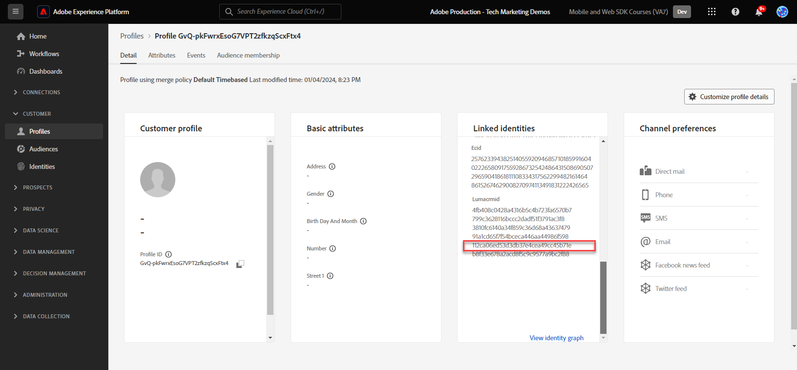

# 使用Web SDK流式传输数据以Experience Platform

了解如何使用Platform Web SDK将Web数据流式传输到Adobe Experience Platform。

Experience Platform是所有新Experience Cloud应用程序(如Adobe Real-time Customer Data Platform、Adobe Customer Journey Analytics和Adobe Journey Optimizer)的支柱。 这些应用程序旨在使用Platform Web SDK作为它们的最佳的Web数据收集方法。

Experience Platform使用您之前创建的相同XDM架构从Luma网站捕获事件数据。 当该数据被发送到Platform Edge Network时，数据流配置可以将其转发到Experience Platform。

## 学习目标

在本课程结束后，您将能够：

* 在Adobe Experience Platform中创建数据集
* 配置数据流以将Web SDK数据发送到Adobe Experience Platform
* 为实时客户个人资料启用流Web数据
* 验证数据是否已抵达Platform数据集和实时客户资料中

## 先决条件

您应该已经完成了以下课程：

* 此 **初始配置** 课程：
   * [配置权限](configure-permissions.md)
   * [配置XDM架构](configure-schemas.md)
   * [配置数据流](configure-datastream.md)
   * [配置身份命名空间](configure-identities.md)

* 此 **标记配置** 课程：
   * [安装 Web SDK 扩展](install-web-sdk.md)
   * [创建数据元素](create-data-elements.md)
   * [创建标记规则](create-tag-rule.md)

## 创建数据集

所有成功引入Adobe Experience Platform的数据将作为数据集保留在数据湖中。 A [数据集](https://experienceleague.adobe.com/docs/experience-platform/catalog/datasets/overview.html?lang=en) 是用于数据集合的存储和管理结构，通常是表格，其中包含架构（列）和字段（行）。 数据集还包含描述其存储的数据的各方面特性的元数据。

在本练习中，您将创建一个数据集以跟踪的内容和电子商务详细信息 [Luma演示站点](https://luma.enablementadobe.com/content/luma/us/en.html).

>[!WARNING]
>
>您必须已创建 `Luma Web Event Data` 如上一课中所述， [配置XDM架构](configure-schemas.md).

1. 转到 [Experience Platform界面](https://experience.adobe.com/platform/)
1. 确认您使用的是本教程所用的开发沙盒
1. 打开 **[!UICONTROL 数据集]** 从左侧导航
1. 选择 **[!UICONTROL 创建数据集]**

   

1. 选择 **[!UICONTROL 从架构创建数据集]** option

   。

1. 选择 `Luma Web Event Data` 在中创建的模式 [早先的教训](configure-schemas.md) 然后选择 **[!UICONTROL 下一个]**

   

1. 提供 **[!UICONTROL 名称]** 和可选 **[!UICONTROL 描述]** 用于数据集。 在本练习中，请使用 `Luma Web Event Data`，然后选择 **[!UICONTROL 完成]**

   

数据集现在配置为开始从Platform Web SDK实施中收集数据。

## 配置数据流

现在，您可以配置 [!UICONTROL 数据流] 以将数据发送到 [!UICONTROL Adobe Experience Platform]. 数据流是标记属性、Platform Edge Network和Experience Platform数据集之间的链接。

1. 打开 [数据收集](https://experience.adobe.com/#/data-collection){target="blank"} 界面
1. 选择 **[!UICONTROL 数据流]** 从左侧导航
1. 打开您在中创建的数据流 [配置数据流](configure-datastream.md) 教训， `Luma Web SDK`

   

1. 选择 **[!UICONTROL 添加服务]**
   
1. 选择 **[!UICONTROL Adobe Experience Platform]** 作为 **[!UICONTROL 服务]**
1. 选择 `Luma Web Event Data` 作为 **[!UICONTROL 事件数据集]**

1. 选择&#x200B;**[!UICONTROL 保存]**。

   

当您在中生成流量 [Luma演示站点](https://luma.enablementadobe.com/content/luma/us/en.html) 映射到您的标记属性时，数据将在Experience Platform中填充数据集！

## 验证数据集

此步骤对于确保数据已载入数据集至关重要。 验证发送到数据集的数据有两个方面。

* 使用进行验证 [!UICONTROL Experience Platform调试程序]
* 使用进行验证 [!UICONTROL 预览数据集]
* 使用进行验证 [!UICONTROL 查询服务]

### Experience Platform Debugger

这些步骤与您在中所执行的操作大致相同 [调试器课程](validate-with-debugger.md). 但是，由于只有在数据流中启用数据后才会将数据发送到Platform，因此您必须生成一些更多示例数据：

1. 打开 [Luma演示站点](https://luma.enablementadobe.com/content/luma/us/en.html) 并选择 [!UICONTROL Experience Platform调试程序] 扩展图标

1. 配置Debugger以将标记属性映射到 *您的* 开发环境，如 [使用Debugger进行验证](validate-with-debugger.md) 课程

   

1. 使用凭据 `test@adobe.com`/`test` 登录 Luma 网站

1. 返回 [Luma 主页](https://luma.enablementadobe.com/content/luma/us/en.html)

1. 在调试器显示的Platform Web SDK网络信标中，选择“事件”行以在弹出窗口中展开详细信息

   

1. 在弹出窗口中搜索“identityMap”。 在这里，您应该会看到包含authenticatedState、id和primary三个键的lumaCrmId
   

现在，数据应填充到 `Luma Web Event Data` 数据集，并准备好进行“预览数据集”验证。

### 预览数据集

要确认数据已抵达Platform的数据湖，一个快速选项是使用 **[!UICONTROL 预览数据集]** 功能。 将Web SDK数据微批次发送到数据湖，并定期在Platform界面中刷新。 查看生成的数据可能需要10-15分钟。

1. 在 [Experience Platform](https://experience.adobe.com/platform/) 界面，选择 **[!UICONTROL 数据集]** 在左侧导航栏中打开 **[!UICONTROL 数据集]** 仪表板。

   仪表板列出您组织的所有可用数据集。 会显示每个列出数据集的详细信息，包括其名称、数据集所遵循的架构以及最近摄取运行的状态。

1. 选择您的 `Luma Web Event Data` 要打开其的 **[!UICONTROL 数据集活动]** 屏幕。

   

   活动屏幕包括一个可视化消息使用率的图表，以及一个成功和失败批次的列表。

1. 从 **[!UICONTROL 数据集活动]** 屏幕，选择 **[!UICONTROL 预览数据集]** 在屏幕的右上角附近，可预览最多100行数据。 如果数据集为空，则停用预览链接。

   

   在预览窗口中，数据集的架构的分层视图显示在右侧。

   

>[!INFO]
>
>Adobe Experience Platform的查询服务是用于验证湖中数据的更可靠方法，但超出了本教程的范围。 有关更多详细信息，请参阅 [浏览数据](https://experienceleague.adobe.com/docs/platform-learn/tutorials/queries/explore-data.html?lang=zh-CN) 在平台教程部分中。

## 为实时客户个人资料启用数据集和架构

下一步是为实时客户档案启用数据集和架构。 来自Web SDK的数据流将是流入Platform的众多数据源之一，您希望将Web数据与其他数据源连接以构建360度客户档案。 要了解有关Real-time Customer Profile的更多信息，请观看此短视频：

>[!VIDEO](https://video.tv.adobe.com/v/27251?learn=on&captions=eng)

>[!CAUTION]
>
>在使用您自己的网站和数据时，我们建议先对数据进行更强大的验证，然后再启用它以用于实时客户档案。

**要启用数据集，请执行以下操作：**

1. 打开您创建的数据集， `Luma Web Event Data`

1. 选择 **[!UICONTROL 配置文件切换]** 以打开它

   

1. 确认您希望 **[!UICONTROL 启用]** 数据集

   

**要启用架构，请执行以下操作：**

1. 打开您创建的架构， `Luma Web Event Data`

1. 选择 **[!UICONTROL 配置文件切换]** 以打开它

   

1. 选择 **[!UICONTROL 此架构的数据将在identityMap字段中包含主标识。]**

   >[!IMPORTANT]
   >
   >    发送到Real-Time Customer Profile的每个记录都需要主身份。 通常，架构中会标记身份字段。 但是，在使用身份映射时，身份字段在架构中不可见。 此对话框用于确认您有一个主要身份，并且您将在发送数据时在身份映射中指定该身份。 如您所知，Web SDK使用标识映射，而Experience CloudID (ECID)是默认的主要标识。

1. 选择 **[!UICONTROL 启用]**

   

1. 选择 **[!UICONTROL 保存]** 保存更新的架构

现在还为配置文件启用了该架构。

>[!IMPORTANT]
>
>    为配置文件启用架构后，无法禁用或删除该架构。 此外，此后无法从架构中删除字段。 在生产环境中使用您自己的数据时，请务必牢记这些含义。 在本教程中，您应该使用开发沙盒，您可以随时删除这个沙盒。
>
>   
> 在处理您自己的数据时，我们建议您按照以下顺序执行操作：
> 
> * 首先，将一些数据摄取到数据集中。
> * 解决在数据摄取过程中出现的任何问题（例如，数据验证或映射问题）。
> * 为配置文件启用数据集和架构
> * 重新摄取数据

### 验证用户档案

您可以在Platform界面(或Journey Optimizer界面)中查找客户配置文件，以确认数据已载入实时客户配置文件。 顾名思义，用户档案会实时填充，因此不会像验证数据集中的数据那样延迟。

首先，必须生成更多示例数据。 重复本课程中前面介绍的步骤，在网站被映射到您的标记资产时登录到Luma网站。 Inspect Platform Web SDK请求，以确保其发送数据的同时 `lumaCRMId`.

1. 在 [Experience Platform](https://experience.adobe.com/platform/) 界面，选择 **[!UICONTROL 配置文件]** 在左侧导航中

1. 作为 **[!UICONTROL 身份命名空间]** 使用 `lumaCRMId`
1. 复制并粘贴的值 `lumaCRMId` 传入您在Experience Platform调试器中检查的调用(可能 `112ca06ed53d3db37e4cea49cc45b71e`)。

   

1. 如果配置文件中存在有效的值， `lumaCRMId`，控制台中会填充配置文件ID：

   

1. 单击 [!UICONTROL 配置文件ID] 和 [!UICONTROL 客户配置文件] 控制台将填充。 在这里，您可以看到链接到 `lumaCRMId`，例如 `ECID`：

   

您现在已为Experience Platform启用了Platform Web SDK(和Real-Time CDP！ 还有Customer Journey Analytics！ 还有Journey Optimizer！)！

[下一步： ](setup-analytics.md)

>[!NOTE]
>
>感谢您投入时间学习Adobe Experience Platform Web SDK。 如果您有疑问、希望分享一般反馈或有关于未来内容的建议，请在此共享它们 [Experience League社区讨论帖子](https://experienceleaguecommunities.adobe.com/t5/adobe-experience-platform-launch/tutorial-discussion-implement-adobe-experience-cloud-with-web/td-p/444996)