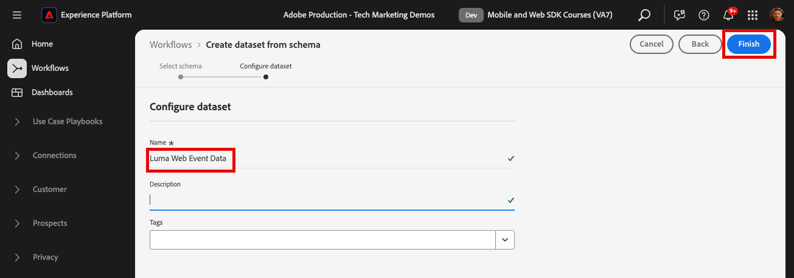

# 使用Web SDK将数据流式传输到Experience Platform

了解如何使用 Platform Web SDK 将 Web 数据传输到 Adobe Experience Platform。

Experience Platform是所有新的Experience Cloud应用程序(例如Adobe Real-Time Customer Data Platform、Adobe Customer Journey Analytics和Adobe Journey Optimizer)的骨干。 这些应用程序旨在使用Platform Web SDK作为其最佳的Web数据收集方法。

Experience Platform使用您之前创建的相同XDM架构从Luma网站捕获事件数据。 当该数据发送至Platform Edge Network时，数据流配置可以将其转发至Experience Platform。

## 学习目标

在本课程结束后，您将能够：

* 在Adobe Experience Platform中创建数据集
* 配置数据流以将Web SDK数据发送到Adobe Experience Platform
* 为实时客户个人资料启用流Web数据
* 验证数据是否已抵达Platform数据集和实时客户资料中
* 将样本忠诚度计划数据摄取到Platform
* 构建简单的平台受众

## 先决条件

要完成本课程，您必须首先：

* 有权访问Adobe Experience Platform应用程序，如Real-Time Customer Data Platform、Journey Optimizer或Customer Journey Analytics
* 完成本教程的初始配置和标记配置部分中之前的课程。

>[!NOTE]
>
>如果您没有任何Platform应用程序，则可以跳过本课程或阅读。

## 创建数据集

所有成功引入Adobe Experience Platform的数据将作为数据集保留在数据湖中。 [数据集](https://experienceleague.adobe.com/en/docs/experience-platform/catalog/datasets/overview)是用于数据集合的存储和管理结构，通常是包含架构（列）和字段（行）的表。 数据集还包含描述其存储的数据的各个方面的元数据。

让我们为您的Luma Web事件数据设置一个数据集：

1. 转到[Experience Platform](https://experience.adobe.com/platform/)或[Journey Optimizer](https://experience.adobe.com/journey-optimizer/)界面
1. 确认您使用的是本教程所用的开发沙盒
1. 从左侧导航中打开&#x200B;**[!UICONTROL 数据管理>数据集]**
1. 选择&#x200B;**[!UICONTROL 创建数据集]**

   

1. 选择&#x200B;**[!UICONTROL 从架构创建数据集]**&#x200B;选项

   

1. 选择在`Luma Web Event Data`之前的课程[中创建的](configure-schemas.md)架构，然后选择&#x200B;**[!UICONTROL 下一步]**

   

1. 为数据集提供&#x200B;**[!UICONTROL 名称]**&#x200B;和可选的&#x200B;**[!UICONTROL 描述]**。 对于此练习，请使用`Luma Web Event Data`，然后选择&#x200B;**[!UICONTROL 完成]**

   

数据集现在配置为开始从Platform Web SDK实施中收集数据。

## 配置数据流

现在您可以将[!UICONTROL 数据流]配置为将数据发送到[!UICONTROL Adobe Experience Platform]。 数据流是标记资产、Platform Edge Network和Experience Platform数据集之间的链接。

1. 打开[数据收集](https://experience.adobe.com/#/data-collection){target="blank"}接口
1. 从左侧导航中选择&#x200B;**[!UICONTROL 数据流]**
1. 打开您在[配置数据流](configure-datastream.md)课程`Luma Web SDK: Development Environment`中创建的数据流

   

1. 选择&#x200B;**[!UICONTROL 添加服务]**
   
1. 选择&#x200B;**[!UICONTROL Adobe Experience Platform]**&#x200B;作为&#x200B;**[!UICONTROL 服务]**
1. 选择&#x200B;**[!UICONTROL 已启用]**
1. 选择`Luma Web Event Data`作为&#x200B;**[!UICONTROL 事件数据集]**

1. 选择&#x200B;**[!UICONTROL 保存]**

   

当您在映射到标记属性的[Luma演示网站](https://luma.enablementadobe.com)上生成流量时，数据将填充Experience Platform中的数据集！

## 验证数据集

此步骤对于确保数据已载入数据集至关重要。 有多种方法可验证发送到数据集的数据的路径。

* 使用[!UICONTROL Experience Platform Debugger]进行验证
* 使用[!UICONTROL Experience Platform Assurance]进行验证
* 使用[!UICONTROL 预览数据集]进行验证
* 使用[!UICONTROL 查询服务]进行验证

### Debugger

这些步骤与您在[调试器课程](validate-with-debugger.md)中所执行的操作大致相同。 但是，由于只有在数据流中启用数据后才会将数据发送到Platform，因此您必须生成一些更多示例数据：

1. 打开[Luma演示网站](https://luma.enablementadobe.com)并选择[!UICONTROL Experience Platform Debugger]扩展图标

1. 配置Debugger以将标记属性映射到&#x200B;*您的*&#x200B;开发环境，如[使用Debugger验证](validate-with-debugger.md)课程中所述

   

1. 浏览网站。 查看一些产品并将一些产品添加到购物车

1. 在调试器中，打开“事件”行以查找一些XDM变量

您已验证数据是否已离开浏览器并发送到数据流！

### Assurance

由于我们现在已在数据流中启用了一项服务，因此我们可以在Assurance中看到更多内容：

1. 打开您的Assurance会话或开始一个新会话
1. 打开&#x200B;**[!UICONTROL 数据流]**&#x200B;事件
1. 在这里，您可以查看Platform服务的配置，包括您之前在本课程中创建的数据流的ID。

   Assurance中的

1. 打开属于&#x200B;**[!UICONTROL com.adobe.streaming.validation]**&#x200B;供应商的&#x200B;**[!UICONTROL generic]**&#x200B;事件。 这显示了请求已连同随附的XDM数据一起发送到数据集

   在Assurance中进行

您已验证请求是否已由Platform Edge Network接收并转发到Platform数据集。

### 预览数据集

现在，让我们实际查看一下数据集！ 一个快速选项是使用&#x200B;**[!UICONTROL 预览数据集]**&#x200B;功能。 Web SDK数据将微批次传输到数据湖，并定期在Platform界面中刷新。 查看生成的数据可能需要10-15分钟。

1. 在[Experience Platform](https://experience.adobe.com/platform/)界面中，从左侧导航中选择&#x200B;**[!UICONTROL 数据管理>数据集]**&#x200B;以打开&#x200B;**[!UICONTROL 数据集]**&#x200B;仪表板。

   仪表板列出您组织的所有可用数据集。 会显示每个列出数据集的详细信息，包括其名称、数据集所遵循的架构以及最近摄取运行的状态。

1. 选择您的`Luma Web Event Data`数据集以打开其&#x200B;**[!UICONTROL 数据集活动]**&#x200B;屏幕。

   

   活动屏幕包括一个可视化消息使用率的图表，以及一个成功和失败批次的列表。
1. 由于这是一个新数据集，因此如果您甚至看到一个包含已摄取记录的批次，这是一个正信号：

1. 从&#x200B;**[!UICONTROL 数据集活动]**&#x200B;屏幕中，选择屏幕右上角附近的&#x200B;**[!UICONTROL 预览数据集]**&#x200B;以预览最多100行数据。 如果数据集为空，则停用预览链接。

   

1. 查询将运行以从您的数据集中提取100个最近的数据行。 您可以深入到单个XDM字段，如web.webPageDetails.name：

   

### 查询数据

您可以对数据运行自定义查询并验证数据摄取：

1. 在[Experience Platform](https://experience.adobe.com/platform/)界面中，从左侧导航中选择&#x200B;**[!UICONTROL 数据管理>查询]**&#x200B;以打开&#x200B;**[!UICONTROL 查询]**&#x200B;屏幕。
1. 选择&#x200B;**[!UICONTROL 创建查询]**
1. 首先，运行查询以查看数据湖中表的所有名称。 在查询编辑器中输入`SHOW TABLES`并单击播放图标运行查询。
1. 在结果中，请注意表名为`luma_web_event_data`的方式
1. 现在，使用引用表的简单查询来查询表（请注意，默认查询将限制为100个结果）： `SELECT * FROM "luma_web_event_data"`
1. 片刻后，您应该会看到Web数据的示例记录。

   

>[!ERROR]
>
>如果您收到“未配置表”错误，请仔细检查表的名称。 也有可能是微量的数据尚未进入数据湖。 请在10-15分钟后重试。

>[!INFO]
>
>  查询服务是面向数据工程师和分析人员的功能非常强大的工具。 有关Adobe Experience Platform查询服务的更多详细信息，请参阅Platform教程部分中的[浏览数据](https://experienceleague.adobe.com/en/docs/platform-learn/tutorials/queries/explore-data)。

>[!NOTE]
>
>感谢您投入时间学习Adobe Experience Platform Web SDK。 如果您有疑问、希望分享一般反馈或有关于未来内容的建议，请在此[Experience League社区讨论帖子](https://experienceleaguecommunities.adobe.com/adobe-experience-platform-18/tutorial-discussion-implement-adobe-experience-cloud-with-web-sdk-tutorial-248848)上分享这些内容
