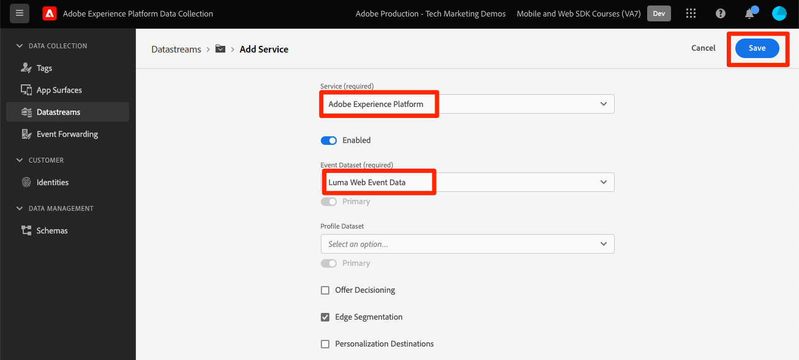

# 使用Web SDK将数据流式传输到Experience Platform

了解如何使用 Platform Web SDK 将 Web 数据传输到 Adobe Experience Platform。

Experience Platform是所有新的Experience Cloud应用程序(例如Adobe Real-Time Customer Data Platform、Adobe Customer Journey Analytics和Adobe Journey Optimizer)的骨干。 这些应用程序旨在使用Platform Web SDK作为其最佳的Web数据收集方法。

Experience Platform使用您之前创建的相同XDM架构从Luma网站捕获事件数据。 当该数据发送至Platform Edge Network时，数据流配置可以将其转发至Experience Platform。

## 学习目标

在本课程结束后，您将能够：

* 在Adobe Experience Platform中创建数据集
* 配置数据流以将Web SDK数据发送到Adobe Experience Platform
* 为实时客户个人资料启用流Web数据
* 验证数据是否已抵达Platform数据集和实时客户资料中
* 将样本忠诚度计划数据摄取到Platform
* 构建简单的平台受众

## 先决条件

要完成本课程，您必须首先：

* 有权访问Adobe Experience Platform应用程序，如Real-Time Customer Data Platform、Journey Optimizer或Customer Journey Analytics
* 完成本教程的初始配置和标记配置部分中之前的课程。

>[!NOTE]
>
>如果您没有任何Platform应用程序，则可以跳过本课程或阅读。

## 创建数据集

所有成功引入Adobe Experience Platform的数据将作为数据集保留在数据湖中。 [数据集](https://experienceleague.adobe.com/zh-hans/docs/experience-platform/catalog/datasets/overview)是用于数据集合的存储和管理结构，通常是包含架构（列）和字段（行）的表。 数据集还包含描述其存储的数据的各个方面的元数据。

让我们为您的Luma Web事件数据设置一个数据集：

1. 转到[Experience Platform](https://experience.adobe.com/platform/)或[Journey Optimizer](https://experience.adobe.com/journey-optimizer/)界面
1. 确认您使用的是本教程所用的开发沙盒
1. 从左侧导航中打开&#x200B;**[!UICONTROL 数据管理>数据集]**
1. 选择&#x200B;**[!UICONTROL 创建数据集]**

   

1. 选择&#x200B;**[!UICONTROL 从架构创建数据集]**&#x200B;选项

   

1. 选择在[之前的课程](configure-schemas.md)中创建的`Luma Web Event Data`架构，然后选择&#x200B;**[!UICONTROL 下一步]**

   

1. 为数据集提供&#x200B;**[!UICONTROL 名称]**&#x200B;和可选的&#x200B;**[!UICONTROL 描述]**。 对于此练习，请使用`Luma Web Event Data`，然后选择&#x200B;**[!UICONTROL 完成]**

   

数据集现在配置为开始从Platform Web SDK实施中收集数据。

## 配置数据流

现在您可以将[!UICONTROL 数据流]配置为将数据发送到[!UICONTROL Adobe Experience Platform]。 数据流是标记资产、Platform Edge Network和Experience Platform数据集之间的链接。

1. 打开[数据收集](https://experience.adobe.com/#/data-collection){target="blank"}接口
1. 从左侧导航中选择&#x200B;**[!UICONTROL 数据流]**
1. 打开您在[配置数据流](configure-datastream.md)课程`Luma Web SDK`中创建的数据流

   

1. 选择&#x200B;**[!UICONTROL 添加服务]**
   
1. 选择&#x200B;**[!UICONTROL Adobe Experience Platform]**&#x200B;作为&#x200B;**[!UICONTROL 服务]**
1. 选择`Luma Web Event Data`作为&#x200B;**[!UICONTROL 事件数据集]**

1. 选择&#x200B;**[!UICONTROL 保存]**。

   

在映射到标记属性的[Luma演示网站](https://luma.enablementadobe.com/content/luma/us/en.html)上生成流量时，数据会填充Experience Platform中的数据集！

## 验证数据集

此步骤对于确保数据已载入数据集至关重要。 验证发送到数据集的数据有两个方面。

* 使用[!UICONTROL Experience Platform Debugger]进行验证
* 使用[!UICONTROL 预览数据集]进行验证
* 使用[!UICONTROL 查询服务]进行验证

### Experience Platform Debugger

这些步骤与您在[调试器课程](validate-with-debugger.md)中所执行的操作大致相同。 但是，由于只有在数据流中启用数据后才会将数据发送到Platform，因此您必须生成一些更多示例数据：

1. 打开[Luma演示网站](https://luma.enablementadobe.com/content/luma/us/en.html)并选择[!UICONTROL Experience Platform Debugger]扩展图标

1. 配置Debugger以将标记属性映射到&#x200B;*您的*&#x200B;开发环境，如[使用Debugger验证](validate-with-debugger.md)课程中所述

   

1. 使用凭据 `test@test.com`/`test` 登录 Luma 网站

1. 返回 [Luma 主页](https://luma.enablementadobe.com/content/luma/us/en.html)

1. 在Debugger显示的Platform Web SDK网络信标中，选择“事件”行以在弹出窗口中展开详细信息

   Debugger中的

1. 在弹出窗口中搜索“identityMap”。 在这里，您应该会看到包含authenticatedState、id和primary三个键的lumaCrmId
   Debugger中的

现在，应在`Luma Web Event Data`数据集中填充数据，并准备好“预览数据集”验证。

### 预览数据集

要确认数据已登陆Platform的数据湖，一个快速选项是使用&#x200B;**[!UICONTROL 预览数据集]**&#x200B;功能。 Web SDK数据将微批次传输到数据湖，并定期在Platform界面中刷新。 查看生成的数据可能需要10-15分钟。

1. 在[Experience Platform](https://experience.adobe.com/platform/)界面中，从左侧导航中选择&#x200B;**[!UICONTROL 数据管理>数据集]**&#x200B;以打开&#x200B;**[!UICONTROL 数据集]**&#x200B;仪表板。

   仪表板列出您组织的所有可用数据集。 会显示每个列出数据集的详细信息，包括其名称、数据集所遵循的架构以及最近摄取运行的状态。

1. 选择您的`Luma Web Event Data`数据集以打开其&#x200B;**[!UICONTROL 数据集活动]**&#x200B;屏幕。

   

   活动屏幕包括一个可视化消息使用率的图表，以及一个成功和失败批次的列表。

1. 从&#x200B;**[!UICONTROL 数据集活动]**&#x200B;屏幕中，选择屏幕右上角附近的&#x200B;**[!UICONTROL 预览数据集]**&#x200B;以预览最多100行数据。 如果数据集为空，则停用预览链接。

   

   在预览窗口中，数据集的架构的分层视图显示在右侧。

   

### 查询数据

1. 在[Experience Platform](https://experience.adobe.com/platform/)界面中，从左侧导航中选择&#x200B;**[!UICONTROL 数据管理>查询]**&#x200B;以打开&#x200B;**[!UICONTROL 查询]**&#x200B;屏幕。
1. 选择&#x200B;**[!UICONTROL 创建查询]**
1. 首先，运行查询以查看数据湖中表的所有名称。 在查询编辑器中输入`SHOW TABLES`并单击播放图标运行查询。
1. 在结果中，请注意表的名称类似于`luma_web_event_data`的情况
1. 现在，使用引用表的简单查询来查询表（请注意，默认查询将限制为100个结果）： `SELECT * FROM "luma_web_event_data"`
1. 片刻后，您应该会看到Web数据的示例记录。

>[!ERROR]
>
>如果您收到“未配置表”错误，请仔细检查表的名称。 也有可能是微量的数据尚未进入数据湖。 请在10-15分钟后重试。

>[!INFO]
>
>  有关Adobe Experience Platform查询服务的更多详细信息，请参阅Platform教程部分中的[浏览数据](https://experienceleague.adobe.com/zh-hans/docs/platform-learn/tutorials/queries/explore-data)。

## 为实时客户个人资料启用数据集和架构

对于Real-Time Customer Data Platform和Journey Optimizer的客户，下一步是为实时客户个人资料启用数据集和架构。 来自Web SDK的数据流将是流入Platform的众多数据源之一，并且您希望将Web数据与其他数据源连接以构建360度客户档案。 要了解有关Real-time Customer Profile的更多信息，请观看此短视频：

>[!VIDEO](https://video.tv.adobe.com/v/27251?learn=on&captions=eng)

>[!CAUTION]
>
>在使用您自己的网站和数据时，我们建议先对数据进行更强大的验证，然后再启用它以用于实时客户档案。

**启用数据集：**

1. 打开您创建的数据集，`Luma Web Event Data`

1. 选择&#x200B;**[!UICONTROL 配置文件切换]**&#x200B;以将其打开

   

1. 确认您要&#x200B;**[!UICONTROL 启用]**&#x200B;数据集

   

**要启用架构：**

1. 打开您创建的架构，`Luma Web Event Data`

1. 选择&#x200B;**[!UICONTROL 配置文件切换]**&#x200B;以将其打开

   

1. 选择&#x200B;**[!UICONTROL 此架构的数据将在identityMap字段中包含主标识。]**

   >[!IMPORTANT]
   >
   >    发送到Real-Time Customer Profile的每个记录都需要主身份。 通常，架构中会标记身份字段。 但是，在使用身份映射时，身份字段在架构中不可见。 此对话框用于确认您有一个主要身份，并且您将在发送数据时在身份映射中指定该身份。 如您所知，Web SDK使用标识映射，将Experience Cloud Id (ECID)作为默认主标识，并将经过身份验证的ID作为主标识（如果可用）。

1. 选择&#x200B;**[!UICONTROL 启用]**

   

1. 选择&#x200B;**[!UICONTROL 保存]**&#x200B;以保存更新的架构

现在还为配置文件启用了该架构。

>[!IMPORTANT]
>
>    为配置文件启用架构后，如果不重置或删除整个沙盒，则无法禁用或删除该架构。 此外，此后无法从架构中删除字段。
>
>   
> 在处理您自己的数据时，我们建议您按照以下顺序执行操作：
> 
> * 首先，将一些数据摄取到数据集中。
> * 解决在数据摄取过程中出现的任何问题（例如，数据验证或映射问题）。
> * 为配置文件启用数据集和架构
> * 如果需要，重新摄取数据

### 验证用户档案

您可以在Platform界面(或Journey Optimizer界面)中查找客户配置文件，以确认数据已载入实时客户配置文件。 顾名思义，用户档案会实时填充，因此不会像验证数据集中的数据那样延迟。

首先，必须生成更多示例数据。 重复本课程中前面介绍的步骤，在网站被映射到您的标记资产时登录到Luma网站。 检查Platform Web SDK请求，以确保其使用`lumaCRMId`发送数据。

1. 在[Experience Platform](https://experience.adobe.com/platform/)界面中，在左侧导航中选择&#x200B;**[!UICONTROL 客户]** > **[!UICONTROL 配置文件]**

1. 由于&#x200B;**[!UICONTROL 身份命名空间]**&#x200B;使用`lumaCRMId`
1. 复制并粘贴您在Experience Platform Debugger中检查的调用中传递的`lumaCRMId`的值，在本例中为`b642b4217b34b1e8d3bd915fc65c4452`。

   

1. 如果`lumaCRMId`的配置文件中存在有效值，则控制台中会填充配置文件ID：

   

1. 要查看每个ID的完整&#x200B;**[!UICONTROL 客户配置文件]**，请在主窗口中选择&#x200B;**[!UICONTROL 配置文件ID]**。

   >[!NOTE]
   >
   >请注意，您可以选择“配置文件ID”的超链接，或者如果您选择了行，则会打开一个右菜单，您可以在其中选择“配置文件ID”超链接
   > 

   在这里，您可以看到链接到`lumaCRMId`的所有标识，如`ECID`。

   

您现在已为Experience Platform(和Real-Time CDP！启用了Platform Web SDK 还有Journey Optimizer！ 和Customer Journey Analytics！)。

### 创建忠诚度模式并摄取示例数据

Real-Time Customer Data Platform和Journey Optimizer的客户可望完成本练习。

将Web SDK数据摄取到Adobe Experience Platform后，可以通过已摄取到Platform的其他数据源来扩充这些数据。 例如，当用户登录到Luma网站时，将在Experience Platform中构建一个身份图，并且所有其他启用配置文件的数据集可能会合并到一起以构建实时客户配置文件。 要查看其实际效果，请快速在Adobe Experience Platform中创建另一个包含一些忠诚度数据示例的数据集，以便您可以将实时客户配置文件与Real-Time Customer Data Platform和Journey Optimizer结合使用。 由于您已经进行了类似的练习，因此会提供简短的说明。

创建忠诚度模式：

1. 创建新架构
1. 选择&#x200B;**[!UICONTROL 个人资料]**&#x200B;作为[!UICONTROL 基类]
1. 命名架构`Luma Loyalty Schema`
1. 添加[!UICONTROL 忠诚度详细信息]字段组
1. 添加[!UICONTROL 人口统计详细信息]字段组
1. 选择`Person ID`字段并使用`Luma CRM Id` [!UICONTROL 标识命名空间]将其标记为[!UICONTROL 标识]和[!UICONTROL 主标识]。
1. 为[!UICONTROL 配置文件]启用架构。 如果找不到配置文件切换开关，请尝试单击左上角的架构名称。
1. 保存架构

   

要创建数据集并摄取示例数据，请执行以下操作：

1. 从`Luma Loyalty Schema`创建新数据集
1. 命名数据集`Luma Loyalty Dataset`
1. 为[!UICONTROL 配置文件]启用数据集
1. 下载样例文件[luma-loyalty-forWeb.json](assets/luma-loyalty-forWeb.json)
1. 将文件拖放到数据集中
1. 确认已成功摄取数据

   

### 创建受众

受众会根据常见特征将用户档案分组在一起。 构建可在Web营销活动中使用的快速受众：

1. 在Experience Platform或Journey Optimizer界面中，在左侧导航中转到&#x200B;**[!UICONTROL 客户]** > **[!UICONTROL 受众]**
1. 选择&#x200B;**[!UICONTROL 创建受众]**
1. 选择&#x200B;**[!UICONTROL 生成规则]**
1. 选择&#x200B;**[!UICONTROL 创建]**

   

1. 选择&#x200B;**[!UICONTROL 属性]**
1. 查找&#x200B;**[!UICONTROL 忠诚度]** > **[!UICONTROL 第]**&#x200B;层字段，并将其拖动到&#x200B;**[!UICONTROL 属性]**&#x200B;部分
1. 将受众定义为其`tier`为`gold`的用户
1. 将受众命名为`Luma Loyalty Rewards – Gold Status`
1. 选择&#x200B;**[!UICONTROL Edge]**&#x200B;作为&#x200B;**[!UICONTROL 评估方法]**
1. 选择&#x200B;**[!UICONTROL 保存]**

   

由于这是一个非常简单的受众，因此我们可以使用Edge评估方法。 Edge受众会在边缘进行评估，因此在由Web SDK向Platform Edge Network发出的相同请求中，我们可以评估受众定义并立即确认用户是否符合条件。

[下一步： ](setup-analytics.md)

>[!NOTE]
>
>感谢您投入时间学习Adobe Experience Platform Web SDK。 如果您有疑问、希望分享一般反馈或有关于未来内容的建议，请在此[Experience League社区讨论帖子](https://experienceleaguecommunities.adobe.com/t5/adobe-experience-platform-data/tutorial-discussion-implement-adobe-experience-cloud-with-web/td-p/444996)上分享这些内容
