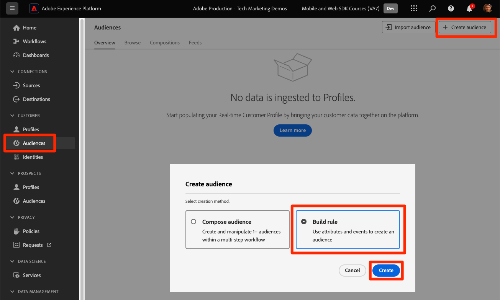

# 实时客户配置文件和Edge分段

## 为实时客户配置文件启用数据集和架构

对于Real-Time Customer Data Platform和Journey Optimizer的客户，下一步是为实时客户个人资料启用数据集和架构。 来自Web SDK的数据流将是流入Platform的众多数据源之一，并且您希望将Web数据与其他数据源连接以构建360度客户档案。 要了解有关Real-time Customer Profile的更多信息，请观看此短视频：

>[!VIDEO](https://video.tv.adobe.com/v/31672?learn=on&captions=chi_hans)

>[!CAUTION]
>
>在使用您自己的网站和数据时，我们建议先对数据进行更强大的验证，然后再启用它以用于实时客户档案。

### 启用架构

要为配置文件启用架构，请执行以下操作：

1. 打开您创建的架构，`Luma Web Event Data`

1. 选择&#x200B;**[!UICONTROL 配置文件切换]**&#x200B;以将其打开

   

1. 选择&#x200B;**[!UICONTROL 此架构的数据将在identityMap字段中包含主标识。]**

1. 选择&#x200B;**[!UICONTROL 启用]**

   

   >[!IMPORTANT]
   >
   >    发送到Real-Time Customer Profile的每个记录都需要主身份。 每个记录都成为一个“配置文件片段”，主标识是查找这些片段的键。
   > 
   > 对于某些类型的数据，架构中会标记身份字段。 但是，对于Experience Platform SDK捕获的事件数据，身份映射是典型的，并且身份字段在架构中不可见。
   >
   > 此对话框用于确认您有一个主要身份，并且您将在发送数据时在身份映射中指定该身份，使用身份图链接规则配置该身份，或同时使用两者。 我们建议您同时执行这两个操作。
   >
   > 如您所知，我们的Luma实施使用具有身份验证的lumaCrmId的标识映射作为主要标识（如果可用），否则它将默认使用Experience Cloud ID (ECID)。

1. 选择&#x200B;**[!UICONTROL 保存]**&#x200B;以保存更新的架构

现在已为配置文件启用架构。

### 启用数据集

要启用数据集，请执行以下操作：

1. 打开您创建的数据集，`Luma Web Event Data`

1. 选择&#x200B;**[!UICONTROL 配置文件切换]**&#x200B;以将其打开

   

1. 确认您要&#x200B;**[!UICONTROL 启用]**&#x200B;数据集

>[!IMPORTANT]
>
>  为配置文件启用架构并将数据摄取到数据集后，如果不重置或删除整个沙盒，则无法禁用或删除该架构。 此外，在此时间点之后，无法从架构中删除已接收数据的字段。
>
>   
> 在处理您自己的数据时，我们建议您按照以下顺序执行操作：
> 
> * 首先，将一些数据摄取到数据集中。
> * 解决在数据摄取过程中出现的任何问题（例如，数据验证或映射问题）。
> * 为配置文件启用数据集和架构
> * 如果需要，重新摄取数据

### 验证用户档案

您可以在Platform界面(或Journey Optimizer界面)中查找客户配置文件，以确认数据已载入实时客户配置文件。 顾名思义，用户档案会实时填充，因此不会像验证数据集中的数据那样延迟。

首先，您必须在启用配置文件的数据集中生成更多示例数据：

1. 打开[Luma演示网站](https://luma.enablementadobe.com)并选择[!UICONTROL Experience Platform Debugger]扩展图标

1. 配置Debugger以将标记属性映射到&#x200B;*您的*&#x200B;开发环境，如[使用Debugger验证](validate-with-debugger.md)课程中所述

   

1. 浏览网站。 查看一些产品并将它们添加到购物车中。

1. 使用凭据`test@test.com`/`test`登录Luma网站（如果收到消息“电子邮件或密码无效”，则使用这些凭据创建帐户）

1. 打开“事件”行以查找一些XDM变量
1. 在弹出窗口中搜索“identityMap”。 在这里，您应该会看到包含authenticatedState、id和primary三个键的lumaCrmId。 请注意，此登录的lumaCrmId值为`f660ab912ec121d1b1e928a0bb4bc61b`。

   Debugger中的

现在，让我们在Experience Platform中查找我们的个人资料：

1. 在[Experience Platform](https://experience.adobe.com/platform/)界面中，在左侧导航中选择&#x200B;**[!UICONTROL 客户]** > **[!UICONTROL 配置文件]**

1. 由于&#x200B;**[!UICONTROL 身份命名空间]**&#x200B;使用`Luma CRM ID`
1. 复制并粘贴您在Experience Platform Debugger中检查的调用中传递的`lumaCrmId`的值，在本例中为`f660ab912ec121d1b1e928a0bb4bc61b`

1. 如果`lumaCRMId`的配置文件中存在有效值，则控制台中会填充配置文件ID

1. 要查看完整的&#x200B;**[!UICONTROL 客户配置文件]**，请选择&#x200B;**[!UICONTROL 查看]**：

   

1. 首先，您将看到用户档案的摘要。 此个人资料中还没有太多信息，但此处是个人资料中链接的身份，`lumaCRMId`和`ECID`：

   

1. 此时，大多数可用的用户档案数据都是来自Web活动的事件数据。 选择&#x200B;**[!UICONTROL 事件]**&#x200B;以查看点击流数据：

   

## 避免配置文件折叠

现在，让我们看一下您永远不希望自己在实施中发生的事情 — 图形折叠。

### 了解问题

首先，我们将生成更多示例数据，以便我们看到问题：

1. 在不删除任何cookie或localStorage对象的情况下，打开[Luma演示网站](https://luma.enablementadobe.com)并选择[!UICONTROL Experience Platform Debugger]扩展图标

1. 配置Debugger以将标记属性映射到&#x200B;*您的*&#x200B;开发环境，如[使用Debugger验证](validate-with-debugger.md)课程中所述

   

1. 希望您仍使用凭据`test@test.com`/`test`登录Luma网站。 如果没有，请重新登录。

1. 浏览网站。 查看一些产品并将它们添加到购物车中。

1. 现在，注销。

1. 现在再次登录，创建帐户作为其他用户(`spouse@test.com/test`)。 我们正在尝试执行的操作是复制“共享设备”方案，其中两个用户共享同一个Web浏览器、对同一网站进行身份验证并共享相同的`ECID`值。
1. 在Debugger中确认`98d73957f59c67617611d56ba7e8dbaa`的lumaCrmId `spouse@test.com/test`不同。

   

1. 查看一些其他产品

现在，再次查找配置文件：

1. 再次搜索`Luma CRM ID`等于`f660ab912ec121d1b1e928a0bb4bc61b`
1. 请注意，该配置文件现在链接到两个不同的Luma CRM ID

1. 选择&#x200B;**[!UICONTROL 查看身份图]**

   

1. 标识图有助于显示此配置文件，由于设备共享，其中两个`lumaCrmId`值由公共`ECID`值联接。

   

这可能会成为Experience Platform实施的一个大问题。 不仅两个用户的事件数据都联接在单个配置文件中，而且使用这些`lumaCrmId`值引入Platform中的其他类型的数据也将被合并。

### 使用身份图链接规则修复此问题

要提前解决图形折叠问题，请在启用Web SDK实施之前使用Adobe Experience Platform中的身份图形链接规则功能。

>[!WARNING]
>
> 这些步骤通常由管理整个Platform实施的数据架构师配置。 该功能所具有的功能比这里所显示的功能要多得多，并且有许多复杂的场景，应首先仔细模拟。
>
> 仅当您在专用的开发沙盒中完成本教程时，才能完成这些步骤，在您完成本教程后，可以删除该沙盒。 对沙盒的这些更改无法撤销。 有关详细信息，请参阅[身份图形链接规则教程](https://experienceleague.adobe.com/zh-hans/docs/platform-learn/tutorials/identities/graph-linking-rules/overview)。

要启用身份图链接规则，请执行以下操作：

1. 从任何“身份”屏幕中，打开&#x200B;**[!UICONTROL 设置]**：

   

1. 查看模态中的警告，然后选择&#x200B;**[!UICONTROL 继续]**
1. 拖动`Luma CRM ID`，使其成为列表中优先级最高的命名空间
1. 检查&#x200B;**[!UICONTROL 的]**&#x200B;每个图形的唯一值`Luma CRM ID`设置
1. 选择&#x200B;**[!UICONTROL 下一步]**
   
1. 查看模式并&#x200B;**[!UICONTROL 确认]**
1. 选择&#x200B;**[!UICONTROL 下一步]**&#x200B;跳过模拟步骤

   >[!WARNING]
   >
   > 同样，如果您没有在自己的专用开发沙盒中工作，请勿完成此工作流以启用这些身份设置。

1. 输入沙盒名称并选择&#x200B;**[!UICONTROL 确认]**

   

24小时后返回网站，以`test@test.com`或`spouse@test.com`身份重新登录，并查看您的配置文件是否已分隔。

## 创建经Edge评估的受众

建议使用Real-Time Customer Data Platform和Journey Optimizer的客户完成此练习。

将Web SDK数据摄取到Adobe Experience Platform后，可以通过已摄取到Platform的其他数据源来扩充这些数据。 例如，当用户登录到Luma网站时，将在Experience Platform中构建一个身份图，并且所有其他启用配置文件的数据集可能会合并到一起以构建实时客户配置文件。 要查看其实际效果，您将快速在Adobe Experience Platform中创建另一个包含一些忠诚度数据示例的数据集，以便可以将实时客户配置文件与Real-Time Customer Data Platform和Journey Optimizer结合使用。 然后，您将基于此数据构建受众。

### 创建忠诚度模式并摄取示例数据

由于您已经进行了类似的练习，因此会提供简短的说明。

创建忠诚度模式：

1. 创建新架构
1. 选择&#x200B;**[!UICONTROL 个人资料]**&#x200B;作为[!UICONTROL 基类]
1. 命名架构`Luma Loyalty Schema`
1. 添加[!UICONTROL 忠诚度详细信息]字段组
1. 添加[!UICONTROL 人口统计详细信息]字段组
1. 选择`Person ID`字段并使用标识命名空间[!UICONTROL 将其标记为]标识`Luma CRM Id`和[!UICONTROL 主标识]。
1. 为[!UICONTROL 配置文件]启用架构。 如果找不到配置文件切换开关，请尝试单击左上角的架构名称。
1. 保存架构

   

要创建数据集并摄取示例数据，请执行以下操作：

1. 从`Luma Loyalty Schema`创建新数据集
1. 命名数据集`Luma Loyalty Dataset`
1. 为[!UICONTROL 配置文件]启用数据集
1. 下载样例文件[luma-loyalty-forWeb.json](assets/luma-loyalty-forWeb.json)
1. 将文件拖放到数据集中
1. 确认已成功摄取数据

   

### 设置Edge上的活动合并策略

所有受众均使用合并策略创建。 合并策略会创建配置文件的不同“视图”，可以包含数据集的子集，并规定不同数据集贡献相同配置文件属性时的优先级顺序。 要在边缘进行评估，受众必须使用具有&#x200B;**[!UICONTROL Active-On-Edge合并策略]**&#x200B;设置的合并策略。

>[!IMPORTANT]
>
>每个沙盒只能有一个合并策略，该策略可以具有&#x200B;**[!UICONTROL Active-On-Edge合并策略]**&#x200B;设置

1. 打开Experience Platform或Journey Optimizer界面，并确保您使用的是本教程所用的开发环境。
1. 导航到&#x200B;**[!UICONTROL 客户]** > **[!UICONTROL 配置文件]** > **[!UICONTROL 合并策略]**&#x200B;页面
1. 打开&#x200B;**[!UICONTROL 默认合并策略]** （可能名为`Default Timebased`）
   
1. 启用&#x200B;**[!UICONTROL Edge上的Active-On合并策略]**&#x200B;设置
1. 选择&#x200B;**[!UICONTROL 下一步]**

   
1. 继续选择&#x200B;**[!UICONTROL 下一步]**&#x200B;以继续执行工作流程的其他步骤，并选择&#x200B;**[!UICONTROL 完成]**&#x200B;以保存您的设置
   

您现在可以创建将在Edge上评估的受众。

### 创建受众

受众会根据常见特征将用户档案分组在一起。 构建可在Real-Time CDP或Journey Optimizer中使用的简单受众：

1. 在Experience Platform或Journey Optimizer界面中，在左侧导航中转到&#x200B;**[!UICONTROL 客户]** > **[!UICONTROL 受众]**
1. 选择&#x200B;**[!UICONTROL 创建受众]**
1. 选择&#x200B;**[!UICONTROL 生成规则]**
1. 选择&#x200B;**[!UICONTROL 创建]**

   

1. 选择&#x200B;**[!UICONTROL 属性]**
1. 查找&#x200B;**[!UICONTROL 忠诚度]** > **[!UICONTROL 第]**&#x200B;层字段，并将其拖动到&#x200B;**[!UICONTROL 属性]**&#x200B;部分
1. 将受众定义为其`tier`为`gold`的用户
1. 将受众命名为`Luma Loyalty Rewards – Gold Status`
1. 选择&#x200B;**[!UICONTROL Edge]**&#x200B;作为&#x200B;**[!UICONTROL 评估方法]**
1. 选择&#x200B;**[!UICONTROL 保存]**

   

>[!NOTE]
>
> 由于我们已将默认合并策略设置为&#x200B;**[!UICONTROL Edge上的活动合并策略]**，因此您创建的受众将自动与此合并策略关联。

由于这是一个非常简单的受众，因此我们可以使用Edge评估方法。 Edge受众会在边缘进行评估，因此在由Web SDK向Platform Edge Network发出的相同请求中，我们可以评估受众定义并立即确认用户是否符合条件。

>[!NOTE]
>
>感谢您投入时间学习Adobe Experience Platform Web SDK。 如果您有疑问、希望分享一般反馈或有关于未来内容的建议，请在此[Experience League社区讨论帖子](https://experienceleaguecommunities.adobe.com/adobe-experience-platform-18/tutorial-discussion-implement-adobe-experience-cloud-with-web-sdk-tutorial-248848?profile.language=zh-Hans)上分享这些内容
