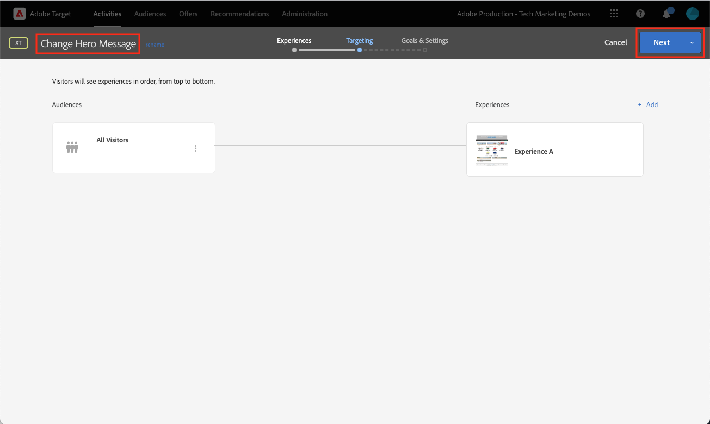

# 使用Platform Web SDK设置Adobe Target

了解如何使用 Adobe Experience Platform Web SDK 实施 Adobe Target。了解如何投放体验，以及如何将其他参数传递给 Target。

[Adobe Target](https://experienceleague.adobe.com/en/docs/target/using/target-home)是一种Adobe Experience Cloud应用程序，可为您提供定制和个性化客户体验所需的一切功能，从而最大限度地增加您的Web和移动设备网站、应用程序及其他数字渠道的收入。


## 学习目标

在本课程结束时，您可以通过Target的Web SDK实施执行以下操作：

* 添加预隐藏代码片段以防止闪烁
* 配置数据流以启用Target功能
* 呈现可视化体验编辑器活动
* 呈现表单编辑器活动
* 将XDM数据传递给Target并了解到Target参数的映射
* 将自定义数据（如配置文件和实体参数）传递到Target
* 验证 Target 实施
* 将个性化请求与Analytics请求分开

>[!TIP]
>
>有关迁移现有at.js实施的分步指南，请参阅我们的[将Target从at.js 2.x迁移到Platform Web SDK](/help/tutorial-migrate-target-websdk/introduction.md)教程。


## 先决条件

要完成此部分中的课程，您必须首先：

* 完成有关Platform Web SDK初始配置的所有课程，包括设置数据元素和规则。
* 确保您在Adobe Target中具有[编辑者或审批者角色](https://experienceleague.adobe.com/en/docs/target/using/administer/manage-users/enterprise/properties-overview#section_8C425E43E5DD4111BBFC734A2B7ABC80)。
* 如果您使用Google Chrome浏览器，请安装[可视化体验编辑器助手扩展](https://experienceleague.adobe.com/en/docs/target/using/experiences/vec/troubleshoot-composer/vec-helper-browser-extension)。
* 了解如何在Target中设置活动。 如果您需要复习者，以下教程和指南对本课程很有帮助：
   * [使用可视化体验编辑器(VEC)助手扩展](https://experienceleague.adobe.com/en/docs/target/using/experiences/vec/troubleshoot-composer/vec-helper-browser-extension)
   * [使用 Visual Experience Composer](https://experienceleague.adobe.com/en/docs/target-learn/tutorials/experiences/use-the-visual-experience-composer)
   * [使用基于表单的体验编辑器](https://experienceleague.adobe.com/en/docs/target-learn/tutorials/experiences/use-the-form-based-experience-composer)
   * [创建体验目标选择活动](https://experienceleague.adobe.com/zh-hans/docs/target-learn/tutorials/activities/create-experience-targeting-activities) 

## 添加闪烁处理

在开始之前，请根据标记库的加载方式，确定是否需要额外的闪烁处理解决方案。

>[!NOTE]
>
>本教程使用[Luma网站](https://luma.enablementadobe.com/content/luma/us/en.html){target=_blank}，该网站已异步实施标记并实施了闪烁抑制。 此部分旨在了解如何通过Platform Web SDK来减少闪烁。


### 异步实施

异步加载标记库时，页面可能会在Target将默认内容替换为个性化内容之前完成渲染。 这种行为可能会导致所谓的“闪烁”，在这种情况下，会先短暂显示默认内容，然后再将该内容替换为个性化内容。 如果要避免出现这种闪烁情况，Adobe建议在紧靠异步标签嵌入代码之前的位置添加一个特殊的预隐藏代码片段。

此代码片段已存在于Luma网站上，但让我们仔细了解一下此代码的用途：

```html
<script>
  !function(e,a,n,t){var i=e.head;if(i){
  if (a) return;
  var o=e.createElement("style");
  o.id="alloy-prehiding",o.innerText=n,i.appendChild(o),setTimeout(function(){o.parentNode&&o.parentNode.removeChild(o)},t)}}
  (document, document.location.href.indexOf("adobe_authoring_enabled") !== -1, ".personalization-container { opacity: 0 !important }", 3000);
</script>
```

预隐藏代码片段使用您选择的CSS定义在页面头中创建样式标记。 在收到来自Target的响应或达到超时时，将删除此样式标记。

预隐藏行为由代码片段末尾的两个配置控制。

* `body { opacity: 0 !important }`指定在Target加载之前要用于预隐藏的CSS定义。 默认情况下，将隐藏整个页面。 您可以将此定义更新为要预隐藏的选择器以及要如何隐藏选择器。 您可以包括多个定义，因为此值只是插入到预隐藏样式标记中的内容。 如果您的导航下有一个可轻松识别的容器元素封装内容，则可以使用此设置限制仅对该容器元素进行预隐藏。
* `3000`指定预隐藏的超时时间（以毫秒为单位）。 如果在超时之前未收到来自Target的响应，则将删除预隐藏样式标记。 达到此超时的情况应该很少见。

>[!NOTE]
>
>Platform Web SDK的预隐藏代码片段与Target at.js库使用的预隐藏代码片段略有不同。 请确保为Platform Web SDK使用正确的代码片段，因为它使用其他样式ID `alloy-prehiding`。 如果使用了适用于at.js的预隐藏代码片段，则可能无法正常使用。

标记中还提供了预隐藏代码片段：

1. 转到标记的&#x200B;**[!UICONTROL 扩展]**&#x200B;部分
1. 为Adobe Experience Platform Web SDK扩展选择&#x200B;**[!UICONTROL 配置]**
1. 选择&#x200B;**[!UICONTROL 将预隐藏代码片段复制到剪贴板]**&#x200B;按钮

   

   >[!NOTE]
   >
   >从Platform Web SDK扩展复制的默认预隐藏代码片段可能包含网站上不存在的CSS定义，例如`.personalization-container { opacity: 0 !important }`。 请确保检查并适当修改网站的预隐藏代码片段。

### 同步实施

Adobe建议如Luma网站上所示异步实施标记。 但是，如果同步加载标记库，则不需要预先隐藏的代码片段。 预隐藏样式而是在Platform Web SDK扩展设置中指定。

同步实施的预隐藏样式可按如下方式配置：

1. 转到标记的&#x200B;**[!UICONTROL 扩展]**&#x200B;部分
1. 为Platform Web SDK扩展选择&#x200B;**[!UICONTROL 配置]**&#x200B;按钮
1. 选择&#x200B;**[!UICONTROL 编辑预隐藏样式]**&#x200B;按钮

   

1. 修改CSS以包含要使用的选择器和隐藏方法，例如： `body { opacity: 0 !important }`（如果要预隐藏页面的整个正文）。
1. 保存更改并将内部版本生成到库

>[!NOTE]
>
>预隐藏样式设置仅用于同步实施。 如果您使用异步标记实施，则此样式应留空或被注释掉。

要了解有关Platform Web SDK如何管理闪烁的更多信息，请参阅指南部分： [管理个性化体验的闪烁](https://experienceleague.adobe.com/en/docs/experience-platform/edge/personalization/manage-flicker)。


## 配置数据流

必须先在数据流配置中启用Target，然后才能通过Platform Web SDK交付任何Target活动。

要在数据流中配置Target，请执行以下操作：

1. 转到[数据收集](https://experience.adobe.com/#/data-collection){target="blank"}接口
1. 在左侧导航中，选择&#x200B;**[!UICONTROL 数据流]**
1. 选择之前创建的`Luma Web SDK: Development Environment`数据流

   

1. 选择&#x200B;**[!UICONTROL 添加服务]**
   
1. 选择&#x200B;**[!UICONTROL Adobe Target]**&#x200B;作为&#x200B;**[!UICONTROL 服务]**
1. 如果需要，请按照以下指南输入有关Target实施的可选详细信息。
1. 选择&#x200B;**[!UICONTROL 保存]**

   

### 资产令牌

Target Premium客户可以选择使用资产管理用户权限。 Target属性允许您围绕用户可以运行Target活动的位置建立边界。 有关详细信息，请参阅Target文档的[企业权限](https://experienceleague.adobe.com/en/docs/target/using/administer/manage-users/enterprise/properties-overview)部分。

要设置或查找属性令牌，请导航到&#x200B;**Adobe Target** > **[!UICONTROL 管理]** > **[!UICONTROL 属性]**。 `</>`图标显示实施代码。 `at_property`值是您将在数据流中使用的属性令牌。


<a id="advanced-pto"></a>

每个数据流只能指定一个属性令牌，但属性令牌覆盖允许您指定替代属性令牌以替换数据流中定义的主属性令牌。 还需要更新`sendEvent`操作以覆盖数据流。


### 目标环境Id

Target中的[环境](https://experienceleague.adobe.com/en/docs/target/using/administer/environments)可帮助您在开发的所有阶段管理实施。 此可选设置指定要用于每个数据流的Target环境。

Adobe建议为每个开发、暂存和生产数据流分别以不同的方式设置Target环境ID，以简化操作。 或者，您可以使用[主机](https://experienceleague.adobe.com/en/docs/target/using/administer/hosts)功能在Target界面中组织环境。

要设置或查找环境ID，请导航到&#x200B;**Adobe Target** > **[!UICONTROL 管理]** > **[!UICONTROL 环境]**。


>[!NOTE]
>
>如果未指定目标环境ID，则假定使用生产目标环境。

### 目标第三方ID命名空间

通过这个可选设置，您可以指定要用于Target第三方ID的身份符号。 Target仅支持在单个身份符号或命名空间上同步配置文件。 有关详细信息，请参阅Target指南的[mbox3rdPartyId](https://experienceleague.adobe.com/en/docs/target/using/audiences/visitor-profiles/3rd-party-id)的实时配置文件同步。

标识符号位于&#x200B;**数据收集** > **[!UICONTROL 客户]** > **[!UICONTROL 标识]**&#x200B;下的标识列表中。


对于使用Luma网站的本教程，请使用在有关[标识](configure-identities.md)的课程中设置的标识符号`lumaCrmId`。


## 呈现可视化个性化决策

可视化个性化决策是指在Adobe Target的可视化体验编辑器中创建的体验。 首先，您应该了解Target和标记界面中使用的术语：

* **活动**：一组面向一个或多个受众的体验。 例如，一个简单的A/B测试可以是具有两个体验的活动。
* **体验**：一组针对一个或多个位置或决策范围的操作。
* **决策范围**：提供Target体验的位置。 如果您熟悉使用旧版Target，则决策范围等同于“mbox”。
* **Personalization决策**：应应用服务器确定的操作。 这些决策可以基于受众标准和Target活动优先级。
* **建议**：服务器做出的决策的结果，这些决策在Platform Web SDK响应中传递。 例如，交换横幅图像就是一个建议。

### 更新[!UICONTROL 发送事件]操作

如果数据流中启用了Target，则Platform Web SDK会交付来自Target的可视个性化决策。 但是，_它们不会自动呈现_。 必须更新[!UICONTROL 发送事件]操作才能启用自动渲染。

1. 在[数据收集](https://experience.adobe.com/#/data-collection){target="blank"}界面中，打开您用于本教程的标记属性
1. 打开`all pages - library loaded - send event - 50`规则
1. 选择`Adobe Experience Platform Web SDK - Send event`操作
1. 使用该复选框启用&#x200B;**[!UICONTROL 呈现可视化个性化决策]**

   

<!--
1. In the **[!UICONTROL Datastream configuration overrides**] the **[!UICONTROL Target Property Token]** can be overridden either as a static value or with a data element. Only property tokens defined in the [**Advanced Property Token Overrides**](#advanced-pto) section in **Datastream Configuration** will return results.
   
   
   -->

1. 保存所做更改，然后将其生成到库

渲染可视化个性化决策设置使Platform Web SDK自动应用使用Target可视化体验编辑器或“全局mbox”指定的任何修改。

>[!NOTE]
>
>通常，每次全页加载仅应为单个“发送事件”操作启用[!UICONTROL 呈现可视化个性化决策]设置。 如果多个发送事件操作启用了此设置，则会忽略后续渲染请求。

如果您希望使用自定义代码自行呈现或操作这些决策，则可以禁用[!UICONTROL 呈现可视化个性化决策]设置。 Platform Web SDK非常灵活，并提供了这项功能来为您提供完全的控制。 您可以参阅指南以了解有关[手动渲染个性化内容](https://experienceleague.adobe.com/en/docs/experience-platform/edge/personalization/rendering-personalization-content)的详细信息。


### 使用可视化体验编辑器设置Target活动

现在，基本实施部分已完成，请在Target中创建体验定位(XT)活动，以验证所有内容是否均可正常工作。 如果需要帮助，您可以参阅[创建体验定位活动](https://experienceleague.adobe.com/zh-hans/docs/target-learn/tutorials/activities/create-experience-targeting-activities)的Target教程。

>[!NOTE]
>
>如果您将Google Chrome用作浏览器，则需要[可视化体验编辑器(VEC)助手扩展](https://experienceleague.adobe.com/en/docs/target/using/experiences/vec/troubleshoot-composer/vec-helper-browser-extension)才能正确加载站点，以便在VEC中进行编辑。

1. 导航到Adobe Target界面
1. 使用活动URL的Luma主页创建体验定位(XT)活动

   

1. 修改页面，例如，更改主页主页主页横幅上的文本。  完成后，选择&#x200B;**[!UICONTROL 保存]**，然后选择&#x200B;**[!UICONTROL 下一步]**。

   

1. 更新事件名称，然后选择&#x200B;**[!UICONTROL 下一步]**。

   

1. 选择Adobe Analytics作为报表源，并将相应的报表包和订单量度作为目标

   

   >[!NOTE]
   >
   >如果不使用Adobe Analytics，请选择Target作为报表源，然后选择其他指标，如&#x200B;**参与>页面查看次数**。 保存和预览活动需要目标量度。

1. 保存活动
1. 如果您对所做更改感到满意，则可以激活活动。 否则，如果要预览体验而不激活，则可以复制[QA预览URL](https://experienceleague.adobe.com/en/docs/target/using/activities/activity-qa/activity-qa)。
1. 加载Luma主页，此时您应会看到所做的更改已应用
1. 几小时后，您应该能够在Adobe Analytics中看到Target活动数据和转化情况。 有关[Analytics for Target (A4T)报表](https://experienceleague.adobe.com/en/docs/target/using/integrate/a4t/reporting)的详细信息，请参阅Target指南。


### 使用调试器进行验证

如果设置活动，则应该会看到内容在页面上呈现。 但是，即使没有实时活动，您也可以查看“发送事件”网络调用，以确认Target配置正确。

>[!CAUTION]
>
>如果您使用Google Chrome并安装了[可视化体验编辑器(VEC) Helper扩展](https://experienceleague.adobe.com/en/docs/target/using/experiences/vec/troubleshoot-composer/vec-helper-browser-extension)，请确保禁用&#x200B;**插入Target库**&#x200B;设置。 启用此设置将导致额外的Target请求。

1. 打开Adobe Experience Platform Debugger浏览器扩展
1. 转到[Luma演示网站](https://luma.enablementadobe.com/content/luma/us/en.html)并使用调试器[将网站上的标记属性切换到您自己的开发属性](validate-with-debugger.md#use-the-experience-platform-debugger-to-map-to-your-tags-property)
1. 重新加载页面
1. 在调试器中选择&#x200B;**[!UICONTROL 网络]**&#x200B;工具
1. 按&#x200B;**[!UICONTROL Experience Platform Web SDK]**&#x200B;筛选
1. 在事件行中为第一次调用选择值

   Adobe Experience Platform Debugger中的

1. 请注意，`query` > `personalization`下有键，`decisionScopes`的值为`__view__`。 此范围等同于`target-global-mbox`。 此Platform Web SDK调用请求来自Target的决策。

   

1. 关闭叠加并选择第二次网络调用的事件详细信息。 此调用仅在Target返回活动时存在。
1. 请注意，其中包含有关从Target返回的活动和体验的详细信息。 此Platform Web SDK调用会向用户发送一条通知，告知其已将Target活动呈现给用户，并会增加展示次数。

   

## 设置和呈现自定义决策范围

自定义决策范围（以前称为“mbox”）可用于通过基于Target表单的体验编辑器，以结构化方式交付HTML或JSON内容。 交付给其中一个自定义范围的内容不会由Platform Web SDK自动呈现。 可以使用Tags中的操作渲染。

### 向[!UICONTROL 发送事件操作]添加作用域

修改页面加载规则以添加自定义决策范围：

1. 打开`all pages - library loaded - send event - 50`规则
1. 选择`Adobe Experience Platform Web SDK - Send Event`操作
1. 添加一个或多个要使用的范围。 对于此示例，请使用`homepage-hero`。

   

1. 保存更改并将内部版本生成到库

>[!TIP]
>
>在本教程中，您将使用单个手动定义的范围进行演示。 如果您决定使用多个针对特定页面的决策范围，则应当考虑使用根据页面路径有条件返回范围数组的数据元素。 此方法有助于使您的实施保持简单且可扩展。

### 处理来自Target的响应

现在，您已将Platform Web SDK配置为请求`homepage-hero`范围的内容，必须对响应执行一些操作。 Platform Web SDK标记扩展提供了[!UICONTROL 发送事件完成]事件，该事件可用于在收到[!UICONTROL 发送事件]操作的响应时立即触发新规则。

1. 创建名为`homepage - send event complete - render homepage-hero`的规则。
1. 向规则添加事件。 使用&#x200B;**Adobe Experience Platform Web SDK**&#x200B;扩展和&#x200B;**[!UICONTROL 发送事件完成]**&#x200B;事件类型。
1. 添加条件以将规则限制为Luma主页（不含查询字符串的路径等于`/content/luma/us/en.html`）。
1. 向规则添加操作。 使用&#x200B;**Adobe Experience Platform Web SDK**&#x200B;扩展和&#x200B;**应用建议**&#x200B;操作类型。

   

   >[!TIP]
   >
   >为规则事件、条件和操作指定描述性名称，而不是使用默认名称。 强大的规则组件名称使搜索结果更有用。

1. 在“建议”字段中输入`%event.propositions%`，因为我们将使用“发送事件完成”事件作为此规则的触发器。
1. 在“建议元数据”部分中选择&#x200B;**[!UICONTROL 使用表单]**
1. 对于&#x200B;**[!UICONTROL 作用域]**&#x200B;字段输入`homepage-hero`
1. 对于&#x200B;**[!UICONTROL 选择器]**&#x200B;字段输入`div.heroimage`
1. 对于&#x200B;**[!UICONTROL 操作类型]**，选择&#x200B;**[!UICONTROL 设置HTML]**
1. 选择&#x200B;**[!UICONTROL 保留更改]**

   

   除了呈现活动之外，还必须额外调用Target以指示已呈现基于表单的活动：

1. 向规则中添加其他操作。 使用&#x200B;**Core**&#x200B;扩展和&#x200B;**[!UICONTROL Custom code]**&#x200B;操作类型：
1. 粘贴以下JavaScript代码：

   ```javascript
   var propositions = event.propositions;
   var heroProposition;
   if (propositions) {
      // Find the hero proposition, if it exists.
      for (var i = 0; i < propositions.length; i++) {
         var proposition = propositions[i];
         if (proposition.scope === "homepage-hero") {
            heroProposition = proposition;
            break;
         }xw
      }
   }
   // Send a "display" event
   if (heroProposition !== undefined){
      alloy("sendEvent", {
         xdm: {
            eventType: "display",
            _experience: {
               decisioning: {
                  propositions: [{
                     id: heroProposition.id,
                     scope: heroProposition.scope,
                     scopeDetails: heroProposition.scopeDetails
                  }]
               }
            }
         }
      });
   }
   ```

   

1. 选择&#x200B;**[!UICONTROL 保留更改]**

1. 保存更改并将内部版本生成到库
1. 加载Luma主页几次，这应该足以在Target界面中注册新的`homepage-hero`决策范围。


### 使用基于表单的体验编辑器设置Target活动

现在您有了手动呈现自定义决策范围的规则，可以在Target中创建另一个体验定位(XT)活动。 这次使用基于表单的体验编辑器。

1. 打开[Adobe Target](https://experience.adobe.com/target)
1. 取消激活用于上一课程的活动
1. 使用基于表单的体验编辑器选项创建体验定位(XT)活动

   

1. 从位置下拉列表中选择&#x200B;**`homepage-hero`**&#x200B;位置，从内容下拉列表中选择&#x200B;**[!UICONTROL 创建HTML选件]**。 如果该位置不可用，则可以键入该位置。 Target在收到对该位置或范围的请求后定期填充新位置名称。

   

1. 将以下代码粘贴到内容框中。 此代码是一个具有不同背景图像的基本主页横幅：

   ```html
   <div class="we-HeroImage jumbotron" style="background-image: url('/content/luma/us/en/women/_jcr_content/root/hero_image.coreimg.jpeg');">
      <div class="container cq-dd-image">
         <div class="we-HeroImage-wrapper">
            <p class="h3">New Luma Yoga Collection</p>
            <strong class="we-HeroImage-title h1">Be active with style&nbsp;</strong>
            <p>
               <a class="btn btn-primary btn-action" href="/content/luma/us/en/products.html" role="button">Shop Now</a>
            </p>
         </div>
      </div>
   </div>
   ```

1. 在[!UICONTROL 目标和设置]步骤中，选择Adobe Target作为报表源，选择[!UICONTROL 参与] > [!UICONTROL 页面查看次数]作为目标
1. 保存活动
1. 如果您对所做更改感到满意，则可以激活活动。 否则，如果要预览体验而不激活，则可以复制[QA预览URL](https://experienceleague.adobe.com/en/docs/target/using/activities/activity-qa/activity-qa)。
1. 加载Luma主页，此时您应会看到所做的更改已应用

>[!NOTE]
>
>“已单击mbox”转化目标无法自动工作。 由于Platform Web SDK不会自动呈现自定义范围，因此它不会跟踪您选择应用内容的位置的点击次数。 您可以使用“点击”`eventType`为每个范围创建自己的点击跟踪，并使用`sendEvent`操作将适用的`_experience`详细信息包含在内。

### 使用调试器进行验证

如果您激活了活动，则应该会在页面上看到内容渲染。 但是，即使没有实时活动，您也可以查看[!UICONTROL 发送事件]网络调用，以确认Target正在为您的自定义范围请求内容。

1. 打开Adobe Experience Platform Debugger浏览器扩展
1. 转到[Luma演示网站](https://luma.enablementadobe.com/content/luma/us/en.html)并使用调试器[将网站上的标记属性切换到您自己的开发属性](validate-with-debugger.md#use-the-experience-platform-debugger-to-map-to-your-tags-property)
1. 重新加载页面
1. 在Debugger中选择&#x200B;**[!UICONTROL 网络]**&#x200B;工具
1. 按&#x200B;**[!UICONTROL Adobe Experience Platform Web SDK]**&#x200B;筛选
1. 在事件行中为第一次调用选择值

   Adobe Experience Platform Debugger中的

1. 请注意，`query` > `personalization`下有一些键，并且`decisionScopes`具有以前类似的`__view__`值，但现在还包含了`homepage-hero`作用域。 此Platform Web SDK调用从Target请求有关使用VEC和特定`homepage-hero`位置所做的更改的决定。

   

1. 关闭叠加并选择第二次网络调用的事件详细信息。 此调用仅在Target返回活动时存在。
1. 请注意，其中包含有关从Target返回的活动和体验的详细信息。 此Platform Web SDK调用会向用户发送一条通知，告知其已将Target活动呈现给用户，并会增加展示次数。 它由您之前添加的自定义代码操作启动。

   

## 将参数发送到Target

在本节中，您将传递特定于Target的数据，并深入了解XDM数据如何映射到Target参数。

### 页面(mbox)参数和XDM

所有XDM字段都会作为[页面参数](https://experienceleague.adobe.com/en/docs/target-dev/developer/implementation/methods/page-parameters)或mbox参数自动传递到Target。

其中一些XDM字段将映射到Target后端中的特殊对象。 例如，`web.webPageDetails.URL`将自动可用于构建基于URL的定位条件，或在创建配置文件脚本时作为`page.url`对象。

您还可以使用数据对象添加页面参数。

### 特殊参数和数据对象

有些数据点对于没有从XDM对象映射的Target可能很有用。 这些特殊的Target参数包括：

* [轮廓属性](https://experienceleague.adobe.com/en/docs/target-dev/developer/implementation/methods/in-page-profile-attributes)
* [推荐实体属性](https://experienceleague.adobe.com/en/docs/target/using/recommendations/entities/entity-attributes)
* [推荐保留的参数](https://experienceleague.adobe.com/en/docs/target/using/recommendations/plan-implement#pass-behavioral)
* [类别亲和度](https://experienceleague.adobe.com/en/docs/target/using/audiences/visitor-profiles/category-affinity)的类别值

这些参数必须在`data`对象中发送，而不是`xdm`对象中发送。 此外，页面（或mbox）参数也可以包含在`data`对象中。

要填充数据对象，请创建以下数据元素，并重用在[创建数据元素](create-data-elements.md)课程中创建的数据元素：

* **`data.content`**&#x200B;使用以下自定义代码：

  ```javascript
  var data = {
     __adobe: {
        target: {
           "entity.id": _satellite.getVar("product.productInfo.sku"),
           "entity.name": _satellite.getVar("product.productInfo.title"),
           "profile.loggedIn": _satellite.getVar("user.profile.attributes.loggedIn"),
           "user.categoryId": _satellite.getVar("product.category")
        }
     }
  }
  return data;
  ```


### 更新页面加载规则

在XDM对象之外传递Target的其他数据需要更新任何适用的规则。 对于此示例，您必须进行的唯一修改是将新的&#x200B;**data.content**&#x200B;数据元素包含在通用页面加载规则和产品页面查看规则中。

1. 打开`all pages - library loaded - send event - 50`规则
1. 选择`Adobe Experience Platform Web SDK - Send event`操作
1. 将`data.content`数据元素添加到数据字段

   

1. 保存更改并将内部版本生成到库

>[!NOTE]
>
>以上示例使用未在所有页面类型上完全填充的`data`对象。 标记可正确处理此情况并忽略具有未定义值的键。 例如，`entity.id`和`entity.name`将不会在除产品详细信息之外的任何页面上传递。


## 拆分Personalization和Analytics请求

Luma网站上的数据层是在tags嵌入代码之前完全定义的。 这样，我们就可以使用单次调用来获取个性化内容(例如从Adobe Target)并发送分析数据(例如发送到Adobe Analytics)。

但是，在许多网站上，数据层的加载时间不够早，或者速度不够快，无法同时为两个应用程序使用一个调用。 在这些情况下，您可以在单个页面加载中使用两个[!UICONTROL 发送事件]操作，并将第一个操作用于个性化，将第二个操作用于分析。 通过这种方式拆分事件，可以尽早触发个性化事件，同时等待数据层完全加载后再发送Analytics事件。 这类似于许多Web前SDK实施，在这些实施中，Adobe Target将在页面顶部触发`target-global-mbox`，而Adobe Analytics将在页面底部触发`s.t()`调用

要创建置顶个性化请求，请执行以下操作：

1. 打开`all pages - library loaded - send event - 50`规则
1. 打开&#x200B;**发送事件**&#x200B;操作
1. 选择&#x200B;**[!UICONTROL 使用引导式事件]**，然后选择&#x200B;**[!UICONTROL 请求个性化]**
1. 这会将&#x200B;**Type**&#x200B;锁定为&#x200B;**[!UICONTROL 决策建议提取]**

   

要创建analytics-on-bottom请求：

1. 创建名为`all pages - page bottom - send event - 50`的新规则
1. 向规则添加事件。 使用&#x200B;**核心**&#x200B;扩展和&#x200B;**[!UICONTROL 页面底部]**&#x200B;事件类型
1. 向规则添加操作。 使用&#x200B;**Adobe Experience Platform Web SDK**&#x200B;扩展和&#x200B;**发送事件**&#x200B;操作类型
1. 选择&#x200B;**[!UICONTROL 使用引导式事件]**，然后选择&#x200B;**[!UICONTROL 收集分析]**
1. 这将锁定选定的&#x200B;**[!UICONTROL 包括挂起的显示通知]**&#x200B;复选框，以便发送来自决策请求的已排队显示通知。


>[!TIP]
>
>如果要为其获取决策主张的事件之后没有Adobe Analytics事件，则使用&#x200B;**引导式事件样式** **[!UICONTROL 非引导式 — 显示所有字段]**。 您需要手动选择所有选项，但它解锁了&#x200B;**[!UICONTROL 自动发送显示通知]**&#x200B;以及获取请求的选项。


### 使用调试器进行验证

现在规则已更新，您可以使用Adobe Debugger验证数据是否正确传递。

1. 导航到[Luma演示站点](https://luma.enablementadobe.com/content/luma/us/en.html)并使用电子邮件`test@test.com`和密码`test`登录
1. 导航到产品详细信息页面
1. 打开Adobe Experience Platform Debugger浏览器扩展，然后[将标记属性切换到您自己的开发属性](validate-with-debugger.md#use-the-experience-platform-debugger-to-map-to-your-tags-property)
1. 重新加载页面
1. 在Debugger中选择&#x200B;**网络**&#x200B;工具，并按&#x200B;**Adobe Experience Platform Web SDK**&#x200B;进行筛选
1. 在事件行中为第一次调用选择值
1. 请注意，`data` > `__adobe` > `target`下有密钥，并且其中填充了产品、类别和登录状态的相关信息。

   

### 在Target界面中验证

接下来，查看Target界面，确认已收到数据，并且这些数据可用于受众和活动。 XDM数据会自动映射到自定义Target参数。 您可以验证Target是否收到了XDM数据，并且可以通过创建受众来使用该数据。

1. 打开[Adobe Target](https://experience.adobe.com/target)
1. 导航到&#x200B;**[!UICONTROL 受众]**&#x200B;部分
1. 创建受众并选择&#x200B;**[!UICONTROL 自定义]**&#x200B;属性类型
1. 在&#x200B;**[!UICONTROL 参数]**&#x200B;字段中搜索`web`。 下拉菜单应填充与网页详细信息相关的所有XDM字段。

   

接下来，验证是否已成功传递登录状态配置文件属性。

1. 选择&#x200B;**[!UICONTROL 访客配置文件]**&#x200B;属性类型
2. 搜索`loggedIn`。 如果该属性在下拉菜单中可用，则该属性已正确传递到Target。 新属性可能需要几分钟才能在Target UI中可用。

   

如果您具有Target Premium，则还可以验证实体数据是否正确传递，以及产品数据是否已写入推荐产品目录。

1. 导航到&#x200B;**[!UICONTROL 推荐]**&#x200B;部分
1. 在左侧导航中选择&#x200B;**[!UICONTROL 目录搜索]**
1. 搜索您之前在Luma网站上访问过的产品SKU或产品名称。 产品应显示在产品目录中。 新产品可能需要几分钟才能在Recommendations产品目录中搜索。

   

### 使用 Assurance 进行验证

此外，您可以酌情使用Assurance来确认Target决策请求是否获得正确的数据以及是否正确发生任何服务器端转换。 您还可以确认营销活动和体验信息包含在Adobe Analytics调用中，即使Target决策调用和Adobe Analytics调用是单独发送也是如此。

1. 打开[Assurance](https://experience.adobe.com/assurance)
1. 启动新的保证会话，输入&#x200B;**[!UICONTROL 会话名称]**，并为您的网站或您正在测试的任何其他页面输入&#x200B;**[!UICONTROL 基本URL]**
1. 单击&#x200B;**[!UICONTROL 下一步]**

   

1. 选择您的连接方法，在此情况下，我们将使用&#x200B;**[!UICONTROL 复制链接]**
1. 复制链接并将其粘贴到新的浏览器选项卡中
1. 单击&#x200B;**[!UICONTROL 完成]**

   

1. 启动Assurance会话后，您会看到事件选项卡中填充的事件
1. 按“tnta”筛选
1. 选择最近的调用并展开消息以确保正确填充并记下“tnta”值

   

1. 接下来，保留“tnta”过滤器，并选择在我们刚刚查看的目标事件之后发生的analytics.mapping事件。
1. 检查“context.mappedQueryParams”。\&lt;yourSchemaName\>”值，以确认它包含“tnta”属性，该属性包含一个与在上一个target事件中找到的“tnta”值匹配的串联字符串。

   

这可以确认，当我们在页面上稍后触发分析跟踪调用时，已正确发送在我们进行Target决策调用时排队等候稍后传输的A4T信息。

现在，您已完成本课程，应该可以使用Platform Web SDK来实施Adobe Target。

[下一步： ](setup-web-channel.md)

>[!NOTE]
>
>感谢您投入时间学习Adobe Experience Platform Web SDK。 如果您有疑问、希望分享一般反馈或有关于未来内容的建议，请在此[Experience League社区讨论帖子](https://experienceleaguecommunities.adobe.com/t5/adobe-experience-platform-data/tutorial-discussion-implement-adobe-experience-cloud-with-web/td-p/444996)上分享这些内容
