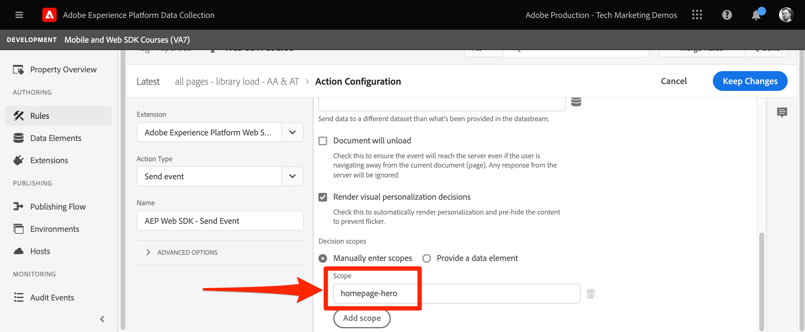

# 使用Platform Web SDK设置Adobe Target


>[!CAUTION]
>
>我们预计将于2024年4月23日星期二发布对本教程的主要更改。 之后，许多练习都将发生更改，您可能需要从头开始重新启动教程才能完成所有课程。

了解如何使用Platform Web SDK实施Adobe Target。 了解如何交付体验以及如何将其他参数传递到Target。

[Adobe Target](https://experienceleague.adobe.com/docs/target/using/target-home.html) 是一种Adobe Experience Cloud应用程序，可为您提供定制和个性化客户体验所需的一切功能，从而最大限度地增加您的Web和移动设备网站、应用程序及其他数字渠道的收入。


## 学习目标

在本课程结束后，您将能够：

* 了解如何添加Platform Web SDK预隐藏代码片段，以防止在将Target与异步标记嵌入代码结合使用时闪烁
* 配置数据流以启用Target功能
* 在页面加载时呈现可视化个性化决策（以前称为“全局mbox”）
* 将XDM数据传递给Target并了解到Target参数的映射
* 将自定义数据（如配置文件和实体参数）传递到Target
* 使用Platform Web SDK验证Target实施

>[!TIP]
>
>查看我们的 [将Target从at.js 2.x迁移到Platform Web SDK](/help/tutorial-migrate-target-websdk/introduction.md) 有关迁移现有at.js实施的分步指南的教程。


## 先决条件

要完成此部分中的课程，您必须首先：

* 完成有关Platform Web SDK初始配置的所有课程，包括设置数据元素和规则。
* 确保您拥有 [编辑者或审批者角色](https://experienceleague.adobe.com/docs/target/using/administer/manage-users/enterprise/properties-overview.html#section_8C425E43E5DD4111BBFC734A2B7ABC80).
* 安装 [可视化体验编辑器助手扩展](https://experienceleague.adobe.com/docs/target/using/experiences/vec/troubleshoot-composer/vec-helper-browser-extension.html) 如果您使用的是Google Chrome浏览器。
* 了解如何在Target中设置活动。 如果您需要复习者，以下教程和指南对本课程很有帮助：
   * [使用可视化体验编辑器(VEC)助手扩展](https://experienceleague.adobe.com/docs/target/using/experiences/vec/troubleshoot-composer/vec-helper-browser-extension.html)
   * [使用 Visual Experience Composer](https://experienceleague.adobe.com/docs/target-learn/tutorials/experiences/use-the-visual-experience-composer.html)
   * [使用基于表单的体验编辑器](https://experienceleague.adobe.com/docs/target-learn/tutorials/experiences/use-the-form-based-experience-composer.html)
   * [创建体验定位活动](https://experienceleague.adobe.com/docs/target-learn/tutorials/activities/create-experience-targeting-activities.html)

## 添加闪烁缓解功能

在开始之前，请根据标记库的加载方式，确定是否需要额外的闪烁处理解决方案。

>[!NOTE]
>
>本教程使用 [Luma网站](https://luma.enablementadobe.com/content/luma/us/en.html) 异步实施标记并消除闪烁。 此部分旨在了解闪烁缓解如何与Platform Web SDK配合使用，以供参考。


### 异步实施

异步加载标记库时，页面可能会在Target执行内容交换之前完成渲染。 这种行为可能会导致所谓的“闪烁”，在这种情况下，会先短暂显示默认内容，然后再将该内容替换为Target指定的个性化内容。 如果要避免出现这种闪烁情况，Adobe建议在紧靠异步标签嵌入代码之前的位置添加一个特殊的预隐藏代码片段。

此代码片段已存在于Luma网站上，但让我们仔细了解一下此代码的用途：

```html
<script>
  !function(e,a,n,t){var i=e.head;if(i){
  if (a) return;
  var o=e.createElement("style");
  o.id="alloy-prehiding",o.innerText=n,i.appendChild(o),setTimeout(function(){o.parentNode&&o.parentNode.removeChild(o)},t)}}
  (document, document.location.href.indexOf("adobe_authoring_enabled") !== -1, ".personalization-container { opacity: 0 !important }", 3000);
</script>
```

预隐藏代码片段使用您选择的CSS定义在页面头中创建样式标记。 在收到来自Target的响应或达到超时时，将删除此样式标记。

预隐藏行为由代码片段末尾的两个配置控制。

* `body { opacity: 0 !important }` 指定在Target加载之前要用于预隐藏的CSS定义。 默认情况下，将隐藏整个页面。 您可以将此定义更新为要预隐藏的选择器以及要如何隐藏选择器。 您可以包括多个定义，因为此值只是插入到预隐藏样式标记中的内容。 如果您的导航下有一个可轻松识别的容器元素封装内容，则可以使用此设置限制仅对该容器元素进行预隐藏。
* `3000` 指定预隐藏的超时时间（以毫秒为单位）。 如果在超时之前未收到来自Target的响应，则将删除预隐藏样式标记。 达到此超时的情况应该很少见。

>[!NOTE]
>
>Platform Web SDK的预隐藏代码片段与Target at.js库中使用的代码片段略有不同。 请务必对Platform Web SDK使用正确的代码片段，因为它使用的样式ID不同： `alloy-prehiding`. 如果使用了适用于at.js的预隐藏代码片段，则可能无法正常使用。

标记中还提供了预隐藏代码片段：

1. 转到 **[!UICONTROL 扩展]** 标记部分
1. 选择 **[!UICONTROL 配置]** 适用于Adobe Experience Platform Web SDK扩展
1. 选择 **[!UICONTROL 将预隐藏代码片段复制到剪贴板]** 按钮

   

   >[!NOTE]
   >
   >从Platform Web SDK扩展复制的默认预隐藏代码片段可能包含网站上不存在的CSS定义，例如 `.personalization-container { opacity: 0 !important }`. 请确保检查并适当修改网站的预隐藏代码片段。

### 同步实施

Adobe建议如Luma网站上所示异步实施标记。 但是，如果同步加载标记库，则不需要预先隐藏的代码片段。 预隐藏样式而是在Platform Web SDK扩展设置中指定。

同步实施的预隐藏样式可按如下方式配置：

1. 转到 **[!UICONTROL 扩展]** 标记部分
1. 选择 **[!UICONTROL 配置]** 适用于Platform Web SDK扩展的按钮
1. 选择 **[!UICONTROL 编辑预隐藏样式]** 按钮

   

1. 修改CSS以包含要使用的选择器和隐藏方法，例如： `body { opacity: 0 !important }` 是否要预隐藏页面的整个正文。
1. 保存更改并将内部版本生成到库

>[!NOTE]
>
>预隐藏样式设置仅用于同步实施。 如果您使用异步标记实施，则此样式应留空或被注释掉。

要了解有关Platform Web SDK如何管理闪烁的更多信息，请参阅指南部分： [管理闪烁以提供个性化体验](https://experienceleague.adobe.com/docs/experience-platform/edge/personalization/manage-flicker.html).


## 配置数据流

必须先在数据流配置中启用Target，Platform Web SDK才能交付任何Target活动。

要在数据流中配置Target，请执行以下操作：

1. 转到 [数据收集](https://experience.adobe.com/#/data-collection){target="blank"} 界面
1. 在左侧导航中，选择 **[!UICONTROL 数据流]**
1. 选择之前创建的 `Luma Web SDK` 数据流

   

1. 选择 **[!UICONTROL 添加服务]**
   
1. 选择 **[!UICONTROL Adobe Target]** 作为 **[!UICONTROL 服务]**
1. 如果需要，请按照以下指南输入有关Target实施的可选详细信息。
1. 选择 **[!UICONTROL 保存]**

   

### 资产令牌

Target Premium客户可以选择使用属性管理用户权限。 Target属性允许您围绕用户可以运行Target活动的位置建立边界。 请参阅 [企业权限](https://experienceleague.adobe.com/docs/target/using/administer/manage-users/enterprise/properties-overview.html) 部分以了解详细信息。

要设置或查找属性令牌，请导航至 **Adobe Target** > **[!UICONTROL 管理]** > **[!UICONTROL 属性]**. 此 `</>` 图标可显示实施代码。 此 `at_property` value是您将在数据流中使用的属性令牌。


>[!NOTE]
>
>每个数据流只能指定一个属性令牌。


### 目标环境Id

[环境](https://experienceleague.adobe.com/docs/target/using/administer/environments.html) 中的Target帮助您管理开发的所有阶段的实施。 此可选设置指定要用于每个数据流的Target环境。

Adobe建议为每个开发、暂存和生产数据流分别以不同的方式设置Target环境ID，以简化操作。

要设置或查找环境ID，请导航至 **Adobe Target** > **[!UICONTROL 管理]** > **[!UICONTROL 环境]**.


>[!NOTE]
>
>如果未指定目标环境ID，则假定使用生产目标环境。

### 目标第三方ID命名空间

通过这个可选设置，您可以指定要用于Target第三方ID的标识符号。 Target仅支持在单个身份符号或命名空间上同步配置文件。 欲了解更多信息，请参见 [mbox3rdPartyId的实时配置文件同步](https://experienceleague.adobe.com/docs/target/using/audiences/visitor-profiles/3rd-party-id.html) 部分。

标识符号位于下的标识列表中 **数据收集** > **[!UICONTROL 客户]** > **[!UICONTROL 身份]**.


对于本教程中使用Luma站点的目的，请使用身份符号 `lumaCrmId` 在课程中设置的关于 [身份](configure-identities.md).


## 呈现可视化个性化决策

首先，您应该了解Target和标记界面中使用的术语。

* **活动**：一组定位到一个或多个受众的体验。 例如，一个简单的A/B测试可以是具有两个体验的活动。
* **体验**：一组针对一个或多个位置或决策范围的操作。
* **决策范围**：交付Target体验的位置。 如果您熟悉使用旧版Target，则决策范围等同于“mbox”。
* **个性化决策**：应用服务器确定的操作。 这些决策可以基于受众标准和Target活动优先级。
* **建议**：服务器做出的决策在Platform Web SDK响应中传递的结果。 例如，交换横幅图像就是一个建议。

### 更新页面加载规则

如果数据流中启用了Target，则Platform Web SDK会交付来自Target的可视个性化决策。 但是， _它们不会自动呈现_. 您必须修改全局页面加载规则以启用自动渲染。

1. 在 [数据收集](https://experience.adobe.com/#/data-collection){target="blank"} 界面中，打开您在本教程中使用的标记属性
1. 打开 `all pages - library load - AA & AT` 规则
1. 选择 `Adobe Experience Platform Web SDK - Send event` 操作
1. 启用 **[!UICONTROL 呈现可视化个性化决策]** 带有复选框

   

1. 保存所做更改，然后将其生成到库

渲染可视化个性化决策设置使Platform Web SDK自动应用使用Target可视化体验编辑器或“全局mbox”指定的任何修改。

>[!NOTE]
>
>通常， [!UICONTROL 呈现可视化个性化决策] 每次全页加载时只应启用一次“发送事件”操作的设置。 如果多个发送事件操作启用了此设置，则会忽略后续渲染请求。

如果您希望使用自定义代码自行呈现或处理这些决策，则可以保留 [!UICONTROL 呈现可视化个性化决策] 设置已禁用。 Platform Web SDK非常灵活，它提供了可让您完全控制的功能。 您可以参阅指南以了解有关 [手动渲染个性化内容](https://experienceleague.adobe.com/docs/experience-platform/edge/personalization/rendering-personalization-content.html).

### 使用可视化体验编辑器设置Target活动

现在，基本实施部分已完成，请在Target中创建体验定位(XT)活动，以验证所有内容是否均可正常工作。 您可以参阅Target教程，了解 [创建体验定位活动](https://experienceleague.adobe.com/docs/target-learn/tutorials/activities/create-experience-targeting-activities.html) 如果您需要帮助。

>[!NOTE]
>
>如果您使用Google Chrome作为浏览器，则 [可视化体验编辑器(VEC)助手扩展](https://experienceleague.adobe.com/docs/target/using/experiences/vec/troubleshoot-composer/vec-helper-browser-extension.html?lang=en) 需要正确加载站点以在VEC中进行编辑。

1. 导航到目标
1. 使用活动URL的Luma主页创建体验定位(XT)活动

   

1. 修改页面，例如更改主页横幅上的文本

   

1. 选择Adobe Analytics作为报表源，并将相应的报表包和订单量度作为目标

   >[!NOTE]
   >
   >如果不使用Adobe Analytics，请选择Target作为报表源，然后选择其他指标，如 **参与>页面查看** 而是。 保存和预览活动需要目标量度。

1. 保存活动
1. 如果您对所做更改感到满意，则可以激活活动。 否则，如果您想预览体验而不激活它，您可以复制 [QA预览URL](https://experienceleague.adobe.com/docs/target/using/activities/activity-qa/activity-qa.html).
1. 加载Luma主页，此时您应会看到所做的更改已应用
1. 几小时后，您应该能够在Adobe Analytics中看到Target活动数据和转化情况。 请参阅《Target指南》 ，以了解有关 [Analytics for Target (A4T)报表](https://experienceleague.adobe.com/docs/target/using/integrate/a4t/reporting.html?lang=en).


### 使用调试器进行验证

如果设置活动，您应会在页面上看到内容渲染。 但是，即使没有实时活动，您也可以查看“发送事件”网络调用，以确认Target配置正确。

>[!CAUTION]
>
>如果您使用的是Google Chrome，并且具有 [可视化体验编辑器(VEC)助手扩展](https://experienceleague.adobe.com/docs/target/using/experiences/vec/troubleshoot-composer/vec-helper-browser-extension.html?lang=en) 已安装，请确保 **插入Target库** 设置已禁用。 启用此设置将导致额外的Target请求。

1. 打开Adobe Experience Platform Debugger浏览器扩展
1. 转到 [Luma演示站点](https://luma.enablementadobe.com/content/luma/us/en.html) 并使用调试器 [将网站上的tag属性切换到您自己的开发资产](validate-with-debugger.md#use-the-experience-platform-debugger-to-map-to-your-tags-property)
1. 重新加载页面
1. 选择 **[!UICONTROL 网络]** debugger中的工具
1. 过滤方式 **[!UICONTROL Adobe Experience Platform Web SDK]**
1. 在事件行中为第一次调用选择值

   

1. 请注意，下有键 `query` > `personalization` 和  `decisionScopes` 具有值 `__view__`. 此范围等同于Target的“全局mbox”。 此Platform Web SDK调用从Target请求决策。

   

1. 关闭叠加并选择第二次网络调用的事件详细信息。 此调用仅在Target返回活动时存在。
1. 请注意，其中包含有关从Target返回的活动和体验的详细信息。 此Platform Web SDK调用会向用户发送一条通知，告知用户已渲染Target活动，并会增加展示次数。

   

## 设置和呈现自定义决策范围

自定义决策范围（以前称为“mbox”）可用于通过基于Target表单的HTML编辑器以结构化方式交付体验或JSON内容。 交付给其中一个自定义范围的内容不会由Platform Web SDK自动呈现。

### 向页面加载规则添加范围

修改页面加载规则以添加自定义决策范围：

1. 打开 `all pages - library load - AA & AT` 规则
1. 选择 `Adobe Experience Platform Web SDK - Send Event` 操作
1. 添加一个或多个要使用的范围。 在本例中，使用 `homepage-hero`.

   

1. 保存更改并将内部版本生成到库

>[!TIP]
>
>在本教程中，您将使用单个手动定义的范围进行演示。 如果您决定使用多个针对特定页面的决策范围，则应当考虑使用根据页面路径有条件返回范围数组的数据元素。 此方法有助于使您的实施保持简单且可扩展。

### 处理来自Target的响应

现在，您已配置Platform Web SDK以请求的内容 `homepage-hero` 范围，必须对响应执行一些操作。 Platform Web SDK标记扩展提供了 [!UICONTROL 发送事件完成] 事件，当收到来自 [!UICONTROL 发送事件] 已收到操作。

1. 创建名为的规则 `homepage - send event complete - render homepage-hero`.
1. 向规则添加事件。 使用 **Adobe Experience Platform Web SDK** 扩展和 **[!UICONTROL 发送事件完成]** 事件类型。
1. 添加条件以将规则限制在Luma主页（不含查询字符串的路径等于） `/content/luma/us/en.html`)。
1. 向规则添加操作。 使用 **核心** 扩展和 **自定义代码** 操作类型。

   

   >[!TIP]
   >
   >为规则事件、条件和操作指定描述性名称，而不是使用默认名称。 强大的规则组件名称使搜索结果更有用。

1. 输入自定义代码，以读取并处理从Platform Web SDK响应返回的建议。 此示例中的自定义代码使用指南中概述的方法用于 [手动渲染个性化内容](https://experienceleague.adobe.com/docs/experience-platform/edge/personalization/rendering-personalization-content.html?lang=en#manually-rendering-content). 该代码是根据 `homepage-hero` 使用标记规则操作的示例范围。

   ```javascript
   var propositions = event.propositions;
   
   var heroProposition;
   if (propositions) {
      // Find the hero proposition, if it exists.
      for (var i = 0; i < propositions.length; i++) {
         var proposition = propositions[i];
         if (proposition.scope === "homepage-hero") {
            heroProposition = proposition;
            break;
         }
      }
   }
   
   var heroHtml;
   if (heroProposition) {
      // Find the item from proposition that should be rendered.
      // Rather than assuming there a single item that has HTML
      // content, find the first item whose schema indicates
      // it contains HTML content.
      for (var j = 0; j < heroProposition.items.length; j++) {
         var heroPropositionItem = heroProposition.items[j];
         if (heroPropositionItem.schema === "https://ns.adobe.com/personalization/html-content-item") {
            heroHtml = heroPropositionItem.data.content;
            break;
         }
      }
   }
   
   if (heroHtml) {
      // Hero HTML exists. Time to render it.
      var heroElement = document.querySelector(".heroimage");
      heroElement.innerHTML = heroHtml;
      // For this example, we assume there is only a signle place to update in the HTML.
   }
   
   // Send a "display" event 
   alloy("sendEvent", {
      xdm: {
         eventType: "propositionDisplay",
         _experience: {
            decisioning: {
               propositions: [
                  {
                     id: heroProposition.id,
                     scope: heroProposition.scope,
                     scopeDetails: heroProposition.scopeDetails
                  }
               ]
            }
         }
      }
   });
   ```

1. 保存更改并将内部版本生成到库
1. 加载Luma主页几次，这应该足以制作新的 `homepage-hero` 决策范围在Target界面中注册。

### 使用基于表单的体验编辑器设置Target活动

现在您有了手动呈现自定义决策范围的规则，可以在Target中创建另一个体验定位(XT)活动。 这次使用基于表单的体验编辑器。

1. 打开 [Adobe Target](https://experience.adobe.com/target)
1. 取消激活用于上一课程的活动
1. 使用基于表单的体验编辑器选项创建体验定位(XT)活动

   

1. 选择 **`homepage-hero`** 位置下拉菜单中的位置和 **[!UICONTROL 创建HTML选件]** 从内容下拉菜单中单击。 如果该位置不可用，则可以键入该位置。 Target在收到对该位置或范围的请求后定期填充新位置名称。

   

1. 将以下代码粘贴到内容框中。 此代码是一个具有不同背景图像的基本主页横幅：

   ```html
   <div class="we-HeroImage jumbotron" style="background-image: url('/content/luma/us/en/women/_jcr_content/root/hero_image.coreimg.jpeg');">
      <div class="container cq-dd-image">
         <div class="we-HeroImage-wrapper">
            <p class="h3">New Luma Yoga Collection</p>
            <strong class="we-HeroImage-title h1">Be active with style&nbsp;</strong>
            <p>
               <a class="btn btn-primary btn-action" href="/content/luma/us/en/products.html" role="button">Shop Now</a>
            </p>
         </div>
      </div>
   </div>
   ```

1. 在 [!UICONTROL 目标和设置] 步骤，选择Adobe Target作为报表源并 [!UICONTROL 参与] > [!UICONTROL 页面查看次数] 作为目标
1. 保存活动
1. 如果您对所做更改感到满意，则可以激活活动。 否则，如果您想预览体验而不激活它，您可以复制 [QA预览URL](https://experienceleague.adobe.com/docs/target/using/activities/activity-qa/activity-qa.html).
1. 加载Luma主页，此时您应会看到所做的更改已应用

>[!NOTE]
>
>“已单击mbox”转化目标无法自动工作。 由于Platform Web SDK不会自动呈现自定义范围，因此它不会跟踪您选择应用内容的位置的点击次数。 您可以使用“click”为每个范围创建自己的点击跟踪 `eventType` 包含适用的 `_experience` 详细信息使用 `sendEvent` 操作。

### 使用调试器进行验证

如果您激活了活动，则应该会在页面上看到内容渲染。 但是，即使没有实时活动，您也可以查看 [!UICONTROL 发送事件] 网络调用以确认Target正在为您的自定义范围请求内容。

1. 打开Adobe Experience Platform Debugger浏览器扩展
1. 转到 [Luma演示站点](https://luma.enablementadobe.com/content/luma/us/en.html) 并使用调试器 [将网站上的tag属性切换到您自己的开发资产](validate-with-debugger.md#use-the-experience-platform-debugger-to-map-to-your-tags-property)
1. 重新加载页面
1. 选择 **[!UICONTROL 网络]** debugger中的工具
1. 过滤方式 **[!UICONTROL Adobe Experience Platform Web SDK]**
1. 在事件行中为第一次调用选择值

   

1. 请注意，下有键 `query` > `personalization` 和  `decisionScopes` 具有值 `__view__` 和以前一样，但现在还有 `homepage-hero` 范围已包括。 此Platform Web SDK调用请求从Target就使用VEC和特定的页面所做的更改做出决策。 `homepage-hero` 位置。

   

1. 关闭叠加并选择第二次网络调用的事件详细信息。 此调用仅在Target返回活动时存在。
1. 请注意，其中包含有关从Target返回的活动和体验的详细信息。 此Platform Web SDK调用会向用户发送一条通知，告知用户已渲染Target活动，并会增加展示次数。

   

## 将其他数据传递到Target

在本节中，您将传递特定于Target的数据，并深入了解XDM数据如何映射到Target参数。

有些数据点对于没有从XDM对象映射的Target可能很有用。 这些特殊的Target参数包括：

* [用户档案属性](https://experienceleague.adobe.com/docs/target/using/implement-target/before-implement/methods/in-page-profile-attributes.html?lang=en)
* [Recommendations实体属性](https://experienceleague.adobe.com/docs/target/using/recommendations/entities/entity-attributes.html?lang=en)
* [Recommendations保留的参数](https://experienceleague.adobe.com/docs/target/using/recommendations/plan-implement.html?lang=en#pass-behavioral)
* 的类别值 [类别亲和力](https://experienceleague.adobe.com/docs/target/using/audiences/visitor-profiles/category-affinity.html?lang=en)

### 为Target参数创建数据元素

首先，为配置文件属性、实体属性、类别值设置一些额外的数据元素，然后构建 `data` 用于传递非XDM数据的对象：

* **`target.entity.id`** 已映射到 `digitalData.product.0.productInfo.sku`
* **`target.entity.name`** 已映射到 `digitalData.product.0.productInfo.title`
* **`target.user.categoryId`** 使用以下自定义代码解析顶级类别的网站URL：

  ```javascript
  var cat = location.pathname.split(/[/.]+/);
  if (cat[5] == 'products') {
     return (cat[6]);
  } else if (cat[5] != 'html') { 
     return (cat[5]);
  }
  ```

* **`data.content`** 使用以下自定义代码：

  ```javascript
  var data = {
     __adobe: {
        target: {
           "entity.id": _satellite.getVar("target.entity.id"),
           "entity.name": _satellite.getVar("target.entity.name"),
           "profile.loggedIn": _satellite.getVar("user.profile.attributes.loggedIn"),
           "user.categoryId": _satellite.getVar("target.user.categoryId")
        }
     }
  }
  return data;
  ```

### 更新页面加载规则

在XDM对象之外传递Target的其他数据需要更新任何适用的规则。 对于此示例，您唯一必须做的修改是包括新的 **data.content** 数据元素到常规页面加载规则和产品页面查看规则。

1. 打开 `all pages - library load - AA & AT` 规则
1. 选择 `Adobe Experience Platform Web SDK - Send event` 操作
1. 添加 `data.content` Data元素到Data字段

   

1. 保存更改并将内部版本生成到库
1. 对重复步骤1至4 **产品视图 — 库加载 — AA** 规则

>[!NOTE]
>
>上面的示例使用 `data` 未在所有页面类型上完全填充的对象。 标记可正确处理此情况并忽略具有未定义值的键。 例如， `entity.id` 和 `entity.name` 将不会在除产品详细信息之外的任何页面上传递。

### 使用调试器验证

现在规则已更新，您可以使用Adobe Debugger验证数据是否正确传递。

1. 导航至 [Luma演示站点](https://luma.enablementadobe.com/content/luma/us/en.html) 并使用电子邮件登录 `test@adobe.com` 和密码 `test`
1. 导航到产品详细信息页面
1. 打开Adobe Experience Platform Debugger浏览器扩展并 [将tag属性切换到您自己的开发属性](validate-with-debugger.md#use-the-experience-platform-debugger-to-map-to-your-tags-property)
1. 重新加载页面
1. 选择 **网络** Debugger中的工具并过滤依据 **Adobe Experience Platform Web SDK**
1. 在事件行中为第一次调用选择值
1. 请注意，下有键 `data` > `__adobe` > `target` 其中填充了有关产品、类别和登录状态的信息。

   

### 在Target界面中验证

接下来，查看Target界面，确认已收到数据，并且这些数据可用于受众和活动。 XDM数据会自动映射到自定义Target参数。 您可以验证Target是否收到了XDM数据，并且可以通过创建受众来使用该数据。

1. 打开 [Adobe Target](https://experience.adobe.com/target)
1. 导航至 **[!UICONTROL 受众]** 部分
1. 创建受众并选择 **[!UICONTROL 自定义]** 属性类型
1. 搜索 **[!UICONTROL 参数]** 字段 `web`. 下拉菜单应填充与网页详细信息相关的所有XDM字段。

接下来，验证是否已成功传递登录状态配置文件属性。

1. 选择 **[!UICONTROL 访客资料]** 属性类型
1. 搜索 `loggedIn`. 如果该属性在下拉菜单中可用，则该属性已正确传递到Target。 新属性可能需要几分钟才能在Target UI中可用。

如果您具有Target Premium，则还可以验证实体数据是否正确传递，以及产品数据是否已写入Recommendations产品目录。

1. 导航至 **[!UICONTROL Recommendations]** 部分
1. 选择 **[!UICONTROL 目录搜索]** 在左侧导航中
1. 搜索您之前在Luma网站上访问过的产品SKU或产品名称。 产品应显示在产品目录中。 新产品可能需要几分钟才能在Recommendations产品目录中搜索。

现在，您已完成本课程，应该可以使用Platform Web SDK有效实施Adobe Target。

[下一步： ](setup-consent.md)

>[!NOTE]
>
>感谢您投入时间学习Adobe Experience Platform Web SDK。 如果您有疑问、希望分享一般反馈或有关于未来内容的建议，请在此共享它们 [Experience League社区讨论帖子](https://experienceleaguecommunities.adobe.com/t5/adobe-experience-platform-launch/tutorial-discussion-implement-adobe-experience-cloud-with-web/td-p/444996)
