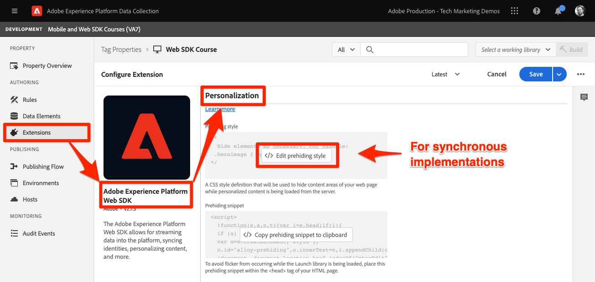

# 使用Platform Web SDK设置Adobe Target

了解如何使用Platform Web SDK实施Adobe Target。 了解如何交付体验以及如何将其他参数传递到Target。

[Adobe Target](https://experienceleague.adobe.com/docs/target/using/target-home.html) 是Adobe Experience Cloud应用程序，可为您提供定制和个性化客户体验所需的一切功能，从而最大限度地增加您的Web和移动设备网站、应用程序及其他数字渠道的收入。

## 学习目标

在本课程结束后，您将能够：

* 了解如何添加Platform Web SDK预隐藏代码片段，以防止在将Target与异步标签嵌入代码结合使用时出现闪烁
* 配置数据流以启用Target功能
* 在页面加载时呈现可视化个性化决策（以前称为“全局mbox”）
* 将XDM数据传递到Target，并了解到与Target参数的映射
* 将自定义数据传递到Target，如配置文件和实体参数
* 使用Platform Web SDK验证Target实施


## 先决条件

要完成此部分中的课程，您必须先：

* 完成有关Platform Web SDK初始配置的所有课程，包括设置数据元素和规则。
* 确保您具有 [编辑者或审批者角色](https://experienceleague.adobe.com/docs/target/using/administer/manage-users/enterprise/properties-overview.html#section_8C425E43E5DD4111BBFC734A2B7ABC80).
* 安装 [可视化体验编辑器助手扩展](https://experienceleague.adobe.com/docs/target/using/experiences/vec/troubleshoot-composer/vec-helper-browser-extension.html) 如果您使用的是Google Chrome浏览器。
* 了解如何在Target中设置活动。 如果您需要刷新，以下教程和指南将对本课程很有帮助：
   * [使用可视化体验编辑器(VEC)助手扩展](https://experienceleague.adobe.com/docs/target/using/experiences/vec/troubleshoot-composer/vec-helper-browser-extension.html)
   * [使用 Visual Experience Composer](https://experienceleague.adobe.com/docs/target-learn/tutorials/experiences/use-the-visual-experience-composer.html)
   * [使用基于表单的体验编辑器](https://experienceleague.adobe.com/docs/target-learn/tutorials/experiences/use-the-form-based-experience-composer.html)
   * [创建体验定位活动](https://experienceleague.adobe.com/docs/target-learn/tutorials/activities/create-experience-targeting-activities.html)

## 添加闪烁缓解

在开始之前，根据标记库的加载方式，确定是否需要额外的闪烁处理解决方案。

>[!NOTE]
>
>本教程使用 [Luma网站](https://luma.enablementadobe.com/content/luma/us/en.html) 已实施标记和闪烁缓解功能。 此部分将参考，以了解闪烁缓解如何与Platform Web SDK配合使用。


### 异步实施

异步加载标记库时，页面可能会在Target执行内容交换之前完成渲染。 此行为可能会导致所谓的“闪烁”，在这种情况下，会先短暂显示默认内容，然后再将其替换为Target指定的个性化内容。 如果要避免出现这种闪烁情况，Adobe建议在紧靠异步标记嵌入代码之前的位置添加特殊的预隐藏代码片段。

Luma网站上已存在此代码片段，但是，让我们进一步了解此代码的功能：

```html
<script>
  !function(e,a,n,t){var i=e.head;if(i){
  if (a) return;
  var o=e.createElement("style");
  o.id="alloy-prehiding",o.innerText=n,i.appendChild(o),setTimeout(function(){o.parentNode&&o.parentNode.removeChild(o)},t)}}
  (document, document.location.href.indexOf("mboxEdit") !== -1, ".body { opacity: 0 !important }", 3000);
</script>
```

预隐藏代码片段会在页面标题中使用您选择的CSS定义创建一个样式标记。 当收到来自Target的响应或达到超时时，将删除此样式标记。

预隐藏行为由代码片段末尾的两个配置控制。

* `body { opacity: 0 !important }` 指定在Target加载之前要用于预隐藏的CSS定义。 默认情况下，会隐藏整个页面。 您可以将此定义更新为要预隐藏的选择器以及隐藏方式。 您可能包含多个定义，因为此值只是插入预隐藏样式标记中的内容。 如果您有一个封装导航下方内容的易于识别的容器元素，则可以使用此设置将预隐藏限制为该容器元素。
* `3000` 指定预隐藏的超时时间（以毫秒为单位）。 如果在超时前未收到来自Target的响应，则会删除预隐藏样式标记。 达到此超时的情况应该很少。

>[!NOTE]
>
>Platform Web SDK的预隐藏代码片段与Target at.js库中使用的代码片段略有不同。 请务必为Platform Web SDK使用正确的代码片段，因为它使用的样式ID不同 `alloy-prehiding`. 如果使用at.js的预隐藏代码片段，则该代码片段可能无法正常工作。

预隐藏代码片段也可在标记中使用：

1. 转到 **[!UICONTROL 扩展]** 标记部分
1. 选择 **[!UICONTROL 配置]** 适用于Adobe Experience Platform Web SDK扩展
1. 选择 **[!UICONTROL 将预隐藏代码片段复制到剪贴板]** 按钮

   

   >[!NOTE]
   >
   >从Platform Web SDK扩展复制的默认预隐藏代码片段可能包含网站上不存在的CSS定义，例如 `.personalization-container { opacity: 0 !important }`. 请务必为您的网站正确检查和修改预隐藏代码片段。

### 同步实施

Adobe建议异步实施标记，如Luma网站上所示。 但是，如果同步加载标记库，则不需要预隐藏代码片段。 而是在Platform Web SDK扩展设置中指定预隐藏样式。

同步实施的预隐藏样式可以按如下方式进行配置：

1. 转到 **[!UICONTROL 扩展]** 标记部分
1. 选择 **[!UICONTROL 配置]** Platform Web SDK扩展的按钮
1. 选择 **[!UICONTROL 编辑预隐藏样式]** 按钮

   

1. 修改CSS以包含要使用的选择器和隐藏方法，例如： `body { opacity: 0 !important }` 如果您希望预先隐藏页面的整个正文，请执行以下操作。
1. 保存更改并将其构建到库

>[!NOTE]
>
>预隐藏样式设置仅用于同步实施。 如果您使用异步实施标记，则此样式应为空白或注释掉。

要进一步了解Platform Web SDK如何管理闪烁，您可以参阅指南部分： [管理个性化体验中的闪烁](https://experienceleague.adobe.com/docs/experience-platform/edge/personalization/manage-flicker.html).


## 配置数据流

必须先在数据流配置中启用Target，然后才能通过Platform Web SDK交付任何Target活动。

要在数据流中配置Target，请执行以下操作：

1. 转到 [数据收集](https://experience.adobe.com/#/data-collection){target=&quot;blank&quot;}接口
1. 在左侧导航中，选择 **[!UICONTROL 数据流]**
1. 选择之前创建的 `Luma Web SDK` 数据流

   

1. 选择 **[!UICONTROL 添加服务]**

   
1. 选择 **[!UICONTROL Adobe Target]** 作为 **[!UICONTROL 服务]**
1. 根据需要，按照以下指南输入有关Target实施的可选详细信息。
1. 选择 **[!UICONTROL 保存]**

   

### 资产令牌

Target Premium客户可以选择使用资产管理用户权限。 利用Target属性，可确定用户可在何处运行Target活动的边界。 请参阅 [企业权限](https://experienceleague.adobe.com/docs/target/using/administer/manage-users/enterprise/properties-overview.html) 部分以了解详细信息。

要设置或查找资产令牌，请导航至 **Adobe Target** > **[!UICONTROL 管理]** > **[!UICONTROL 属性]**. 的 `</>` 图标可显示实施代码。 的 `at_property` value是您在数据流中使用的资产令牌。


>[!NOTE]
>
>每个数据流只能指定一个资产令牌。


### Target环境ID

[环境](https://experienceleague.adobe.com/docs/target/using/administer/environments.html) 中的Target可帮助您管理所有开发阶段的实施。 此可选设置指定要用于每个数据流的Target环境。

Adobe建议对每个开发、暂存和生产数据流以不同的方式设置Target环境ID，以保持操作简单。

要设置或查找环境ID，请导航到 **Adobe Target** > **[!UICONTROL 管理]** > **[!UICONTROL 环境]**.


>[!NOTE]
>
>如果未指定Target环境ID，则假定使用生产Target环境。

### 定位第三方ID命名空间

此可选设置允许您指定用于Target第三方ID的身份符号。 Target仅支持在单个身份符号或命名空间上同步配置文件。 有关更多信息，请参阅 [mbox3rdPartyId的实时配置文件同步](https://experienceleague.adobe.com/docs/target/using/audiences/visitor-profiles/3rd-party-id.html) 部分。

标识符号位于 **数据收集** > **[!UICONTROL 客户]** > **[!UICONTROL 标识]**.


为了在本教程中使用Luma网站，请使用身份符号 `lumaCrmId` 在课程中设置关于 [标识](configure-identities.md).


## 呈现可视化个性化决策

首先，您应该了解Target和标记界面中使用的术语。

* **活动**:一组定位到一个或多个受众的体验。 例如，一个简单的A/B测试可以是包含两个体验的活动。
* **体验**:一组定位到一个或多个位置或决策范围的操作。
* **决策范围**:提供Target体验的位置。 如果您熟悉使用旧版Target，则决策范围等同于“mbox”。
* **个性化决策**:应用服务器确定的操作。 这些决策可能基于受众标准和Target活动优先级。
* **建议**:服务器在Platform Web SDK响应中交付的决策结果。 例如，交换横幅图像是一种建议。

### 更新页面加载规则

如果在数据流中启用了Target，则Target的可视化个性化决策将由Platform Web SDK提供。 但是， _它们不会自动呈现_. 您必须修改全局页面加载规则才能启用自动渲染。

1. 在 [数据收集](https://experience.adobe.com/#/data-collection){target=&quot;blank&quot;}界面，打开您在本教程中使用的标记属性
1. 打开 `all pages - library load - AA & AT` 规则
1. 选择 `Adobe Experience Platform Web SDK - Send event` 操作
1. 启用 **[!UICONTROL 呈现可视化个性化决策]** 复选框

   

1. 保存更改，然后将其构建到库

呈现可视化个性化决策设置会使Platform Web SDK自动应用使用Target可视化体验编辑器或“全局mbox”指定的任何修改。

>[!NOTE]
>
>通常， [!UICONTROL 呈现可视化个性化决策] 只应为每次加载完整页面时的单个“发送事件”操作启用设置。 如果多个“发送事件”操作已启用此设置，则将忽略后续渲染请求。

如果您希望自行使用自定义代码渲染或对这些决策执行操作，则可以将 [!UICONTROL 呈现可视化个性化决策] 设置为禁用。 Platform Web SDK是灵活的，它提供了这项功能，使您能够完全控制。 有关详细信息，请参阅指南 [手动渲染个性化内容](https://experienceleague.adobe.com/docs/experience-platform/edge/personalization/rendering-personalization-content.html).

### 使用可视化体验编辑器设置Target活动

现在，基本实施部分已完成，请在Target中创建体验定位(XT)活动，以验证所有内容是否均可正常使用。 您可以参阅Target教程，以了解 [创建体验定位活动](https://experienceleague.adobe.com/docs/target-learn/tutorials/activities/create-experience-targeting-activities.html) 如果你需要帮助。

>[!NOTE]
>
>如果您使用Google Chrome作为浏览器，则 [可视化体验编辑器(VEC)助手扩展](https://experienceleague.adobe.com/docs/target/using/experiences/vec/troubleshoot-composer/vec-helper-browser-extension.html?lang=en) 需要正确加载网站才能在VEC中进行编辑。

1. 导航到Target
1. 使用活动URL的Luma主页创建体验定位(XT)活动

   

1. 修改页面，例如更改主页横幅上的文本

   

1. 选择Adobe Analytics作为报表源，并以相应的报表包和订单量度为目标

   >[!NOTE]
   >
   >如果您不使用Adobe Analytics，请选择Target作为报表源，然后选择其他量度，例如 **参与度>页面查看次数** 中。 保存和预览活动时需要使用目标量度。

1. 保存活动
1. 如果您习惯进行更改，则可以激活活动。 否则，如果您希望在不激活的情况下预览体验，可以复制 [QA预览URL](https://experienceleague.adobe.com/docs/target/using/activities/activity-qa/activity-qa.html).
1. 加载Luma主页，此时您应会看到所应用的更改
1. 几小时后，您应该能够在Adobe Analytics中查看Target活动数据和转化。 有关 [Analytics for Target(A4T)报表](https://experienceleague.adobe.com/docs/target/using/integrate/a4t/reporting.html?lang=en).


### 使用调试器验证

如果设置活动，则应会在页面上显示内容。 但是，即使没有活动处于实时状态，您也可以查看发送事件网络调用，以确认Target配置正确。

>[!CAUTION]
>
>如果您使用Google Chrome，并且 [可视化体验编辑器(VEC)助手扩展](https://experienceleague.adobe.com/docs/target/using/experiences/vec/troubleshoot-composer/vec-helper-browser-extension.html?lang=en) 已安装，请确保 **插入Target库** 设置处于禁用状态。 启用此设置将导致额外的Target请求。

1. 打开Adobe Experience Platform Debugger浏览器扩展
1. 转到 [Luma演示网站](https://luma.enablementadobe.com/content/luma/us/en.html) 并使用调试器 [将网站上的标记资产切换到您自己的开发资产](validate-with-debugger.md#use-the-experience-platform-debugger-to-map-to-your-tags-property)
1. 重新加载页面
1. 选择 **[!UICONTROL 网络]** 工具
1. 过滤依据 **[!UICONTROL Adobe Experience Platform Web SDK]**
1. 在事件行中为首次调用选择值

   

1. 请注意， `query` > `personalization` 和  `decisionScopes` 的值为 `__view__`. 此范围等同于Target的“全局mbox”。 此平台Web SDK调用请求了Target做出决策。

   

1. 关闭叠加，并为第二次网络调用选择事件详细信息。 仅当Target返回活动时，才会出现此调用。
1. 请注意，有关从Target返回的活动和体验的详细信息。 此平台Web SDK调用会向用户发送呈现Target活动的通知，并增加展示次数。

   

## 设置和渲染自定义决策范围

自定义决策范围（以前称为“mbox”）可用于使用基于Target表单的体验编辑器以结构化方式交付HTML或JSON内容。 交付到其中一个自定义作用域的内容不会由Platform Web SDK自动呈现。

### 向页面加载规则添加范围

修改页面加载规则以添加自定义决策范围：

1. 打开 `all pages - library load - AA & AT` 规则
1. 选择 `Adobe Experience Platform Web SDK - Send Event` 操作
1. 添加一个或多个要使用的范围。 在本例中，使用 `homepage-hero`.

   

1. 保存更改并将内部版本构建到库

>[!TIP]
>
>在本教程中，您将使用一个手动定义的范围进行演示。 如果您决定使用多个专门用于特定页面的决策范围，则应当考虑使用一个数据元素，该数据元素根据页面路径有条件地返回一组范围。 此方法有助于保持实施简单且可扩展。

### 处理来自Target的响应

现在，您已配置Platform Web SDK以请求 `homepage-hero` 范围，您必须对响应执行一些操作。 平台Web SDK标记扩展提供了 [!UICONTROL 发送事件结束] 事件，当来自 [!UICONTROL 发送事件] 操作。

1. 创建一个名为 `homepage - send event complete - render homepage-hero`.
1. 向规则中添加事件。 使用 **Adobe Experience Platform Web SDK** 扩展和 **[!UICONTROL 发送事件结束]** 事件类型。
1. 添加条件以将规则限制在Luma主页（不含查询字符串等于的路径） `/content/luma/us/en.html`)。
1. 向规则中添加操作。 使用 **核心** 扩展和 **自定义代码** 操作类型。

   

   >[!TIP]
   >
   >为规则事件、条件和操作提供描述性名称，而不是使用默认名称。 强大的规则组件名称使搜索结果更有用。

1. 输入要读取的自定义代码，并对从Platform Web SDK响应返回的建议执行操作。 此示例中的自定义代码使用指南中概述的方法 [手动渲染个性化内容](https://experienceleague.adobe.com/docs/experience-platform/edge/personalization/rendering-personalization-content.html?lang=en#manually-rendering-content). 该代码适用于 `homepage-hero` 使用标记规则操作的示例范围。

   ```javascript
   var propositions = event.propositions;
   
   var heroProposition;
   if (propositions) {
      // Find the hero proposition, if it exists.
      for (var i = 0; i < propositions.length; i++) {
         var proposition = propositions[i];
         if (proposition.scope === "homepage-hero") {
            heroProposition = proposition;
            break;
         }
      }
   }
   
   var heroHtml;
   if (heroProposition) {
      // Find the item from proposition that should be rendered.
      // Rather than assuming there a single item that has HTML
      // content, find the first item whose schema indicates
      // it contains HTML content.
      for (var j = 0; j < heroProposition.items.length; j++) {
         var heroPropositionItem = heroProposition.items[j];
         if (heroPropositionItem.schema === "https://ns.adobe.com/personalization/html-content-item") {
            heroHtml = heroPropositionItem.data.content;
            break;
         }
      }
   }
   
   if (heroHtml) {
      // Hero HTML exists. Time to render it.
      var heroElement = document.querySelector(".heroimage");
      heroElement.innerHTML = heroHtml;
      // For this example, we assume there is only a signle place to update in the HTML.
   }
   
   // Send a "display" event 
   alloy("sendEvent", {
      xdm: {
         eventType: "display",
         _experience: {
            decisioning: {
               propositions: [
                  {
                     id: heroProposition.id,
                     scope: heroProposition.scope,
                     scopeDetails: heroProposition.scopeDetails
                  }
               ]
            }
         }
      }
   });
   ```

1. 保存更改并将内部版本构建到库
1. 加载几次Luma主页，这应该足以生成新 `homepage-hero` Target界面中的决策范围注册。

### 使用基于表单的体验编辑器设置Target活动

现在，您已拥有用于手动渲染自定义决策范围的规则，接下来可以在Target中创建其他体验定位(XT)活动。 这次使用基于表单的体验编辑器。

1. 打开 [Adobe Target](https://experience.adobe.com/target)
1. 停用用于上一课程的活动
1. 使用基于表单的体验编辑器选项创建体验定位(XT)活动

   

1. 选择 **`homepage-hero`** 位置下拉列表和 **[!UICONTROL 创建HTML选件]** 从内容下拉菜单中。 如果位置不可用，您可以在中键入该位置。 在收到该位置或范围的请求后，Target会定期填充新的位置名称。

   

1. 将以下代码粘贴到内容框中。 此代码是具有不同背景图像的基本主页横幅：

   ```html
   <div class="we-HeroImage jumbotron" style="background-image: url('/content/luma/us/en/women/_jcr_content/root/hero_image.coreimg.jpeg');">
      <div class="container cq-dd-image">
         <div class="we-HeroImage-wrapper">
            <p class="h3">New Luma Yoga Collection</p>
            <strong class="we-HeroImage-title h1">Be active with style&nbsp;</strong>
            <p>
               <a class="btn btn-primary btn-action" href="/content/luma/us/en/products.html" role="button">Shop Now</a>
            </p>
         </div>
      </div>
   </div>
   ```

1. 在 [!UICONTROL 目标和设置] 步骤中，选择Adobe Target作为报表源，然后 [!UICONTROL 参与度] > [!UICONTROL 页面查看次数] 作为目标
1. 保存活动
1. 如果您习惯进行更改，则可以激活活动。 否则，如果您希望在不激活的情况下预览体验，可以复制 [QA预览URL](https://experienceleague.adobe.com/docs/target/using/activities/activity-qa/activity-qa.html).
1. 加载Luma主页，此时您应会看到所应用的更改

>[!NOTE]
>
>“已点击mbox”转化目标无法自动运行。 由于Platform Web SDK不会自动渲染自定义范围，因此它不会跟踪您选择应用内容的位置的点击量。 您可以使用“click”为每个范围创建自己的点击跟踪 `eventType` 适用 `_experience` 使用 `sendEvent` 操作。

### 使用调试器验证

如果激活了活动，则应会在页面上显示内容。 但是，即使没有活动处于实时状态，您也可以查看 [!UICONTROL 发送事件] 网络调用，以确认Target正在为您的自定义作用域请求内容。

1. 打开Adobe Experience Platform Debugger浏览器扩展
1. 转到 [Luma演示网站](https://luma.enablementadobe.com/content/luma/us/en.html) 并使用调试器 [将网站上的标记资产切换到您自己的开发资产](validate-with-debugger.md#use-the-experience-platform-debugger-to-map-to-your-tags-property)
1. 重新加载页面
1. 选择 **[!UICONTROL 网络]** 工具
1. 过滤依据 **[!UICONTROL Adobe Experience Platform Web SDK]**
1. 在事件行中为首次调用选择值

   

1. 请注意， `query` > `personalization` 和  `decisionScopes` 的值为 `__view__` 和以前一样，但现在 `homepage-hero` 范围。 此平台Web SDK调用请求Target做出决策，以获取使用VEC和特定 `homepage-hero` 位置。

   

1. 关闭叠加，并为第二次网络调用选择事件详细信息。 仅当Target返回活动时，才会出现此调用。
1. 请注意，有关从Target返回的活动和体验的详细信息。 此平台Web SDK调用会向用户发送呈现Target活动的通知，并增加展示次数。

   

## 将其他数据传递到Target

在此部分中，您将传递特定于Target的数据，并详细了解XDM数据如何映射到Target参数。

有些数据点可能对Target有用，但它们未从XDM对象进行映射。 这些特殊的Target参数包括：

* [配置文件属性](https://experienceleague.adobe.com/docs/target/using/implement-target/before-implement/methods/in-page-profile-attributes.html?lang=en)
* [Recommendations实体属性](https://experienceleague.adobe.com/docs/target/using/recommendations/entities/entity-attributes.html?lang=en)
* [Recommendations保留参数](https://experienceleague.adobe.com/docs/target/using/recommendations/plan-implement.html?lang=en#pass-behavioral)
* 类别值 [类别亲和度](https://experienceleague.adobe.com/docs/target/using/audiences/visitor-profiles/category-affinity.html?lang=en)

### 为Target参数创建数据元素

首先，为配置文件属性、实体属性、类别值设置一些额外的数据元素，然后构建 `data` 用于传递非XDM数据的对象：

* **`target.entity.id`** 映射到 `digitalData.product.0.productInfo.sku`
* **`target.entity.name`** 映射到 `digitalData.product.0.productInfo.title`
* **`target.user.categoryId`** 使用以下自定义代码解析顶级类别的网站URL:

   ```javascript
   var cat = location.pathname.split(/[/.]+/);
   if (cat[5] == 'products') {
      return (cat[6]);
   } else if (cat[5] != 'html') { 
      return (cat[5]);
   }
   ```

* **`data.content`** 使用以下自定义代码：

   ```javascript
   var data = {
      __adobe: {
         target: {
            "entity.id": _satellite.getVar("target.entity.id"),
            "entity.name": _satellite.getVar("target.entity.name"),
            "profile.loggedIn": _satellite.getVar("user.profile.attributes.loggedIn"),
            "user.categoryId": _satellite.getVar("target.user.categoryId")
         }
      }
   }
   return data;
   ```

### 更新页面加载规则

在XDM对象之外传递Target的其他数据时，需要更新任何适用的规则。 在本例中，您必须进行的唯一修改是包含新 **data.content** 数据元素添加到通用页面加载规则和产品页面查看规则。

1. 打开 `all pages - library load - AA & AT` 规则
1. 选择 `Adobe Experience Platform Web SDK - Send event` 操作
1. 添加 `data.content` 数据元素到数据字段

   

1. 保存更改并将内部版本构建到库
1. 对 **产品视图 — 库加载 — AA** 规则

>[!NOTE]
>
>上例使用 `data` 未在所有页面类型上完全填充的对象。 标记可正确处理这种情况，并忽略值未定义的键。 例如， `entity.id` 和 `entity.name` 不会在除产品详细信息之外的任何页面上传递。

### 使用调试器验证

现在，规则已更新，您可以使用Adobe调试器验证数据是否正确传递。

1. 导航到 [Luma演示网站](https://luma.enablementadobe.com/content/luma/us/en.html) 并通过电子邮件登录 `test@adobe.com` 和密码 `test`
1. 导航到产品详细信息页面
1. 打开Adobe Experience Platform Debugger浏览器扩展和 [将标记资产切换到您自己的开发资产](validate-with-debugger.md#use-the-experience-platform-debugger-to-map-to-your-tags-property)
1. 重新加载页面
1. 选择 **网络** 工具中的过滤器，并按 **Adobe Experience Platform Web SDK**
1. 在事件行中为首次调用选择值
1. 请注意， `data` > `__adobe` > `target` 并填充了有关产品、类别和登录状态的信息。

   

### 在Target界面中验证

接下来，查看Target界面，以确认收到了数据，并且该数据可在受众和活动中使用。 XDM数据会自动映射到自定义Target参数。 您可以通过创建受众来验证Target是否收到了XDM数据，以及该数据是否可用。

1. 打开 [Adobe Target](https://experience.adobe.com/target)
1. 导航到 **[!UICONTROL 受众]** 部分
1. 创建受众并选择 **[!UICONTROL 自定义]** 属性类型
1. 搜索 **[!UICONTROL 参数]** 字段 `web`. 下拉菜单应使用与网页详细信息相关的所有XDM字段进行填充。

接下来，验证登录状态配置文件属性是否已成功传递。

1. 选择 **[!UICONTROL 访客资料]** 属性类型
1. 搜索 `loggedIn`. 如果属性在下拉菜单中可用，则该属性已正确传递到Target。 新属性可能需要几分钟才能在Target UI中变得可用。

如果您拥有Target Premium，则还可以验证是否正确传递了实体数据，并且产品数据已写入Recommendations产品目录。

1. 导航到 **[!UICONTROL Recommendations]** 部分
1. 选择 **[!UICONTROL 目录搜索]** 在左侧导航中
1. 搜索您之前在Luma网站上访问的产品SKU或产品名称。 产品应会显示在产品目录中。 可能需要几分钟时间才能在Recommendations产品目录中搜索新产品。

现在，您已完成本课程，接下来应使用Platform Web SDK对Adobe Target进行有效实施。

[下一个： ](setup-consent.md)

>[!NOTE]
>
>感谢您花时间学习Adobe Experience Platform Web SDK。 如果您有任何疑问、想要分享一般反馈或对未来内容提出建议，请就此分享 [Experience League社区讨论帖子](https://experienceleaguecommunities.adobe.com/t5/adobe-experience-platform-launch/tutorial-discussion-implement-adobe-experience-cloud-with-web/td-p/444996)
