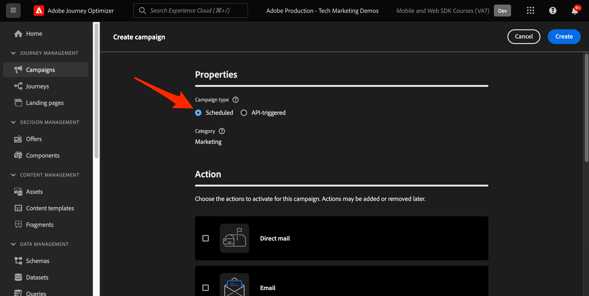

# 使用Web SDK设置Journey Optimizer Web渠道

了解如何使用Adobe Experience Platform Web SDK实施Adobe Journey Optimizer [Web渠道](https://experienceleague.adobe.com/en/docs/journey-optimizer/using/web/get-started-web)。 本课程包括基本Web渠道先决条件、配置的详细步骤以及围绕忠诚度状态的用例的深入探讨。

通过学习本课程，Journey Optimizer用户将能够使用Journey Optimizer Web Designer的Web渠道来实现高级在线个性化。

## 学习目标

在本课程结束时，您能够：

* 了解Web SDK在提供Web渠道体验中的功能和意义。
* 利用示例Luma忠诚度奖励用例，从头到尾了解创建Web渠道营销活动的过程。
* 在界面中配置促销活动属性、操作和计划。
* 了解Adobe Experience Cloud可视化编辑帮助程序扩展的功能和好处。
* 了解如何使用Web设计器编辑网页内容，包括图像、标题和其他元素。
* 了解如何使用优惠决策组件将优惠插入到网页中。
* 熟悉确保Web渠道营销活动质量和成功的最佳实践。

## 先决条件

要完成此部分中的课程，您必须首先：

* 完成有关Platform Web SDK初始配置的所有课程，包括设置数据元素和规则。
* 确保您的Adobe Experience Platform Web SDK标记扩展版本为2.16或更高版本。
* 如果您使用Journey Optimizer Web设计器创作您的Web渠道体验，请确保您使用的是Google Chrome或Microsoft®Edge浏览器。
* 另外，请确保已下载并启用[Adobe Experience Cloud可视化编辑帮助程序浏览器扩展](https://chromewebstore.google.com/detail/adobe-experience-cloud-vi/kgmjjkfjacffaebgpkpcllakjifppnca)。
* 确保您的浏览器允许使用第三方Cookie。 可能还需要在浏览器中禁用任何广告拦截器。

  >[!CAUTION]
  >
  > 在Journey Optimizer Web设计器中，由于以下原因之一，某些网站可能无法可靠地打开：
  > 
  > 1. 网站具有严格的安全策略。
  > 1. 网站嵌入在iframe中。
  > 1. 无法从外部访问客户的QA或暂存站点（它是一个内部站点）。

* 从Adobe Experience Manager Assets Essentials库创建Web体验并包含内容时，需要[配置子域以发布此内容](https://experienceleague.adobe.com/en/docs/journey-optimizer/using/web/configure-web-channel/web-delegated-subdomains)。
* 如果使用内容试验功能，请确保您的Web数据集也包含在报表配置中。
* 目前，支持两种类型的实施，以便能够在Web资产上创作和交付Web渠道营销活动：
   * 仅限客户端：要修改您的网站，必须实施Adobe Experience Platform Web SDK。
   * 混合模式：您可以利用平台Edge Network服务器API来请求个性化服务器端。 来自API的响应随后会提供给Adobe Experience Platform Web SDK，以便在客户端进行修改。 有关更多信息，请参阅Adobe Experience PlatformEdge Network服务器API文档。 可以在这篇博客文章中找到混合模式的其他详细信息和实施示例。

  >[!NOTE]
  >
  >当前不支持仅服务器端实施。

## 术语

首先，您应该了解Web渠道营销活动中使用的术语。

* **Web渠道**：用于通信或通过Web传递内容的媒介。 在本指南的上下文中，它介绍了在Adobe Journey Optimizer中使用Platform Web SDK向网站访客交付个性化内容的机制。
* **Web表面**：引用由传送内容的URL标识的Web属性。 它可以包含单个或多个网页。
* **Journey Optimizer Web设计器**： Journey Optimizer中的特定工具或界面，用户可以在其中设计其Web渠道体验。
* **Adobe Experience Cloud可视化编辑帮助程序**：一种浏览器扩展，可协助以可视方式编辑和设计Web渠道体验。
* **数据流**： Adobe Experience Platform服务中确保Web渠道体验可交付的配置。
* **合并策略**：一种确保准确激活和发布入站营销活动的配置。
* **受众**：符合特定条件的用户或网站访客的特定区段。
* **Web设计器**：一种界面或工具，它有助于在不深入了解代码的情况下直观地编辑和设计Web体验。
* **表达式编辑器**： Web设计器中的一个工具，允许用户向Web内容添加个性化，可能基于数据属性或其他条件。
* **优惠决策组件**： Web设计器中的一个组件，可帮助根据决策管理决定哪个优惠最适合向特定访客显示。
* **内容实验**：一种测试不同内容变体的方法，以确定哪些变体在所需量度（如入站点击次数）方面表现最佳。
* **处理**：在内容实验的上下文中，处理是指相对于其他内容进行测试的特定内容变体。
* **模拟**：一种预览机制，用于在为实时受众激活Web渠道体验之前将其可视化。

## 配置数据流

您已将Adobe Experience Platform服务添加到数据流。 现在，您需要启用Adobe Journey Optimizer选项，以便提供Web渠道体验。

要在数据流中配置Adobe Journey Optimizer，请执行以下操作：

1. 转到[数据收集](https://experience.adobe.com/#/data-collection){target="blank"}接口。
1. 在左侧导航中，选择&#x200B;**[!UICONTROL 数据流]**。
1. 选择之前创建的Luma Web SDK数据流。

   

1. 在Adobe Experience Platform服务中选择&#x200B;**[!UICONTROL 编辑]**。

   

1. 选中&#x200B;**[!UICONTROL Adobe Journey Optimizer]**&#x200B;框。

   

1. 选择&#x200B;**[!UICONTROL 保存]**。

这可确保Adobe Experience PlatformEdge Network正确处理Journey Optimizer的入站事件。

## 配置合并策略

确保在启用&#x200B;**[!UICONTROL Active-On-Edge合并策略]**&#x200B;选项的情况下定义合并策略。 Journey Optimizer集客渠道可使用此合并策略选项，以确保在边缘准确地激活和发布集客营销活动。

要在合并策略中配置选项，请执行以下操作：

1. 在Experience Platform或Journey Optimizer界面中转到&#x200B;**[!UICONTROL Customer]** > **[!UICONTROL Profiles]**&#x200B;页面。
1. 选择&#x200B;**[!UICONTROL 合并策略]**&#x200B;选项卡。
1. 选择您的策略（通常最好使用[!UICONTROL 基于默认时间的]策略），然后在&#x200B;**[!UICONTROL 配置]**&#x200B;步骤中切换&#x200B;**[!UICONTROL Edge上的活动合并策略]**&#x200B;选项。

   

## 为内容试验配置Web数据集

要在Web渠道营销活动中使用内容实验，必须确保使用的Web数据集也包含在报表配置中。 Journey Optimizer报表系统以只读方式使用数据集来填充现成的内容试验报表。

[本节](https://experienceleague.adobe.com/en/docs/journey-optimizer/using/content-management/content-experiment/reporting-configuration#add-datasets)详细介绍了如何添加用于内容试验报告的数据集。

## 用例概述 — 忠诚度奖励

在本课程中，一个忠诚度奖励用例用于详细介绍使用Web SDK实施Web渠道体验。

此用例使您能够更好地了解Journey Optimizer如何利用Journey Optimizer营销活动和Web设计器，帮助向客户提供最佳入站体验。

由于本教程面向实施者，因此需要注意的是，本课程涉及Journey Optimizer中的大量界面工作。 虽然此类界面任务通常由营销人员处理，但对于实施者而言，深入了解该流程可能会有所帮助，即使他们通常不负责Web渠道营销活动创建。

### 创建忠诚度奖励营销活动

现在，您已摄取我们的示例忠诚度数据并创建我们的区段，请在Adobe Journey Optimizer中创建忠诚度奖励网络渠道营销活动。

要创建示例营销活动，请执行以下操作：

1. 打开[Journey Optimizer](https://experience.adobe.com/journey-optimizer/home){target="_blank"}界面

   >[!NOTE]
   >
   > 架构、数据集和受众都是常见的Experience Platform结构，因此也可以在Journey Optimizer界面中构建。

1. 在左侧导航中导航到&#x200B;**[!UICONTROL 历程管理]** > **[!UICONTROL 促销活动]**
1. 单击右上角的&#x200B;**[!UICONTROL 创建营销活动]**。
1. 在&#x200B;**[!UICONTROL 属性]**&#x200B;部分中，指定您希望如何执行营销活动。 对于忠诚度奖励用例，请选择&#x200B;**计划**。

   

1. 在&#x200B;**[!UICONTROL 操作]**&#x200B;部分中，选择&#x200B;**[!UICONTROL Web渠道]**。 作为&#x200B;**[!UICONTROL Web表面]**，请选择&#x200B;**[!UICONTROL 页面URL]**。

   >[!NOTE]
   >
   >Web表面是指由交付内容的URL标识的Web属性。 它可以对应于单个页面URL或包含多个页面，使您能够在一个或多个网页中应用修改。

1. 选择&#x200B;**[!UICONTROL 页面URL]** Web表面选项可在此营销活动的一个页面上部署体验。 输入Luma页面的URL，`https://luma.enablementadobe.com/content/luma/us/en.html`

1. 定义Web表面后，选择&#x200B;**[!UICONTROL 创建]**。

   

1. 现在向新的Web渠道营销活动添加一些其他详细信息。 首先，命名营销活动。 调用它`Luma Loyalty Rewards – Gold Status`。 （可选）您可以向市场活动添加描述。 还要添加&#x200B;**[!UICONTROL 标记]**&#x200B;以改进整个促销活动分类。

   

1. 默认情况下，该营销活动对所有网站访客有效。 对于此用例，只有金会员状态奖励会员才能看到体验。 要启用此功能，请单击&#x200B;**[!UICONTROL 选择受众]**&#x200B;并选择`Luma Loyalty Rewards – Gold Status`受众。

1. 在&#x200B;**[!UICONTROL 身份命名空间]**&#x200B;字段中，选择用于标识所选区段内个人的命名空间。 由于您要将促销活动部署在Luma网站上，因此可以选择ECID命名空间。 `Luma Loyalty Rewards – Gold Status`受众中缺少各种身份中的ECID命名空间的配置文件不会成为Web渠道营销活动的目标。

   

1. 使用&#x200B;**[!UICONTROL 促销活动开始]**&#x200B;选项安排在今天的日期开始促销活动，使用&#x200B;**[!UICONTROL 促销活动结束]**&#x200B;选项安排在一周内结束。

   

>[!NOTE]
>
>请记住，对于Web渠道营销活动，Web体验会在访客打开页面时显示。 因此，与Adobe Journey Optimizer中的其他类型的营销活动不同，**[!UICONTROL 操作触发器]**&#x200B;部分不可配置。

### 尝试忠诚度奖励内容

如果向上滚动，则可以在&#x200B;**[!UICONTROL 操作]**&#x200B;部分中创建试验，以测试哪些内容更适合`Luma Loyalty Rewards – Gold Status`受众。 让我们创建并测试两个处理作为Campaign配置的一部分。

要创建内容试验，请执行以下操作：

1. 单击&#x200B;**[!UICONTROL 创建试验]**。

   

1. 首先选择&#x200B;**[!UICONTROL 成功量度]**。 这是确定内容有效性的量度。 选择&#x200B;**[!UICONTROL 独特入站点击次数]**，以查看哪个内容处理在Web体验CTA上产生了更多的点击次数。

   

1. 使用Web渠道设置试验并选择&#x200B;**[!UICONTROL 入站点击数]**、**[!UICONTROL 独特入站点击数]**、**[!UICONTROL 页面查看数]**&#x200B;或&#x200B;**[!UICONTROL 独特页面查看数]**&#x200B;指标时，**[!UICONTROL 点击操作]**&#x200B;下拉列表可让您准确地跟踪和监视特定页面上的点击数和查看数。

1. 或者，您可以指定不接收这两种处理中任何一种的&#x200B;**[!UICONTROL 维持]**。 暂时取消选中此项。

1. 也可以选择平均&#x200B;**[!UICONTROL 分配]**。 选中此选项可确保始终平均拆分处理拆分。

[进一步了解Adobe Journey Optimizer Web渠道中的内容实验](https://experienceleague.adobe.com/en/docs/journey-optimizer/using/campaigns/content-experiment/get-started-experiment)。

### 使用可视化帮助程序编辑内容

现在，让我们创作Web渠道体验。 为此，请使用Adobe Experience Cloud **[!UICONTROL 可视化帮助程序]**。 此工具是一个与Google Chrome和Microsoft® Edge兼容的浏览器扩展。 在尝试构建体验之前，请确保已下载该扩展。 还要确保网页包含Web SDK。

1. 在营销活动的&#x200B;**[!UICONTROL 操作]**&#x200B;选项卡中，单击&#x200B;**[!UICONTROL 编辑内容]**。 由于您输入了单个页面URL作为表面，因此您应该可以在编辑器中开始工作。

   

1. 现在，单击&#x200B;**[!UICONTROL 编辑网页]**&#x200B;开始创作。

   

1. 首先，使用Web编辑器编辑某些元素。 使用上下文菜单编辑Luma主页图像标题。 调整右侧上下文窗格的样式。

   

1. 还可以使用&#x200B;**[!UICONTROL 表达式编辑器]**&#x200B;将个性化添加到容器中。

   

1. 确保正确跟踪点击体验。 从上下文菜单中选择&#x200B;**[!UICONTROL 单击跟踪元素]**。

   

1. 使用&#x200B;**[!UICONTROL 优惠决策组件]**&#x200B;在网页中插入优惠。 此组件使用&#x200B;**[!UICONTROL 决策管理]**&#x200B;挑选要交付给Luma访客的最佳优惠。

### HTML设计更改

如果您希望将更高级的更改或自定义的更改作为忠诚度奖励促销活动的一部分，可以使用一些方法。

使用&#x200B;**[!UICONTROL 组件]**&#x200B;窗格将HTML或其他内容直接添加到Luma网站。

在页面顶部添加新的HTML组件。 从设计界面或&#x200B;**[!UICONTROL 上下文]**&#x200B;窗格编辑组件中的HTML。

或者，从&#x200B;**[!UICONTROL 修改]**&#x200B;窗格添加HTML编辑。 此窗格允许您在页面上选择一个组件，然后从设计器界面中对其进行编辑。

在编辑器中，添加`Luma Loyalty Rewards – Gold Status`受众的HTML。 选择&#x200B;**[!UICONTROL 验证]**。

现在，查看新的自定义HTML组件以了解其适合和风格。

使用&#x200B;**[!UICONTROL CSS选择器类型]**&#x200B;修改编辑特定组件。

使用&#x200B;**页面`<head>`类型**&#x200B;修改添加自定义代码。

使用&#x200B;**[!UICONTROL 可视化帮助程序]**&#x200B;的可能性是无穷的。

### 模拟忠诚度奖励内容

在激活营销活动之前，查看已修改网页的预览。 请记住，您必须将测试用户档案配置为模拟Web渠道体验。

要模拟体验，请执行以下操作：

1. 在营销活动中选择&#x200B;**[!UICONTROL 模拟内容]**。

   

1. 选择要接收模拟的测试用户档案。 请记住，测试配置文件应位于`Luma Loyalty Rewards – Gold Status`受众中才能获得适当的处理。

1. 将显示测试用户档案的预览。

### 激活忠诚度奖励营销活动

最后，激活Web渠道营销活动。

1. 选择&#x200B;**查看以激活**。

1. 系统会提示您最后一次确认促销活动详细信息。 选择&#x200B;**[!UICONTROL 激活]**。 营销活动最多可能需要15分钟才能在网站上处于活动状态。

### 忠诚度奖励QA

您可以使用一些登录来模拟“金牌状态”用户并授予您的促销活动资格：

1. `cleavlandeuler@emailsim.io`/`test`
1. `leftybeagen@emailsim.io`/`test`
1. `jenimartinho@emailsim.io`/`test`

作为最佳实践，请监视营销活动实时和全局报告的&#x200B;**[!UICONTROL Web]**&#x200B;选项卡，以查看特定于营销活动的KPI。 对于此营销活动，监视体验展示次数，然后单击率。

### 使用Adobe Experience Platform Debugger进行Web渠道验证

适用于Chrome和Firefox的Adobe Experience Platform Debugger扩展可分析您的网页，以识别Adobe Experience Cloud解决方案实施中的问题。

您可以使用Luma网站上的调试器来验证生产环境中的Web渠道体验。 在忠诚度奖励用例启动并运行后，这是一种最佳实践，可确保正确配置所有内容。

[通过此处](https://experienceleague.adobe.com/en/docs/platform-learn/data-collection/debugger/overview)了解如何使用指南在浏览器中配置调试器。

要使用调试器开始验证，请执行以下操作：

1. 导航到具有Web渠道体验的Luma网页。
   <!--
    
    -->
1. 在网页上，打开&#x200B;**[!UICONTROL Adobe Experience Platform Debugger]**。
   <!--
    
    -->
1. 导航到&#x200B;**摘要**。 验证&#x200B;**[!UICONTROL 数据流ID]**&#x200B;是否与您启用了Adobe Journey Optimizer的&#x200B;**[!UICONTROL Adobe数据收集]**&#x200B;中的&#x200B;**[!UICONTROL 数据流]**&#x200B;匹配。
   <!--
    
    -->
1. 然后，您可以使用各种Luma忠诚度帐户登录网站，并使用该调试器验证发送到Adobe Experience PlatformEdge Network的请求。
   <!--
    
    -->
1. 在&#x200B;**[!UICONTROL 解决方案]**&#x200B;下，导航到&#x200B;**[!UICONTROL Experience PlatformWeb SDK]**。
   <!--
    
    -->
1. 在&#x200B;**配置**&#x200B;选项卡中，打开&#x200B;**[!UICONTROL 启用调试]**。 这将启用&#x200B;**[!UICONTROL Adobe Experience Platform保证]**&#x200B;会话中的会话日志记录。
   <!--
    
    -->
1. 使用各种Luma忠诚度帐户登录网站，然后使用调试器验证发送到&#x200B;**[!UICONTROL Adobe Experience Platform Edge网络]**&#x200B;的请求。 所有这些请求都应在&#x200B;**[!UICONTROL 保证]**&#x200B;中捕获以进行日志跟踪。
<!--
   
-->

[下一步： ](setup-decision-management.md)

>[!NOTE]
>
>感谢您投入时间学习Adobe Experience Platform Web SDK。 如果您有疑问、希望分享一般反馈或有关于未来内容的建议，请在此[Experience League社区讨论帖子](https://experienceleaguecommunities.adobe.com/t5/adobe-experience-platform-data/tutorial-discussion-implement-adobe-experience-cloud-with-web/td-p/444996)上分享这些内容
