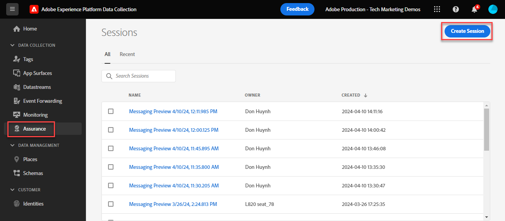

# 通过Experience Platform保证验证Web SDK实施

Adobe Experience Platform Assurance是一项功能，可帮助您检查、证明、模拟和验证数据收集或提供体验的方式。 详细了解 [Adobe保证](https://experienceleague.adobe.com/en/docs/experience-platform/assurance/home).

## 学习目标

在本课程结束后，您将能够：

* 启动保证会话
* 查看发送到Platform Edge Network和从其中发出的请求

## 先决条件

您熟悉数据收集标记和 [Luma演示站点](https://luma.enablementadobe.com/content/luma/us/en.html){target="_blank"} 并完成了本教程中以前的课程：

* [配置XDM架构](configure-schemas.md)
* [配置身份命名空间](configure-identities.md)
* [配置数据流](configure-datastream.md)
* [Web SDK扩展安装在标记属性中](install-web-sdk.md)
* [创建数据元素](create-data-elements.md)
* [创建身份](create-identities.md)
* [创建标记规则](create-tag-rule.md)
* [使用Debugger进行验证](validate-with-debugger.md)

## 启动并查看保证会话

有几种方法可启动保证会话。

### 在Debugger中启动保证会话

每次在Adobe Experience Platform Debugger中启用边缘跟踪时，都会在后台启动保证会话。

在Debugger课程中查看我们如何执行此操作：

1. 转到 [Luma演示站点](https://luma.enablementadobe.com/content/luma/us/en.html) 并使用调试器 [将网站上的tag属性切换到您自己的开发资产](validate-with-debugger.md#use-the-experience-platform-debugger-to-map-to-your-tags-property)
1. 在左侧导航中 **[!UICONTROL Experience Platform调试程序]** 选择 **[!UICONTROL 日志]**
1. 选择 **[!UICONTROL Edge]** 选项卡，然后选择 **[!UICONTROL 连接]**

   
1. 启用边缘跟踪后，您会在顶部看到一个传出链接图标。 选择图标以打开“保证”。

   

1. 此时将打开一个新的浏览器选项卡，其中包含Assurance界面。

### 从Assurance界面启动Assurance会话

1. 打开 [数据收集界面](https://experience.adobe.com/#/data-collection/home){target="_blank"}
1. 在左侧导航中选择Assurance
1. 选择创建会话
   
1. 选择开始
1. 为会话命名，例如， `Luma Web SDK validation`
1. 作为 **[!UICONTROL 基本URL]** 进入 `https://luma.enablementadobe.com/`
   
1. 在下一个屏幕上，选择 **[!UICONTROL 复制链接]**
1. 选择图标以将链接复制到剪贴板
1. 将URL粘贴到浏览器中，这将打开带特殊URL参数的Luma网站 `adb_validation_sessionid` 并启动会话
1. 在Assurance界面中，您应该会看到一条消息，指示您已成功连接到会话，并且您应该会看到Assurance界面中捕获的事件。
   

## 验证Web SDK实施的当前状态

在实施过程的此阶段，要查看的信息有限。 我们可以看到您在PlatformEdge Network上生成的Experience CloudID (ECID)值：

1. 选择带有称为“Adobe响应句柄”的事件的行。
1. 右侧将显示一个菜单。 选择 `+` 签名到 `[!UICONTROL ACPExtensionEvent]`
1. 通过选择 `[!UICONTROL payload > 0 > payload > 0 > namespace]`. 显示在最后一个 `0` 对应于 `ECID`. 根据以下显示的值，您知道 `namespace` 匹配 `ECID`

   

   >[!CAUTION]
   >
   >由于窗口宽度，您可能会看到截断的ECID值。 只需选择界面中的手柄栏并向左拖动即可查看整个ECID。

在将来的课程中，您可以使用Assurance验证完全处理的负载，这些负载将到达在数据流中启用的Adobe应用程序。

现在，通过在页面上触发XDM对象，并了解如何验证您的数据收集，您便可以使用Platform Web SDK设置Experience Platform和单个Adobe应用程序。

[下一步： ](setup-experience-platform.md)

>[!NOTE]
>
>感谢您投入时间学习Adobe Experience Platform Web SDK。 如果您有疑问、希望分享一般反馈或有关于未来内容的建议，请在此共享它们 [Experience League社区讨论帖子](https://experienceleaguecommunities.adobe.com/t5/adobe-experience-platform-data/tutorial-discussion-implement-adobe-experience-cloud-with-web/td-p/444996)
