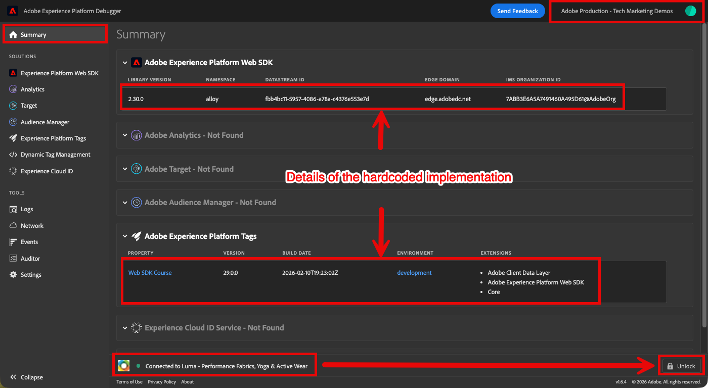

# 使用Experience Platform Debugger验证Web SDK实施

了解如何使用 Adobe Experience Platform Debugger 验证您的 Adobe Experience Platform Web SDK 实施。

Experience Platform Debugger是一个[Chrome扩展](https://chromewebstore.google.com/detail/adobe-experience-platform/bfnnokhpnncpkdmbokanobigaccjkpob)，可帮助您查看在网页中实施的Adobe技术。 Experience Platform Debugger和浏览器的开发人员控制台是验证和调试Web SDK实施的浏览器端方面的最佳方法。 Adobe Experience Platform Assurance将在下一课程中介绍，它提供了数据进出平台Edge Network时的最佳视图。

如果您以前从未使用过该调试器，则可能需要观看以下时长为5分钟的概述视频：

>[!VIDEO](https://video.tv.adobe.com/v/35858?captions=chi_hans&learn=on&enablevpops)

在本课程中，您使用[Adobe Experience Platform Debugger扩展](https://chromewebstore.google.com/detail/adobe-experience-platform/bfnnokhpnncpkdmbokanobigaccjkpob)将[Luma演示网站](https://luma.enablementadobe.com)上硬编码的标记属性替换为您自己的属性。

此技术称为环境切换，当您以后在自己的网站上使用标记时，此技术将非常有用。 它允许您在浏览器中加载生产网站，但需要使用&#x200B;*开发*&#x200B;标记库。 此功能使您能够放心地做出并验证标记更改，而不依赖于常规代码发布。 毕竟，将营销标记发布与常规代码发布分开是客户最初使用标记的主要原因之一！

## 学习目标

在本课程结束时，您将能够使用调试器执行以下操作：

* 加载备用标记库
* 验证客户端XDM事件是否按预期捕获数据并发送到Platform Edge Network
* 启用Edge跟踪以查看由Platform Edge Network发送的服务器端请求

## 先决条件

您熟悉数据收集标记和[Luma演示网站](https://luma.enablementadobe.com/){target="_blank"}，并完成了本教程中以前的课程：

* [配置XDM架构](configure-schemas.md)
* [配置身份命名空间](configure-identities.md)
* [配置数据流](configure-datastream.md)
* [Web SDK扩展安装在标记属性中](install-web-sdk.md)
* [创建数据元素](create-data-elements.md)
* [捕获身份](create-identities.md)
* [创建标记规则](create-tag-rule.md)

## 使用Debugger加载备用标记库

Experience Platform Debugger具有一项酷炫功能，您可以使用其他标记库替换现有标记库。 此技术对验证非常有用，允许我们跳过本教程中的许多实施步骤。

1. 确保已打开[Luma演示网站](https://luma.enablementadobe.com){target="_blank"}，然后选择Experience Platform Debugger扩展图标
1. 调试器将打开并显示硬编码实施的一些详细信息（您可能需要在打开调试器后重新加载Luma网站）
1. 确认Debugger已“**[!UICONTROL 连接到Luma]**”（如下图所示），然后选择“**[!UICONTROL 锁定]**”图标以将Debugger锁定到Luma网站。
1. 选择&#x200B;**[!UICONTROL 登录]**&#x200B;按钮，使用您的Adobe ID登录Adobe Experience Cloud，然后选择您的组织。

   >[!TIP]
   >
   > 如果调试器在登录后显示您的用户名而不是您的组织名称，请注销并重试。

   

1. 现在，转到左侧导航栏中的&#x200B;**[!UICONTROL Experience Platform标记]**
1. 选择&#x200B;**[!UICONTROL 配置]**&#x200B;选项卡
1. 右侧显示&#x200B;**[!UICONTROL 页面嵌入代码]**，打开&#x200B;**[!UICONTROL 操作]**&#x200B;下拉列表，然后选择&#x200B;**[!UICONTROL 替换]**

   

1. 由于您已经过身份验证，调试器将会拉入您的可用标记属性和环境。 选择您的资产
1. 选择您的`Development`环境
   

   >[!TIP]
   >
   > 如果您无法使用下拉列表选择您的属性和环境，请转到[!UICONTROL 标记] > [!UICONTROL 环境] > [!UICONTROL 开发] > [!UICONTROL 安装]，然后选择图标以复制嵌入代码并将其粘贴到Debugger中：
   > 

1. 选择&#x200B;**[!UICONTROL 应用]**&#x200B;按钮

1. Luma网站现在将使用您自己的标记属性&#x200B;_重新加载_。

   已替换

在本教程的后面部分，您将使用此技术将Luma网站映射到您自己的标记资产，以验证您的Platform Web SDK实施。 在您自己的网站上使用标记时，您可以使用该同一技术验证生产网站上的开发标记库。

## 使用Debugger进行验证

### 验证网络请求和XDM

您可以使用Debugger验证从Platform Web SDK实施触发的客户端信标，以查看发送到Platform Edge Network的数据：

1. 转到左侧导航中的&#x200B;**[!UICONTROL 摘要]**，以查看标记属性的详细信息

   

1. 现在，转到左侧导航栏中的&#x200B;**[!UICONTROL Experience Platform Web SDK]**&#x200B;以查看&#x200B;**[!UICONTROL 网络请求]**
1. 打开&#x200B;**[!UICONTROL 事件]**&#x200B;行

   

1. 请注意，如何查看您在`web.webPageDetails.pageView`更新变量[!UICONTROL 操作中指定的]事件类型，以及其他位于`AEP Web SDK ExperienceEvent`字段组后面的现成变量

   

1. 向下滚动到`web`对象，选择以打开它并检查`webPageDetails.name`。 它们应与主页上的相应`adobeDataLayer`数据层变量匹配

>[!TIP]
>
> 要查看和比较主页上的`adobeDataLayer`数据层，请执行以下操作：
>
> 1. 在Luma主页上，打开浏览器开发人员工具。 对于Chrome，请选择键盘上的按钮`F12`
> 1. 选择&#x200B;**[!UICONTROL 控制台]**&#x200B;选项卡
> 1. 输入`adobeDataLayer`并在键盘上选择`Enter`以调出数据层值

验证在产品页面、购物车页面和订单确认页面上设置的事件和变量。

### 验证身份映射

您还可以验证身份映射详细信息：

1. 在&#x200B;**[!DNL Sign In]** Luma网站[上选择](https://luma.enablementadobe.com/){target=_blank}。 选择&#x200B;**[!DNL Create Account]**&#x200B;并使用凭据`test@test.com`/`test`创建帐户

1. 使用Debugger中的“跳转到最近的&#x200B;**[!UICONTROL ”快捷方式可快速转到最近的Web SDK事件（这是最后一列）。]**&#x200B;选择&#x200B;**[!UICONTROL events]**&#x200B;行以打开详细信息模式。

1. 在模态中搜索&#x200B;**identityMap**。 在这里，您应该会看到具有authenticatedState、id和主指定三个键的`lumaCrmId`：
   Debugger中的

## 使用浏览器开发人员工具进行验证

许多Web开发人员可能更喜欢在其浏览器的开发人员工具中查看实施。 这一点尤为重要，因为并非所有浏览器都支持Debugger扩展。 此外，由于框架灵活，您还可以检查其他实施详细信息，如Cookie和响应详细信息。

### 验证网络请求

Web SDK请求详细信息也会显示在浏览器的Web开发人员工具&#x200B;**网络**&#x200B;选项卡中（假设网站正在加载您的标记库）。

1. 打开浏览器的Web开发人员工具&#x200B;**网络**&#x200B;选项卡，然后重新加载页面。 筛选具有`/ee`的调用以查找该调用，选择它，然后查看&#x200B;**标头**&#x200B;选项卡和&#x200B;**有效负载**&#x200B;选项卡

   

1. 转到&#x200B;**预览**&#x200B;选项卡，并记下ECID值如何包含在网络响应中。

   

   >[!NOTE]
   >
   > ECID值在网络响应中可见。 它没有包括在网络请求的`identityMap`部分中，也没有以此格式存储在Cookie中。

### Web SDK Cookie

我们使用开发人员工具时，我们来看看浏览器中的SDK网站集的一些Cookie。 打开Application > Cookie > https://luma.enablementadobe.com

您应该会看到由Web SDK设置的多个Cookie：

* kndctr_[IMS_ORGID]_AdobeOrg_identity：这将存储与ECID相关的数据
* kndctr_[IMS_ORGID]_AdobeOrg_cluster：这将存储使用的数据中心位置，以便后续网络调用路由到相同的Edge服务器
* AMCV_[IMS_ORGID]%40AdobeOrg：这是以前的Web SDK Experience Cloud库使用的旧版AMCV Cookie，之所以设置它，是因为我们保留了在Adobe Experience Platform Web SDK标记扩展中选择的默认&#x200B;**[!UICONTROL 将ECID迁移到VisitorAPI到Web SDK]**&#x200B;设置。 此设置对于在您将页面从旧版库迁移到Web SDK时启用很重要，但在迁移所有页面一段时间后，可以禁用此设置。

如果您清除这些Cookie并重新加载页面，您可能会注意到在`.demdex.net`域上设置了额外的第三方Cookie。 设置这些是因为我们保留了Adobe Experience Platform Web SDK标记扩展中的默认&#x200B;**[!UICONTROL 使用第三方Cookie]**： **[!UICONTROL 已启用]**&#x200B;设置。 如果您的浏览器不允许使用第三方Cookie，则当您重新加载页面时，这些Cookie将被删除。

### Luma本地存储

Luma演示网站严格使用客户端技术，如HTML、CSS和JavaScript。 除了网站默认状态使用的Experience Cloud实施之外，没有后端存储机制。 用户名详细信息等信息仅使用localStorage存储在浏览器的本地。 因此，如果您删除此信息或使用无痕窗口，您会注意到可能需要重新创建您之前创建的测试用户帐户。

接下来，了解如何使用Adobe Experience Platform Assurance在Platform Edge Network中接收和传输这些网络请求时验证这些请求！

>[!NOTE]
>
>感谢您投入时间学习Adobe Experience Platform Web SDK。 如果您有疑问、希望分享一般反馈或有关于未来内容的建议，请在此[Experience League社区讨论帖子](https://experienceleaguecommunities.adobe.com/adobe-experience-platform-18/tutorial-discussion-implement-adobe-experience-cloud-with-web-sdk-tutorial-248848?profile.language=zh-Hans)上分享这些内容
