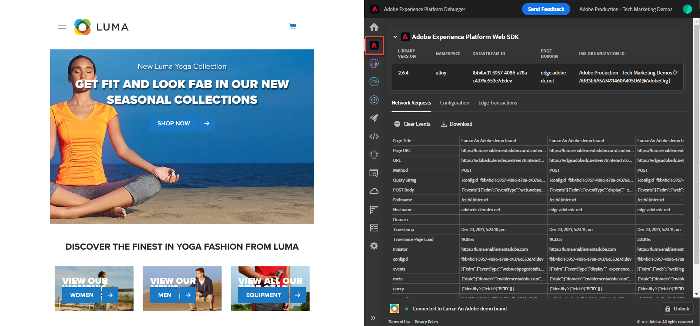

# 使用Experience Platform调试器验证Web SDK实施

了解如何使用Adobe Experience Platform Debugger验证您的Platform Web SDK实施。

Experience Platform调试器是一个适用于Chrome和Firefox浏览器的扩展，可帮助您查看在网页中实现的Adobe技术。 下载首选浏览器的版本：

* [Firefox扩展](https://addons.mozilla.org/zh-CN/firefox/addon/adobe-experience-platform-dbg/)
* [Chrome扩展](https://chrome.google.com/webstore/detail/adobe-experience-platform/bfnnokhpnncpkdmbokanobigaccjkpob)

如果您以前从未使用过该调试器，并且此调试器不同于之前的Adobe Experience Cloud Debugger，则可能需要观看以下时长为五分钟的概述视频：

>[!VIDEO](https://video.tv.adobe.com/v/32156?learn=on)

在本课程中，您将使用 [Adobe Experience Cloud Debugger扩展](https://chrome.google.com/webstore/detail/adobe-experience-cloud-de/ocdmogmohccmeicdhlhhgepeaijenapj) 替换 [Luma演示站点](https://luma.enablementadobe.com/content/luma/us/en.html) 拥有自己的财产。

此技术称为环境切换，当您以后在自己的网站上使用标记时，此技术将非常有用。 您可以在浏览器中加载生产网站，但需使用 *开发* 标记环境。 此功能使您能够放心地做出并验证标记更改，而不依赖于常规代码发布。 毕竟，将营销标记发布与常规代码发布分开是客户最初使用标记的主要原因之一！

## 学习目标

在本课程结束时，您将能够使用调试器执行以下操作：

* 加载备用标记库
* 验证XDM对象是否正在按预期捕获和发送边缘网络数据

## 先决条件

您熟悉数据收集标记和 [Luma演示站点](https://luma.enablementadobe.com/content/luma/us/en.html){target="_blank"} 并已在教程中完成了以下以前的课程：

* [配置权限](configure-permissions.md)
* [配置XDM架构](configure-schemas.md)
* [配置身份命名空间](configure-identities.md)
* [配置数据流](configure-datastream.md)
* [Web SDK扩展安装在标记属性中](install-web-sdk.md)
* [创建数据元素](create-data-elements.md)
* [创建标记规则](create-tag-rule.md)

## 使用Debugger加载备用标记库

本教程使用的公共托管版本的 [Luma演示网站](https://luma.enablementadobe.com/content/luma/us/en.html). 打开主页并将其加入书签。

Experience PlatformDebugger具有一项酷炫功能，允许您使用其他标记库替换现有标记库。 此技术对验证非常有用，允许我们跳过本教程中的许多实施步骤。

1. 确保已打开Luma网站并选择Experience PlatformDebugger扩展图标
1. 调试器将会打开并显示硬编码实施的一些详细信息，这些详细信息与本教程无关（在打开调试器后，您可能需要重新加载Luma网站）
1. 确认调试器为“**[!UICONTROL 已连接到Luma]**&quot;，如下图所示，然后选择&quot;**[!UICONTROL 锁定]**”图标将Debugger锁定到Luma网站。
1. 选择 **[!UICONTROL 登录]** 按钮并使用您的AdobeID登录Adobe Experience Cloud。
1. 现在转到 **[!UICONTROL Experience Platform标记]** 在左侧导航中

   

1. 选择 **[!UICONTROL 配置]** 选项卡
1. 右边显示了 **[!UICONTROL 页面嵌入代码]**，打开 **[!UICONTROL 操作]** 下拉列表，然后选择 **[!UICONTROL 替换]**

   

1. 由于您已经过身份验证，调试器将会拉入您的可用标记属性和环境。 选择您的 `Web SDK Course` 属性
1. 选择您的 `Development` 环境
1. 选择 **[!UICONTROL 应用]** 按钮

   

1. Luma网站现在将重新加载 _标记属性_.

   

在本教程的后面部分，您将使用此技术将Luma网站映射到您自己的标记资产，以验证您的Platform Web SDK实施。 在生产网站上开始使用标记时，您可以使用该同一技术验证所做的更改。

## 在Experience Platform调试器中验证您的实施

您可以使用Debugger验证Platform Web SDK实施，并查看发送到Platform Edge Network的数据：

1. 转到 **[!UICONTROL 摘要]** 在左侧导航中，查看标记属性的详细信息

   

1. 现在转到 **[!UICONTROL Experience PlatformWeb SDK]** 在左侧导航中查看 **[!UICONTROL 网络请求]**
1. 打开 **[!UICONTROL 事件]** 行（如果此屏幕快照显示的请求数多于您的请求，请不要担心，其中包含来自未来课程的请求，您现在可以忽略）

   

1. 请注意我们的查看方式 `web.webpagedetails.pageView` 我们在 [!UICONTROL 发送事件] 操作以及其他遵循的开箱即用变量 `AEP Web SDK ExperienceEvent Mixin` 格式

   

1. 向下滚动到 `web` 对象，选择以将其打开并检查 `webPageDetails.name`， `webPageDetails.server`、和 `webPageDetails.siteSection`. 它们应该与主页上的相应digitalData数据层变量匹配

   

您还可以验证身份映射详细信息：

1. 使用凭据 `test@adobe.com`/`test` 登录 Luma 网站

1. 返回 [Luma 主页](https://luma.enablementadobe.com/content/luma/us/en.html)

1. 打开 **[!UICONTROL Experience PlatformWeb SDK]** 左侧导航中的部分

   

1. 选择 **[!UICONTROL 事件]** 在弹出窗口中打开详细信息的行

   

1. 搜索 **identityMap** 在弹出窗口中。 您应该看到 `lumaCrmId` 包含authenticatedState、id和primary的三个键：
   

## 使用浏览器开发工具进行验证

这些类型的请求详细信息还可在浏览器的Web开发人员工具中查看 **网络** 选项卡（假设网站正在加载您的标记库）。

1. 打开浏览器的Web开发人员工具 **网络** 制表符并重新加载页面。 过滤调用 `/ee` 要查找该调用，请选择它，然后查看 **标题** 制表符，和 **有效负荷** 选项卡

   

1. 转到 **响应** 选项卡，并记下ECID值在响应中的包含方式。 复制此值，因为您将在下一个练习中使用它来验证用户档案信息

   

   >[!NOTE]
   >
   >    您可能会看到与上述屏幕快照中相同的有效负载请求量。 这种差异是因为未来的教训 [设置Target](setup-target.md) 在拍摄屏幕快照时完成。 你可以暂时忽略这个区别。

现在，通过在页面上触发XDM对象，并了解如何验证您的数据收集，您便可以使用Platform Web SDK设置单独的Adobe应用程序。

[下一步： ](setup-experience-platform.md)

>[!NOTE]
>
>感谢您投入时间学习Adobe Experience Platform Web SDK。 如果您有疑问、希望分享一般反馈或有关于未来内容的建议，请在此共享它们 [Experience League社区讨论帖子](https://experienceleaguecommunities.adobe.com/t5/adobe-experience-platform-launch/tutorial-discussion-implement-adobe-experience-cloud-with-web/td-p/444996)
