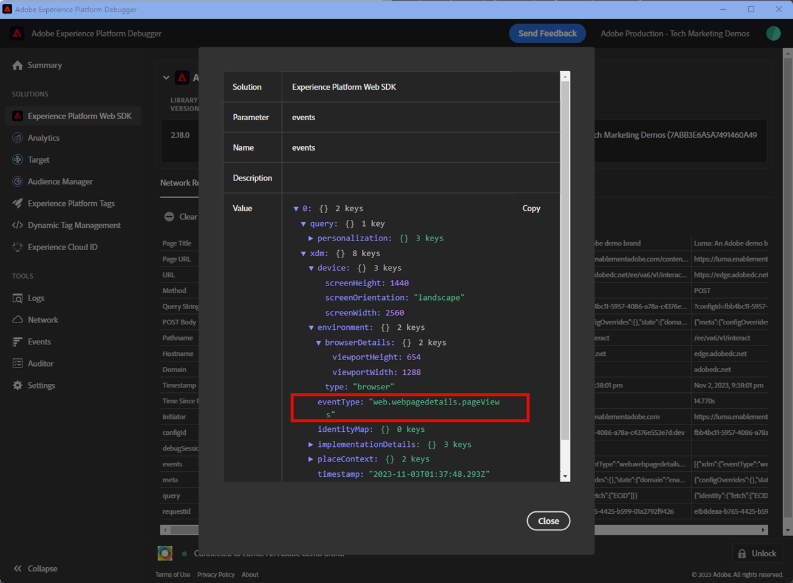

# 使用Experience Platform Debugger验证Web SDK实施

了解如何使用 Adobe Experience Platform Debugger 验证您的 Adobe Experience Platform Web SDK 实施。

Experience Platform Debugger是适用于Chrome的扩展，可帮助您查看在网页中实施的Adobe技术：

* [Chrome扩展](https://chromewebstore.google.com/detail/adobe-experience-platform/bfnnokhpnncpkdmbokanobigaccjkpob)

如果您以前从未使用过该调试器，则可能需要观看以下时长为5分钟的概述视频：

>[!VIDEO](https://video.tv.adobe.com/v/35858?captions=chi_hans&learn=on&enablevpops)

在本课程中，您使用[Adobe Experience Platform Debugger扩展](https://chromewebstore.google.com/detail/adobe-experience-platform/bfnnokhpnncpkdmbokanobigaccjkpob)将[Luma演示网站](https://luma.enablementadobe.com/content/luma/us/en.html)上硬编码的标记属性替换为您自己的属性。

此技术称为环境切换，当您以后在自己的网站上使用标记时，此技术将非常有用。 它允许您在浏览器中加载生产网站，但需要使用&#x200B;*开发*&#x200B;标记库。 此功能使您能够放心地做出并验证标记更改，而不依赖于常规代码发布。 毕竟，将营销标记发布与常规代码发布分开是客户最初使用标记的主要原因之一！

## 学习目标

在本课程结束时，您将能够使用调试器执行以下操作：

* 加载备用标记库
* 验证客户端XDM事件是否按预期捕获数据并发送到Platform Edge Network
* 启用Edge跟踪以查看由Platform Edge Network发送的服务器端请求

## 先决条件

您熟悉数据收集标记和[Luma演示网站](https://luma.enablementadobe.com/content/luma/us/en.html){target="_blank"}，并完成了本教程中以前的课程：

* [配置XDM架构](configure-schemas.md)
* [配置身份命名空间](configure-identities.md)
* [配置数据流](configure-datastream.md)
* [Web SDK扩展安装在标记属性中](install-web-sdk.md)
* [创建数据元素](create-data-elements.md)
* [创建身份](create-identities.md)
* [创建标记规则](create-tag-rule.md)

## 使用Debugger加载备用标记库

Experience Platform Debugger具有一项酷炫功能，您可以使用其他标记库替换现有标记库。 此技术对验证非常有用，允许我们跳过本教程中的许多实施步骤。

1. 确保已打开[Luma演示网站](https://luma.enablementadobe.com/content/luma/us/en.html){target="_blank"}，然后选择Experience Platform Debugger扩展图标
1. 调试器将打开并显示硬编码实施的一些详细信息（您可能需要在打开调试器后重新加载Luma网站）
1. 确认Debugger已“**[!UICONTROL 连接到Luma]**”（如下图所示），然后选择“**[!UICONTROL 锁定]**”图标以将Debugger锁定到Luma网站。
1. 选择&#x200B;**[!UICONTROL 登录]**&#x200B;按钮，然后使用您的Adobe ID登录Adobe Experience Cloud。
1. 现在，转到左侧导航栏中的&#x200B;**[!UICONTROL Experience Platform标记]**

   

1. 选择&#x200B;**[!UICONTROL 配置]**&#x200B;选项卡
1. 右侧显示&#x200B;**[!UICONTROL 页面嵌入代码]**，打开&#x200B;**[!UICONTROL 操作]**&#x200B;下拉列表，然后选择&#x200B;**[!UICONTROL 替换]**

   

1. 由于您已经过身份验证，调试器将会拉入您的可用标记属性和环境。 选择您的资产
1. 选择您的`Development`环境
1. 选择&#x200B;**[!UICONTROL 应用]**&#x200B;按钮

   

1. Luma网站现在将使用您自己的标记属性&#x200B;_重新加载_。

   已替换

在本教程的后面部分，您将使用此技术将Luma网站映射到您自己的标记资产，以验证您的Platform Web SDK实施。 在您自己的网站上使用标记时，您可以使用该同一技术验证生产网站上的开发标记库。

## 使用Experience Platform Debugger验证客户端网络请求

您可以使用Debugger验证从Platform Web SDK实施触发的客户端信标，以查看发送到Platform Edge Network的数据：

1. 转到左侧导航中的&#x200B;**[!UICONTROL 摘要]**，以查看标记属性的详细信息

   

1. 现在，转到左侧导航栏中的&#x200B;**[!UICONTROL Experience Platform Web SDK]**&#x200B;以查看&#x200B;**[!UICONTROL 网络请求]**
1. 打开&#x200B;**[!UICONTROL 事件]**&#x200B;行

   

1. 请注意，如何查看您在`web.webpagedetails.pageView`更新变量[!UICONTROL 操作中指定的]事件类型，以及其他位于`AEP Web SDK ExperienceEvent`字段组后面的现成变量

   

1. 向下滚动到`web`对象，选择以打开它并检查`webPageDetails.name`、`webPageDetails.server`和`webPageDetails.siteSection`。 它们应与主页上的相应`digitalData`数据层变量匹配

>[!TIP]
>
> 要查看和比较主页上的`digitalData`数据层，请执行以下操作：
>
> 1. 在Luma主页上，打开浏览器开发人员工具。 对于Chrome，请选择键盘上的按钮`F12`
> 1. 选择&#x200B;**[!UICONTROL 控制台]**&#x200B;选项卡
> 1. 输入`digitalData`并在键盘上选择`Enter`以调出数据层值

您还可以验证身份映射详细信息：

1. 使用凭据`test@test.com`/`test`登录Luma网站

1. 返回 [Luma 主页](https://luma.enablementadobe.com/content/luma/us/en.html)

1. 在左侧导航中打开&#x200B;**[!UICONTROL Experience Platform Web SDK]**&#x200B;部分

   Debugger中的

1. 选择&#x200B;**[!UICONTROL 事件]**&#x200B;行以在弹出窗口中打开详细信息

   Debugger中的

1. 在弹出窗口中搜索&#x200B;**identityMap**。 在这里，您应该看到包含authenticatedState、id和primary三个密钥的`lumaCrmId`：
   Debugger中的

### 使用浏览器开发工具验证客户端请求

这些类型的请求详细信息也会显示在浏览器的Web开发人员工具&#x200B;**网络**&#x200B;选项卡中（假设网站正在加载您的标记库）。

1. 打开浏览器的Web开发人员工具&#x200B;**网络**&#x200B;选项卡，然后重新加载页面。 筛选具有`/ee`的调用以查找该调用，选择它，然后查看&#x200B;**标头**&#x200B;选项卡和&#x200B;**有效负载**&#x200B;选项卡

   

1. 转到&#x200B;**响应**&#x200B;选项卡，并记下ECID值是如何包含在响应中的。

   

   >[!NOTE]
   >
   > ECID值在网络响应中可见。 它没有包括在网络请求的`identityMap`部分中，也没有以此格式存储在Cookie中。

## 使用Experience Platform Debugger验证服务器端网络请求

如您在[配置数据流](configure-datastream.md)课程中所学的，Platform Web SDK会先将数据从您的数字资产发送到Platform Edge Network。 然后，Platform Edge Network会向数据流中启用的相应服务发出其他服务器端请求。 通过使用Debugger中的Edge跟踪，您可以验证Platform Edge Network发出的服务器端请求。

<!--Furthermore, you can also validate the fully processed payload after it reaches an Adobe application by using [Adobe Experience Platform Assurance](https://experienceleague.adobe.com/zh-hans/docs/experience-platform/assurance/home). -->

### 启用Edge跟踪

要启用Edge跟踪，请执行以下操作：

1. 在&#x200B;**[!UICONTROL Experience Platform Debugger]**&#x200B;的左侧导航中，选择&#x200B;**[!UICONTROL 日志]**
1. 选择&#x200B;**[!UICONTROL Edge]**&#x200B;选项卡，然后选择&#x200B;**[!UICONTROL 连接]**

   

1. 目前为空

   

1. 刷新[Luma主页](https://luma.enablementadobe.com/)并再次检查&#x200B;**[!UICONTROL Experience Platform Debugger]**，查看数据传入情况。

   

此时，您无法查看任何前往Adobe应用程序的Platform Edge Network请求，因为您未在数据流中启用任何请求。 在将来的课程中，您将使用Edge跟踪查看对Adobe应用程序的传出服务器端请求和事件转发。 但首先，了解用于验证Platform Edge Network发出的服务器端请求的另一个工具 — Adobe Experience Platform Assurance！

>[!NOTE]
>
>感谢您投入时间学习Adobe Experience Platform Web SDK。 如果您有疑问、希望分享一般反馈或有关于未来内容的建议，请在此[Experience League社区讨论帖子](https://experienceleaguecommunities.adobe.com/t5/adobe-experience-platform-data/tutorial-discussion-implement-adobe-experience-cloud-with-web/td-p/444996?profile.language=zh-Hans)上分享这些内容
