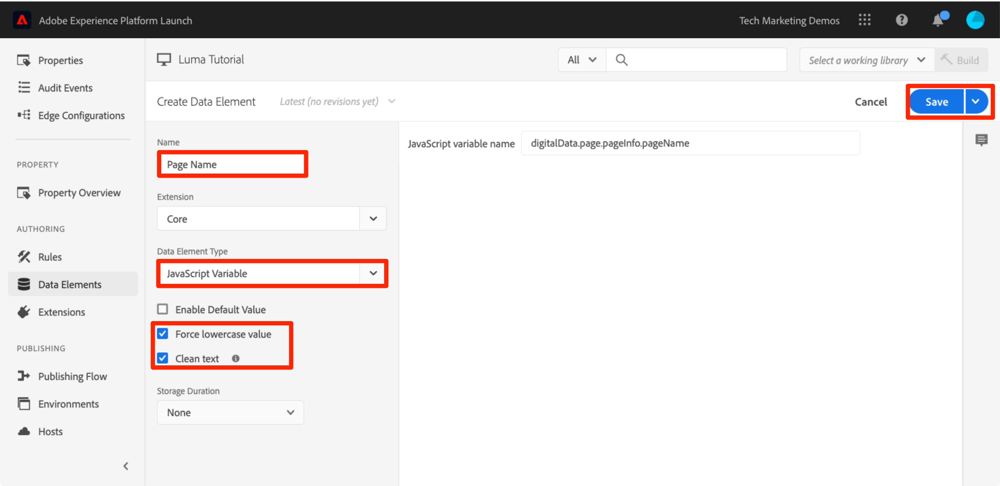
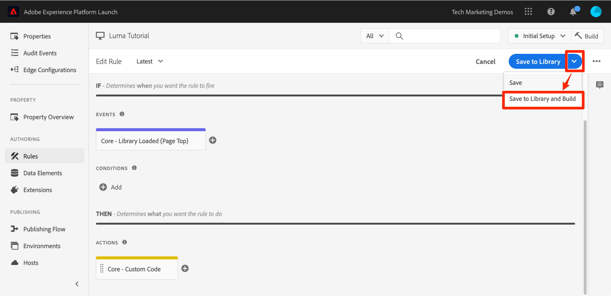

# 添加数据元素、规则和库

在本课程中，您将创建第一个数据元素、规则和库。

数据元素和规则是标记的基本构建块。 数据元素会存储您要发送到营销和广告解决方案的属性，而规则会在适当的条件下触发向这些解决方案发送的请求。库是在页面上加载以用于完成所有工作的 JavaScript 文件。在本课程中，您将使用所有这三项来让示例页面完成一些工作。

>[!NOTE]
>
>Adobe Experience Platform Launch正在作为一套数据收集技术集成到Adobe Experience Platform中。 在使用此内容时，您应该了解的界面中推出了几项术语更改：
>
> * platform launch（客户端）现在为&#x200B;**[[!DNL tags]](https://experienceleague.adobe.com/docs/experience-platform/tags/home.html)**
> * platform launch服务器端现在为&#x200B;**[[!DNL event forwarding]](https://experienceleague.adobe.com/docs/experience-platform/tags/event-forwarding/overview.html)**
> * Edge配置现在为&#x200B;**[[!DNL datastreams]](https://experienceleague.adobe.com/docs/experience-platform/edge/fundamentals/datastreams.html)**

## 学习目标

在本课程结束后，您将能够：

* 创建数据元素
* 创建规则
* 创建库
* 将更改添加到库
* 验证您的库是否正在 Web 浏览器中加载
* 使用“工作库”功能提高工作效率

## 为页面名称创建数据元素

数据元素是数据层的标记版本。 它们可以存储来自您自己的数据层对象、Cookie、本地存储对象、查询字符串参数、页面元素、meta 标记等的值。在本练习中，您将为页面名称创建一个数据元素，稍后您将在 Target 和 Analytics 实施中使用该数据元素。

**创建数据元素**

1. 在左侧导航中，单击&#x200B;**[!UICONTROL 数据元素]**

1. 由于您尚未在此资产中创建任何数据元素，因此会显示一个简短视频，该视频中提供了有关此主题的其他信息。如有需要，请观看此视频。

1. 单击&#x200B;**[!UICONTROL 创建新数据元素]**&#x200B;按钮：

   

1. 命名数据元素，例如 `Page Name`

1. 使用 [!UICONTROL JavaScript Variable] 数据元素类型指向示例页面数据层中的一个值：`digitalData.page.pageInfo.pageName`

1. 选中&#x200B;**[!UICONTROL 强制小写值]**&#x200B;和&#x200B;**[!UICONTROL 清除文本]**&#x200B;复选框，以使大小写标准化，并删除无关空格

1. 将&#x200B;**[!UICONTROL None]**&#x200B;保留为&#x200B;**[!UICONTROL 存储持续时间]**&#x200B;设置，因为该值通常在每个页面上都不相同

1. 单击&#x200B;**[!UICONTROL 保存]**&#x200B;按钮以保存数据元素

   。

>[!NOTE]
>
>可以使用Extensions _扩展数据元素功能_。 例如，ContextHub 扩展允许您使用该扩展的功能添加数据元素。

## 创建规则

接下来，您将以简单的规则使用此数据元素。规则是标记中最强大的功能之一，允许您指定当访客与您的网站交互时应发生的操作。 如果满足您的规则中所列的标准，规则将触发您指定的操作。

您将创建一个用于将 Page Name 数据元素值输出到浏览器控制台的规则。

**创建规则**

1. 在左侧导航中，单击&#x200B;**[!UICONTROL 规则]**

1. 由于您尚未在此资产中创建任何规则，因此会显示一个简短视频，该视频中提供了有关此主题的其他信息。如有需要，请观看此视频。

1. 单击&#x200B;**[!UICONTROL 创建新规则]**&#x200B;按钮：

   

1. 将规则命名为 `All Pages - Library Loaded`。此命名约定指示规则将触发的位置和时间，从而使规则更容易识别和重复使用，因为标记属性会日渐成熟。

1. 在“事件”下，单击&#x200B;**[!UICONTROL 添加]**。 事件可告知标记规则应何时触发，事件有多种类型，包括页面加载、点击、自定义JavaScript事件等。

   

   1. 对于事件类型，选择&#x200B;**[!UICONTROL 已加载库（页面顶部）]**。请注意，在选择事件类型时，标记会使用您的选择预填充事件的名称。 另请注意，事件的默认顺序为 50。在标记中，排序是一项强大的功能；当您的多个规则由同一事件触发时，这项功能可以让您精确控制操作的顺序。 您将在本教程的后面部分使用此功能。

   1. 单击&#x200B;**[!UICONTROL 保留更改]**&#x200B;按钮

   

1. 由于此规则应在所有页面上触发，因此将&#x200B;**[!UICONTROL Conditions]**&#x200B;留空。 如果您打开 Conditions 模式窗口，则会发现条件可以根据各种选项（包括 URL、数据元素值、日期范围等）添加限制条件和排除条件。

1. 在“操作”下，单击&#x200B;**[!UICONTROL 添加]**

1. 选择&#x200B;**[!UICONTROL Action Type > Custom Code]**，此时这是唯一的选项。 稍后在教程中，当您添加扩展时，会有更多的选项可用。

1. 选择&#x200B;**[!UICONTROL &lt;/>打开编辑器]**&#x200B;以打开代码编辑器

   

1. 将以下代码添加到代码编辑器中。此代码会将 Page Name 数据元素的值输出到浏览器控制台，以便您能够确认它在正常工作：

   ```javascript
   console.log('The page name is '+_satellite.getVar('Page Name'));
   ```

1. 保存代码编辑器

   

1. 在操作配置屏幕上，单击&#x200B;**[!UICONTROL 保留更改]**

1. 单击&#x200B;**[!UICONTROL 保存]**&#x200B;以保存规则

在“规则”页面上，您应该会看到新规则：
上

## 将更改保存到库

在数据收集界面中配置一组扩展、数据元素和规则后，您需要将这些功能和逻辑打包到一组JavaScript代码中，之后可在您的网站上部署该代码，以便在访客访问网站时触发营销标记。 库便是执行此操作的一组 JavaScript 代码。

在前面的课程中，您在示例页面上实施了开发环境的嵌入代码。在加载示例页面时，返回了与嵌入代码URL有关的404错误，原因是尚未构建标记库并且未将其分配到环境。 现在，您要将新的数据元素和规则放置到库中，以便示例页面可以执行一些操作。

**添加和构建库**

1. 在左侧导航中，单击&#x200B;**[!UICONTROL 发布流]**

1. 单击&#x200B;**[!UICONTROL 添加新库]**

   

1. 命名库，如`Initial Setup`

1. 选择&#x200B;**[!UICONTROL 环境>开发]**

1. 单击&#x200B;**[!UICONTROL 添加所有更改的资源]**

   

1. 请注意，单击&#x200B;**[!UICONTROL Add All Changed Resources]**&#x200B;标记后，将汇总您刚才所做的更改。

1. 单击&#x200B;**[!UICONTROL 保存并生成以进行开发]**

   

片刻后，状态圆点将变为绿色，这表示库已成功构建。


## 验证您的工作

现在，验证您的规则是否按预期运行。

重新加载示例页面。如果您查看开发人员工具的“网络”选项卡，现在应会看到标记库的200响应！


如果您查看开发人员工具的“控制台”，则应当看到文本“The page name is home”


恭喜，您已创建第一个数据元素和规则，并构建了第一个标记库！

## 使用工作库功能

在标记中进行多项更改时，如果每次想要查看结果都必须打开Publishing选项卡、添加更改并构建库，这样会很麻烦。  现在，您已创建“Initial Setup”库，接下来可以使用“工作库”功能快速保存所做的更改并重新构建库，所有这些操作只需一步即可完成。

对“All Pages - Library Loaded”规则进行小幅更改。在左侧导航中，单击&#x200B;**[!UICONTROL 规则]**，然后单击`All Pages - Library Loaded`规则以将其打开。


在`Edit Rule`页面上，单击&#x200B;***[!UICONTROL 工作库]***&#x200B;下拉列表，然后选择您的`Initial Setup`库。


选择库后，您应该会看到&#x200B;**[!UICONTROL 保存]**&#x200B;按钮现在默认为&#x200B;**[!UICONTROL 保存到库]**。 在标记中进行更改时，您可以使用此选项自动将所做的更改直接添加到工作库中和/或重建该库。

我们来测试一下。打开您的 Custom Code 操作并在文本“The page name is”后面添加一个冒号，以使整个代码块如下所示：

```javascript
console.log('The page name is: '+_satellite.getVar('Page Name'));
```

保存代码，保留操作中的更改，现在单击&#x200B;**[!UICONTROL Save to Library and Build]**&#x200B;按钮。



等待片刻，直到 [!UICONTROL Working Library] 下拉菜单旁重新显示绿色圆点。现在，重新加载示例页面，您应当看到控制台消息中反映了所做的更改（您可能需要清除浏览器缓存并重新加载，才能看到对页面所做的更改）：


这是一种更快的工作方式，您将在本教程的其余部分使用此方法。

[下一课程“使用Experience Cloud Debugger切换环境”>](switch-environments.md)
