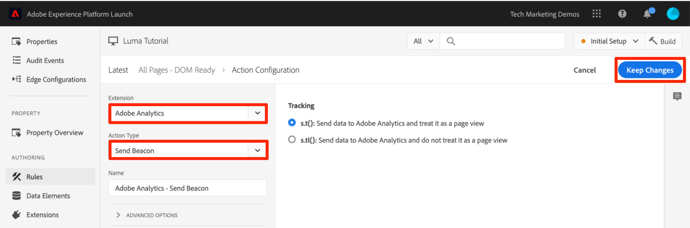
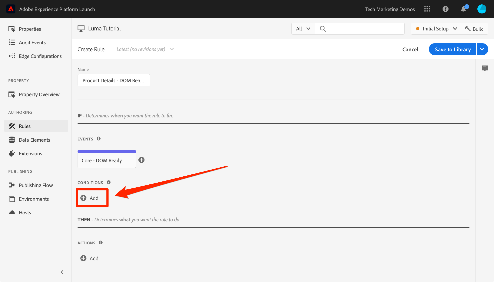
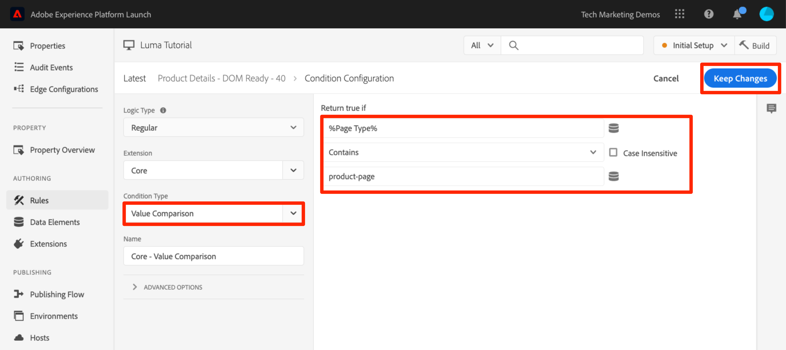
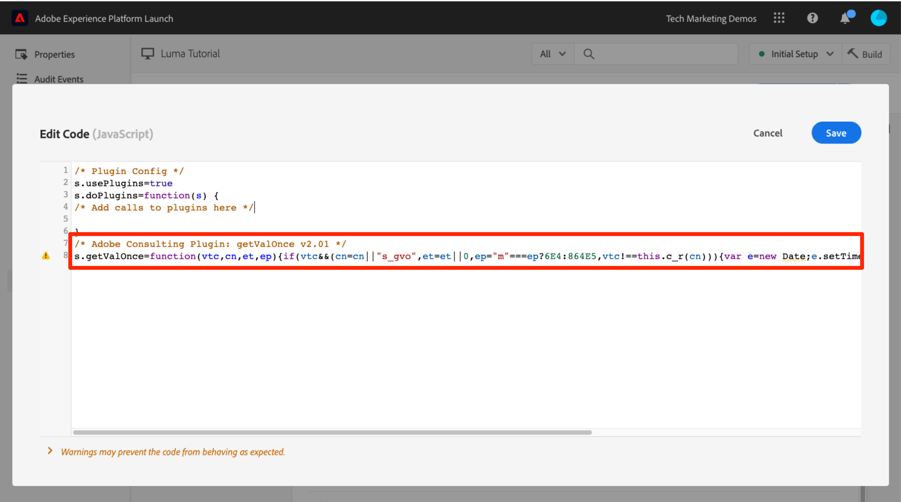

# 添加 Adobe Analytics

在本课程中，您将实施 [Adobe Analytics 扩展](https://experienceleague.adobe.com/docs/experience-platform/tags/extensions/adobe/analytics/overview.html?lang=zh-Hans)，并创建相应规则以将数据发送到 Adobe Analytics。


>[!WARNING]
>
> 本教程中使用的Luma网站预计将在2026年2月16日这一周内被替换。 作为本教程的一部分完成的工作可能不适用于新网站。

[Adobe Analytics](https://experienceleague.adobe.com/docs/analytics.html?lang=zh-Hans) 是一款行业领先的解决方案，可帮助您充分了解客户的行为和需求，并根据客户情报掌控自己的业务发展方向。

>[!NOTE]
>
>Adobe Experience Platform Launch正在作为一套数据收集技术集成到Adobe Experience Platform中。 在使用此内容时，您应该了解的界面中推出了几项术语更改：
>
> * Platform Launch（客户端）现在为&#x200B;**[[!DNL tags]](https://experienceleague.adobe.com/docs/experience-platform/tags/home.html?lang=zh-Hans)**
> * Platform Launch服务器端现在为&#x200B;**[[!DNL event forwarding]](https://experienceleague.adobe.com/docs/experience-platform/tags/event-forwarding/overview.html?lang=zh-Hans)**
> * Edge配置现在为&#x200B;**[[!DNL datastreams]](https://experienceleague.adobe.com/docs/experience-platform/edge/fundamentals/datastreams.html?lang=zh-Hans)**

## 学习目标

在本课程结束后，您将能够：

1. 添加 Adobe Analytics 扩展
1. 使用该扩展设置全局变量
1. 添加页面查看信标
1. 使用规则添加其他变量
1. 添加“点击跟踪”信标和其他基于事件的信标
1. 添加 Analytics 插件

在标记中，可以对Analytics实施多项操作。 本课程的内容虽不详尽，但应当仍可以让您充分了解在自己的网站中实施 Analytics 所需的各项主要技术。

## 先决条件

您应该已经完成[配置标记](create-a-property.md)和[添加Identity服务](id-service.md)中的课程。

此外，您还至少需要一个报表包 ID 和跟踪服务器。如果您没有可在本教程中使用的测试/开发报表包，请创建一个。如果不确定如何执行此操作，请参阅[此文档](https://experienceleague.adobe.com/zh-hans/docs/analytics/admin/admin-tools/manage-report-suites/c-new-report-suite/t-create-a-report-suite)。您可以从当前实施中检索跟踪服务器，或者向 Adobe 顾问或客户关怀代表索取。

## 添加 Analytics 扩展

Analytics 扩展包含两个主要部分：

1. 扩展配置，用于管理核心 AppMeasurement.js 库设置并可设置全局变量
1. 规则操作，用于执行以下操作：
   1. 设置变量
   1. 清除变量
   1. 发送 Analytics 信标

**添加 Analytics 扩展**

1. 转到&#x200B;**[!UICONTROL 扩展>目录]**
1. 找到 Adobe Analytics 扩展
1. 单击&#x200B;**[!UICONTROL 安装]**

   

1. 在[!UICONTROL Library Management > Report Suites]下，输入要用于每个标记环境的报表包ID。 如果您的用户有权访问Adobe Analytics，请注意，开始在框中键入内容时，您将看到一个已预填充您的所有报表包的列表。 （在本教程中，您可以为所有环境使用一个报告包，但在现实工作中，您会希望为不同的环境使用不同的报告包，如下图所示）

   

   >[!TIP]
   >
   >我们建议使用[!UICONTROL 为我管理库]选项作为[!UICONTROL 库管理]设置，因为这样可以更轻松地使`AppMeasurement.js`库保持为最新。

1. 在[!UICONTROL 常规>跟踪服务器]下，输入您的跟踪服务器，例如`tmd.sc.omtrdc.net`。 如果您的网站支持 `https://`，请输入 SSL 跟踪服务器

   

1. 在[!UICONTROL 全局变量部分]的[!UICONTROL 其他设置]下，使用您的[!UICONTROL 数据元素设置]页面名称`Page Name`变量。 单击  图标以打开模式窗口，然后选择页面 `Page Name` 数据元素

1. 单击&#x200B;**[!UICONTROL 保存到库]**

   

>[!NOTE]
>
>全局变量可以在扩展配置或规则操作中进行设置。 请注意，在扩展配置中设置变量时，必须&#x200B;*在*&#x200B;标记嵌入代码之前定义数据层。

## 发送页面查看信标

现在，您将创建一个规则以触发 Analytics 信标，进而发送在扩展配置中设置的 [!UICONTROL Page Name] 变量。

您已在本教程的[添加数据元素、规则和库](add-data-elements-rules.md)课程中创建“All Pages - Library Loaded”规则，该规则将在加载标记库时在每个页面上触发。 您&#x200B;*也可以*&#x200B;将此规则用于Analytics，但此设置要求先定义Analytics信标中使用的所有数据层属性，然后再定义标记嵌入代码。 为增加数据收集的灵活性，您将新建一个在 DOM 就绪时触发的“所有页面”规则，以触发 Analytics 信标。

**发送页面查看信标**

1. 转到左侧导航中的&#x200B;**[!UICONTROL 规则]**&#x200B;部分，然后单击&#x200B;**[!UICONTROL 添加规则]**

   

1. 将规则命名为 `All Pages - DOM Ready`
1. 单击&#x200B;**[!UICONTROL 事件>添加]**&#x200B;以打开`Event Configuration`屏幕

   

1. 选择&#x200B;**[!UICONTROL Event Type > DOM Ready]**（请注意，该规则的顺序为“50”）
1. 单击&#x200B;**[!UICONTROL 保留更改]**
   

1. 在 Actions 下，单击  以添加新操作

   

1. 选择&#x200B;**[!UICONTROL 扩展> Adobe Analytics]**

1. 选择&#x200B;**[!UICONTROL 操作类型>发送信标]**

1. 将 Tracking 保留设置为 `s.t()`。请注意，如果您想要在点击事件规则中发起 `s.tl()` 调用，则也可以使用 Send Beacon 操作来实现这一点。

1. 单击&#x200B;**[!UICONTROL 保留更改]**&#x200B;按钮

   

1. 单击&#x200B;**[!UICONTROL 保存到库并生成]**

   

### 验证页面查看信标

现在，您已创建用于发送 Analytics 信标的规则，接下来应该能够在 Experience Cloud Debugger 中看到相应请求。

1. 在 Chrome 浏览器中打开 [Luma 网站](https://luma.enablementadobe.com/content/luma/us/en.html)
1. 单击Debugger图标以打开&#x200B;**[!UICONTROL Adobe Experience Cloud Debugger]**
1. 如&#x200B;*前面的课程*&#x200B;中所述，确保Debugger将标记属性映射到[您的](switch-environments.md)开发环境

   

1. 单击以打开 Analytics 选项卡
1. 展开您的报表包名称以显示针对该报表包发出的所有请求
1. 确认使用 Page Name 变量和值触发了相应请求

   

>[!NOTE]
>
>如果未显示页面名称，请回溯本页面中的各个步骤，以确保未遗漏任何内容。

## 使用规则添加变量

配置 Analytics 扩展后，您便在扩展配置中填充了 `pageName` 变量。如果在加载标记嵌入代码之前页面上就有可用的值，那么也可以在扩展配置中填充其他全局变量，如eVar和prop。

要更加灵活地设置变量和事件，可以通过在规则中使用 `Set Variables` 操作来实现。使用规则，您可以在不同的条件下设置不同的 Analytics 变量和事件。例如，之前，您只能在产品详细信息页面上设置 `prodView` 事件，且只能在订单确认页面上设置 `purchase` 事件。此部分将向您讲授如何使用规则设置变量。

### 用例

产品详细信息页面 (PDP) 是零售网站上的重要数据收集点。一般情况下，您会希望 Analytics 记录发生的产品查看事件以及查看的产品。这有助于您了解哪些产品在客户中受欢迎。在媒体网站上，文章或视频页面也可以使用类似于您在此部分所使用的跟踪技术。加载产品详细信息页面时，您可能希望将该值放入“页面类型”`eVar` 中，并设置一些事件和产品 ID。这使我们能够在分析中了解以下信息：

1. 产品详细信息页面的加载次数是多少
1. 查看了哪些特定产品以及查看次数是多少
1. 其他因素（促销活动、搜索等）如何影响 PDP 的用户加载量

### 为页面类型创建数据元素

首先，您需要确定哪些页面属于产品详细信息页面。您可以使用数据元素来执行该操作。

**为页面类型创建数据元素**

1. 在左侧导航中单击&#x200B;**[!UICONTROL 数据元素]**
1. 单击&#x200B;**[!UICONTROL 添加数据元素]**

   

1. 将数据元素命名为 `Page Type`
1. 选择&#x200B;**[!UICONTROL 数据元素类型> JavaScript变量]**
1. 使用`digitalData.page.category.type`作为&#x200B;**[!UICONTROL JavaScript变量名称]**
1. 检查&#x200B;**[!UICONTROL 清除文本]**&#x200B;和&#x200B;**[!UICONTROL 强制小写]**&#x200B;选项
1. 单击&#x200B;**[!UICONTROL 保存到库]**

   

### 为产品 ID 创建数据元素

接下来，您将使用数据元素收集当前产品详细信息页面中的产品 ID

**为产品 ID 创建数据元素**

1. 在左侧导航中单击&#x200B;**[!UICONTROL 数据元素]**
1. 单击&#x200B;**[!UICONTROL 添加数据元素]**

   

1. 将数据元素命名为 `Product Id`
1. 选择&#x200B;**[!UICONTROL 数据元素类型> JavaScript变量]**
1. 使用`digitalData.product.0.productInfo.sku`作为&#x200B;**[!UICONTROL JavaScript变量名称]**
1. 检查&#x200B;**[!UICONTROL 清除文本]**&#x200B;和&#x200B;**[!UICONTROL 强制小写]**&#x200B;选项
1. 单击&#x200B;**[!UICONTROL 保存到库]**

   

### 添加 Adobe Analytics Product String 扩展

如果您已经熟悉 Adobe Analytics 实施，则可能也熟悉[产品变量](https://experienceleague.adobe.com/docs/analytics/implementation/vars/page-vars/products.html?lang=zh-Hans)。产品变量具有非常具体的语法，而且其使用方式会因上下文而略有不同。为帮助在标记中更轻松地填充产品变量，已在标记扩展市场中创建了三个其他扩展！ 在此部分中，您将添加一个由 Adobe 咨询团队创建的扩展，以将其用在产品详细信息页面中。

**添加 `Adobe Analytics Product String` 扩展**

1. 转到 [!UICONTROL Extensions > Catalog] 页面
1. 找到由Adobe Consulting服务创建的`Adobe Analytics Product String`扩展，然后单击&#x200B;**[!UICONTROL 安装]**
   
1. 花些时间阅读相关说明
1. 单击&#x200B;**[!UICONTROL 保存到库]**

   

### 为产品详细信息页面创建规则

现在，您将使用新的数据元素和扩展来构建产品详细信息页面规则。对于此功能，您将再创建一个在 DOM 就绪时触发的页面加载规则。但是，您将使用相应条件以便该规则只在产品详细信息页面上触发，并设置顺序以便该规则在用于发送信标的规则“之前”触发。__

**构建产品详细信息页面规则**

1. 转到左侧导航中的&#x200B;**[!UICONTROL 规则]**&#x200B;部分，然后单击&#x200B;**[!UICONTROL 添加规则]**

   

1. 将规则命名为 `Product Details - DOM Ready - 40`
1. 单击&#x200B;**[!UICONTROL 事件>添加]**&#x200B;以打开`Event Configuration`屏幕

   

1. 选择&#x200B;**[!UICONTROL 事件类型> DOM就绪]**
1. 将&#x200B;**[!UICONTROL Order]**&#x200B;设置为40，以便该规则在&#x200B;*包含Analytics > Send Beacon操作的规则之前*&#x200B;运行
1. 单击&#x200B;**[!UICONTROL 保留更改]**
   

1. 在&#x200B;**[!UICONTROL 条件]**&#x200B;下，单击以打开`Condition Configuration`屏幕
   

   1. 选择&#x200B;**[!UICONTROL 条件类型>值比较]**
   1. 使用数据元素选取器，在第一个字段中选择 `Page Type`
   1. 从比较运算符下拉列表中选择&#x200B;**[!UICONTROL Contains]**
   1. 在下一个字段中键入 `product-page`（这是从 PDP 上的数据层提取的页面类型值的独特部分）
   1. 单击&#x200B;**[!UICONTROL 保留更改]**

      

1. 在 Actions 下，单击  以添加新操作

   

1. 选择&#x200B;**[!UICONTROL 扩展> Adobe Analytics Product String]**
1. 选择&#x200B;**[!UICONTROL 操作类型>设置s.products]**

1. 在&#x200B;**[!UICONTROL Analytics电子商务事件]**&#x200B;部分中，选择&#x200B;**[!UICONTROL prodView]**

1. 在&#x200B;**[!UICONTROL 产品数据的数据层变量]**&#x200B;节中，使用数据元素选取器选择`Product Id`数据元素

1. 单击&#x200B;**[!UICONTROL 保留更改]**

   


1. 在 Actions 下，单击  以添加新操作

   

1. 选择&#x200B;**[!UICONTROL 扩展> Adobe Analytics]**
1. 选择&#x200B;**[!UICONTROL 操作类型>设置变量]**
1. 选择&#x200B;**[!UICONTROL eVar1 >设置为]**&#x200B;并输入`product detail page`
1. 设置&#x200B;**[!UICONTROL event1]**，并将可选值留空
1. 在“事件”下，单击&#x200B;**[!UICONTROL 添加其他]**&#x200B;按钮
1. 设置&#x200B;**[!UICONTROL prodView]**&#x200B;事件，并将可选值留空
1. 单击&#x200B;**[!UICONTROL 保留更改]**

   

1. 单击&#x200B;**[!UICONTROL 保存到库并生成]**

   

### 验证产品详细信息页面数据

您刚刚创建了一个规则，该规则会在发送信标之前设置变量。现在，您应该能够在 Experience Cloud Debugger 中查看在点击中传出的新数据。

**验证产品详细信息页面数据**

1. 在 Chrome 浏览器中打开 [Luma 网站](https://luma.enablementadobe.com/content/luma/us/en.html)
1. 导航到任意产品详细信息页面
1. 单击Debugger图标以打开&#x200B;**[!UICONTROL Adobe Experience Cloud Debugger]**
1. 单击 Analytics 选项卡
1. 展开您的报表包
1. 请注意当前位于 Debugger 中的产品详细信息变量，即：`eVar1` 已设置为“product detail page”，`Events` 变量已设置为“event1”和“prodView”，Products 变量已设置为您正在查看的产品的产品 ID，并且 Page Name 仍由 Analytics 扩展进行设置

   

## 发送跟踪链接信标

页面加载时，通常会触发由 `s.t()` 函数触发的页面加载信标。这会自动递增在 `pageName` 变量中列出的页面的 `page view` 量度。

但是，有时候您不希望递增网站上的页面查看次数，因为正在执行的操作“不足以”计为一次页面查看，或者可能根本不属于页面查看。在这种情况下，将使用 `s.tl()` 函数，该函数通常称为“跟踪链接”请求。虽然它称为跟踪链接请求，但不需要在单击链接时触发。该请求可以由标记规则生成器中可用的&#x200B;*任意*&#x200B;事件触发，包括您自己的自定义JavaScript。

在本教程中，您将使用最酷的 JavaScript 事件之一（`Enters Viewport` 事件）来触发 `s.tl()` 调用。

### 用例

对于此用例，您希望了解用户是否在Luma主页上向下滚动到足够远的位置，以查看我们页面的&#x200B;*特色产品*&#x200B;部分。 我们公司内部对于用户是否查看了该部分存在一些分歧，因此您希望使用 Analytics 查明真相。

### 在标记中创建规则

1. 转到左侧导航中的&#x200B;**[!UICONTROL 规则]**&#x200B;部分，然后单击&#x200B;**[!UICONTROL 添加规则]**
   
1. 将规则命名为 `Homepage - Featured Products enters Viewport`
1. 单击&#x200B;**[!UICONTROL 事件>添加]**&#x200B;以打开`Event Configuration`屏幕

   

1. 选择&#x200B;**[!UICONTROL Event Type > Enters Viewport]**。 此时将显示一个字段，您需要在其中输入 CSS 选择器，该选择器将标识页面上应在进入浏览器视区时触发此规则的项目。
1. 返回到Luma主页，然后向下滚动到精选产品部分。
1. 右键单击“精选产品”标题与此部分所含项目之间的空白处，然后从右键单击菜单中选择`Inspect`。 这会将您引导至目标位置附近。
1. 在目标位置附近，可能就在选定部分正下方，您需要查找包含 `class="we-productgrid aem-GridColumn aem-GridColumn--default--12"` 的 div。找到该元素。
1. 右键单击此元素，然后选择&#x200B;**[!UICONTROL 复制>复制选择器]**

   

1. 返回标记，并将此值从剪贴板粘贴到标记为`Elements matching the CSS selector`的字段中。
   1. 有一点要注意，如何标识 CSS 选择器将由您来决定。此方法存在一些缺陷，因为页面上的某些更改可能会破坏此选择器。在标记中使用任何CSS选择器时，请考虑这一点。
1. 单击&#x200B;**[!UICONTROL 保留更改]**
   

1. 在 Conditions 下，单击  以添加新条件
1. 选择&#x200B;**[!UICONTROL 条件类型>值比较]**
1. 使用数据元素选取器，在第一个字段中选择 `Page Name`
1. 从比较运算符下拉列表中选择&#x200B;**[!UICONTROL 等于]**
1. 在下一个字段中键入 `content:luma:us:en`（这是从数据层提取的主页的页面名称 - 我们只希望此规则在主页上运行）
1. 单击&#x200B;**[!UICONTROL 保留更改]**

   

1. 在 Actions 下，单击  以添加新操作
1. 选择&#x200B;**[!UICONTROL 扩展> Adobe Analytics]**
1. 选择&#x200B;**[!UICONTROL 操作类型>设置变量]**
1. 将 `eVar3` 设置为 `Home Page - Featured Products`
1. 将 `prop3` 设置为 `Home Page - Featured Products`
1. 将 `Events` 变量设置为 `event3`
1. 单击&#x200B;**[!UICONTROL 保留更改]**

   

1. 在 Actions 下，单击  以添加其他新操作

1. 选择&#x200B;**[!UICONTROL 扩展> Adobe Analytics]**
1. 选择&#x200B;**[!UICONTROL 操作类型>发送信标]**
1. 选择&#x200B;**[!UICONTROL `s.tl()`]**&#x200B;跟踪选项
1. 在&#x200B;**[!UICONTROL 链接名称]**&#x200B;字段中，输入`Scrolled down to Featured Products`。 此值将放入 Analytics 的“自定义链接”报表中。
1. 单击&#x200B;**[!UICONTROL 保留更改]**

   

1. 单击&#x200B;**[!UICONTROL 保存到库并生成]**

   

### 验证跟踪链接信标

现在，您将需要确保在向下滚动到我们网站主页的“精选产品”部分时会计入此点击。 第一次加载主页时，不应发起该请求，但在向下滚动直至 New Arrivals 部分可见后，该点击应触发我们的新值。

1. 在 Chrome 浏览器中打开 [Luma 网站](https://luma.enablementadobe.com/content/luma/us/en.html)，并确保您位于主页顶部。
1. 单击&#x200B;**[!UICONTROL 调试器图标]** 以打开[!UICONTROL Adobe Experience Cloud Debugger]
1. 单击 Analytics 选项卡
1. 展开您的报表包点击
1. 请注意主页的常规页面查看点击中的页面名称等（但 eVar3 或 prop3 中没有任何内容）。

   

1. 保持Debugger处于打开状态，在您的网站上向下滚动，直至看到“精选产品”部分
1. 再次查看 Debugger，此时应该出现另一次 Analytics 点击。此点击应具有与您设置的 s.tl() 点击相关联的参数，即：
   1. `LinkType = "link_o"`（这表示此点击是自定义链接点击，而不是页面查看点击）
   1. `LinkName = "Scrolled down to Featured Products"`
   1. `prop3 = "Home Page - Featured Products"`
   1. `eVar3 = "Home Page - Featured Products"`
   1. `Events = "event3"`

      

## 添加插件

插件是一段 JavaScript 代码，您可以将该代码添加到实施中以执行未内置到产品中的特定功能。插件既可以由您自行构建，也可以由其他 Adobe 客户/合作伙伴或 Adobe 咨询团队构建。

要实施插件，基本上有三个步骤：

1. 包含将引用插件的 doPlugins 函数
1. 添加插件的主函数代码
1. 包含用于调用函数、设置变量和执行其他操作的代码

### 使 Analytics 对象可全局访问

如果您将要添加 doPlugins 函数（如下所示）并使用插件，则需要选中用于使 Analytics“s”对象在 Analytics 实施中全局可用的复选框。

1. 转到&#x200B;**[!UICONTROL 扩展>已安装]**

1. 在Adobe Analytics扩展中，单击&#x200B;**[!UICONTROL 配置]**

   

1. 在&#x200B;**[!UICONTROL 库管理]**&#x200B;下，选中标记为`Make tracker globally accessible`的框。 正如您在帮助气泡中所看到的，选中该复选框将导致跟踪器在 window.s 下的范围设置为全局，如果您希望在客户 JavaScript 中引用它，则务必要这样做。
   

### 包含 doPlugins 函数

要添加插件，您需要添加一个名为 doPlugins 的函数。默认情况下不会添加此函数，但添加后，此函数会由 AppMeasurement 库处理，并在将点击发送到 Adobe Analytics 时最后调用。因此，您可以使用此函数运行某个 JavaScript，以设置更容易通过此方式进行设置的变量。

1. 保持处于 Analytics 扩展中，同时向下滚动到名为 `Configure Tracker Using Custom Code.` 的部分，并展开此部分
1. 单击&#x200B;**[!UICONTROL 打开编辑器]**
1. 将以下代码粘贴到代码编辑器中：

   ```javascript
   /* Plugin Config */
   s.usePlugins=true
   s.doPlugins=function(s) {
   /* Add calls to plugins here */
   }
   ```

1. 保持此窗口处于打开状态，以便执行下一个步骤

### 为插件添加函数代码

实际上，您将在此代码中调用两个插件，但其中一个插件内置于 AppMeasurement 库中，因此您无需添加该插件的调用函数。但是，对于另外一个插件，您还需要添加函数代码。此函数名为 getValOnce()。

### getValOnce() 插件

此插件的用途是：当访客刷新页面或使用浏览器的返回按钮返回到在其中设置了值的页面时，防止错误地在代码中重复显示该值。在本课程中，您将使用该插件来防止重复显示 `clickthrough` 事件。

此插件的代码可在 [Analytics 文档](https://experienceleague.adobe.com/docs/analytics/implementation/vars/plugins/getvalonce.html?lang=zh-Hans)中找到，但我们仍在此处提供，方便您复制/粘贴。

1. 复制以下代码

   ```javascript
   /* Adobe Consulting Plugin: getValOnce v2.01 */
   s.getValOnce=function(vtc,cn,et,ep){if(vtc&&(cn=cn||"s_gvo",et=et||0,ep="m"===ep?6E4:864E5,vtc!==this.c_r(cn))){var e=new Date;e.setTime(e.getTime()+et*ep);this.c_w(cn,vtc,0===et?0:e);return vtc}return""};
   ```

1. 将该代码粘贴到 Analytics 扩展的代码窗口中（如果尚未打开该窗口，请按照上一步骤重新将其打开），注意要完全粘贴到 doPlugins 函数的&#x200B;**下方**（而不是其内部）。

   

此时您可以从 doPlugins 中调用此插件。

### 从 doPlugins 中调用插件

现在，代码已放置到位且可供引用，接下来您可以在 doPlugins 函数中调用插件。

首先，调用已纳入 AppMeasurement 库中的插件，此插件称为“实用程序”。此插件名为 `s.Util.getQueryParam`，这是因为此插件是 s 对象的一部分，属于内置实用程序，且将从 URL 中的查询字符串（基于参数）获取值。

1. 复制以下代码：

   ```javascript
   s.campaign = s.Util.getQueryParam("cid");
   ```

1. 将该代码粘贴到 doPlugins 函数中。这将会在当前页面 URL 中查找名为 `cid` 的参数，并将其放置到 s.campaign 变量中。
1. 现在，复制以下代码并将其粘贴到 getQueryParam 调用的正下方，从而调用 getValOnce 函数：

   ```javascript
   s.campaign=s.getValOnce(s.campaign,'s_cmp',30);
   ```

   此代码将确保 30 天内不会连续多次发送同一值（请参阅相应文档，以了解根据您的需求自定义此代码的方法）。

   

1. 保存代码窗口
1. 单击&#x200B;**[!UICONTROL 保存到库并生成]**

   

### 验证插件

现在，您可以确保插件可正常运行。

**验证插件**

1. 在 Chrome 浏览器中打开 [Luma 网站](https://luma.enablementadobe.com/content/luma/us/en.html)
1. 单击Debugger图标以打开&#x200B;**[!UICONTROL Adobe Experience Cloud Debugger]**
1. 单击 Analytics 选项卡
1. 展开您的报表包
1. 请注意，Analytics 点击中没有 Campaign 变量
1. 保持 Debugger 处于打开状态，返回到 Luma 网站并在 URL 中添加 `?cid=1234`，然后按 Enter，以使用所包含的查询字符串刷新页面

   

1. 查看 Debugger，并确认存在第二个 Analytics 请求，且该请求中的 Campaign 变量设置为 `1234`

   

1. 再次返回并刷新 Luma 页面，同时仍将查询字符串保留在 URL 中
1. 在 Debugger 中查看下一次点击，该点击中应该&#x200B;**不**&#x200B;存在 Campaign 变量，因为 getValOnce 插件已确保不会重复显示该变量，从而不会看起来像有其他用户通过促销活动跟踪代码进入页面一样。

   

1. 附加练习：您可以通过更改查询字符串中 `cid` 参数的值，来反复执行测试。仅当您是&#x200B;**首次**&#x200B;使用此值运行该页面时，Campaign 变量才应存在。如果您未在 Debugger 中看到 Campaign 值，只需在 URL 的查询字符串中更改 `cid` 的值，然后按 Enter，便应会在 Debugger 中再次看到该值。

   >[!NOTE]
   >
   >实际上，还有一些在URL的查询字符串外部获取参数的不同方式，包括在Analytics扩展配置中获取参数。 但是，若使用这些其他非插件选项，将无法像在此处使用 getValOnce 插件那样防止不必要的重复。这里介绍的是作者最喜欢采用的方法，您应该根据需要确定最适合自己的方法。

做得不错！您已完成 Analytics 课程。当然，您还可以执行许多其他操作来增强Analytics实施，但希望通过上述练习，您已掌握一些核心技能来解决您的其他需求。

[下一课程“添加Adobe Audience Manager”>](audience-manager.md)
