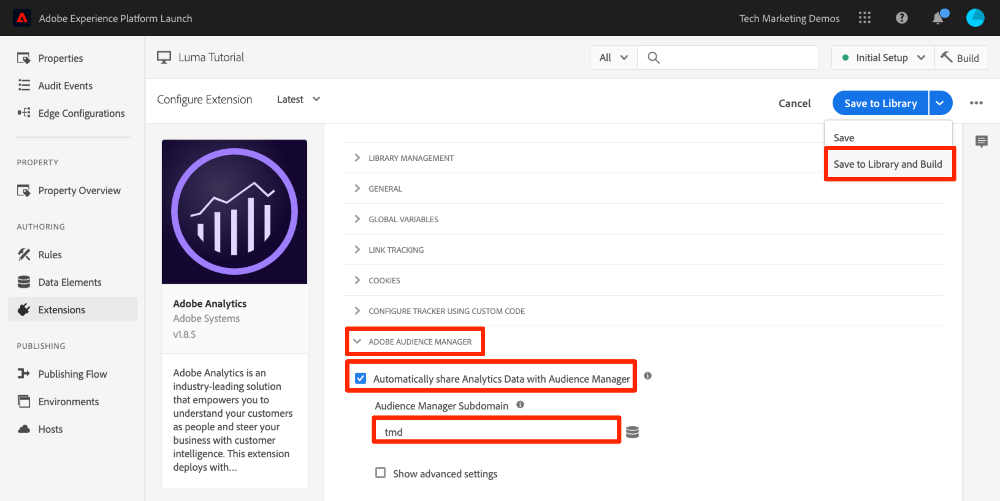

# 添加 Adobe Audience Manager

本课程将指导您完成使用服务器端转发启用 Adobe Audience Manager 的步骤。

[Adobe Audience Manager](https://experienceleague.adobe.com/docs/audience-manager/user-guide/aam-home.html) (AAM) 提供了行业领先的在线受众数据管理服务，为数字广告商和出版商提供了控制和利用其数据资产所需的工具，进而助力取得销售成功。

>[!NOTE]
>
>Adobe Experience Platform Launch正在作为一套数据收集技术集成到Adobe Experience Platform中。 在使用此内容时，您应该了解的界面中推出了几项术语更改：
>
> * platform launch（客户端）现在为&#x200B;**[[!DNL tags]](https://experienceleague.adobe.com/docs/experience-platform/tags/home.html)**
> * platform launch服务器端现在为&#x200B;**[[!DNL event forwarding]](https://experienceleague.adobe.com/docs/experience-platform/tags/event-forwarding/overview.html)**
> * Edge配置现在为&#x200B;**[[!DNL datastreams]](https://experienceleague.adobe.com/docs/experience-platform/edge/fundamentals/datastreams.html)**

## 学习目标

在本课程结束后，您将能够：

1. 阐述在网站中实施 Audience Manager 的两种主要方法
1. 使用 Analytics 信标的服务器端转发功能添加 Audience Manager
1. 验证 Audience Manager 实施

## 先决条件

要完成本课程，您将需要：

1. 已完成[配置标记](create-a-property.md)、[添加Adobe Analytics](analytics.md)和[添加Identity Service](id-service.md)中的课程。

1. 拥有 Adobe Analytics 的管理员访问权限，以便能够为将在本教程中使用的报表包启用服务器端转发。或者，也可以按照下面的说明，请求贵组织的现有管理员为您执行此操作。

1. 知晓您的“Audience Manager 子域”（也称为“合作伙伴名称”、“合作伙伴 ID”或“合作伙伴子域”）。如果您已在实际的网站上实施 Audience Manager，则获取该子域的最简单方式是转到实际的网站，然后打开 Debugger。该子域位于“摘要”选项卡的 Audience Manager 部分：

   

如果您尚未实施 Audience Manager，请按照[获取 Audience Manager 子域](https://experienceleague.adobe.com/docs/audience-manager-learn/tutorials/web-implementation/how-to-identify-your-partner-id-or-subdomain.html)中提供的说明进行操作。

## 实施选项

在网站中实施 Audience Manager 的方法有两种：

* **服务器端转发 (SSF)** — 对于具有 Adobe Analytics 的客户来说，这是最简单、也是推荐的实施方法。Adobe Analytics 会将数据转发到位于 Adobe 后端的 AAM，从而允许页面上减少一次请求。此外，这种方法还支持重要的集成功能，并符合 Audience Manager 代码实施和部署的最佳实践。

* **客户端 DIL** — 这种方法适用于没有 Adobe Analytics 的客户。DIL 代码（数据集成库代码，AAM JavaScript 配置代码）会将数据直接从网页发送到 Audience Manager。

由于您在本教程中已经部署了 Adobe Analytics，因此您将使用服务器端转发来部署 Audience Manager。有关服务器端转发的完整说明和要求列表，请参阅[此文档](https://experienceleague.adobe.com/docs/analytics/admin/admin-tools/server-side-forwarding/ssf.html?lang=zh-Hans)，以便您可以了解服务器端转发的工作方式、要求和验证方法。

## 启用服务器端转发

实施 SSF 有两个主要步骤：

1. 在 Analytics Admin Console 中打开用于“按报表包”**&#x200B;将数据从 Analytics 转发到 Audience Manager 的“选项开关”。
1. 将代码放置到适当位置，这是通过标记完成的。 为了使其正常工作，您需要安装 Adobe Experience Platform Identity Service 扩展以及 Analytics 扩展（实际上，您“不”**&#x200B;需要 AAM 扩展，理由如下所述)。

### 在 Analytics Admin Console 中启用服务器端转发

需要在 Adobe Analytics Admin Console 中进行配置，才能开始将数据从 Adobe Analytics 转发到 Adobe Audience Manager。由于最长可能需要四个小时才能开始转发数据，因此您应该先执行此步骤。

#### 在 Analytics Admin Console 中启用 SSF

1. 通过 Experience Cloud UI 登录 Analytics。如果您没有 Analytics 的管理员访问权限，则需要联系 Experience Cloud 或 Analytics 管理员，以便向您分配访问权限或为您完成这些步骤。

   

1. 在Analytics的顶部导航中，选择&#x200B;**[!UICONTROL 管理员>报表包]**，然后从列表中选择（或多选）要转发到Audience Manager的报表包。

   

1. 从“报表包”屏幕中选择报表包，然后选择&#x200B;**[!UICONTROL 编辑设置>常规>服务器端转发]**。

   

   >[!WARNING]
   >
   >如上所述，您需要具有管理员权限才能查看此菜单项。

1. 在“服务器端转发”页面上，阅读相应信息并选中&#x200B;**[!UICONTROL 为报表包启用服务器端转发]**&#x200B;框。

1. 单击&#x200B;**[!UICONTROL 保存]**

   

>[!NOTE]
>
>由于需要按报表包启用SSF，因此，当您在实际网站的报表包中部署SSF时，请不要忘记为每个实际的报表包重复此步骤。
>
>此外，如果 SSF 选项为灰色，您需要将报表包映射到 Experience Cloud 组织，才能启用此选项。[此文档](https://experienceleague.adobe.com/docs/analytics/admin/data-governance/gdpr-view-settings.html)对此进行了说明。

完成此步骤后，如果您启用了 Adobe Experience Platform Identity Service，则数据将从 Analytics 转发到 AAM。但是，要完成此过程，以便响应从AAM正常返回到页面(并通过Audience Analytics功能返回到Analytics)，您还必须在标记中完成以下步骤。 别担心，这超级简单。

### 在标记中启用服务器端转发

这是启用 SSF 的两个步骤中的第二个步骤。您已在AnalyticsAdmin Console中打开相应选项开关，现在只需添加代码，如果您选中了正确的复选框，那么这些标记将为您发挥作用。

>[!NOTE]
>
>为实施Analytics数据到AAM的服务器端转发，我们实际上将在标记中编辑/配置Analytics扩展，**而不是** AAM扩展。 AAM 扩展专门用于客户端 DIL 实施，适用于没有 Adobe Analytics 的用户。因此，当以下步骤引导您转到 Analytics 扩展进行设置时，这些步骤是正确的。

#### 在标记中启用SSF

1. 转到&#x200B;**[!UICONTROL Extensions > Installed]**，然后单击以配置Analytics扩展。

   

1. 展开 `Adobe Audience Manager` 部分

1. 选中&#x200B;**[!UICONTROL 自动与Audience Manager]**&#x200B;共享Analytics数据的框。 这会将 Audience Manager“模块”（代码）添加到 Analytics `AppMeasurement.js` 实施中。

1. 添加您的“Audience Manager 子域”（也称为“合作伙伴名称”、“合作伙伴 ID”或“合作伙伴子域”）。按照[获取 Audience Manager 子域](https://experienceleague.adobe.com/docs/audience-manager-learn/tutorials/web-implementation/how-to-identify-your-partner-id-or-subdomain.html)中提供的说明进行操作。

1. 单击&#x200B;**[!UICONTROL 保存到库并生成]**

   

现在，服务器端转发代码已实施！

### 验证服务器端转发

验证服务器端转发是否已启动并正在运行的主要方法是，查看针对任意 Adobe Analytics 点击的响应。我们很快将执行这一操作。同时，我们还将检查一些其他事项，以便帮助确保服务器端转发按照我们希望的方式运行。

#### 验证代码是否正确加载

Tags安装的用于处理转发(尤其是从AAM到页面的响应)的代码称为Audience Manager
“模块。” 我们可以使用 Experience Cloud Debugger 来确保该代码已加载。

1. 打开 Luma 网站
1. 单击浏览器中的调试器图标以打开 Experience Cloud Debugger
1. 停留在“摘要”选项卡上，向下滚动到 Analytics 部分
1. 确认 **AudienceManagement** 在“模块”部分下列出

   

#### 在 Debugger 中验证合作伙伴 ID

接下来，我们还可以验证 Debugger 是否从代码中获取了正确的“合作伙伴 ID”（也称为合作伙伴子域等）。

1. 当仍处于 Debugger 中的“摘要”选项卡上时，向下滚动到 Audience Manager 部分
1. 验证“合作伙伴”下的合作伙伴 ID/子域

   

>[!WARNING]
>
>您可能会注意到，Debugger的“Audience Manager”部分引用了“DIL”，即“Data Integration Library”，通常指客户端实施，而不是我们在此处实施的服务器端方法。 事实上，AAM“模块”（用在此 SSF 方法中）会使用很多与客户端 DIL 库相同的代码，因此 Debugger 当前正按照此方式进行报告。如果您已执行本教程中的步骤，且此验证部分中的其余项目均正确无误，则可以确认服务器端转发运行正常。

#### 验证 Analytics 请求和响应

好，这是个大问题。如果您没有对数据执行从 Analytics 到 Audience Manager 的服务器端转发，则实际不会有任何针对 Analytics 信标的响应（除 2x2 像素以外）。但是，如果您正在执行 SSF，则可以在 Analytics 请求和响应中验证一些项目，以确认 SSF 运行正常。遗憾的是，Experience Cloud Debugger 当前不支持显示针对信标的响应。因此，您应使用其他调试器/数据包探查器（如 Charles 代理）或浏览器的开发人员工具。

1. 在浏览器中打开开发人员工具，然后转到“网络”选项卡
1. 在筛选器字段中键入 `b/ss`，这将限制您仅可看到 Adobe Analytics 请求
1. 刷新页面以查看 Analytics 请求

   

1. 在 Analytics 信标（请求）中，查找“callback”参数。该参数将设置为如下内容：`s_c_il[1].doPostbacks`

   

1. 您将具有针对 Analytics 信标的响应。该响应将包含对请求中调用的 doPostbacks 的引用，最重要的是，它应该有一个“stuff”对象。这是将 AAM 区段 ID 发送回浏览器的位置。如果具有“stuff”对象，则表示 SSF 运行正常！

   

>[!WARNING]
>
>请注意误报的“成功” — 如果存在响应，并且一切似乎都运行正常，请&#x200B;**确保**&#x200B;您具有该“stuff”对象。 如果没有该对象，您可能会在响应中看到一条显示 &quot;status&quot;:&quot;SUCCESS&quot; 的消息。尽管这听起来很不可思议，但实际上却证明 SSF **没有**&#x200B;正常运行。如果您看到此消息，则表示您已经完成此部分的第二个步骤（标记中的代码），但尚未完成AnalyticsAdmin Console中的转发（此部分的第一个步骤）。 在这种情况下，您需要验证是否已在 Analytics Admin Console 中启用 SSF。如果您已启用，但尚未满 4 个小时，请耐心等待。

[下一课程“Experience Cloud集成”>](integrations.md)
