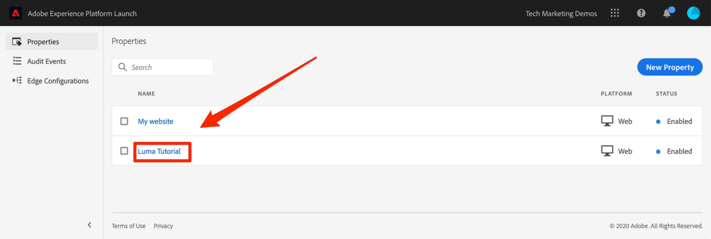

# 创建标记属性

在本课程中，您将创建您的第一个标记资产。

资产基本上就是一个容器，在将标记部署到网站时可在其中填充扩展、规则、数据元素和库。

## 先决条件

要完成接下来的几个课程，您必须拥有在标记中开发、批准、Publish、管理扩展和管理环境的权限。 如果由于用户界面选项不可用而无法完成其中的任何步骤，请联系 Experience Cloud 管理员以请求获取访问权限。有关标记用户权限的详细信息，请参阅[文档](https://experienceleague.adobe.com/docs/experience-platform/tags/admin/user-permissions.html)。

>[!NOTE]
>
>Adobe Experience Platform Launch正在作为一套数据收集技术集成到Adobe Experience Platform中。 在使用此内容时，您应该了解的界面中推出了几项术语更改：
>
> * platform launch（客户端）现在为&#x200B;**[[!DNL tags]](https://experienceleague.adobe.com/docs/experience-platform/tags/home.html)**
> * platform launch服务器端现在为&#x200B;**[[!DNL event forwarding]](https://experienceleague.adobe.com/docs/experience-platform/tags/event-forwarding/overview.html)**
> * Edge配置现在为&#x200B;**[[!DNL datastreams]](https://experienceleague.adobe.com/docs/experience-platform/edge/fundamentals/datastreams.html)**

## 学习目标

在本课程结束后，您将能够：

* 登录到数据收集用户界面
* 创建新标记属性
* 配置标记属性

## 转到数据收集界面

**以访问数据收集**

1. 登录 [Adobe Experience Cloud](https://experiencecloud.adobe.com)

1. 单击图标以打开应用程序切换器

1. 从菜单中选择&#x200B;**[!UICONTROL 启动/数据收集]**

此时您应会看到 `Tags Properties` 屏幕（如果帐户中尚未创建任何资产，则此屏幕可能为空）：

## 创建资产

资产基本上就是一个容器，在将标记部署到网站时可在其中填充扩展、规则、数据元素和库。资产可以是一个或多个域和子域的任意组合。您可以通过相似的方式管理和跟踪这些资产。例如，假定您有多个基于一个模板的网站，并希望在所有这些网站中跟踪相同的资产。您可以将一个资产应用于多个域。有关创建资产的更多信息，请参阅产品文档中的[“公司和资产”](https://experienceleague.adobe.com/docs/experience-platform/tags/admin/companies-and-properties.html)。

**创建资产**

1. 单击&#x200B;**[!UICONTROL 新建属性]**&#x200B;按钮：

   

1. 命名您的资产（例如，`Luma Tutorial` 或 `Luma Tutorial - Daniel`）
1. 对于域，输入 `enablementadobe.com`，因为这是托管 Luma 演示网站的域。尽管“域”字段是必填字段，但标记属性将在实施该属性的任何域中起作用。 此字段的主要用途是在规则构建器中预填充菜单选项。
1. 展开&#x200B;**[!UICONTROL 高级选项]**&#x200B;部分并选中该框以&#x200B;**[!UICONTROL 按顺序运行规则组件]**
1. 单击&#x200B;**[!UICONTROL 保存]**&#x200B;按钮

   

您的新资产应会显示在 Properties 页面上。请注意，如果选中属性名称旁边的复选框，则用于&#x200B;**[!UICONTROL 配置]**&#x200B;或&#x200B;**[!UICONTROL 删除]**&#x200B;该属性的选项将显示在属性列表上方。 单击您的资产的名称（例如，`Luma Tutorial`）以打开 `Overview` 屏幕。

[下一课程“添加嵌入代码”>](add-embed-code.md)
